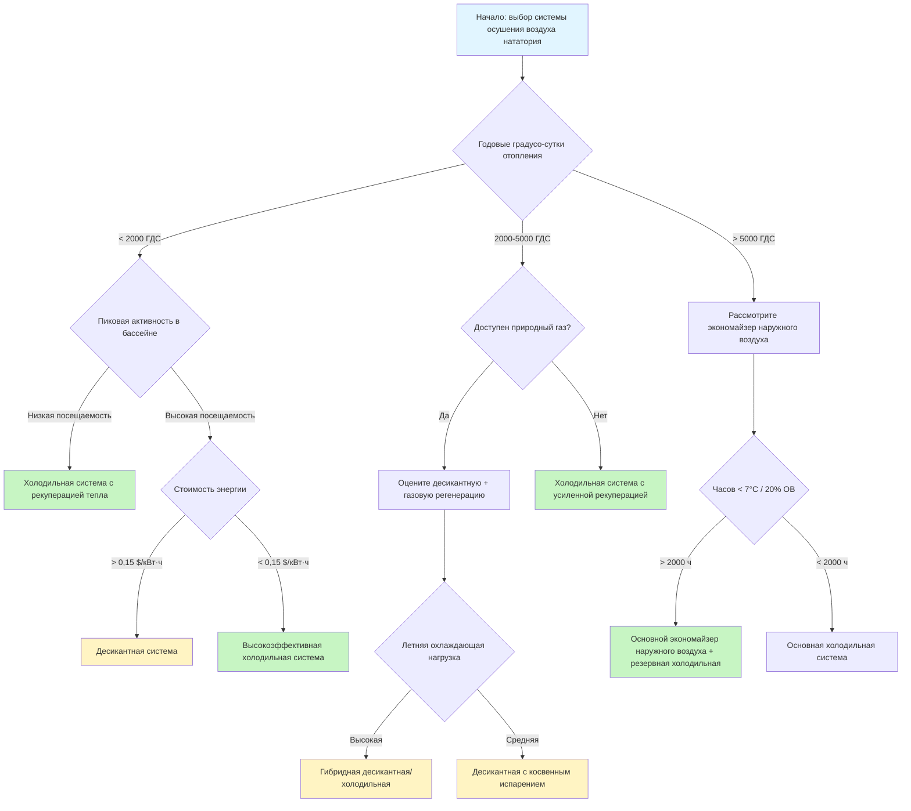

Выбор надлежащей системы осушения воздуха для крытого бассейна требует всестороннего анализа характеристик объекта, климатических условий, энергетической экономики и требований к эксплуатации. Процесс выбора сбалансирован между первоначальной стоимостью, стоимостью эксплуатации, ограничениями по пространству и задачами производительности для выявления оптимальной технологии для каждого применения.

## Сравнение технологий систем

Три основные технологии осушения воздуха служат применению в нататориях, каждая с характерными показателями производительности и надлежащими диапазонами применения:

| Тип системы | Типичный диапазон производительности | Энергетическая эффективность | Первоначальная стоимость | Лучшие применения |
|-------------|--------------------------------------|-----------------------------|------------------------|-------------------|
| Холодильная система (DX) | 22,7–907,2 кг/ч | 0,9–1,3 кг/кВт | Базовая | Умеренный климат, круглогодичная работа |
| Десикантные системы | 45,4–2268 кг/ч | 0,5–0,9 кг/кВт | 1,5–2,5× холодильная | Жаркий влажный климат, высокие скрытые нагрузки |
| Экономайзер наружного воздуха | Переменная | 2,0–3,8 кг/кВт | 0,3–0,6× холодильная | Холодный сухой климат, сезонное использование |
| Гибридная холодильная/десикантная | 90,7–1360,8 кг/ч | 1,0–1,7 кг/кВт | 1,8–2,8× холодильная | Переменный климат, требуется оптимизация |

## Требования к определению размера производительности

Производительность осушения должна учитывать испарение с поверхностей бассейна и настила, образование влаги от посетителей и скрытую нагрузку вентиляции. Общая влажностная нагрузка:

$$W_{total} = W_{pool} + W_{deck} + W_{occupants} + W_{ventilation}$$

Скорость испарения из бассейна по ASHRAE:

$$W_{pool} = A_{pool} \times (0,1 + 0,0085 \cdot V_{air}) \times (P_{sat,pool} - P_{air}) \times \frac{1}{1093}$$

Где:
- $A_{pool}$ = площадь поверхности воды в бассейне (м²)
- $V_{air}$ = скорость воздуха над поверхностью бассейна (м/с), обычно 0,05–0,15 м/с
- $P_{sat,pool}$ = давление насыщения при температуре воды в бассейне (кПа)
- $P_{air}$ = парциальное давление водяного пара в воздухе помещения (кПа)
- Результат в кг/ч

Применение коэффициента безопасности:

$$W_{design} = W_{total} \times SF$$

Где $SF$ = 1,2–1,5 в зависимости от уровня активности в бассейне (1,2 для жилищного фонда, 1,3 для коммерческого спортзала, 1,5 для спортивных/оздоровительных бассейнов).

## Дерево решений выбора системы

## Рассмотрение климатических зон

Климат коренным образом влияет на выбор системы через баланс отопления/охлаждения и потенциал экономайзера:

**Холодные климаты (зоны 6–7):** Холодильные системы с комплексной рекуперацией тепла обеспечивают оптимальную производительность. Утилизированное тепло конденсации компенсирует нагрузки отопления объекта в течение продолжительного сезона отопления. Работа экономайзера наружного воздуха возможна в течение 30–50 % годовых часов, когда условия наружного воздуха находятся ниже 7 °C и 30 % относительной влажности.

**Умеренные климаты (зоны 3–5):** Холодильные системы остаются основным выбором. Эффективность рекуперации тепла снижается по мере сокращения сезона отопления. Экономический анализ должен учитывать производительность сезона охлаждения, когда утилизированное тепло становится обязательством, требующим отвода.

**Жаркие влажные климаты (зоны 1–2):** Десикантные системы получают преимущество благодаря независимому управлению температурой и влажностью. Высокая эффективность регенерации при использовании отходящего тепла или природного газа оправдывает увеличенную первоначальную стоимость. Холодильные системы требуют увеличения размера по скрытой производительности, снижая эффективность явного охлаждения.

## Показатели энергетической производительности

Сравнивайте системы, используя скрытый коэффициент производительности при условиях проектирования:

$$COP_{latent} = \frac{W_{removed} \times h_{fg}}{E_{input} \times 3.412}$$

Где:
- $W_{removed}$ = скорость удаления влаги (кг/ч)
- $h_{fg}$ = скрытая теплота испарения = 2501 кДж/кг при 21 °C
- $E_{input}$ = электрический вход (кВт)
- 3,412 = кДж/ч на ватт

Сравнение годовой стоимости энергии:

$$C_{annual} = \sum_{i=1}^{8760} \left(\frac{W_{required,i}}{COP_{latent,i}}\right) \times 3.412 \times C_{energy,i}$$

Анализ полной стоимости жизненного цикла должен включать:
- Первоначальная стоимость оборудования с установкой
- Годовая стоимость энергии по прогнозируемым тарифам коммунальных услуг
- Стоимость обслуживания (холодильная: 2–4 % первоначальной стоимости в год; десикантная: 3–6 %)
- Ожидаемый срок службы оборудования (холодильная: 15–20 лет; десикантная: 20–25 лет)
- Дисконтная ставка для расчета приведенной стоимости

## Соображения при выборе системы

**Требования к пространству:** Холодильные системы предлагают компактный размер (0,028–0,047 м²/(м³/ч)). Десикантные системы требуют в 1,5–2 раза больше пространства для десикантного колеса, регенерационного отопления и охлаждающих катушек. Оцените ограничения механического помещения на ранней стадии проектирования.

**Критерии шума:** Нататории требуют максимум NC 40–45. Холодильные компрессоры создают уровень звука 75–85 дБА, требующий ослабления. Десикантные системы работают при 70–78 дБА с более низким содержанием частоты. Удаленное размещение или акустическая обработка влияют на стоимость установки.

**Доступ для обслуживания:** Холодильные системы требуют постоянного обслуживания холодильными установками. Десикантные системы требуют проверки десикантного колеса каждые 2–3 года и потенциальной замены через 10–15 лет. Обслуживание фильтров идентично для всех технологий с интервалом 2000–4000 часов.

**Интеграция управления:** Современные системы интегрируются с системой автоматизации зданий через протоколы BACnet или Modbus. Критические точки управления включают точку росы помещения, температуру воды в бассейне, датчики присутствия и логику экономайзера наружного воздуха. Десикантные системы требуют дополнительного управления температурой регенерации.

## Рекомендации по проектированию ASHRAE

Справочник приложений ASHRAE, глава 6 (Нататории) устанавливает критерии выбора:

- Проектируйте для непрерывной работы; прерывистая работа вызывает повреждение конденсацией
- Определите размер для скорости испарения в неработающем состоянии плюс минимум 30 % для всплесков посещаемости
- Обеспечьте возможность 100 % наружного воздуха для исключительных событий посещаемости
- Минимальная эффективность рекуперации тепла 60 % для соответствия энергетическому кодексу
- Поддерживайте понижение точки росы на 1–2 °C ниже температуры воды в бассейне
- Обеспечьте минимум 4–6 воздухообменов в час, 6–8 ВОЧ для спортивных бассейнов

Процесс выбора требует тщательного расчета нагрузки, анализа климата и экономической оценки для выявления системы, которая минимизирует полную стоимость жизненного цикла при соответствии требованиям производительности.

## Заключение

Ни одна технология осушения воздуха не подходит для всех применений в нататориях. Холодильные системы обеспечивают надежную, экономичную производительность для большинства установок с умеренным климатом. Десикантные системы превосходны в жарких влажных климатах и объектах с высокой скрытой нагрузкой, несмотря на более высокую первоначальную стоимость. Экономайзеры наружного воздуха снижают эксплуатационные расходы в холодных сухих климатах при надлежащей интеграции с механическим осушением. Тщательный анализ климата, характеристик бассейна, стоимости энергии и ограничений объекта определяет оптимальный выбор системы.
