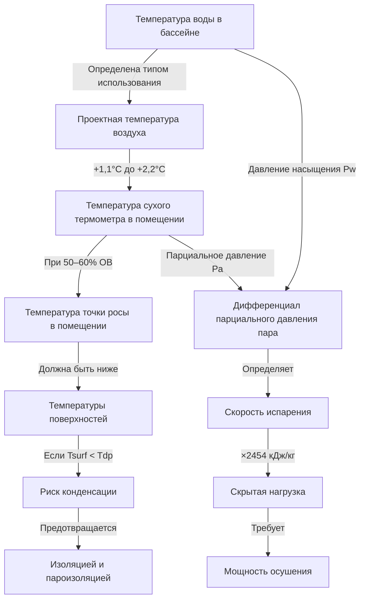

## Обзор

Условия проектирования бассейна представляют собой критический баланс между комфортом пользователей, энергоэффективностью и защитой конструкции. В отличие от обычных приложений HVAC, среда крытого бассейна требует точного контроля температуры воздуха, температуры воды и относительной влажности для предотвращения конденсационных повреждений при сохранении комфорта пловцов и минимизации скорости испарения.

Фундаментальная проектная проблема вытекает из непрерывного испарения воды с поверхности бассейна, которое вносит огромные скрытые нагрузки в помещение. Этот процесс испарения регулируется дифференциалом парциального давления пара между поверхностью воды и окружающим воздухом, что делает соотношение температура воздуха-вода основным проектным параметром.

## Требования к температуре воздуха

Температура воздуха в помещении бассейна должна поддерживаться выше температуры воды в бассейне, чтобы предотвратить некомфортное охлаждение пловцов при выходе из бассейна. Стандартное проектное соотношение:

$$T_{air} = T_{water} + 1.1°C \text{ до } 2.2°C$$

Этот температурный дифференциал выполняет несколько функций. Он снижает скорость испарения с поверхности бассейна за счет уменьшения градиента парциального давления пара, обеспечивает тепловой комфорт для мокрых пловцов и предотвращает конденсацию на внутренних поверхностях при надлежащем контроле влажности.

Для типичных общественных бассейнов с температурой воды 25,5–27,8°C это дает проектные температуры воздуха 26,7–30°C. Спортивные бассейны часто поддерживают более холодную воду (24–25,5°C) для спортивной производительности, что приводит к соответствующим температурам воздуха 25,5–27,8°C.

Поддержание температуры воздуха ниже температуры воды создает серьезные проблемы с комфортом. Пловцы, выходящие из бассейна, испытывают быстрое испарительное охлаждение с влажной кожи, что создает ощущение холода несмотря на относительно теплые температуры воздуха. Это состояние также ускоряет скорость испарения, увеличивая как скрытые нагрузки, так и расходы на химическую обработку.

## Проектные значения температуры воды в бассейне

Температура воды в бассейне определяется в первую очередь предполагаемым использованием и демографией пользователей:

| Тип бассейна | Температура воды | Температура воздуха | Относительная влажность |
|-----------|-------------------|-----------------|-------------------|
| Спортивное плавание | 24–25,5°C | 25,5–27,8°C | 50–60% |
| Общественный бассейн | 25,5–27,8°C | 26,7–30°C | 50–60% |
| Терапия/Реабилитация | 30–33,3°C | 31,1–34,4°C | 50–60% |
| Прыжковая площадка | 26,7–27,8°C | 27,8–30°C | 50–60% |
| Детский бассейн | 27,8–30°C | 28,9–31,1°C | 50–60% |
| Отельный/курортный бассейн | 27,8–28,9°C | 28,9–31,1°C | 50–60% |

Эти значения соответствуют рекомендациям ASHRAE Handbook Applications Chapter 5 по проектированию бассейнов. Температурный дифференциал воздух-вода остается постоянным для всех типов бассейнов, корректируя абсолютные значения температуры на основе установки температуры воды.

## Контроль относительной влажности

Относительная влажность представляет собой наиболее критический параметр для предотвращения конденсационных повреждений конструкции здания и механических систем. ASHRAE рекомендует поддерживать относительную влажность в бассейне между 50–60% для оптимальных условий.

Температура точки росы воздуха в помещении должна оставаться ниже температуры всех внутренних поверхностей, чтобы предотвратить конденсацию. Это соотношение выражается как:

$$T_{surface} > T_{dewpoint}$$

где $T_{dewpoint}$ рассчитывается на основе температуры сухого термометра в помещении и относительной влажности с использованием психрометрических зависимостей.

При 50% ОВ помещение, поддерживаемое при 27,8°C, имеет точку росы приблизительно 16,1°C. Все окна, конструктивные элементы и поверхности воздуховодов должны поддерживаться выше этой температуры благодаря изоляции, пароизоляционным барьерам или активному отоплению.

Более низкие уровни влажности (ниже 50%) снижают риск конденсации, но увеличивают скорость испарения и могут вызвать дискомфорт от чрезмерного высыхания кожи. Более высокие уровни влажности (выше 60%) создают риск конденсации, способствуют росту плесени и создают "тяжелую" некомфортную атмосферу.

## Психрометрические зависимости

Скорость испарения с поверхности бассейна определяется следующим образом:

$$E = A \times F \times (P_w - P_a)$$

где:
- $E$ = скорость испарения (кг/ч)
- $A$ = площадь поверхности бассейна (м²)
- $F$ = коэффициент испарения (функция скорости воздуха и активности)
- $P_w$ = давление насыщенного пара при температуре воды (кПа)
- $P_a$ = парциальное давление пара воздуха в помещении (кПа)

Это уравнение демонстрирует, почему температурный дифференциал воздух-вода и относительная влажность являются взаимозависимыми проектными параметрами. Увеличение температуры воздуха снижает $(P_w - P_a)$ за счет повышения $P_a$, таким образом уменьшая испарение. Аналогично, увеличение относительной влажности напрямую увеличивает $P_a$, снижая дифференциал парциального давления пара.

Скрытая теплота, связанная с этим испарением, составляет:

$$Q_{latent} = E \times h_{fg}$$

где $h_{fg}$ = 2 454 кДж/кг (скрытая теплота испарения для воды).

Для типичного бассейна площадью 185,8 м² с умеренной активностью скорости испарения 2,4–4,8 кг/ч/м² являются обычными, создавая скрытые нагрузки в диапазоне 1,2–2,4 МВт, которые система осушения должна удалить.

## Процесс выбора проектных условий

Выбор надлежащих проектных условий требует анализа конкретных требований объекта:

1. **Определить температуру воды в бассейне** на основе основного использования (спортивное, общественное, терапевтическое)
2. **Рассчитать температуру воздуха**, добавив 1,1–2,2°C к температуре воды
3. **Установить относительную влажность** на уровне 50–60% на основе конструкции конструкции и местного климата
4. **Рассчитать температуру точки росы** на основе температуры воздуха и ОВ с использованием психрометрических диаграмм
5. **Проверить все поверхности**, чтобы они превышали температуру точки росы с надлежащим запасом безопасности (минимум 2,8°C)
6. **Рассчитать скорость испарения** с использованием площади бассейна, коэффициента активности и дифференциала парциального давления пара
7. **Выбрать размер оборудования осушения** для обработки скрытой нагрузки плюс требования к вентиляции свежим воздухом

Этот систематический подход обеспечивает надлежащую координацию всех взаимозависимых параметров и гарантирует, что объект будет работать без конденсационных проблем при сохранении комфорта пользователей.

## Сезонные вариации

Многие бассейны реализуют сезонные корректировки установок для снижения энергопотребления в периоды, когда объект не используется, или в переходные сезоны. Однако контроль влажности должен поддерживаться круглый год для предотвращения конденсационных повреждений, даже когда бассейн не в активном использовании. Снижение температуры воздуха в периоды неиспользования приемлемо только в том случае, если соответствующая точка росы остается безопасно ниже всех температур поверхностей.
