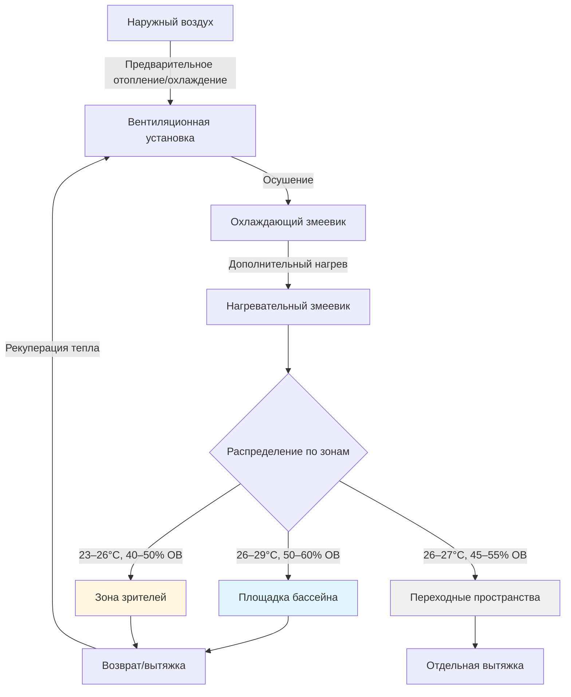
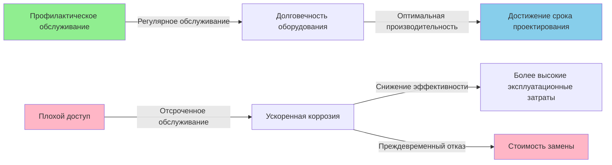

## Интегрированный подход к системам

Проектирование HVAC для крытых бассейнов требует одновременной оптимизации множества взаимодействующих переменных. Высокая скорость генерирования влаги из испарения воды с поверхности бассейна—в диапазоне от 0,05 до 0,25 кг/м²·ч в зависимости от уровня активности—создает условия, при которых требуется балансировка теплового комфорта, контроля влажности и защиты конструкции. Подход на уровне систем предотвращает конфликты между требованиями зон и обеспечивает энергоэффективную работу.

Фундаментальная сложность вытекает из физики испарительного охлаждения. Каждый килограмм воды, испаренный с поверхности бассейна, поглощает примерно 2 430 кДж скрытого тепла, создавая существенные охлаждающие нагрузки даже зимой. Это извлечение тепла должно быть восполнено, одновременно удаляя влагу, чтобы предотвратить конденсацию на поверхностях здания.

## Требования к проектированию по зонам

### Условия площадки бассейна

Зона площадки бассейна испытывает наибольшие нагрузки по влажности и требует точного контроля для обеспечения комфорта занимающихся и минимизации испарения. ASHRAE 62.1 рекомендует температуру воздуха на площадке на 1–2°C выше температуры воды для снижения скоростей испарения при сохранении теплового комфорта для мокрых занимающихся.

**Тепловая стратификация** становится критической в крытых бассейнах с высокими потолками. Движение теплого влажного воздуха, управляемое плавучестью, создает вертикальные градиенты температуры, описываемые:

$$\frac{dT}{dz} = \frac{g}{c_p} \left(1 - \frac{1}{\gamma}\right)$$

Где $g$ — ускорение свободного падения, $c_p$ — удельная теплоемкость при постоянном давлении и $\gamma$ — отношение удельных теплоемкостей. Для типичных условий крытого бассейна разности температур в 5–8°C между уровнем площадки и потолком являются обычными без надлежащей циркуляции воздуха.

| Параметр зоны | Площадка бассейна | Зона зрителей | Переходное пространство |
|---|---|---|---|
| Температура | 26–29°C | 23–26°C | 26–27°C |
| Относительная влажность | 50–60% | 40–50% | 45–55% |
| Скорость воздуха | < 0,15 м/с | < 0,25 м/с | < 0,2 м/с |
| Точка росы | 15–18°C | 11–14°C | 13–17°C |

### Условия зоны зрителей

Зоны зрителей требуют традиционных условий комфорта (23–26°C, 40–50% ОВ), отличных от требований площадки бассейна. Физическое разделение между этими зонами создает три проектных проблемы:

1. **Соотношения давлений** — площадка бассейна должна поддерживать слегка повышенное давление (+5–12 Па) относительно зон зрителей, чтобы предотвратить миграцию влажного воздуха
2. **Тепловая граница** — температурный перепад вызывает кондуктивный теплопередачу через разделяющие стены со скоростью $q = UA\Delta T$
3. **Граница влажности** — разница парциального давления водяного пара вызывает миграцию влаги через строительные конструкции

Разница парциального давления водяного пара между зонами может быть рассчитана:

$$\Delta p_v = p_{sat,площадка} \cdot RH_{площадка} - p_{sat,зрители} \cdot RH_{зрители}$$

Для типичных условий (площадка: 28°C/55% ОВ, зрители: 24°C/45% ОВ) это дает примерно 38 Па разницы парциального давления водяного пара, требующей эффективных паробарьеров в разделяющих стенах.

### Переходные и вспомогательные помещения

Раздевалки, коридоры и входные преддверия функционируют как буферные зоны. Эти пространства должны поддерживать промежуточные условия температуры и влажности, чтобы минимизировать тепловой шок, когда занимающиеся переходят между окружающей средой. Воздух, вытяжной из раздевалок, должен быть отделенным (не рециркулируемым) из-за проблем загрязнения согласно ASHRAE 62.1.

## Проектирование оболочки здания для контроля влажности

Отказы оболочки здания в крытых бассейнах происходят из-за конденсации на поверхностях ниже точки росы воздуха. Критический порог температуры поверхности:

$$T_{поверхность,мин} = T_{точка\ росы} + \Delta T_{безопасность}$$

Где $\Delta T_{безопасность}$ обычно составляет 3–5°C для учета тепловых мостиков и локальных вариаций циркуляции воздуха. Для воздуха площадки бассейна при 28°C/55% ОВ (точка росы 17°C) все поверхности оболочки должны поддерживать температуры выше 20–23°C.

### Смягчение тепловых мостиков

Общие тепловые мостики в оболочках крытых бассейнов включают:

- **Стальные конструктивные элементы** — тепловодность 45 Вт/м·°C создает прямые проводящие пути через изоляцию
- **Оконные рамы** — металлические рамы без терморазрывов достигают наружных температур
- **Периметры фундамента** — края железобетонной плиты проводят тепло в холодный грунт
- **Крышные проходки** — HVAC переходные балконы, мансардные окна и конструктивные соединения

Теплопередача через тепловой мост может быть квантифицирована, используя линейную тепловую трансмиттанцию:

$$\Psi = \frac{Q_{2D} - \sum U_i \cdot A_i}{L}$$

Где $Q_{2D}$ — фактический тепловой поток через соединение, $U_i \cdot A_i$ представляет одномерные тепловые потоки через соседние конструкции и $L$ — длина соединения.

### Стратегия паробарьера

Контроль водяного пара в оболочках крытых бассейнов требует тщательного внимания как к диффузии, так и к утечкам воздуха. Скорость диффузионного потока водяного пара через строительные конструкции следует:

$$\dot{m}_{пар} = \frac{\Delta p_v}{\sum R_{пар}}$$

Где $R_{пар}$ — паровое сопротивление каждого слоя материала в пермах. Однако утечка воздуха, как правило, способствует переносу влаги в 100–1000 раз больше, чем диффузия, делая непрерывность воздухонепроницаемого слоя основной проектной проблемой.

## Выбор материалов, устойчивых к коррозии

Хлорированная вода бассейна создает агрессивную среду. Испарение хлора производит пары гипохлористой кислоты (HOCl) и соляной кислоты (HCl), которые ускоряют коррозию черных металлов, алюминия и меди. Скорости коррозии растут экспоненциально с температурой и влажностью согласно:

$$r_{корр} = A \cdot e^{-E_a/RT} \cdot (RH)^n$$

Где $E_a$ — энергия активации, $R$ — газовая постоянная, $T$ — абсолютная температура и $n$ — эмпирический показатель (обычно 2–3 для атмосферной коррозии).

### Выбор материалов по компонентам

| Компонент | Неподходящие материалы | Рекомендуемые материалы |
|---|---|---|
| Воздуховоды | Оцинкованная сталь, алюминий | Нержавеющая сталь 316L, покрытая сталь, стекловолокно |
| Диффузоры/решетки | Алюминий, углеродистая сталь | Нержавеющая сталь, пластик ABS, порошково-окрашенный алюминий |
| Трубопроводы | Медь (зоны хлора), черная сталь | PVC, CPVC, нержавеющая сталь, полимер-облицованная сталь |
| Крепежные элементы | Оцинкованная сталь | Нержавеющая сталь 316, горячее цинкование |
| Конструктивные опоры | Оцинкованная сталь | Нержавеющая сталь, эпоксидно-покрытая сталь |
| Компоненты вентиляционной установки | Стандартные змеевики и поддоны | Покрытые змеевики, поддоны из нержавеющей стали |

Нержавеющая сталь 316L содержит 2–3% молибдена, обеспечивая превосходную устойчивость к питтинговой коррозии, вызванной хлоридами, по сравнению с сплавами 304.

## Доступность оборудования и техническое обслуживание

Осушающее оборудование в крытых бассейнах требует частого обслуживания из-за коррозионной среды. Проектирование должно обеспечивать:

**Зазоры доступа** согласно требованиям производителя (обычно минимум 0,9 м на сторонах обслуживания)
- Съемные панели для чистки змеевиков без разборки системы
- Напольные стоки под всем осушающим оборудованием
- Устройства подъема для замены двигателя и компрессора
- Электрические отключающие устройства в прямой видимости от оборудования

Общая стоимость владения системами HVAC в крытых бассейнах значительно взвешена в сторону обслуживания и замены. Доступность во время проектирования предотвращает дорогостоящие операционные перебои. Оборудование, расположенное в трудно доступных местах, испытывает отсроченное обслуживание, приводящее к деградации эффективности и преждевременному отказу.

## Контрольный список интеграции проекта

Успешное проектирование HVAC для крытых бассейнов требует координации между дисциплинами:

1. **Архитектура** — уровни изоляции оболочки, размещение паробарьера, технические характеристики остекления
2. **Конструкции** — детали терморазрывов при конструктивных проходках, места опоры для тяжелых осушителей
3. **Механика** — разделение зон, контроль давления, материалы, устойчивые к коррозии
4. **Электроснабжение** — устойчивый к коррозии кабелепровод и коробки, защита GFCI во влажных зонах
5. **Водопровод** — влияние очистки воды бассейна на качество воздуха, предусмотрение слива конденсата

Взаимосвязанная природа генерирования влаги, тепловых нагрузок и долговечности материалов требует ранней координации во избежание конфликтов во время строительства и операционных проблем после ввода в эксплуатацию.
