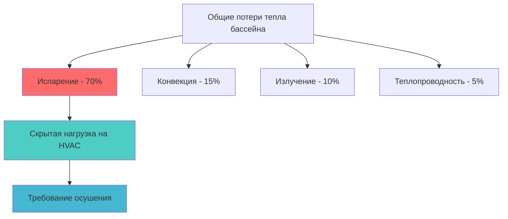
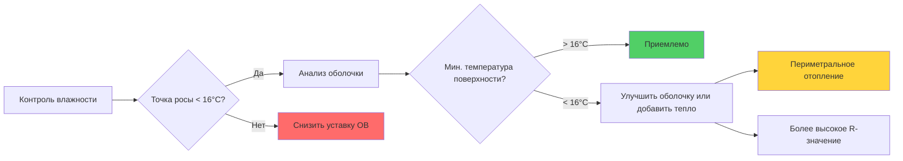

## Обзор

Контроль влажности представляет наиболее критический параметр проектирования для HVAC систем бассейнов. В отличие от обычных занятых пространств, крытые плавательные бассейны генерируют огромные влажностные нагрузки из-за непрерывного испарения воды, требуя точного управления влажностью для предотвращения повреждений от конденсации, обеспечения комфорта пользователей и защиты конструкций здания от коррозии.

## Диапазон проектной влажности

### Целевые условия

ASHRAE Applications Handbook указывает следующие параметры влажности для бассейнов:

| Параметр | Значение | Обоснование |
|-----------|----------|-------------|
| Относительная влажность (проектная) | 50-60% | Сбалансирует контроль испарения и комфорт |
| Минимальная ОВ | 40% | Предотвращает чрезмерное испарение и дискомфорт пользователей |
| Максимальная ОВ | 60% | Ограничивает риск конденсации на поверхностях здания |
| Проектная точка росы | 13-16°C | Предотвращает конденсацию на типичном остеклении |
| Температура воздуха | на 1-2°C выше температуры воды | Минимизирует испарение при обеспечении комфорта |

Диапазон 50-60% ОВ возникает из пересечения множественных физических ограничений. Ниже 50% ОВ скорости испарения увеличиваются экспоненциально, приводя к чрезмерным потерям воды, увеличению расхода химикатов и потерям энергии. Выше 60% ОВ риск конденсации на компонентах внешней оболочки здания становится неприемлемым, особенно на окнах, металлических конструкциях и наружных стенах в холодное время года.

## Расчеты скорости испарения

### Уравнение Carrier

Фундаментальное соотношение, регулирующее испарение воды с поверхности бассейна, это уравнение Carrier:

$$W = \frac{A \cdot Y \cdot (P_w - P_a)}{Y_p}$$

Где:
- $W$ = скорость испарения (кг/ч)
- $A$ = площадь поверхности воды (м²)
- $Y$ = коэффициент активности (безразмерный)
- $P_w$ = давление насыщенного пара при температуре воды (кПа)
- $P_a$ = парциальное давление пара окружающего воздуха (кПа)
- $Y_p$ = коэффициент скрытой теплоты (обычно 2447 кДж/кг при стандартных условиях)

### Коэффициенты активности

| Тип бассейна | Без пользователей | С пользователями | Гидромассаж/Спа |
|--------------|-------------------|------------------|-----------------|
| Коэффициент активности (Y) | 0,5 | 1,0 | 1,5 |

Эти эмпирические коэффициенты учитывают эффекты перемешивания поверхности. Бассейны с пользователями испытывают удвоенные скорости испарения из-за всплесков, волновых движений и увеличенной площади поверхности возмущенной воды.

### Разность давлений пара

Движущая сила испарения — это разность давлений пара $(P_w - P_a)$. Для бассейна при 28°C с воздухом при 29°C и 55% ОВ:

$$P_w = 3,77 \text{ кПа (насыщение при 28°C)}$$

$$P_a = P_{нас,воздух} \times ОВ = 4,01 \times 0,55 = 2,21 \text{ кПа}$$

$$\Delta P = 3,77 - 2,21 = 1,56 \text{ кПа}$$

Этот градиент давления пара количественно определяет термодинамический потенциал для передачи влаги и напрямую определяет нагрузки на осушение.

## Расчет нагрузки на осушение

### Удаление скрытой теплоты

Чувствительный и скрытый тепловой баланс для бассейна кардинально отличается от обычных пространств:

Скрытая нагрузка доминирует, составляя примерно 70% от общих потерь тепла из воды бассейна. Эта нагрузка напрямую преобразуется в требование мощности осушения:

$$Q_{скрытая} = W \times h_{fg}$$

Где:
- $Q_{скрытая}$ = скрытая охлаждающая нагрузка (кДж/ч)
- $W$ = скорость испарения из уравнения Carrier (кг/ч)
- $h_{fg}$ = скрытая теплота парообразования ≈ 2447 кДж/кг при типичных условиях бассейна

### Пример расчета

Для конкурентного бассейна площадью 140 м² работающего при температуре воды 28°C с воздухом 29°C при 55% ОВ в периоды использования:

$$W = \frac{140 \times 1,0 \times 1,56}{1} = 218,4 \text{ кг/ч}$$

$$Q_{скрытая} = 218,4 \times 2447 = 534,2 \text{ МДж/ч} \approx 218 \text{ кВт}$$

Эта огромная скрытая нагрузка требует выделенного оборудования осушения, обычно сочетающего механическую холодильную установку с утилизацией теплоты для минимизации потребления энергии.

## Контроль точки росы и предотвращение конденсации

### Анализ критической температуры поверхности

Конденсация происходит, когда температура любой поверхности падает ниже температуры точки росы воздуха. Критическое соотношение:

$$T_{поверхность} < T_{точка росы} \rightarrow \text{Конденсация}$$

Для воздуха в бассейне при 29°C и 55% ОВ точка росы примерно 18°C. Любая поверхность здания ниже этой температуры становится местом конденсации.

### Анализ остекления

Окна представляют наиболее уязвимые места для конденсации. Температура внутренней поверхности остекления зависит от:

$$T_{внутри} = T_{помещение} - \frac{T_{помещение} - T_{снаружи}}{1 + \frac{U \cdot h_i}{h_o}}$$

Упрощено для практического применения с известным коэффициентом U:

$$T_{внутри} \approx T_{помещение} - U(T_{помещение} - T_{снаружи}) \times R_{внутри}$$

| Тип остекления | Коэффициент U (Вт/м²·K) | Мин. наружная температура (°C) для отсутствия конденсации* |
|--------------|--------------------------|-----|
| Однокамерное | 6,25 | 12 |
| Двухкамерное, воздух | 2,84 | 0 |
| Двухкамерное, Low-E | 1,70 | -11 |
| Трехкамерное, Low-E, аргон | 1,14 | -19 |

*Предполагает 29°C в помещении, 18°C точка росы

Этот анализ показывает, почему однокамерное остекление никогда не приемлемо в бассейнах, кроме тропических климатов. Даже двухкамерные системы требуют покрытий Low-E для работы без конденсации в умеренных зонах.

### Стратегия контроля конденсации

## Предотвращение коррозии посредством контроля влажности

### Выделение хлора и коррозионная активность

Химикаты для обработки воды бассейна, особенно соединения хлора, испаряются в воздух. Скорость коррозии металлов в хлорированной среде бассейна экспоненциально увеличивается с относительной влажностью:

$$\text{Скорость коррозии} \propto ОВ^{2,5} \times [\text{Cl}_2]$$

Это нелинейное соотношение объясняет, почему поддержание ОВ ниже 60% обеспечивает драматическую защиту конструкционной стали, HVAC оборудования и электрических компонентов.

| Материал | Макс. ОВ для 20-летнего срока службы | Метод защиты |
|----------|--------------------------------------|--------------|
| Углеродистая сталь (без покрытия) | 45% | Не рекомендуется |
| Оцинкованная сталь | 55% | Стандарт для воздуховодов |
| Нержавеющая сталь (304) | 60% | Предпочтительно для диффузоров |
| Нержавеющая сталь (316) | 70% | Оборудование бассейна, жалюзи |
| Алюминий (анодированный) | 65% | Конструкционные приложения |

Высокая влажность окружающей среды ускоряет коррозию, вызванную хлоридами и питтингом. Поддержание проектной влажности на уровне 50-55% вместо допуска смещения до 60% может удвоить срок службы оборудования.

## Учет комфорта пользователей

### Психрометрическая зона комфорта

Тепловой комфорт человека в водных объектах отличается от сухих сред из-за влажной кожи:

$$PMV = f(T_{воздуха}, ОВ, v_{воздуха}, T_{излучение}, M_{метаболизм}, I_{одежда})$$

Для минимально одетых пользователей бассейна (пловцы, зрители в купальниках):
- Оптимальный комфорт: 28-30°C воздуха, 50-60% ОВ
- Высокая влажность (>65%) при этих температурах создает гнетущие условия
- Низкая влажность (<45%) вызывает чрезмерное испарительное охлаждение влажной кожи, воспринимается как холодные сквозняки

Узкий приемлемый диапазон требует надежного контроля влажности с минимальным отклонением.

## Рекомендации по проектированию

1. **Первичное осушение**: Рассчитать оборудование на коэффициент активности при использовании с 20% запасом безопасности
2. **Уставка точки росы**: Контролировать до максимум 14°C для обеспечения 7°C запаса безопасности для типичного двухкамерного остекления
3. **Проектирование оболочки**: Указать коэффициенты U остекления на основе зимней проектной температуры и критерия точки росы 16°C
4. **Интеграция вентиляции**: Сбалансировать требования наружного воздуха ASHRAE 62.1 с мощностью осушения — избыток вентиляции в влажную погоду увеличивает скрытые нагрузки
5. **Выбор материалов**: Указать материалы, устойчивые к коррозии, оценённые на непрерывное воздействие 60% ОВ в хлорированной среде

Надлежащий контроль влажности в бассейнах требует интегрированного анализа термодинамики, психрометрики, строительной науки и материаловедения. Диапазон проектной влажности 50-60% ОВ представляет оптимизированное решение, уравновешивающее контроль испарения, предотвращение конденсации, долговечность оборудования и комфорт пользователей.
