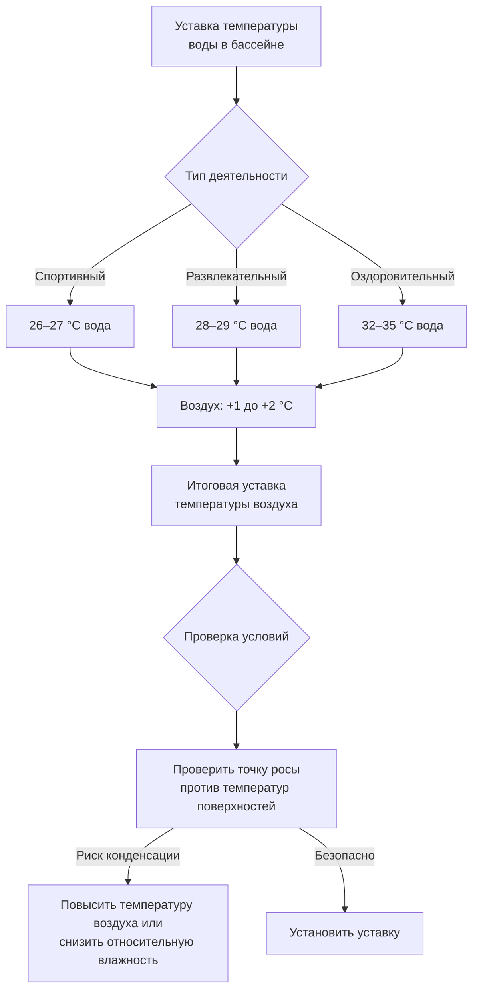

## Обзор

Управление температурой в бассейне требует точной координации между температурами воздуха и воды для минимизации испарения, обеспечения комфорта пользователей и сохранения целостности конструкции. Фундаментальный принцип заключается в поддержании температуры воздуха в помещении на 1–2 °C выше температуры воды в бассейне, создавая небольшой градиент давления пара, который снижает испарение при обеспечении теплового комфорта для мокрых людей.

## Термодинамическая основа температурного дифференциала

Скорость испарения с поверхности бассейна следует соотношению массопередачи:

$$\dot{m}_e = h_m \cdot A \cdot (W_s - W_a)$$

Где:
- $\dot{m}_e$ = скорость испарения (кг/ч)
- $h_m$ = коэффициент массопередачи (кг/ч·м²)
- $A$ = площадь поверхности бассейна (м²)
- $W_s$ = влагосодержание на поверхности воды (кг/кг)
- $W_a$ = влагосодержание воздуха (кг/кг)

Влагосодержание на поверхности воды определяется насыщенными условиями при температуре воды. Когда температура воздуха падает ниже температуры воды, дифференциал давления пара $(W_s - W_a)$ резко увеличивается, ускоряя испарение. Это создает три критические проблемы:

1. **Потери энергии**: Каждый килограмм испарившейся воды уносит примерно 2,450 кДж скрытой теплоты
2. **Нагрузка по влажности**: Система HVAC должна удалять испарившуюся влагу
3. **Дискомфорт пользователей**: Испарительное охлаждение создает холодные сквозняки на поверхности бассейна

Поддержание температуры воздуха на 1–2 °C выше температуры воды снижает дифференциал давления пара на 15–25%, значительно уменьшая скорость испарения.

## Стандарты температуры воды в бассейне по назначению

Различные применения бассейна требуют определенных температур воды в зависимости от интенсивности и продолжительности деятельности:

| Тип бассейна | Температура воды | Температура воздуха | Обоснование |
|-----------|------------------|-----------------|-----------|
| Спортивный | 26–27 °C | 27–29 °C | Более низкая температура снижает нагрузку на сердечно-сосудистую систему при интенсивных упражнениях |
| Развлекательный | 28–29 °C | 29–31 °C | Комфортная температура для умеренной активности и длительного пребывания в воде |
| Оздоровительный | 32–35 °C | 33–37 °C | Повышенная температура способствует релаксации мышц и улучшению кровообращения |
| Для прыжков | 27–28 °C | 28–30 °C | Более холодная вода предпочтительна для взрывных спортивных движений |
| Досуг | 29–30 °C | 30–32 °C | Более теплая температура для пассивного отдыха и семейного пользования |
| Плавание на дистанцию | 26–28 °C | 27–30 °C | Умеренная температура балансирует комфорт и спортивные результаты |

### Методология выбора температуры

Выбор температуры воды следует принципам метаболического выделения тепла. Человеческое тело в состоянии покоя вырабатывает примерно 116 Вт. Во время интенсивного плавания метаболическая скорость увеличивается до 440–585 Вт. Передача тепла от тела в воду следует формуле:

$$q = h_c \cdot A_b \cdot (T_{skin} - T_{water})$$

Где:
- $q$ = скорость передачи тепла (Вт)
- $h_c$ = коэффициент конвективной теплопередачи (Вт/м²·°C)
- $A_b$ = площадь поверхности тела (примерно 1,9 м²)
- $T_{skin}$ = температура кожи (примерно 33 °C)

Для спортсменов, генерирующих высокое метаболическое тепло, температуры воды 26–27 °C обеспечивают достаточное отведение тепла. Оздоровительные бассейны при 32–35 °C минимизируют потери тепла, поддерживая мышцы в тепле и способствуя кровообращению.

## Стратегия управления температурой воздуха

Уставка температуры воздуха должна учитывать три фактора:

1. **Контроль испарения**: Поддерживать на 1–2 °C выше температуры воды
2. **Комфорт пользователей**: Учитывать охлаждающий эффект испарения на мокрой коже
3. **Защита конструкции**: Предотвращать конденсацию на поверхностях здания

### Тепловой комфорт влажных пользователей

Человек, выходящий из бассейна, испытывает значительное испарительное охлаждение. Потеря тепла от испарения:

$$q_{evap} = \dot{m}_{water} \cdot h_{fg}$$

Где:
- $\dot{m}_{water}$ = скорость испарения воды с кожи (кг/ч)
- $h_{fg}$ = скрытая теплота парообразования (2,450 кДж/кг при 27 °C)

Тонкий слой воды на коже (примерно 0,005 кг), испаряющийся за 2–3 минуты, представляет 700–1,200 кДж охлаждения. Для компенсации температура воздуха должна быть повышена выше типичных зон комфорта. Эффективная температура для влажного пользователя примерно на 3–4 °C ниже фактической температуры воздуха из-за испарительного охлаждения.

Это объясняет, почему температуры воздуха в бассейне 28–31 °C кажутся комфортными влажным пользователям, тогда как такая же температура в сухом помещении была бы неприятно теплой.

## Температурный дифференциал и контроль испарения

Связь между температурным дифференциалом и скоростью испарения количественно определяется уравнением Carrier для испарения из бассейна:

$$E = 0.1 \cdot A \cdot (p_w - p_a) \cdot (1 + 0.2 \cdot V)$$

Где:
- $E$ = скорость испарения (кг/ч)
- $A$ = площадь поверхности бассейна (м²)
- $p_w$ = давление пара на поверхности воды (кПа)
- $p_a$ = давление пара воздуха (кПа)
- $V$ = скорость воздуха над поверхностью воды (м/с ÷ 0.1)

Давление пара увеличивается экспоненциально с температурой в соответствии с уравнением Антуана. Снижение температуры воздуха на 2 °C ниже температуры воды может увеличить $(p_w - p_a)$ на 20–30%, прямо увеличивая скорость испарения.

## Реализация проекта в соответствии с ASHRAE

Справочник ASHRAE — Приложения HVAC рекомендует:

- **Температура в помещении**: на 1–2 °C выше температуры воды
- **Относительная влажность**: 50–60% для комфорта и контроля конденсации
- **Скорость воздуха**: максимум 0.15 м/с над поверхностью бассейна при отсутствии пользователей
- **Вентиляция**: в соответствии с ASHRAE 62.1, минимум 2.58 CFM (4.37 м³/ч) на м² площади бассейна

Системы управления температурой должны включать:

1. **Мониторинг точки росы**: Поддерживать точку росы как минимум на 1–2 °C ниже самой холодной температуры поверхности
2. **Ступенчатое управление**: Постепенная регулировка температуры для предотвращения переходных процессов конденсации
3. **Ограничения снижения**: Максимальное снижение на 3 °C в периоды отсутствия пользователей для контроля влажности

## Оптимизация управления температурой

Энергоэффективная работа требует балансирования нескольких переменных:

Оптимальная производительность обычно достигается при:
- Минимально допустимом дифференциале воздуха и воды (1 °C) для снижения энергии отопления
- Максимально допустимой относительной влажности (60%) для снижения энергии осушения
- Точном управлении (±0.5 °C) для предотвращения проблем комфорта, вызванных колебаниями

Влияние на энергию значительно. Каждое увеличение температуры воздуха на 1 °C добавляет примерно 3–5% к нагрузке на отопление помещения, тогда как каждое снижение дифференциала воздуха и воды на 1 °C может снизить нагрузку испарения на 5–8%.

## Заключение

Требования к температуре в бассейне вытекают из физики испарительной массопередачи и теплового комфорта влажных пользователей. Температурный дифференциал воздуха и воды в 1–2 °C представляет инженерный компромисс, который минимизирует испарение при поддержании комфорта и предотвращении структурной конденсации. Правильная реализация требует тщательной координации выбора температуры воды в зависимости от назначения бассейна, точного управления температурой воздуха и постоянного мониторинга условий точки росы.
