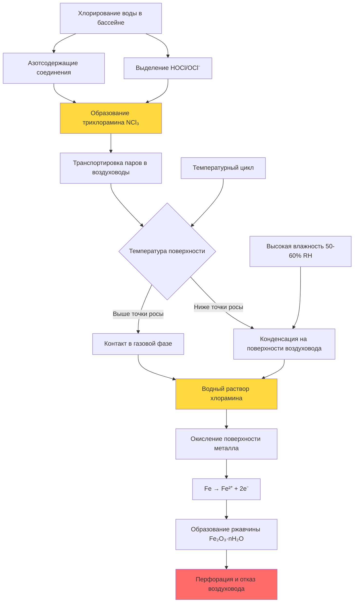

Воздуховоды нататориев работают в наиболее коррозионной среде HVAC из-за сочетания высокой влажности (обычно 50-60% RH), повышенных концентраций хлора и хлораминов, а также постоянного температурного цикла. Обычные оцинкованные стальные воздуховоды быстро выходят из строя в этих условиях, полная деградация возможна за 2-5 лет. Правильный выбор материалов и защита от коррозии имеют критическое значение для долговечности системы и качества воздуха.

## Механизмы коррозии в помещениях с бассейнами

Хлорированная вода в бассейне выделяет гипохлористую кислоту (HOCl) и ионы гипохлорита (OCl⁻) в воздух. При сочетании с азотсодержащими соединениями из отходов пловцов они образуют трихлорамин (NCl₃) — высокотоксичный коррозионный газ, который конденсируется на холодных поверхностях воздуховодов. Процесс коррозии ускоряется при возникновении условий точки росы внутри воздуховодов.

## Факторы скорости коррозии

Скорость коррозии черных металлов в среде нататория зависит от концентрации хлораминов, относительной влажности и температуры поверхности:

$$
CR = k \cdot [NCl_3]^{0.8} \cdot (RH)^{1.5} \cdot e^{-\frac{E_a}{RT_s}}
$$

Где:
- $CR$ = скорость коррозии (мкм/год)
- $k$ = материалоспецифичная константа
- $[NCl_3]$ = концентрация трихлорамина (мг/м³)
- $RH$ = относительная влажность (доля)
- $E_a$ = энергия активации реакции коррозии (Дж/моль)
- $R$ = универсальная газовая постоянная (8,314 Дж/моль·К)
- $T_s$ = температура поверхности (К)

Для оцинкованной стали в типичных условиях нататория ([NCl₃] = 0,3-0,5 мг/м³, RH = 0,55, T_s = 20°C) скорость коррозии составляет 0,38-1,02 мм/год, что приводит к отказу воздуховодов толщиной 0,7 мм в течение 2-4 лет.

## Выбор материала воздуховодов

Выбор материала должен уравновешивать устойчивость к коррозии, механическую прочность и стоимость. В справочнике ASHRAE Applications Handbook Chapter 6 и руководствах SMACNA рекомендуется избегать черных металлов для приложений в нататориях.

| Материал | Устойчивость к коррозии | Коэффициент стоимости | Механическая прочность | Срок службы | Примечания |
|----------|------------------------|----------------------|------------------------|------------|-----------|
| Оцинкованная сталь | Низкая | 1,0× | Отличная | 2-5 лет | Не рекомендуется; быстрый отказ |
| Сталь с эпоксидным покрытием | Удовлетворительная | 1,8× | Отличная | 5-8 лет | Повреждение покрытия в местах соединений |
| Алюминий (5052/6061) | Хорошая | 2,2× | Хорошая | 12-20 лет | Питтинг при хлоридах >0,5 мг/м³ |
| Нержавеющая сталь 304 | Очень хорошая | 3,5× | Отличная | 20-30 лет | Коррозия под напряжением в местах крепления |
| Нержавеющая сталь 316 | Отличная | 4,8× | Отличная | 30+ лет | Лучший металлический вариант |
| Стеклопластик (FRP) | Отличная | 2,8× | Удовлетворительная | 25-35 лет | Требует внешнего усиления |
| ПВХ/ХПВХ Schedule 40 | Отличная | 2,5× | Плохая | 20-30 лет | Ограничено низкоскоростными приложениями |

**Коэффициенты стоимости указаны относительно стоимости установки оцинкованной стали на квадратный метр поверхности воздуховода.**

## Критерии выбора материала

Коэффициент устойчивости для выбора материала объединяет химическую стойкость, механические свойства и тепловые характеристики:

$$
R_f = \frac{(C_r \cdot M_s)}{(C_i \cdot T_e)} \cdot \eta_{fab}
$$

Где:
- $R_f$ = коэффициент устойчивости (выше лучше)
- $C_r$ = рейтинг химической стойкости (шкала 1-10)
- $M_s$ = коэффициент механической прочности относительно оцинкованной стали
- $C_i$ = коэффициент установленной стоимости
- $T_e$ = коэффициент теплового расширения относительно оцинкованной стали
- $\eta_{fab}$ = коэффициент сложности изготовления (0,6-1,0)

Для нататориев требуется $R_f > 2,0$ для приточных воздуховодов и $R_f > 2,5$ для вытяжных воздуховодов с наибольшими концентрациями хлораминов.

## Системы покрытий для стальных воздуховодов

При экономических ограничениях, требующих стальных воздуховодов, многослойные системы покрытий продлевают срок службы. SMACNA "HVAC Systems - Duct Design" определяет требования к покрытиям для коррозионной среды.

**Эффективные системы покрытий:**

1. **Эпоксидно-фенольное плавленое покрытие**
   - Толщина сухой пленки: 0,30-0,41 мм
   - Способ нанесения: Заводское нанесение порошкового покрытия
   - Срок службы: 8-12 лет при надлежащей герметизации швов
   - Критично: Все полевые срезы и стыки требуют восстановления полевого покрытия

2. **Полиамидная эпоксидная смола**
   - Толщина влажной пленки: 0,25-0,30 мм (два слоя)
   - Способ нанесения: Распыление или ручное нанесение
   - Срок службы: 6-10 лет
   - Требует подготовку поверхности SSPC-SP6 (коммерческая пескоструйная обработка)

3. **Виниловая смола сложного эфира**
   - Толщина влажной пленки: 0,38-0,51 мм
   - Способ нанесения: Заводское нанесение с тепловым отверждением
   - Срок службы: 10-15 лет
   - Отличная устойчивость к хлораминам

**Все системы покрытий выходят из строя в негерметичных стыках, проходах и местах крепления.** Полевые герметики, совместимые с системой покрытия, обязательны во всех соединениях.

## Рекомендации по проектированию

**Приточные воздуховоды:**
- Минимум: Алюминий 5052 или стеклопластик (FRP)
- Предпочтительно: Нержавеющая сталь 304 для долговечности
- Изоляция: Внешняя с пароизоляцией для предотвращения конденсации
- Скорость: ≤6,1 м/с для минимизации эрозии покрытия

**Вытяжные воздуховоды:**
- Минимум: FRP или ПВХ для низконапорных систем
- Предпочтительно: Нержавеющая сталь 316 со сварными швами
- Критично: Первые 6-9 м от области бассейна испытывают наибольшее воздействие хлораминов
- Уклон: Минимум 1,3 см на метр с целью дренажа конденсата, с дренажными устройствами через каждые 6 м

**Крепежи и опоры:**
- Используйте нержавеющую сталь 316 для всех крепежей, подвесок и опор
- Избегайте контакта разнородных металлов (используйте изолирующие втулки)
- Резьбовые герметики должны быть устойчивы к хлору (например, на основе PTFE)

**Герметизация стыков:**
- Все продольные и поперечные стыки требуют герметика, совместимого с материалом воздуховода
- Силиконовые или полиуретановые герметики, рассчитанные на постоянную влажность
- Минимум 0,63 см слой герметика во всех S-слипах и направляющих

## Осмотр и техническое обслуживание

Визуальный осмотр воздуховодов нататория должен проводиться каждые 6 месяцев с особым внимание к:
- Целостности стыков и состоянию герметика
- Появлению ржавчины или белых продуктов коррозии (алюминий)
- Адгезии и повреждению покрытия
- Пятнам конденсата, указывающим на условия точки росы

Ежегодное тестирование качества воздуха на содержание хлораминов предупреждает о деградации системы. Концентрации >0,5 мг/м³ указывают на неадекватную вентиляцию или утечки воздуховодов, позволяющие возврату загрязненного воздуха.

SMACNA "Accepted Industry Practices for Sheet Metal Lagging" предоставляет руководства по осмотру и процедурам восстановления защитного покрытия, специфичные для коррозионной среды.

## Заключение

Защита воздуховодов нататория от коррозии требует системного подхода: надлежащего выбора материала, правильной изоляции для предотвращения конденсации, эффективной герметизации для предотвращения утечек и регулярного осмотра. Хотя первоначальные затраты на коррозионно-стойкие материалы в 2,5-5 раз выше, чем на оцинкованную сталь, срок службы 20-30 лет и исключение затрат на преждевременную замену обеспечивают сильное экономическое обоснование. Для критических приложений нержавеющая сталь 316 или стеклопластиковые воздуховоды представляют наиболее надежное долгосрочное решение.
