Соображения при проектировании воздуховодов плавательных бассейнов выходят за рамки выбора материалов и охватывают дренажные системы, точки доступа, герметизацию соединений и системы поддержки, которые в совокупности предотвращают повреждение от коррозии. Надлежащее проектирование снижает двойную угрозу внешней конденсации и внутреннего накопления влаги в хлорамин-содержащей среде.

## Дренажные системы и требования к уклону

Воздуховоды в плавательных бассейнах должны удалять стоячую воду и конденсат, которые ускоряют коррозию при комбинировании с хлораминами. Рекомендации SMACNA предусматривают минимальный уклон воздуховода 1:200 (0,5%) в сторону дренажных точек для горизонтальных участков.

**Расчеты проектирования дренажа:**

$$Q_d = \frac{A \cdot V \cdot \Delta T \cdot h_{fg}}{c_p \cdot (T_s - T_{dp})}$$

Где:
- $Q_d$ = расход конденсата (кг/ч)
- $A$ = площадь наружной поверхности воздуховода (м²)
- $V$ = скорость воздуха (м/с)
- $\Delta T$ = разность температур (°C)
- $h_{fg}$ = скрытая теплота испарения (кДж/кг)
- $c_p$ = удельная теплоемкость воздуха (кДж/(кг·°C))
- $T_s$ = температура поверхности (°C)
- $T_{dp}$ = температура точки росы (°C)

**Пределы скорости в коррозионных средах:**

$$v_{max} = \sqrt{\frac{2 \cdot \Delta P \cdot \rho}{f \cdot L/D}}$$

Где:
- $v_{max}$ = максимальная скорость (м/с)
- $\Delta P$ = допустимое падение давления (Па)
- $\rho$ = плотность воздуха (кг/м³)
- $f$ = коэффициент трения (безразмерный)
- $L/D$ = коэффициент формы воздуховода

Справочник ASHRAE по приложениям (глава 6) ограничивает скорость воздуха в системах подачи воздуховодов плавательных бассейнов до 3300-4100 м³/ч для минимизации эрозионной коррозии на фитингах и предотвращения повторного уноса влаги из точек дренажа.

## Особенности проектирования воздуховодов, устойчивых к коррозии

```mermaid
graph TD
    A[Система воздуховодов плавательного бассейна] --> B[Проектирование дренажа]
    A --> C[Обеспечение доступа]
    A --> D[Герметизация соединений]
    A --> E[Защита системы поддержки]

    B --> B1[Минимальный уклон 1:200]
    B --> B2[Дренажные поддоны в низких точках]
    B --> B3[Праймеры ловушек]
    B --> B4[Положительный дренаж]

    C --> C1[Люки доступа через каждые 6 м]
    C --> C2[Смотровые отверстия]
    C --> C3[Коррозионностойкие рамы]
    C --> C4[Герметичные уплотнения]

    D --> D1[Предпочтительны сварные швы]
    D --> D2[Герметичные механические соединения]
    D --> D3[Негигроскопичные герметики]
    D --> D4[Непрерывный контроль сварки]

    E --> E1[Покрытые кронштейны поддержки]
    E --> E2[Изолирующие прокладки]
    E --> E3[Оборудование из нержавеющей стали]
    E --> E4[Гальваническая защита]

    style A fill:#e1f5ff
    style B fill:#fff4e1
    style C fill:#ffe1f5
    style D fill:#e1ffe7
    style E fill:#f5e1ff
```

## Проектирование люков доступа и смотровых отверстий

Люки доступа служат двойной цели в воздуховодах плавательного бассейна: обеспечение инспекции коррозии и облегчение очистки отложений хлорамина. Стандарты SMACNA для размещения люков доступа:

- Минимум один люк доступа на каждые 6 м горизонтального воздуховода
- Люки доступа в низких точках со всеми дренажными системами
- Доступ перед и после теплообменников и фильтров
- Минимум 30 см × 30 см для инспекции; 46 см × 46 см для входа

Рамы и оборудование люков доступа должны быть коррозионностойкими:
- Рамы и крепежные элементы из нержавеющей стали марки 316
- Уплотнения из EPDM или силикона (не неопрена)
- Внешние защелки с коррозионностойким покрытием
- Съемные снаружи без нарушения уплотнений

## Проектирование герметизации соединений и соединительных узлов

Целостность соединений предотвращает проникновение хлорамина в изоляцию воздуховода и в полости стен. Иерархия герметизации для приложений с плавательными бассейнами:

1. **Сварные соединения** (предпочтительно): непрерывные сварные швы TIG или MIG для ПВХ-покрытых, нержавеющих или алюминиевых воздуховодов
2. **Механические соединения**: герметизированные неотвердевающимися, негигроскопичными герметиками
3. **Фланцевые соединения**: уплотненные EPDM или силиконовыми прокладками, не пробковыми или волокнистыми материалами

**Соображения по статическому давлению в герметичных системах:**

$$\Delta P_{seal} = \frac{f \cdot L \cdot \rho \cdot v^2}{2 \cdot D \cdot g_c} + K \cdot \frac{\rho \cdot v^2}{2 \cdot g_c}$$

Где:
- $\Delta P_{seal}$ = падение давления на герметичном соединении (Па)
- $K$ = коэффициент потерь соединения (0,05–0,15 для герметичных соединений)
- $g_c$ = гравитационная постоянная (9,81 м/с²)

Чрезмерное статическое давление от избыточной герметизации может напрячь соединения и создать точки утечки. Целевое значение проекта: утечка соединения < 1% при рабочих давлениях согласно SMACNA Seal Class A.

## Подходы к проектированию по степени тяжести коррозии

| Уровень коррозии | Материал воздуховода | Тип соединения | Частота доступа | Уклон дренажа | Система покрытия |
|-----------------|----------------------|-----------------|------------------|-------------------|------------------|
| **Мягкая** (< 0,16 м³/с хлораминов) | ПВХ-покрытый оцинкованный | Герметичное механическое | Через каждые 9 м | 1:200 (0,5%) | Односложное эпоксидное снаружи |
| **Средняя** (0,16–0,48 м³/с) | Нержавеющая сталь марки 304 | Сварные или уплотненные фланцы | Через каждые 6 м | 1:150 (0,67%) | Двойное эпоксидное или фенольное |
| **Высокая** (> 0,48 м³/с) | Нержавеющая сталь марки 316 или FRP | Непрерывно сварные | Через каждые 4,6 м | 1:100 (1%) | Тройное фенольное внутри/снаружи |
| **Экстремальная** (соревновательные бассейны) | FRP или сплав AL6XN | Сварной FRP | Через каждые 3 м | 1:80 (1,25%) | Интегральный FRP или фторополимерный слой |

## Защита от коррозии системы поддержки

Поддержка воздуховодов создает риски гальванического связывания и концентрации конденсации. Стратегии защиты:

- **Изоляция**: прокладки из EPDM или неопрена между воздуховодом и поддержкой
- **Совместимость материалов**: соответствие материала поддержки материалу воздуховода (поддержка из нержавеющей стали марки 316 для воздуховода из нержавеющей стали марки 316)
- **Покрытие**: горячее цинкование или эпоксидное покрытие стали с минимальной толщиной сухого пленки 100 мкм
- **Оборудование**: болты, резьбовые стержни и крепежные элементы из нержавеющей стали марки 316

Расстояние между вешалками должно учитывать вес влаги в дополнение к стандартным нагрузкам. SMACNA рекомендует уменьшить стандартное расстояние вешалок на 25% для приложений с плавательными бассейнами, где возможно накопление конденсата.

## Управление конденсатом

Низкие точки требуют дренажных поддонов, изготовленные из коррозионностойких материалов (нержавеющая сталь марки 316 или ПВХ) с уловленными соединениями для санитарных стоков. Праймеры ловушек предотвращают потерю уплотнения в сухие периоды. Размер дренажных соединений для 150% от расчетного расхода конденсата для предотвращения переполнения при пиковых нагрузках осушения.

Справочник ASHRAE по приложениям, глава 6 предоставляет психрометрические методы для расчета скоростей образования конденсата на основе притока наружного воздуха, условий в помещении и температур поверхности воздуховода.

## Интеграция мониторинга коррозии

Проектирование должно включать точки мониторинга коррозии:
- Съемные образцы в репрезентативных местах
- Точки доступа для ультразвукового измерения толщины
- Смотровые отверстия в зонах повышенного риска (фитинги, переходы)
- Документирование исходных измерений толщины

Частота мониторинга: ежеквартально в течение первого года, затем ежегодно, если скорости коррозии остаются ниже расчетных порогов (< 50 мкм/год для покрытых систем, < 12 мкм/год для нержавеющей стали).

## Ссылки

- SMACNA HVAC Systems Duct Design, 4th Edition: спецификации воздуховодов плавательного бассейна
- ASHRAE Handbook—Applications, Chapter 6: руководство по проектированию HVAC плавательного бассейна
- SMACNA Architectural Sheet Metal Manual: стандарты деталей люков доступа и дренажа
