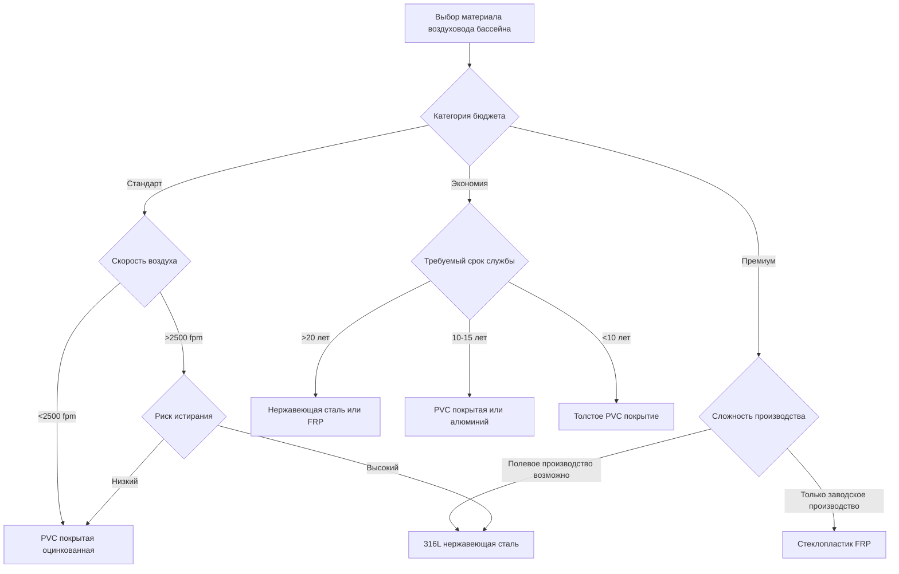

Выбор материала воздуховодов для бассейнов представляет одно из наиболее критичных инженерных решений в системах HVAC закрытых бассейнов. В отличие от стандартных коммерческих применений, воздуховоды бассейнов должны выдерживать непрерывное воздействие хлорированного воздуха с относительной влажностью 50-60%, создавая агрессивную коррозионную среду, которая быстро разрушает обычные оцинкованные стальные системы.

## Механизмы коррозии в окружающей среде бассейна

Основным фактором коррозии в закрытых бассейнах является образование гипохлорита (HClO) и хлороводорода (HCl) при реакции хлорсодержащих соединений с влагой в воздухе. Скорость коррозии черных металлов в этой среде следует уравнению:

$$C_r = k \cdot [\text{Cl}_2]^{0.6} \cdot (\text{RH})^{1.8} \cdot e^{-E_a/RT}$$

Где:
- $C_r$ = скорость коррозии (мкм/год)
- $k$ = специфичная для материала константа
- $[\text{Cl}_2]$ = концентрация хлора (ppm)
- $\text{RH}$ = относительная влажность (десятичная дробь)
- $E_a$ = энергия активации
- $R$ = газовая постоянная
- $T$ = абсолютная температура (K)

Стандартные оцинкованные стальные воздуховоды обычно выходят из строя в течение 3-7 лет в применении для бассейнов, что делает выбор материала существенным для долгосрочной жизнеспособности системы.

## Основа принятия решений по выбору материала

## Матрица сравнения материалов

| Материал | Химическая стойкость | Начальная стоимость | Производство | Обслуживание | Срок службы | SMACNA рейтинг |
|----------|---------------------|--------------|-------------|-------------|--------------|---------------|
| **316L Нержавеющая сталь** | Отличная | $$$$ | Стандартная листовая обработка | Минимальное | 30+ лет | Отличный |
| **Стеклопластик FRP** | Отличная | $$$ | Специализированное производство | Минимальное | 25-30 лет | Отличный |
| **PVC покрытая оцинкованная (толстая)** | Очень хорошая | $$ | Модифицированное стандартное | Периодическая проверка | 15-20 лет | Хорошо |
| **Алюминий 5052** | Хорошая | $$$ | Стандартная листовая обработка | Регулярная проверка | 15-20 лет | Удовлетворительно |
| **PVC ductboard** | Отличная | $ | Заводское производство | Мониторинг конструкции | 20-25 лет | Хорошо |
| **Тканевый воздуховод (антимикробный)** | Хорошая | $$ | Специализированное производство | Периодическая замена | 10-15 лет | Ограниченно |

## Критерии инженерного выбора

### 316L Нержавеющая сталь

Аустенитная нержавеющая сталь с низким содержанием углерода обеспечивает превосходную стойкость к коррозии под напряжением, вызванной хлоридами. Пассивирующий слой оксида хрома остается стабильным в типичном диапазоне pH бассейна (7.2-7.8):

$$\text{PREN} = \%\text{Cr} + 3.3(\%\text{Mo}) + 16(\%\text{N})$$

Для 316L: PREN ≈ 24-26, обеспечивая отличную стойкость к питтинг-коррозии.

**Применение**: Приточные и обратные воздуховоды, системы с высокой скоростью потока (>3000 fpm), воздухозаборы наружного воздуха
**Производство**: Применяются стандартные методы конструкции SMACNA; TIG сварка предпочтительна для швов
**Ограничения**: Наиболее высокая начальная стоимость; требует крепежа из нержавеющей стали и совместимой опорной конструкции

### Стеклопластик FRP

Термореактивные системы на основе полиэфира или винилэстера, армированные стеклянными матами, обеспечивают полную невосприимчивость к коррозии от хлора. Материал демонстрирует практически нулевое поглощение влаги:

$$\alpha_{\text{влага}} < 0.1\%$$

**Применение**: Основные тракты приточного и обратного воздуха, соединения осушающего оборудования, вытяжные системы
**Производство**: Заводское производство с ручной или намоточной технологией; полевые соединения используют механические муфты
**Ограничения**: Ограничено более низкими скоростями (<2500 fpm); требует специализированной рабочей силы; деградация от УФ при воздействии солнечного света

### PVC покрытая оцинкованная сталь

Горячеоцинкованная сталь с покрытием из пластизола PVC толщиной 10-20 мил обеспечивает экономичную защиту от коррозии при условии сохранения целостности покрытия:

$$t_{\text{покрытие}} \geq 15 \text{ мил для соответствия ASHRAE Applications Manual}$$

**Применение**: Системы с низкой и средней скоростью воздуха, ответвительные воздуховоды, установки над подвесным потолком
**Производство**: Модифицированные методы SMACNA; восстановление покрытия требуется во всех местах обрезки и проникновения
**Ограничения**: Повреждение покрытия при установке нарушает защиту; требует протокола проверки

### Алюминиевые сплавы

Алюминий 5052-H32 обеспечивает умеренную стойкость к коррозии через образование защитной оксидной пленки. Производительность зависит от пределов концентрации хлоридов:

$$[\text{Cl}^-] < 50 \text{ ppm для приемлемых скоростей коррозии}$$

**Применение**: Ограничено низкохлорными окружающими средами или короткими участками воздуховодов
**Производство**: Стандартные методы листовой обработки металла; избегать гальванического контакта с разнородными металлами
**Ограничения**: Риск питтинг-коррозии возрастает с влажностью; не рекомендуется для основных систем

## Рекомендации ASHRAE и SMACNA

Справочник ASHRAE Applications Handbook (Глава 6: Natatoriums) определяет критерии выбора материала на основе степени воздействия:

**Зона 1 (площадь прямого воздействия воды бассейна)**: Только FRP или 316L нержавеющая сталь
**Зона 2 (в пределах 9 м от бассейна)**: PVC покрытая (толстая), FRP или нержавеющая сталь
**Зона 3 (удаленные механические помещения)**: Покрытая оцинкованная сталь приемлема с мониторингом

SMACNA *HVAC Systems Duct Design* рекомендует коэффициенты допуска на коррозию для расчетов толщины материала в хлорированных окружающих средах:

$$t_{\text{проектная}} = t_{\text{стандартная}} \cdot (1 + C_f)$$

Где $C_f$ = 0.3-0.5 для применения в бассейнах.

## Рассмотрение стоимости жизненного цикла

Хотя нержавеющая сталь и FRP требуют начальных затрат в 2.5-4 раза выше, чем покрытые оцинкованные системы, анализ жизненного цикла последовательно отдает предпочтение коррозионностойким материалам:

$$\text{LCC} = C_{\text{начальная}} + \sum_{t=1}^{n} \frac{C_{\text{обслуж},t} + C_{\text{замена},t}}{(1+r)^t}$$

Для типичной системы из 10,000 CFM (16,990 м³/ч) для бассейна в течение 20 лет системы из нержавеющей стали или FRP демонстрируют 30-45% меньшие LCC по сравнению с многократными заменами покрытых оцинкованных систем.

## Лучшие практики в технических условиях

1. **Явно указывайте марку сплава**: "316L нержавеющая сталь", а не просто "нержавеющая сталь"
2. **Требуйте проверку толщины покрытия**: Минимум 15 мил для систем PVC
3. **Подробно описывайте процедуры полевого ремонта**: Все системы с защитным покрытием нуждаются в документированных протоколах ремонта
4. **Указывайте совместимость крепежа**: Используйте тот же материал или совместимые сплавы для опор и крепежей
5. **Включайте требования проверки**: Ежегодная проверка целостности покрытия для неметаллических защитных систем

Выбор материала создает основу для надежной долгосрочной работы HVAC бассейна. Агрессивная хлорированная окружающая среда исключает традиционные материалы как жизнеспособный вариант, требуя инженерного анализа для уравновешивания начальной стоимости против срока службы и требований к обслуживанию.
