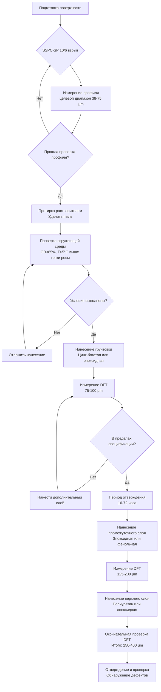

## Защитные покрытия для воздуховодов бассейнов

Системы защитных покрытий представляют собой основную линию защиты от коррозии, вызванной хлоридами, в воздуховодах бассейнов. Агрессивная химическая среда, характеризуемая концентрациями хлорного газа 0,5–2,0 ppm, парами хлоромина и относительной влажностью, превышающей 60%, требует систем покрытий, спроектированных для химической стойкости, стабильности адгезии и долгосрочной непроницаемости.

## Критерии выбора системы покрытия

Выбор защитных покрытий требует оценки нескольких параметров производительности:

**Химическая стойкость**: Покрытия должны выдерживать постоянное воздействие хлора, гипохлористой кислоты (HOCl) и хлораминов без деградации, вздутия или потери адгезии.

**Проницаемость**: Низкие скорости передачи водяного пара предотвращают коррозию подложки. Толщина пленки и плотность сшивки определяют характеристики проницаемости.

**Тепловая стабильность**: Рабочие температуры в системах осушения варьируются от -5 °C до 65 °C. Системы покрытий должны сохранять целостность в этом диапазоне температур без растрескивания или расслаивания.

**Механические свойства**: Покрытия должны иметь достаточную гибкость для компенсации теплового расширения (коэффициент α = 12–17 × 10⁻⁶ /°C для стали) и механического напряжения от вибраций, вызванных потоком воздуха.

## Сравнение типов покрытий

| Тип покрытия | Толщина сухой пленки (DFT) | Химическая стойкость | Рабочая температура | Окно переполучения | Относительная стоимость |
|--------------|---------------------------|---------------------|---------------------|---------------|---------------|
| Эпоксидная (2-компонентная) | 125–250 μm | Отличная для хлора/щелочи | -20 °C до 120 °C | 24–72 часа | Средняя |
| Полиуретан (алифатический) | 75–150 μm | Хорошая, стойкость к УФ | -30 °C до 90 °C | 16–48 часов | Средняя–высокая |
| Эпоксидная с цинком (грунтовка) | 75–100 μm | Отличная (жертвенная) | -20 °C до 65 °C | Макс. 48 часов | Высокая |
| Фенольная эпоксидная | 200–400 μm | Превосходная для кислот/хлора | -10 °C до 200 °C | 24–96 часов | Высокая |

## Требования к подготовке поверхности

Производительность покрытия напрямую коррелирует с качеством подготовки поверхности. Стандарты SSPC-SP определяют протоколы подготовки:

**SSPC-SP 10 (ближе к белому взрыву)**: Удалите всю видимую ржавчину, окалину и покрытия для достижения 95% чистой поверхности. Требуется для условий погружения или серьезного химического воздействия.

**SSPC-SP 6 (коммерческий взрыв)**: Минимальный стандарт для воздуховодов бассейнов, удаляет 67% поверхностного загрязнения. Глубина профиля поверхности: 38–75 μm.

**Измерение профиля поверхности**: Глубина рисунка якоря должна коррелировать с толщиной покрытия:

$$
t_{\text{профиль}} = 0,25 \times t_{\text{покрытие}}
$$

где $t_{\text{профиль}}$ — глубина профиля поверхности, а $t_{\text{покрытие}}$ — указанная толщина сухой пленки.

**Проверка чистоты**: Загрязнение хлоридами не должно превышать 7 μg/cm² (метод Bresle, ISO 8502-6). Удаление масла и смазки согласно SSPC-SP 1 с использованием растворителей предшествует абразивной обработке.

## Процесс нанесения покрытия

## Расчеты толщины покрытия

Общая толщина системы следует принципу многослойного нанесения, когда каждый слой обеспечивает конкретную функцию:

$$
DFT_{\text{всего}} = DFT_{\text{грунтовка}} + DFT_{\text{промежуточный}} + DFT_{\text{верхний}}
$$

Для суровых условий в бассейнах укажите:
- Грунтовка: 75–100 μm
- Промежуточный слой: 125–150 μm
- Верхний слой: 75–100 μm
- **Итого: 275–350 μm**

**Расчет покрытия**: Теоретическое покрытие зависит от содержания объемных твердых веществ (VS):

$$
\text{Покрытие (м}^2\text{/л)} = \frac{VS \times 10}{DFT_{\mu m}}
$$

Пример: Эпоксидное покрытие с 70% VS, нанесенное при DFT 125 μm дает:

$$
\text{Покрытие} = \frac{70 \times 10}{125} = 5,6 \text{ м}^2\text{/л теоретически}
$$

Практическое покрытие учитывает потери 25–35% (напыление, неровности поверхности):

$$
\text{Покрытие}_{\text{практическое}} = \text{Покрытие}_{\text{теоретическое}} \times 0,70 = 3,9 \text{ м}^2\text{/л}
$$

## Выбор метода нанесения

**Безвоздушное распыление**: Основной метод для крупного производства воздуховодов. Размер форсунки 0,43–0,53 mm, давление 140–210 bar. Обеспечивает равномерное наращивание пленки с минимальными потерями.

**Кисть/валик**: Полевой ремонт и небольшие площади. Увеличивает DFT на 20–30% по сравнению с распылением из-за механической обработки покрытия в профиль поверхности.

**Распыление с несколькими компонентами**: Для быстро отверждаемых полиуретановых и полиуретановых систем. Требует нагреванных шлангов (60–70 °C) и точного контроля коэффициента соотношения (1:1 или пользовательские коэффициенты).

## Контроль окружающей среды при нанесении

Нанесение покрытия требует строгого контроля окружающей среды:

- **Температура**: Температура подложки должна превышать точку росы минимум на 3 °C, согласно SSPC-PA 1
- **Относительная влажность**: Максимум 85% ОВ во время нанесения и начального отверждения
- **Температура воздуха**: В пределах спецификации производителя, обычно 10–35 °C

Расчет точки росы:

$$
T_{\text{dp}} = T - \frac{100 - ОВ}{5}
$$

где $T$ — температура воздуха (°C), а ОВ — относительная влажность (%).

## Проверка покрытия и обеспечение качества

**Толщина сухой пленки**: Измеряйте с помощью датчиков магнитной индукции (тип 1 или 2, согласно SSPC-PA 2). Минимум 5 измерений на 10 м² площади. Отдельные показания не должны быть ниже 90% указанного DFT.

**Обнаружение дефектов**: Применить испытание искровым электродом при напряжении, определяемом толщиной покрытия:

$$
V_{\text{тест}} = 1000 + 3000 \times \left(\frac{DFT_{\text{мил}} - 5}{5}\right)
$$

Для покрытия толщиной 12 мил: $V = 1000 + 3000 \times \frac{7}{5} = 5200$ В постоянного тока.

**Испытание адгезии**: Минимум отслаивающейся адгезии ASTM D4541 составляет 2,0 МПа для грунтовок, 1,4 МПа для верхних слоев.

## Срок службы и переполучение

Правильно нанесенные системы покрытий в условиях бассейна достигают 15–25 лет срока службы. К режимам деградации относятся:

- **Мелование**: Деградация полимера, вызванная УФ (наружные применения)
- **Вздутие**: Осмотическое давление от загрязнения подложки или неадекватного отверждения
- **Расслаивание**: Потеря адгезии от химического воздействия на стыке покрытие–подложка

**Оценка переполучения**: Когда деградация покрытия достигает 5–10% площади поверхности, инициируйте протокол переполучения:

1. Удалите рыхлое/деградированное покрытие согласно SSPC-SP 2 или SP 11 (очистка электроинструментом)
2. Скосите края существующего покрытия с скосом 50 mm
3. Используйте точечную грунтовку голых участков для соответствия существующему DFT
4. Нанесите полную систему верхнего слоя

## Применимые стандарты и спецификации

- **NACE SP0108**: Контроль внутренней коррозии в стальных трубопроводах и системах трубопроводов
- **SSPC-SP 10/NACE No. 2**: Очистка взрывом почти до белого цвета
- **SSPC-SP 6/NACE No. 3**: Коммерческая взрывная очистка
- **SSPC-PA 2**: Измерение толщины сухого покрытия с помощью магнитных датчиков
- **ASTM D4541**: Прочность отслаивания покрытий с использованием портативных испытательных машин адгезии
- **ISO 12944**: Краски и лаки — защита от коррозии стальных конструкций (среды C4/C5)

## Компоненты

- Эпоксидное покрытие воздуховода
- Фенольное покрытие
- Полиуретановое покрытие
- Покрытие оцинкованной стали
- Требования к толщине покрытия
- Стандарты нанесения покрытия
- Проверка покрытия
- Ожидаемый срок службы покрытия
