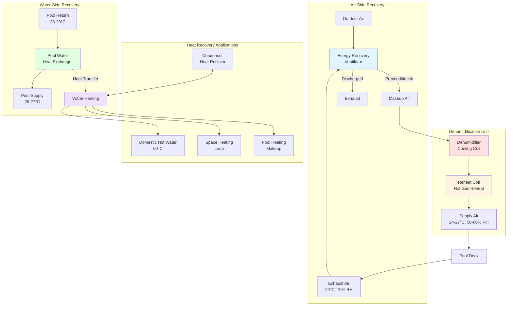

## Обзор

Комбинированные системы рекуперации тепла для аквапарков интегрируют рекуперацию энергии воздуха из помещений и рекуперацию тепла из воды бассейна для максимизации энергоэффективности. Эти двухпотоковые системы рекуперации захватывают тепловую энергию из теплого влажного воздуха из помещений, одновременно извлекая тепло из циркуляционной воды бассейна, слива душевых и других водяных потоков акватических объектов. Интегрированный подход достигает эффективности рекуперации, превышающей возможности отдельных систем, снижая эксплуатационные затраты объекта на 40-60% по сравнению с обычными системами без рекуперации тепла.

## Интеграция двойной рекуперации тепла

Комбинированные системы рекуперации координируют множество источников и приемников тепла в аквапарке. Первичный поток воздуха из помещений проходит через вентиляторы рекуперации энергии или тепловые трубки, передавая явное и скрытое тепло поступающему наружному воздуху. Одновременно циркуляционная вода бассейна отводится через теплообменники вода-вода или вода-хладагент перед возвратом в бассейн. Дополнительные возможности рекуперации включают рекуперацию тепла душевых, воды обратного потока и конденсата из оборудования осушения.

Проблема интеграции включает балансировку мощностей рекуперации в различных потоках. Доступность рекуперации воздуха из помещений коррелирует с расходами вентиляции (минимум 0,5 CFM/м² площади палубы согласно ASHRAE 62.1), в то время как рекуперация воды бассейна зависит от частоты циркуляции фильтрации (6-8 часов за цикл). Оптимальное проектирование системы последовательно расставляет оборудование рекуперации для максимизации перепадов температур и минимизации паразитных потерь от энергии на перекачивание и вентиляцию.

## Расчеты эффективности системы

Общая комбинированная эффективность рекуперации учитывает рекуперацию тепла как со стороны воздуха, так и со стороны воды:

$$\eta_{combined} = 1 - \frac{Q_{aux}}{Q_{total}}$$

где $Q_{aux}$ представляет вспомогательную энергию отопления после работы всех систем рекуперации, а $Q_{total}$ равна полной тепловой нагрузке, включая отопление помещения, отопление воды бассейна и горячее водоснабжение.

Комбинированная мощность рекуперации тепла суммирует отдельные потоки рекуперации:

$$Q_{recovery} = Q_{air} + Q_{pool} + Q_{shower} + Q_{other}$$

Для рекуперации со стороны воздуха:

$$Q_{air} = \dot{m}_{air} \cdot (h_{exhaust} - h_{oa}) \cdot \eta_{ERV}$$

Для рекуперации воды бассейна:

$$Q_{pool} = \dot{m}_{pool} \cdot c_p \cdot (T_{return} - T_{supply}) \cdot \eta_{HX}$$

Чистый коэффициент производительности системы объединяет механическое охлаждение для осушения с рекуперацией тепла:

$$COP_{net} = \frac{Q_{cooling} + Q_{reheat} + Q_{recovery}}{W_{comp} + W_{fan} + W_{pump}}$$

Типичные комбинированные системы достигают чистых значений COP от 4,5 до 6,5, что сравнивается с 2,5-3,5 для оборудования только для осушения без рекуперации.

## Конфигурация интегрированной системы

## Комбинированные конфигурации систем

| Тип конфигурации | Рекуперация воздуха | Рекуперация воды | Приложения | Типичная эффективность | Коэффициент установленной стоимости |
|-------------------|--------------|----------------|--------------|-------------------|----------------------|
| **Базовая комбинированная** | Run-around coil | Pool filter HX | Малые бассейны (<186 м²) | 35-45% общей рекуперации | 1,0× базовая |
| **Стандартная интегрированная** | Пластинчатый ERV + run-around | Бассейн + слив душевых | Средние объекты | 45-55% общей рекуперации | 1,3× базовая |
| **Продвинутая двухпотоковая** | Энтальпийное колесо + тепловая труба | Многоступенчатый бассейн/душ/обратный поток | Крупные аквапарки | 55-65% общей рекуперации | 1,6× базовая |
| **Полная интеграция** | Множество ERV + выделенный наружный воздух | Все водяные потоки + конденсат | Объекты для соревнований | 60-70% общей рекуперации | 2,0× базовая |

## Возможности рекуперации энергии

**Рекуперация воздуха из помещений**

Воздух из помещений аквапарка содержит значительную энергию явного и скрытого тепла. При типичных условиях (29°C, 70% относительной влажности) энтальпия воздуха из помещений достигает 92-102 кДж/кг, по сравнению с наружным воздухом при зимних условиях проектирования (-18°C, минимальная влажность) от 5-10 кДж/кг. Это различие в 82-97 кДж/кг представляет значительный потенциал рекуперации, особенно во время отопительного сезона, когда наружный воздух требует максимального кондиционирования.

**Рекуперация тепла воды бассейна**

Системы фильтрации бассейна циркулируют полный объем воды бассейна каждые 6-8 часов, обеспечивая постоянные возможности рекуперации тепла. Типичный олимпийский бассейн (2 500 м³) с циркуляцией за 6 часов перемещает через фильтры 116 л/с. Извлечение от 2 до 3°C из этого потока перед возвратом в бассейн дает:

$$Q_{pool} = 116 \text{ л/с} \times 1000 \text{ кг/м³} \times 4,18 \text{ кДж/кг·°C} \times 2,8°C = 1,35 \text{ ГДж/ч}$$

Эта извлеченная энергия предварительно нагревает горячее водоснабжение, обеспечивает отопление помещений или компенсирует нагрузки на отопление бассейна.

**Рекуперация тепла душевых и дренажа**

Крупные аквапарки с обширными душевыми помещениями генерируют значительное тепло дренажной воды. Теплообменники дренажной воды извлекают 40-60% тепла душевой, обычно предварительно нагревая холодную воду подпитки с 10-13°C до 29-35°C. Для объектов с 30-50 одновременно работающими душевыми в периоды пиковой нагрузки это представляет мощность рекуперации 58-117 кВт.

## Вопросы интеграции системы

Комбинированные системы рекуперации требуют тщательной интеграции, чтобы избежать конфликтов между режимами рекуперации. Охлаждение воды циркуляции бассейна для рекуперации тепла не должно переохлаждать бассейн ниже уставки (типичный диапазон 26-28°C). Оборудование рекуперации со стороны воздуха должно поддерживать надлежащие условия в помещении (24-27°C, 50-60% относительной влажности согласно ASHRAE 62.1 и местным санитарным кодам) независимо от работы рекуперации.

Последовательности управления приоритизируют работу оборудования рекуперации на основе мгновенных нагрузок. В переходные периоды с минимальными тепловыми нагрузками системы могут обойти оборудование рекуперации, чтобы предотвратить перегрев. Зимняя работа максимизирует рекуперацию для компенсации тепловой энергии. Летняя работа переводит акцент на охлаждение воды бассейна, используя извлеченное тепло для горячего водоснабжения вместо отопления помещений.

Анализ экономики должен учитывать повышенные первоначальные затраты против годовой экономии энергии. Комбинированные системы добавляют 86-161 $/м² площади палубы по сравнению с оборудованием только для осушения, но снижают годовые эксплуатационные расходы на 32-65 $/м² за счет рекуперации энергии. Периоды простой окупаемости варьируются от 2 до 5 лет в зависимости от климата, тарифов на коммунальные услуги и графиков работы объекта.

## Оптимизация производительности

Максимальная комбинированная эффективность рекуперации требует надлежащего подбора размеров и последовательности оборудования. Недостаточное оборудование рекуперации со стороны воздуха создает чрезмерные перепады давления и снижает эффективность вентиляции. Чрезмерно большие теплообменники воды бассейна увеличивают паразитную энергию на перекачивание без пропорционального прироста рекуперации.

Температурный каскад улучшает общую эффективность путем надлежащего согласования источников и приемников тепла. Источники рекуперации самой высокой температуры (тепло конденсатора от осушения) обслуживают нагрузки горячего водоснабжения, требующие выхода при 60°C. Промежуточные источники температуры (воздух из помещений при 29°C) обеспечивают отопление помещений и отопление воды бассейна. Источники более низкой температуры (слив душевых при 35-40°C) предварительно нагревают холодную воду подпитки.

Стандарт ASHRAE 90.1 требует рекуперации энергии для применений в аквапарках, превышающих 2360 CFM (4,0 м³/с) наружного воздуха и 70% или более доли наружного воздуха. Многие аквапарки работают с 100% наружным воздухом, чтобы предотвратить рециркуляцию воздуха, загрязненного хлоромином, что делает рекуперацию энергии обязательной для соответствия кодексу и необходимой для экономичной работы.

## Ссылки

- ASHRAE Standard 62.1: Ventilation for Acceptable Indoor Air Quality
- ASHRAE Standard 90.1: Energy Standard for Buildings Except Low-Rise Residential Buildings
- ASHRAE HVAC Applications Handbook, Chapter 6: Natatoriums
- ASHRAE Journal: Energy Recovery in Pool Facilities
- Model Aquatic Health Code (MAHC): Ventilation Requirements
