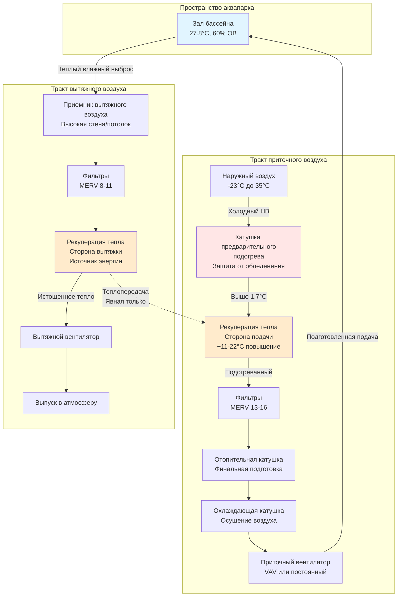

## Обзор

Рекуперация тепла вытяжного воздуха представляет собой наиболее эффективную стратегию энергосбережения в системах HVAC аквапарков. Крытые бассейны непрерывно выводят большие объемы теплого влажного воздуха для контроля влажности и поддержания приемлемого качества воздуха в помещении. Без рекуперации тепла это представляет собой огромную потерю тепловой энергии. Современные системы рекуперации тепла могут уловить 50-85% этой иначе потерянной энергии, значительно снижая затраты на отопление при сохранении надлежащего экологического контроля.

Уникальные условия эксплуатации аквапарков—высокая влажность, воздух, насыщенный хлораминами, и круглосуточная работа—предъявляют экстраординарные требования к оборудованию рекуперации тепла. Успешная реализация требует тщательного выбора типа теплообменника, надежной защиты от коррозии и комплексной стратегии предотвращения обледенения.

## Эффективность рекуперации тепла

Эффективность рекуперации тепла количественно определяет тепловые характеристики оборудования для рекуперации энергии. Для рекуперации явного тепла эффективность определяется как:

$$\eta_{sensible} = \frac{T_{supply} - T_{outdoor}}{T_{exhaust} - T_{outdoor}}$$

Где:
- $T_{supply}$ = температура подаваемого воздуха на выходе из теплообменника (°C)
- $T_{outdoor}$ = температура наружного воздуха на входе в теплообменник (°C)
- $T_{exhaust}$ = температура вытяжного воздуха на входе в теплообменник (°C)

Для систем полной рекуперации энергии (энтальпийная рекуперация) эффективность учитывает как явное, так и скрытое переносы тепла:

$$\eta_{total} = \frac{h_{supply} - h_{outdoor}}{h_{exhaust} - h_{outdoor}}$$

Где $h$ представляет удельную энтальпию (кДж/кг). Эффективность полной рекуперации энергии обычно составляет 60-75% для ротационных колес и 50-65% для пластинчатых теплообменников, разработанных для обслуживания аквапарков.

Годовое энергосбережение от рекуперации тепла можно оценить как:

$$Q_{saved} = \dot{m} \times c_p \times \eta \times (T_{exhaust} - T_{outdoor}) \times hours_{annual}$$

Для типичного аквапарка, выводящего 5,670 м³/ч (10,000 CFM) с эффективностью 70% и 5,500 часов отопления в год, это дает примерно 1,900 МДж/ч восстановленной мощности.

## Типы теплообменников для аквапарков

Выбор технологии теплообменника критически влияет на долгосрочную надежность и затраты на обслуживание в условиях бассейна.

| Тип теплообменника | Эффективность | Устойчивость к коррозии | Риск обледенения | Перекрестное загрязнение | Капитальные затраты | Обслуживание |
|---------------------|--------------|---------------------|-----------|---------------------|--------------|-------------|
| **Пластинчатый (Стационарный)** | 50-65% | Отличная (AL или SS) | Средний | Отсутствует | Умеренные | Низкое |
| **Ротационное колесо** | 70-85% | Плохая-Хорошая | Низкий | 1-3% утечка | Высокие | Среднее-Высокое |
| **Тепловая труба** | 45-60% | Отличная | Средний | Отсутствует | Умеренные | Очень низкое |
| **Замкнутый контур** | 45-55% | Отличная | Отсутствует | Отсутствует | Низкие-Умеренные | Среднее |

### Пластинчатые теплообменники

Стационарные пластинчатые теплообменники обеспечивают надежную рекуперацию явного тепла без перекрестного загрязнения. Для обслуживания аквапарков обязательна конструкция из алюминия или нержавеющей стали. Пластины должны иметь широкий зазор (6,4-9,5 мм) для минимизации загрязнения и обеспечения эффективной очистки. Перекрестные потоки предпочтительнее противотока для лучшего контроля обледенения.

**Ключевые спецификации:**
- Материал: нержавеющая сталь 316 или эпоксидированный алюминий
- Зазор между пластинами: минимум 6,4 мм
- Линейная скорость на входе: максимум 2,0 м/с
- Перепад давления: 9,9-19,8 Па при расходном расходе

### Ротационные тепловые колеса

Энтальпийные колеса обеспечивают наивысшую эффективность, но представляют значительные проблемы в приложениях с бассейнами. Стандартные колеса с десорбирующим покрытием несовместимы с воздействием хлоринов—следует рассматривать только сенсибельные колеса с алюминиевым или эпоксидированным субстратом. Даже с надлежащими материалами механизм ротационного уплотнения требует интенсивного обслуживания.

Справочник ASHRAE по применению специально предостерегает от энтальпийной рекуперации в аквапарках из-за передачи влаги и загрязняющих веществ из вытяжного в приточный воздухопровод. Если используются энтальпийные колеса, необходимны продувочные секции площадью минимум 10% от площади колеса.

### Теплообменники с тепловыми трубами

Тепловые трубы обеспечивают пассивный теплообмен через герметичные трубы с хладагентом. Полное разделение воздушных потоков исключает риск перекрестного загрязнения. Тепловые трубы превосходно работают в коррозионной среде при конструкции с медными трубами и алюминиевыми ребрами с защитными покрытиями.

Работа, зависящая от гравитации, означает, что тепловые трубы должны поддерживать надлежащую ориентацию (вытяжка выше подачи) и не могут применяться в горизонтальных конфигурациях. Эффективность объективно ниже, чем у активных систем, но надежность исключительная.

### Системы замкнутого контура

Системы замкнутого контура (гликолевый контур) размещают ребристые катушки в воздухопроводах вытяжки и подачи, соединенные циркулирующим раствором гликоля. Эта конфигурация предлагает полную гибкость в размещении катушек—физическая близость не требуется—и исключает все проблемы перекрестного загрязнения и обледенения.

Концентрация гликоля должна поддерживаться на уровне 40-50% для предотвращения замерзания в катушках наружного воздуха. Эффективность теплопередачи ограничена промежуточным жидким контуром, но операционная гибкость часто оправдывает этот штраф производительности в приложениях аквапарков.

## Защита от коррозии в условиях бассейна

Хламины, присутствующие в вытяжном воздухе аквапарков, агрессивно атакуют стандартные материалы HVAC. Все компоненты рекуперации тепла, контактирующие с вытяжным воздухом бассейна, требуют коррозионно-стойкой конструкции:

**Спецификации материалов:**
- Поверхности теплообменников: нержавеющая сталь 316, эпоксидированный алюминий или медь с защитным покрытием
- Рамы и корпуса: оцинкованная сталь минимум; нержавеющая сталь предпочтительнее
- Крепежные элементы: вся нержавеющая сталь
- Катушки (замкнутый контур): медные трубы с алюминиевыми ребрами, эпоксидное покрытие обязательно

Регулярные протоколы проверки должны проверять целостность покрытия. Любое нарушение защитных покрытий экспоненциально ускоряет деградацию. Запланируйте переработку или замену каждые 10-15 лет даже при надлежащем выборе материала.

## Стратегии защиты от обледенения

Когда температура наружного воздуха падает ниже нуля, конденсат внутри теплообменников может замерзнуть, блокируя поток воздуха и потенциально повреждая оборудование. Аквапарки представляют повышенный риск обледенения из-за высокого содержания влаги в вытяжном воздухе.

**Методы предотвращения обледенения:**

1. **Предварительный подогрев**: Подогрейте наружный воздух до 1.7-4.4°C перед входом в теплообменник
2. **Контроль байпаса**: Модулируйте наружный воздух вокруг теплообменника для поддержания минимальной температуры вытяжного воздуха
3. **Заслонки лицевой панели и байпаса**: Изменяйте эффективную площадь теплообменника, подверженную потоку воздуха
4. **Контроль скорости колеса** (ротационные колеса только): Уменьшайте скорость вращения для снижения эффективности

Температура точки росы вытяжного воздуха в самой холодной точке теплообменника должна оставаться выше 0°C. Для типичного аквапарка с вытяжным воздухом 27.8°C, 60% ОВ (точка росы 17.8°C), это обеспечивает существенный запас безопасности. Однако при низкой загруженности с уменьшенными скрытыми нагрузками активная защита от обледенения становится критичной.

Управление лицевой панелью и байпасом обеспечивает наиболее надежную защиту от обледенения с пластинчатыми теплообменниками. Установите датчики температуры на самый холодный выходной участок воздуха и модулируйте заслонки байпаса для поддержания минимума 4.4°C.

## Энтальпийная рекуперация против явной рекуперации

Выбор между рекуперацией только явного тепла и полной энергией (энтальпийной) фундаментально влияет на производительность системы в аквапарках.

**Преимущества явной рекуперации:**
- Отсутствие передачи влаги из вытяжного в приточный воздух (предотвращение загрязнения)
- Более простые последовательности управления
- Лучшая совместимость с коррозионной средой
- Более низкие требования к обслуживанию

**Проблемы энтальпийной рекуперации:**
- Передает 1-3% загрязняющих веществ вытяжного воздуха в подачу
- Десорбирующие покрытия быстро деградируют при воздействии хлоринов
- Повышенная сложность психрометрического управления
- ASHRAE рекомендует против применения в приложениях с бассейнами

Консенсус среди проектировщиков аквапарков ясен: рекуперация явного тепла только является предпочтительной. Скромное увеличение рекуперации влаги не оправдывает риск загрязнения и проблемы совместимости материалов.

## Конфигурация системы

## Лучшие практики реализации

**Соображения при проектировании:**

- **Возможность байпаса**: Установите полный байпас вокруг рекуперации тепла для обеспечения 100% механического охлаждения при благоприятных условиях на улице
- **Интеграция экономайзера**: Координируйте управление рекуперацией тепла с работой экономайзера для оптимальной эффективности
- **Доступность для обслуживания**: Обеспечьте съемные секции для периодической очистки и проверки
- **Мониторинг**: Установите датчики температуры и давления на всех границах теплообменника
- **Последовательности управления**: Запрограммируйте автоматический байпас при низкой температуре вытяжки, высокой температуре подачи или сигнале тревоги перепада давления

**Руководящие принципы эксплуатации:**

- Очищайте поверхности теплообменника минимум раз в год (ежеквартально в учреждениях с интенсивным использованием)
- Проверяйте покрытия два раза в год на предмет коррозионных повреждений
- Проверяйте работу защиты от обледенения перед каждым сезоном отопления
- Ежеквартально контролируйте эффективность рекуперации тепла и исследуйте любую деградацию
- Поддерживайте концентрацию гликоля (системы замкнутого контура) в соответствии со спецификациями производителя

**Валидация производительности:**

Документируйте базовую эффективность во время пуска с использованием приведенного выше уравнения. Ежегодная проверка обеспечивает, что оборудование сохраняет проектную производительность. Деградация эффективности более чем на 10% указывает на загрязнение или механический отказ, требующий корректирующих действий.

## Анализ энергии и экономики

Экономическое обоснование рекуперации тепла в аквапарках убедительно. Рассмотрим аквапарк площадью 1,400 м², выводящий 2,840 м³/ч с 3,333 градусо-днями отопления:

- Годовая нагрузка отопления без рекуперации: 3,400 ГДж
- Экономия от рекуперации тепла (70% эффективность): 2,380 ГДж
- Экономия природного газа (8.4 руб./кВч, 80% эффективность): 245,900 руб./год
- Простой период окупаемости (типичная установка): 3-5 лет

Эти сбережения сохраняются в течение жизненного цикла объекта. Рекуперация энергии должна рассматриваться как обязательная для любого аквапарка в климатических зонах со значительными требованиями к отоплению.

## Ссылки и стандарты

- ASHRAE Handbook—HVAC Applications, Chapter 6: Natatoriums
- ASHRAE Standard 62.1: Ventilation for Acceptable Indoor Air Quality
- ASHRAE Standard 90.1: Energy Standard for Buildings (Section 6.5.6 Energy Recovery)
- CDC Model Aquatic Health Code (MAHC): Ventilation Requirements

Рекуперация тепла в аквапарках представляет проверенную технологию с десятилетиями успешных внедрений. Надлежащий выбор оборудования, надежная защита от коррозии и эффективный контроль обледенения обеспечивают надежную работу и существенное энергосбережение на протяжении всего жизненного цикла объекта.
