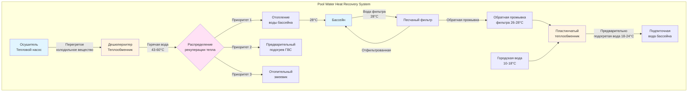

## Обзор

Рекуперация тепла бассейна захватывает тепловую энергию из множественных источников в системах HVAC нататориума для снижения эксплуатационных расходов и повышения энергоэффективности. Основные возможности рекуперации включают дешюперхитирование холодильного вещества из оборудования осушения воздуха, рекуперацию тепла обратной промывки фильтра и отработанное тепло механических систем. Правильно спроектированные системы рекуперации тепла могут снизить энергопотребление на отопление бассейна на 50-70%, одновременно нагревая горячую воду для хозяйственных нужд или обеспечивая отопление помещений.

Физика рекуперации тепла бассейна сосредоточена на передаче явного тепла от источника с более высокой температурой к воде бассейна при 26-28°C или другим конечным потребителям. Теплообменники служат в качестве критического интерфейса, с размерами, определяемыми коэффициентами теплопередачи, расходами и разностями температур.

## Системы дешюперхитера теплового насоса

Тепловые насосы осушения воздуха в нататориумах отводят тепло через конденсаторы, работающие при температурах холодильного вещества 32-49°C. Дешюперхитеры рекуперируют часть этого тепла из перегретого паров холодильного вещества перед конденсацией, обеспечивая горячую воду при 43-60°C.

### Емкость рекуперации тепла дешюперхитера

Рекуперируемое тепло из перегретого пара холодильного вещества:

$$Q_{dsh} = \dot{m}_r (h_2 - h_3)$$

Где:
- $Q_{dsh}$ = скорость рекуперации тепла дешюперхитером (кДж/ч)
- $\dot{m}_r$ = массовый расход холодильного вещества (кг/ч)
- $h_2$ = энтальпия на выходе компрессора (кДж/кг)
- $h_3$ = энтальпия при температуре насыщения (кДж/кг)

Для типичного оборудования осушения воздуха рекуперация дешюперхитером представляет 15-25% от полной емкости конденсатора.

### Размеры теплообменника

Теплообменники холодильное вещество-вода требуют правильного размера для максимизации теплопередачи при поддержании приемлемого перепада давления:

$$Q = UA \cdot LMTD$$

Где:
- $Q$ = скорость теплопередачи (кДж/ч)
- $U$ = общий коэффициент теплопередачи (кДж/ч·м²·°C)
- $A$ = площадь поверхности теплообменника (м²)
- $LMTD$ = логарифмическая средняя разность температур (°C)

$$LMTD = \frac{(T_{r,in} - T_{w,out}) - (T_{r,out} - T_{w,in})}{\ln\left(\frac{T_{r,in} - T_{w,out}}{T_{r,out} - T_{w,in}}\right)}$$

Где:
- $T_{r,in}$ = температура на входе холодильного вещества (°C)
- $T_{r,out}$ = температура на выходе холодильного вещества (°C)
- $T_{w,in}$ = температура воды на входе (°C)
- $T_{w,out}$ = температура воды на выходе (°C)

Типичные общие коэффициенты теплопередачи для теплообменников холодильное вещество-вода колеблются от 850-1400 кДж/ч·м²·°C в зависимости от скоростей потока и конструкции теплообменника.

## Рекуперация тепла обратной промывки фильтра

Фильтры бассейна требуют периодической обратной промывки, сбрасывая 3000-5700 л воды при 26-28°C при каждом цикле обратной промывки. Рекуперация тепла из этого потока отходов предварительно подогревает поступающую подпиточную воду, снижая нагрузки на отопление.

### Потенциал рекуперации тепла обратной промывки

Рекуперируемая энергия из обратной промывки фильтра:

$$Q_{bw} = \dot{m}_w c_p (T_{bw} - T_{mu})$$

Где:
- $Q_{bw}$ = скорость рекуперации тепла обратной промывки (кДж/ч)
- $\dot{m}_w$ = расход воды обратной промывки (кг/ч)
- $c_p$ = удельная теплоемкость воды (4.18 кДж/кг·°C)
- $T_{bw}$ = температура воды обратной промывки (°C)
- $T_{mu}$ = температура подпиточной воды (°C)

Для бассейна объемом 189000 л с обратной промывкой три раза в неделю годовой потенциал рекуперации тепла обратной промывки превышает 7,5 ГДж при 60% эффективности теплообменника.

## Интегрированные системы рекуперации тепла

Современные системы HVAC нататориума интегрируют множественные возможности рекуперации тепла через последовательные или параллельные расположения теплообменников.

## Сравнение применений рекуперации тепла

| Применение | Диапазон температур | Типовая емкость | Годовое время работы | Эффективность | Стоимость внедрения | Период окупаемости |
|-------------|------------------|------------------|----------------|-----------|---------------------|----------------|
| **Отопление воды бассейна** | 26-28°C | 15-59 кВт | 8760 часов | COP 4,5-6,0 | 7500-14000 € | 2-4 года |
| **Предварительный подогрев ГВС** | 32-49°C | 9-29 кВт | 6000-8000 часов | Эффективность 60-75% | 5600-11200 € | 3-5 лет |
| **Отопление помещений** | 38-60°C | 22-73 кВт | 3000-5000 часов | Эффективность 65-80% | 9400-18700 € | 4-7 лет |
| **Рекуперация обратной промывки фильтра** | Предварительный подогрев 18-24°C | 3-9 кВт | 150-300 часов | Эффективность 50-70% | 3750-7500 € | 5-8 лет |

## Рекомендации по проектированию

### Выбор теплообменника

Тип теплообменника влияет на производительность, требования к обслуживанию и стоимость:

- **Пластинчато-рамные теплообменники**: Высокая эффективность (75-85%), компактные, обслуживаемые, идеальны для рекуперации обратной промывки
- **Паяные пластинчатые теплообменники**: Более низкая стоимость, необслуживаемые, подходят для чистых водных приложений
- **Двустенные теплообменники**: Требуются для защиты питьевой воды, более низкая эффективность (60-70%)
- **Коаксиальные трубчатые теплообменники**: Отличные для холодильное вещество-вода, высокая способность к давлению

### Интеграция системы

Системы рекуперации тепла требуют надлежащей интеграции с существующим оборудованием обогрева бассейна:

1. **Управление температурой**: Модулирующие клапаны поддерживают температуру бассейна в пределах ±0,5°C при приоритизации рекуперации тепла
2. **Управление потоком**: Насосы с переменной скоростью оптимизируют скорости теплопередачи и минимизируют паразитные потери
3. **Защита от замораживания**: Гликолевые растворы или электрообогрев защищают открытые трубопроводы в холодном климате
4. **Резервное отопление**: Вспомогательные котлы или тепловые насосы дополняют рекуперацию тепла во время пиковых нагрузок

### Оптимизация производительности

Максимизируйте эффективность рекуперации тепла через оптимизацию проектирования:

- **Противоточная конфигурация**: Повышает LMTD на 15-25% по сравнению с параллельным потоком
- **Скорость потока**: Поддерживайте 0,9-1,8 м/с в теплообменниках для обеспечения турбулентного потока и высоких коэффициентов теплопередачи
- **Подход по температуре**: Проектируйте для разности подходящей температуры 3-6°C на выходе теплообменника
- **Коэффициенты загрязнения**: Включите сопротивление загрязнению 0,00176-0,00352 м²·°C/кВт для приложений с водой бассейна

## Рекомендации по проектированию ASHRAE

ASHRAE Standard 90.1 Section 6.5.6 требует рекуперации тепла для бассейнов, превышающих 21°C, когда охлаждается кондиционируемое пространство. ASHRAE Applications Handbook Chapter 6 (Natatoriums) предоставляет исчерпывающее руководство по проектированию:

- Минимальная эффективность рекуперации тепла 60% для систем воздух-воздух
- Приоритет отопления воды бассейна над ГВС или отоплением помещений для минимизации испарения
- Управление системой рекуперации тепла для предотвращения перегрева в периоды низких нагрузок
- Годовой анализ энергии для обоснования внедрения рекуперации тепла

## Требования к обслуживанию

Системы рекуперации тепла требуют периодического обслуживания для поддержания производительности:

- **Ежемесячно**: Проверяйте датчики температуры и давления, убедитесь в работе управления
- **Ежеквартально**: Очищайте или обратно промывайте теплообменники, проверяйте на образование накипи или загрязнение
- **Ежегодно**: Измеряйте эффективность теплопередачи, калибруйте датчики температуры, проверяйте заряд холодильного вещества
- **Химическая обработка**: Поддерживайте надлежащую химию воды бассейна (pH 7,2-7,8, щелочность 80-120 мг/л) для минимизации образования накипи

Надлежащее обслуживание сохраняет коэффициенты теплопередачи в пределах 10% от расчетных значений и продлевает срок службы оборудования до 15-20 лет.

## Ссылки

- ASHRAE Handbook—HVAC Applications, Chapter 6: Natatoriums (2023)
- ASHRAE Standard 90.1: Energy Standard for Buildings Except Low-Rise Residential Buildings, Section 6.5.6
- ASHRAE Handbook—HVAC Systems and Equipment, Chapter 26: Heat Exchangers (2020)
