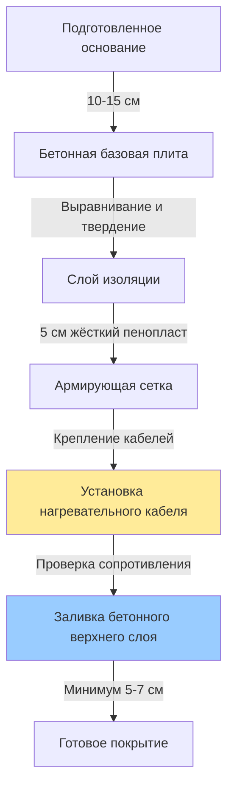
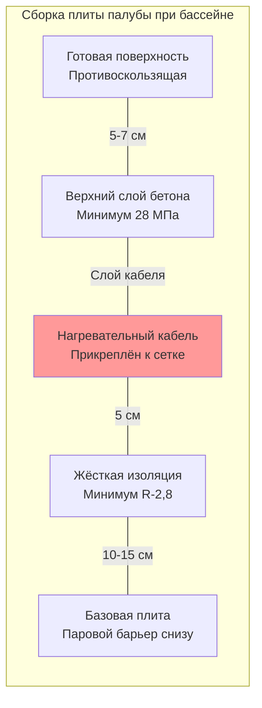

Электрическое лучистое отопление обеспечивает равномерное тепло палубам при крытых спортивных комплексах с бассейнами через элементы сопротивления, встроенные в бетонную плиту. Данный метод отопления обеспечивает прямое тепловое удобство для босых ног, предотвращает конденсацию, ускоряет высыхание и исключает необходимость в котельных системах.

## Типы систем

### Кабель постоянной мощности

Кабели постоянной мощности производят фиксированный тепловой выход независимо от температуры пола. Эти кабели состоят из элементов сопротивления, соединённых последовательно или параллельно, изолированных оболочками из сшитого полиэтилена или фторополимера.

**Расчет теплового выхода:**

$$Q = \frac{P \times A}{1,055}$$

Где:
- $Q$ = Тепловой выход (кДж/ч)
- $P$ = Плотность мощности (Вт/м²)
- $A$ = Обогреваемая площадь (м²)
- $1,055$ = Коэффициент пересчета (кДж/ч на ватт)

Типичная плотность мощности составляет 160–270 Вт/м² для палуб при бассейнах в зависимости от потерь плиты, условий в помещении и желаемой температуры поверхности.

**Формула расстояния между кабелями:**

$$S = \frac{W_{кабель}}{P_{целевая}}$$

Где:
- $S$ = Расстояние между проходами кабеля (см)
- $W_{кабель}$ = Мощность кабеля на линейный метр (Вт/м)
- $P_{целевая}$ = Целевая плотность мощности (Вт/м²)

Например, кабель мощностью 39 Вт/м, установленный для достижения 215 Вт/м², требует расстояния 18 см.

### Саморегулирующийся кабель

Саморегулирующиеся кабели автоматически регулируют тепловой выход на основе местной температуры, используя проводящую полимерную матрицу между параллельными шинами. По мере увеличения температуры сопротивление полимера увеличивается, снижая величину тока и теплогенерацию.

**Преимущества:**
- Энергоэффективность благодаря автоматическому реагированию на температуру
- Отсутствие холодных или горячих пятен благодаря локальной модуляции температуры
- Перекрытие проходов кабеля допускается без риска перегорания
- Низкие требования к техническому обслуживанию

**Ограничения:**
- Более высокая начальная стоимость по сравнению с кабелем постоянной мощности
- Максимальная температура непрерывного воздействия обычно 65°C
- Мощность уменьшается с возрастом (примерно на 10% за 10 лет)

### Системы с матами отопления

Сборные маты отопления состоят из заводских нагревательных кабелей, прикреплённых к полимерной сетке с фиксированным расстоянием. Маты упрощают установку, исключая расчеты расстояния на месте и сокращая время монтажа.

Стандартные ширины матов: 30, 45, 60, 75 см
Стандартные длины: 3–30 м
Плотности мощности: 130, 160, 215, 270 Вт/м²

## Сравнение типов кабелей

| Параметр | Постоянная мощность | Саморегулирующийся |
|-----------|------|------|
| Тепловой выход | Фиксирован при всех температурах | Изменяется в зависимости от местной температуры |
| Стабильность плотности мощности | Постоянна в течение срока службы | Уменьшается на 10% за 10 лет |
| Энергоэффективность | Требует управления термостатом | Саморегуляция снижает энергопотребление |
| Чувствительность к установке | Требуется точное расстояние | Перекрытие допускается |
| Максимальная температура воздействия | До 205°C (в зависимости от кабеля) | Обычно 65°C непрерывно |
| Начальная стоимость | 860–1610 руб./м² | 1290–2370 руб./м² |
| Период гарантии | 10–25 лет | 10–15 лет |

## Методы установки

**Детальное поперечное сечение:**

### Последовательность установки

1. **Подготовка основания:** Заливка и твердение базовой плиты толщиной 10–15 см над уплотнённым основанием с паровым барьером
2. **Установка изоляции:** Монтаж жёсткого пенопласта толщиной 5 см (минимум R-2,8 м²·K/Вт) для направления тепла вверх и снижения потерь вниз
3. **Установка армирования:** Укладка сетки (сетка 15×15 см или толще) с креплением через каждые 60 см
4. **Крепление кабеля:** Закрепление нагревательного кабеля на сетке пластиковыми хомутами или клипсами с расстоянием, указанным производителем
5. **Электрическое тестирование:** Измерение и запись сопротивления кабеля перед заливкой бетона (отклонение более 5% указывает на повреждение)
6. **Заливка бетона:** Аккуратная заливка верхнего слоя бетона толщиной 5–7 см (минимум 28 МПа) для предотвращения повреждения кабеля
7. **Период твердения:** Твердение бетона в течение 28 дней перед включением системы отопления

**Критические моменты при установке:**
- Сохранение минимального зазора 15 см от стены бассейна для предотвращения термического напряжения
- Кабели на минимальном расстоянии 30 см от дренажных отверстий палубы для предотвращения горячих пятен
- Прокладка холодных проводников в кондуит для предотвращения повреждения при проходах через плиту
- Размещение датчиков температуры пола в 15 см от проходов нагревательного кабеля

## Электрические требования

### Защита GFCI

Национальный электрический кодекс (NEC, раздел 680.27) требует защиты устройством защиты от утечки тока для всего оборудования обогрева палубы при бассейне. Устройства GFCI должны срабатывать при токе утечки 5 мА в течение 25 миллисекунд.

**Типы GFCI:**
- **Защита персонала:** Стандартное устройство GFCI 5 мА для цепей 120 В
- **Защита оборудования:** Устройство GFCI 30 мА допускается для постоянно установленного оборудования
- **Предотвращение ложных срабатываний:** Использование устройств GFCI, рассчитанных на ёмкостные нагрузки (нагревательные кабели обладают ёмкостью)

### Стратегии управления

**Управление температурой пола:**
- Основной метод управления для занятых палуб при бассейнах
- Сохранение температуры поверхности в диапазоне 28–31°C для удобства
- Датчик, встроенный в плиту в 15 см от нагревательного элемента
- ПИД-регуляторы (пропорционально-интегрально-дифференциальные) минимизируют перерегулирование температуры

**Управление температурой воздуха:**
- Вторичный или резервный метод управления
- Предотвращение чрезмерного нагрева пола в периоды отсутствия людей
- Менее чувствительно, чем датчик пола, из-за отставания тепловой массы

**Комбинированное управление:**
- Датчик пола как основной с датчиком воздуха как защита от максимума
- Датчик воздуха предотвращает безконтрольный нагрев при отказе датчика пола
- Рекомендуемый подход для коммерческих крытых спортивных комплексов с бассейнами

**Уравнение для определения размера плотности мощности:**

$$P_{требуемая} = \frac{q_{потери} + q_{испар}}{A_{обогрев} \times \eta}$$

Где:
- $P_{требуемая}$ = Требуемая плотность мощности (Вт/м²)
- $q_{потери}$ = Потери тепла плиты в окружающую среду (кДж/ч)
- $q_{испар}$ = Испарительное охлаждение от влажных ног (кДж/ч)
- $A_{обогрев}$ = Обогреваемая площадь палубы (м²)
- $\eta$ = Эффективность системы (обычно 0,95)

ASHRAE рекомендует 160–215 Вт/м² для внутренних палуб при бассейнах с надлежащей изоляцией и контролируемой влажностью. Увеличьте до 215–270 Вт/м² для высокопроходимых зон, смежных наружных зон или объектов с повышенными показателями испарения.

## Преимущества и ограничения

**Преимущества:**
- Отсутствие необходимости в котле или гидравлической системе распределения
- Быстрое реагирование на температуру (30–60 минут до установки)
- Зональное управление позволяет избирательный обогрев высокопроходимых зон
- Минимальные требования к техническому обслуживанию
- Отсутствие риска замерзания или утечки воды
- Точное управление температурой через электронные термостаты

**Ограничения:**
- Стоимость эксплуатации выше, чем у гидравлических систем при интенсивном использовании (обычно 1,3–1,9 руб./кВт·ч)
- Требуется достаточная ёмкость электроснабжения (40–60 А для 93 м² палубы при 215 Вт/м²)
- Ремонт требует удаления бетона при отказе кабеля
- Ограниченная пригодность для модернизации без реконструкции палубы

## Ссылки на проектные нормы

- ASHRAE Handbook—HVAC Applications, Chapter 6: Natatoriums
- NEC Article 680: Swimming Pools, Fountains, and Similar Installations
- NEC Article 424: Fixed Electric Space-Heating Equipment
- NEMA Standards Publication WC 51: Heating Cables
- IEEE Standard 515: Testing of Electrical Resistance Heating Cables

Правильно спроектированные и установленные системы электрического обогрева палуб при бассейнах обеспечивают надёжную работу без обслуживания в течение 20–30 лет. Успех зависит от правильного выбора плотности мощности, надлежащей изоляции для минимизации потерь вниз, надлежащей защиты GFCI и аккуратной установки для предотвращения повреждения кабеля при заливке бетона.
