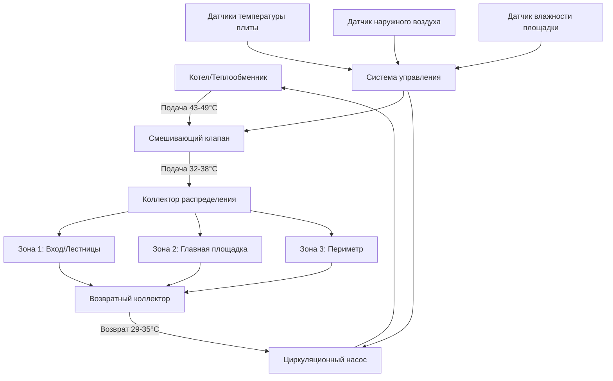

Лучистое отопление пола обеспечивает оптимальный тепловой комфорт для площадок бассейнов за счет равномерного распределения тепла, устранения дискомфорта холодных влажных поверхностей и предотвращения скользкости, вызванной конденсацией. Система встраивает гидравлические трубки в бетонную плиту, создавая непрерывную нагретую поверхность, которая поддерживает температуру площадки между 26,7–29,4°C независимо от внешних условий.

## Основы гидравлических систем

Системы лучистого отопления пола работают на основе принципов конвективного и лучистого теплопередачи. Тепло течет от теплой воды через стенки трубок в бетонную плиту, затем проводится к поверхности, где излучается на людей и испаряет влагу с поверхности.

Тепловой выход на единицу площади зависит от разницы температур между поверхностью плиты и помещением:

$$q = U \cdot A \cdot \Delta T$$

Где:
- $q$ = тепловой поток (кДж/ч)
- $U$ = общий коэффициент теплопередачи (кДж/ч·м²·°C)
- $A$ = площадь поверхности (м²)
- $\Delta T$ = разница температур между поверхностью и воздухом (°C)

Для типичных приложений бассейнов тепловой поток составляет 63–111 кДж/ч·м² в зависимости от испарительной нагрузки с влажных поверхностей и интенсивности пешеходного трафика.

## Конструкция трубок и расстояние между ними

Расстояние между трубками напрямую влияет на равномерность температуры поверхности и производительность системы. Меньшее расстояние увеличивает тепловой выход, но повышает стоимость установки и энергию насоса.

Связь между расстоянием между трубками и средней температурой воды:

$$\Delta T_{mwt} = \frac{q \cdot s}{12 \cdot k_{concrete}}$$

Где:
- $\Delta T_{mwt}$ = колебание температуры на поверхности (°C)
- $s$ = расстояние между трубками (см)
- $k_{concrete}$ = теплопроводность бетона (обычно 1,52 кДж/ч·м·°C)

**Рекомендуемое расстояние для площадок бассейна:**

| Тип зоны | Расстояние трубок | Тепловой выход | Применение |
|-----------|------------------|-----------------|-----------|
| Высокая проходимость | 15 см | 95–111 кДж/ч·м² | Входные зоны, лестницы |
| Периметр площадки | 23 см | 79–95 кДж/ч·м² | Основные ходовые поверхности |
| Низкая интенсивность использования | 30 см | 63–79 кДж/ч·м² | Технологические ниши |

Установите трубки на 5–7,6 см ниже готовой поверхности для оптимальной теплопередачи и структурной целостности. Избегайте размещения трубок глубже 10 см, так как тепловая задержка увеличивается и чувствительность снижается.

## Компоненты системы и конфигурация

Система включает:

- **Источник тепла**: Выделенный котел или теплообменник, связанный с системой отопления бассейна
- **Смешивающий клапан**: Модулирует температуру подачи в зависимости от требований нагрузки
- **Коллекторы**: Распределяют и собирают воду из нескольких зон
- **Циркуляционный насос**: Насос переменной производительности поддерживает расход
- **Система управления**: Контролирует температуру плиты и регулирует выход
- **Теплоизоляция**: Жесткая теплоизоляция толщиной 5 см под плитой предотвращает потерю тепла вниз

## Сравнение материалов трубок

| Характеристика | PEX-A | PEX-B | PEX-AL-PEX |
|-----------------|-------|-------|------------|
| Температурный рейтинг | 93°C | 93°C | 93°C |
| Рейтинг давления | 1100 кПа при 23°C | 1100 кПа при 23°C | 1380 кПа при 23°C |
| Радиус изгиба | 6× OD | 8× OD | 5× OD |
| Кислородный барьер | Требует слой EVOH | Требует слой EVOH | Алюминиевый слой |
| Коэффициент расширения | 1,0 см/10°C/30 м | 1,0 см/10°C/30 м | 0,13 см/10°C/30 м |
| Стоимость (относительная) | $$$ | $$ | $$$$ |
| Лучшее применение | Жилые бассейны | Коммерческие бассейны | Высокопроизводительные системы |

Все трубки должны включать кислородный барьер для предотвращения коррозии в компонентах системы из черных металлов. PEX-AL-PEX обеспечивает превосходную размерную стабильность в крупных коммерческих установках, но требует специализированных фитингов.

## Проектирование температуры подаваемой воды

Системы лучистого отопления пола бассейна работают при более низких температурах, чем обычное гидравлическое отопление:

**Параметры проектирования:**
- Температура подаваемой воды: 35–40°C
- Температура возвращаемой воды: 29–35°C
- Проектная ΔT: 5,6–8,3°C
- Максимальная температура поверхности плиты: 29,4°C (согласно ASHRAE Applications Handbook)

Более низкие температуры воды по сравнению со стандартными системами лучистого отопления (49–60°C) обусловлены:

1. **Высокая температура окружающей среды**: Помещения бассейна, поддерживаемые при 28–30°C, снижают требуемую ΔT
2. **Постоянная влажность**: Испарительное охлаждение требует постоянного умеренного теплового ввода
3. **Пределы комфорта**: Температуры поверхности, превышающие 29,4°C, вызывают дискомфорт на обнаженных ногах

Расчет расхода для заданной зоны:

$$\dot{m} = \frac{q}{c_p \cdot \Delta T}$$

Где:
- $\dot{m}$ = массовый расход (кг/ч)
- $c_p$ = удельная теплоемкость воды (4,19 кДж/кг·°C)
- $q$ = тепловая нагрузка зоны (кДж/ч)
- $\Delta T$ = разница температур подачи и возврата (°C)

## Преимущества теплоемкости бетонной плиты

Тепловая масса бетонной плиты обеспечивает критические преимущества в приложениях бассейна:

**Емкость теплового хранилища:**

$$Q_{stored} = m \cdot c_p \cdot \Delta T = \rho \cdot V \cdot c_p \cdot \Delta T$$

Для плиты толщиной 10 см:
- Плотность ($\rho$): 2400 кг/м³
- Удельная теплоемкость ($c_p$): 0,84 кДж/кг·°C
- Емкость хранения: 32 кДж/м² на °C изменения температуры

Этот эффект теплового маховика:
- Снижает быстрые колебания температуры в результате изменения занятости
- Снижает частоту циклирования котла
- Поддерживает комфорт при кратковременных сбоях оборудования
- Обеспечивает ночные стратегии снижения температуры на сезонных объектах

## Методы установки

**Способ крепления**: Трубки прикреплены к нижней стороне чернового пола с пластинами передачи. Не рекомендуется для площадок бассейна из-за воздействия влаги.

**Тонкий слой плиты**: Трубки встроены в слой толщиной 3,8 см из гипсобетона. Подходит для переоборудования существующих конструктивных плит.

**Толстый слой плиты** (предпочтительно): Трубки встроены в конструктивный бетонный слой, на 5–7,6 см ниже поверхности. Обеспечивает оптимальную тепловую производительность и долговечность.

## Стратегии управления

Эффективное управление поддерживает комфорт при минимизации потребления энергии:

1. **Наружная коррекция**: Снижает температуру подачи в более теплую погоду
2. **Датчики температуры плиты**: Поддерживают целевую температуру поверхности (28–29,4°C)
3. **Обнаружение влажности**: Увеличивает выход в зонах с высоким трафиком и устойчивой влагой
4. **Управление зонами**: Независимо управляет входной, главной и низкоинтенсивной зонами
5. **Ночное снижение температуры**: Снижает температуру на 2,8–3,9°C в часы отсутствия людей (восстановление требует 4–6 часов)

## Соображения проектирования согласно ASHRAE

ASHRAE HVAC Applications Handbook (Глава 6, Swimming Pools) предоставляет рекомендации:

- Температура поверхности площадки: 27–29,4°C для комфорта на обнаженной ноге
- Теплоизоляция под плитой: Минимум RSI 1,76 для предотвращения потери тепла в землю
- Паровой барьер: Полиэтилен толщиной 0,15 мм под теплоизоляцией предотвращает миграцию влаги
- Компенсационные швы: Обеспечивают контуры трубок с защитой от расширения
- Зонирование управления: Отдельные зоны для областей с различными схемами использования

Лучистое отопление пола интегрируется с системами осушения для создания комплексной стратегии управления влажностью. Нагретая поверхность площадки способствует быстрому испарению, в то время как система обработки воздуха удаляет влагу, поддерживая относительную влажность внутри помещения между 50–60%.

## Ввод в эксплуатацию и проверка производительности

Выполните гидравлическое испытание всех контуров трубок при 690 кПа в течение 24 часов перед бетонированием. После установки:

1. Промойте систему для удаления воздуха и мусора
2. Постепенно повышайте температуру воды в течение 5–7 дней для надлежащего отверждения бетона
3. Проверьте расходы на каждой зоне коллектора (± 10% от проектного значения)
4. Измерьте температуры поверхности в нескольких точках (должны различаться менее чем на 1,7°C в пределах зон)
5. Подтвердите правильное реагирование системы управления на изменения установки

Правильно спроектированные системы лучистого отопления пола обеспечивают превосходный комфорт, снижают опасность скольжения и обеспечивают десятилетия безобслуживаемой работы в требовательных условиях бассейнов.
