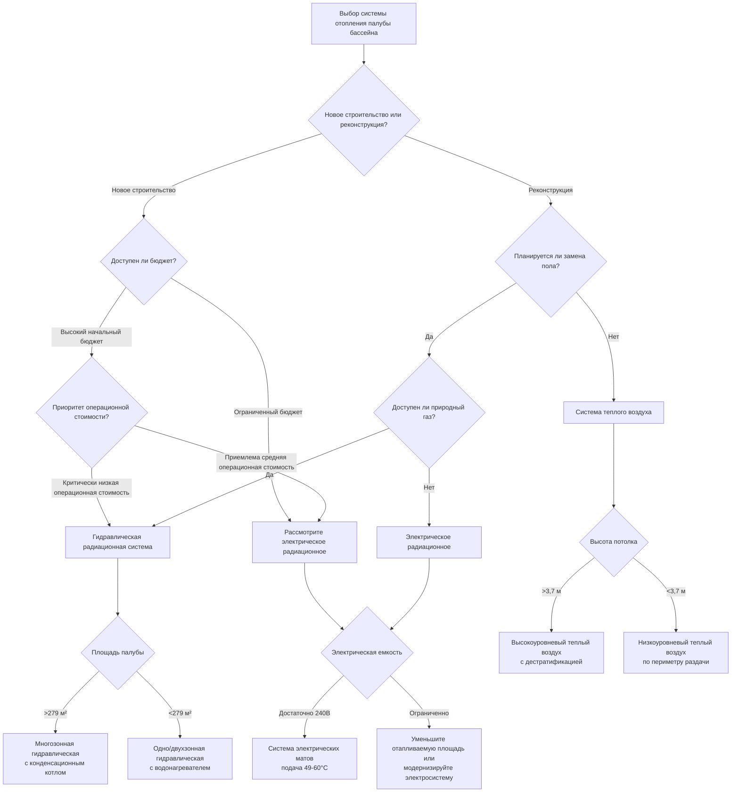

## Обзор выбора системы

Выбор оптимальной системы отопления палубы бассейна требует оценки множества критериев, включая термическую производительность, энергоэффективность, затраты на установку, операционные затраты, требования к техническому обслуживанию и характеристики времени отклика. Три основных типа систем — гидравлическое радиационное, электрическое радиационное и системы теплого воздуха — каждая имеет отчетливые преимущества в зависимости от требований объекта.

## Требования к тепловой нагрузке

Тепловые нагрузки палубы бассейна значительно отличаются от стандартного напольного отопления из-за эффектов испарения и требований к комфорту при ходьбе босиком. Общий тепловой поток, требуемый на поверхности палубы, сочетает потери теплопроводностью и передачу испаряющейся влаги.

Требование тепла для поверхности палубы:

$$q_{deck} = q_{cond} + q_{evap}$$

где:

$$q_{cond} = \frac{T_{surface} - T_{slab,bottom}}{R_{deck}}$$

$$q_{evap} = h_{mass} \cdot (W_{sat,surface} - W_{air}) \cdot h_{fg}$$

Для комфорта при ходьбе босиком на мокрых поверхностях поддерживайте температуру палубы от 28 до 30°C. Требуемый тепловой поток обычно составляет 79-126 Вт/м² в зависимости от условий окружающей среды и скорости испарения.

## Методология определения размера системы

Определяйте размер системы отопления на основе максимального условия тепловой нагрузки, возникающего при нахождении помещения при температуре проектирования с максимальной загруженностью и содержанием влаги.

Требуемая полная мощность системы:

$$Q_{total} = A_{deck} \cdot q_{deck} \cdot F_{safety}$$

Применяйте коэффициент безопасности $F_{safety}$ 1,15-1,25, чтобы учесть потери на краях, неравномерное отопление и эффекты тепловой инерции. Для гидравлических систем рассчитывайте требуемое расстояние между трубками:

$$S_{tube} = \frac{k_{deck} \cdot (T_{supply} - T_{surface})}{q_{deck} \cdot L_{embed}}$$

где $L_{embed}$ — глубина укладки трубки под поверхностью (обычно 4-6 см для палуб бассейнов) и $k_{deck}$ — теплопроводность материала палубы.

## Сравнение систем


| Параметр | Гидравлическое радиационное | Электрическое радиационное | Теплый воздух |
|-----------|-----------------|------------------|----------|
| **Начальная стоимость** | $$$ (Высокая) | $$ (Средняя) | $$$$ (Очень высокая) |
| **Операционная стоимость** | $ (Низкая) | $$$ (Высокая) | $$ (Средняя) |
| **Энергоэффективность** | 85-92% | 98-100% | 65-75% |
| **Время отклика** | 45-90 мин | 20-45 мин | 5-15 мин |
| **Равномерность температуры** | Отличная (±0,6°C) | Отличная (±0,6°C) | Удовлетворительная (±1,7-2,8°C) |
| **Сложность монтажа** | Высокая | Средняя | Средняя |
| **Частота техобслуживания** | Низкая (5-10 лет) | Очень низкая (15-25 лет) | Средняя (1-3 года) |
| **Пригодность для реконструкции** | Плохая | Удовлетворительная | Хорошая |
| **Влияние толщины пола** | +7,6-10 см | +1,3-2,5 см | Отсутствует |
| **Возможность зонирования** | Отличная | Отличная | Ограниченная |
| **Типичный срок службы** | 25-35 лет | 30-50 лет | 15-25 лет |


## Дерево решений по выбору системы

## Гидравлические радиационные системы

Гидравлические системы циркулируют горячую воду (обычно 35-60°C) через трубки из PEX или EPDM, встроенные в бетонную палубу. Эти системы предлагают наименьшие операционные затраты при наличии природного газа или утилизации отходящего тепла.

**Преимущества:**
- Наименьшая операционная стоимость с газовыми конденсационными котлами (коэффициент полезного действия 0,85-0,95)
- Отличная равномерность температуры по большим площадям палубы
- Возможность интеграции с отоплением воды бассейна и рекуперацией тепла дегидратации
- Подходит для сложной геометрии палубы с множеством зон
- Минимальные электромагнитные помехи

**Недостатки:**
- Наивысшие начальные затраты на установку (1291-1935 руб./м² установлено)
- Самое медленное время теплового отклика (45-90 минут до достижения уставки)
- Требует механического помещения для котла/коллекторов
- Потенциал утечек в агрессивной среде нататориумов
- Не подходит для реконструкции без замены палубы

## Электрические радиационные системы

Электрические кабели сопротивления или маты, встроенные в палубу или под ней, обеспечивают прямое преобразование электроэнергии в тепло с КПД близким к 100% в точке использования.

**Преимущества:**
- Умеренная стоимость установки (861-1505 руб./м² установлено)
- Не требуется оборудование в механическом помещении
- Более быстрое время отклика, чем гидравлическое (20-45 минут)
- Минимальные требования к техническому обслуживанию
- Точное зональное управление с простыми термостатами
- Подходит для небольших и средних площадей палубы

**Недостатки:**
- Наивысшая операционная стоимость в большинстве структур тарифов коммунальных услуг
- Требует существенной электрической мощности (270-430 Вт/м² спроса)
- Менее экономична для площадей, превышающих 232-279 м²
- Ограниченная интеграция с другими системами HVAC
- Потенциальные опасения относительно электромагнитных полей (низкая частота)

## Системы теплого воздуха

Подача нагретого воздуха через диффузоры периметра пола или высокоуровневую раздачу воздуха обеспечивает как отопление, так и движение воздуха для контроля испарения.

**Преимущества:**
- Самое быстрое время отклика (5-15 минут)
- Лучший вариант реконструкции без замены пола
- Сочетает отопление с циркуляцией воздуха для удаления влаги
- Умеренные операционные затраты при газовом оборудовании
- Отсутствует штраф за толщину пола

**Недостатки:**
- Плохая равномерность температуры на поверхности палубы
- Наивысшая начальная стоимость, включая воздуховоды (1613-2370 руб./м² эквивалента)
- Создает движение воздуха, которое может ощущаться как сквозняк на мокрой коже
- Более высокие требования к техническому обслуживанию фильтров и движущихся частей
- Шум от оборудования обработки воздуха
- Менее эффективна для точечного отопления определенных зон

## Рекомендации ASHRAE по выбору

Справочник ASHRAE - Приложение HVAC Глава 6 (Нататориумы) содержит следующие рекомендации по выбору:

1. **Основной критерий:** Для нового строительства с площадью палубы, превышающей 186 м², предпочтительны радиационные системы (гидравлические или электрические) для превосходного комфорта и энергоэффективности.

2. **Энергетическая производительность:** Радиационные системы снижают потребление энергии на отопление на 15-30% по сравнению с системами теплого воздуха благодаря более низким требованиям к температуре помещения и уменьшенным потерям стратификации.

3. **Интеграция:** Гидравлические системы должны быть оценены для интеграции с отоплением воды бассейна, рекуперацией тепла конденсатора дегидратации и системами солнечного теплового отопления при наличии.

4. **Стратегия управления:** Поддерживайте температуру поверхности палубы на основе прямых датчиков поверхности, а не температуры воздуха, чтобы обеспечить последовательный комфорт при ходьбе босиком.

5. **Зонирование:** Отдельные зоны управления для областей с различными режимами использования (палуба спортивного бассейна, палуба развлекательного бассейна, площади спа, зрительские площади).

## Экономический анализ

Анализ жизненного цикла в течение 20-летнего периода для палубы бассейна площадью 325 м² (климатическая зона 5A, природный газ 1,20 руб./кДж, электричество 0,12 руб./кВтч):

**Гидравлическая система:**
- Начальная стоимость: 629 000 руб.
- Годовая операционная стоимость: 34 000 руб.
- Итого за 20 лет: 1 308 000 руб.

**Электрическая система:**
- Начальная стоимость: 460 000 руб.
- Годовая операционная стоимость: 80 300 руб.
- Итого за 20 лет: 2 066 000 руб.

**Система теплого воздуха:**
- Начальная стоимость: 753 000 руб.
- Годовая операционная стоимость: 50 200 руб.
- Итого за 20 лет: 1 758 000 руб.

Гидравлическая система обеспечивает наименьшую стоимость жизненного цикла в этом сценарии, окупаясь за счет электрической через 4,2 года и за счет теплого воздуха через 6,8 лет.

## Рассмотрение времени отклика

Время отклика влияет как на восстановление комфорта после периодов сниженного действия, так и на способность внедрения стратегий снижения для экономии энергии.

Постоянная времени теплового отклика:

$$\tau = \frac{\rho \cdot c_p \cdot V_{heated}}{h \cdot A}$$

Для типичной палубы из бетона толщиной 10 см с встроенными гидравлическими трубками на глубине 5 см:
- Время до 63% финальной температуры: 55-75 минут
- Время до 95% финальной температуры: 165-225 минут

Это медленное время отклика требует непрерывной работы или предсказывающих элементов управления, которые предвидят режимы присутствия. Электрические системы с кабелями ближе к поверхности (0,6-1,3 см в глубину) достигают аналогичных результатов на 30-40% меньше времени.

## Факторы сложности установки

**Гидравлические системы:**
- Требуют испытания под давлением перед укладкой бетона
- Требуют размещения компенсационных швов при маршрутизации трубок
- Требуют квалифицированного персонала для балансировки коллекторов
- Критическое управление глубиной укладки для производительности

**Электрические системы:**
- Более простая установка с матовыми продуктами
- Требуют контроля сопротивления до и после укладки бетона
- Требуют изоляции от армирующей стали
- Должны быть согласованы с электрическими работами

**Системы теплого воздуха:**
- Требуют маршрутизации воздуховодов и установки периметровых диффузоров
- Требуют выделения места для блока обработки воздуха
- Более простые процедуры пуска в эксплуатацию
- Стандартная установка торговли HVAC

## Рекомендации

- **Крупные объекты (>279 м²) с природным газом:** Гидравлическое радиационное с конденсационным котлом
- **Средние объекты (93-279 м²) с высокими тарифами на электричество:** Гидравлическое радиационное
- **Средние объекты с низкими тарифами на электричество или стимулами:** Электрическое радиационное
- **Небольшие объекты (<93 м²):** Электрическое радиационное
- **Приложения реконструкции без замены пола:** Периметральное отопление теплым воздухом
- **Объекты с доступным отходящим теплом:** Гидравлическое радиационное, интегрированное с рекуперацией тепла

Выбирайте систему, которая минимизирует стоимость жизненного цикла, при этом соответствуя требованиям времени отклика и равномерности комфорта для конкретного графика работы объекта и режимов использования.
