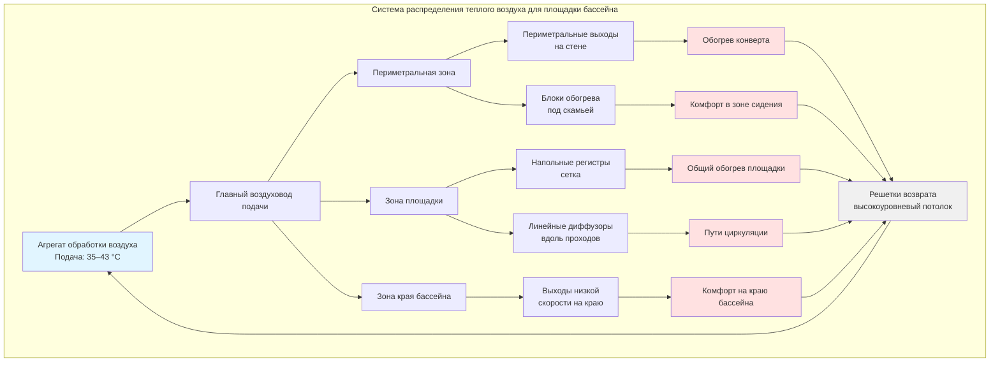

## Системы теплого воздушного отопления для площадок у бассейнов

Теплый воздушный обогрев обеспечивает термический комфорт на площадке бассейна через конвективный теплообмен кондиционированного воздуха, подаваемого через напольные регистры, периметральные выходы или потолочные диффузоры. Этот подход обогревает людей и поверхности путем принудительной конвекции при интеграции с вентиляционной системой нататориума. Надлежащее проектирование требует тщательного учета температур подаваемого воздуха, ограничений скорости и схем распределения для предотвращения термической стратификации и холодных зон.

## Механизм теплообмена

Теплый воздушный обогрев работает в основном за счет принудительной конвекции, при этом интенсивность конвективного теплообмена определяется следующим образом:

$$Q_{conv} = h \cdot A \cdot (T_{air} - T_{surface})$$

Где:
- $Q_{conv}$ = интенсивность конвективного теплообмена (Вт)
- $h$ = коэффициент конвективного теплообмена (Вт/м²·K)
- $A$ = площадь поверхности, подвергаемая воздействию теплого воздуха (м²)
- $T_{air}$ = температура подаваемого воздуха (°C)
- $T_{surface}$ = температура поверхности настила (°C)

Коэффициент теплообмена варьируется в зависимости от скорости воздуха в соответствии с:

$$h = C \cdot V^{0.8}$$

Где $C$ — константа, зависящая от геометрии поверхности, а $V$ — локальная скорость воздуха (м/с). Эта зависимость показывает, что более высокие скорости воздуха увеличивают конвективный теплообмен, но должны быть сбалансированы требованиями комфорта людей.

## Проектирование температуры подаваемого воздуха

ASHRAE рекомендует температуры сухого термометра на площадке бассейна в диапазоне 26–29 °C, обычно на 1–2 °C выше температуры воды в бассейне. Температуры подаваемого воздуха для приложений обогрева площадки обычно варьируются от 32–43 °C в зависимости от метода распределения.

**Критерии выбора температуры:**

- **Напольные регистры:** 35–40 °C для предотвращения чрезмерных температурных перепадов на уровне щиколоток
- **Периметральные выходы:** 38–43 °C для обогрева конверта вдоль наружных стен
- **Потолочные диффузоры:** 32–37 °C для минимизации термической стратификации

Требуемую температуру подаваемого воздуха можно рассчитать из:

$$T_{supply} = T_{deck} + \frac{Q_{loss}}{m \cdot c_p}$$

Где:
- $T_{deck}$ = желаемая температура площадки (°C)
- $Q_{loss}$ = общие потери тепла с площадки (Вт)
- $m$ = массовый расход воздуха (кг/с)
- $c_p$ = удельная теплоемкость воздуха (1,006 кДж/кг·K)

## Скорость воздуха и ограничения комфорта

Скорость воздуха в занятой зоне должна оставаться ниже 0,25 м/с для предотвращения сквозняков и чрезмерного испарительного охлаждения влажной кожи. Затухание скорости воздуха от напольного регистра следует:

$$V_x = V_0 \cdot \left(\frac{A_0}{A_x}\right)^{0.5}$$

Где:
- $V_x$ = скорость на расстоянии $x$ от выхода (м/с)
- $V_0$ = начальная скорость выброса (м/с)
- $A_0$ = площадь выхода (м²)
- $A_x$ = эффективная площадь потока на расстоянии $x$ (м²)

Надлежащий интервал между выходами обеспечивает затухание скорости до приемлемых уровней до достижения занятой зоны.

## Конфигурации системы распределения

## Сравнение конфигураций

| Конфигурация | Температура подачи | Скорость на выходе | Схема покрытия | Применение | Преимущества | Ограничения |
|--------------|------------------|-----------------|------------------|-----------|------------|-------------|
| **Напольные регистры (сетка)** | 35–40 °C | 2,0–3,5 м/с | Равномерный массив с интервалом 2–3 м | Общие площадки, проходы | Равномерное распределение температуры, прямой обогрев ног | Сложность монтажа, потенциальная опасность спотыкания |
| **Периметральные выходы** | 38–43 °C | 3,0–5,0 м/с | Вдоль наружных стен | Обогрев конверта, компенсация холодных поверхностей | Компенсация потерь конверта, предотвращение конденсации | Ограниченное покрытие центральной площадки |
| **Линейные щелевые диффузоры** | 35–38 °C | 1,5–2,5 м/с | Направленные вдоль путей | Проходы, переходные зоны | Низкий профиль, контролируемый выброс | Более высокие требования к объему воздуха |
| **Блоки под скамьей** | 40–43 °C | 1,0–2,0 м/с | Локализированная в зоне сидения | Зоны зрителей, места отдыха | Целевой комфорт, интеграция с мебелью | Только точечное отопление |
| **Комбинированная система** | 32–43 °C (варьируется) | 1,5–5,0 м/с | Многозонное покрытие | Проектирование полного объекта | Оптимизированный комфорт и эффективность | Повышенная сложность системы, требования к управлению |

## Схемы циркуляции воздуха

Эффективное теплое воздушное отопление требует надлежащей циркуляции воздуха для предотвращения стратификации. Схема циркуляции должна создавать мягкий нисходящий поток вдоль наружных стен (от периметрального отопления) и восходящий поток от поверхности бассейна (вызванный испарением и температурой воды).

**Принципы проектирования:**

1. **Размещение возвратного воздуха:** Возвратные отверстия высокого уровня (на потолке) улавливают теплый влажный воздух, поднимающийся от бассейна
2. **Выброс подаваемого воздуха:** Горизонтальные схемы выброса предотвращают прямое попадание на людей
3. **Кратность воздухообмена:** Минимум 4–6 воздухообменов в час для комбинированной вентиляции и отопления
4. **Эффективность смешивания:** Подаваемый воздух должен тщательно смешиваться перед достижением занятой зоны

Эффективность распределения воздуха можно оценить с помощью:

$$\epsilon = \frac{T_{exhaust} - T_{supply}}{T_{occupied} - T_{supply}}$$

Где $\epsilon$ представляет эффективность вентиляции (целевое значение: 0,9–1,0 для площадок бассейнов).

## Расчет зоны комфорта

Ощутимая температура, воспринимаемая людьми, сочетает температуру воздуха и среднюю радиационную температуру:

$$T_{operative} = \frac{T_{air} + T_{radiant}}{2}$$

Для приемлемого комфорта на площадке бассейна согласно ASHRAE Standard 55 ощутимая температура должна оставаться в пределах 26–29 °C с относительной влажностью между 50–60 %. Системы теплого воздуха должны компенсировать потери лучистого тепла на холодные поверхности (наружные стены, остекление) повышенными температурами воздуха.

## Интеграция с осушением

Системы теплого воздушного отопления обычно интегрируются с оборудованием осушения нататориума. В режиме отопления катушка повторного нагрева осушителя повышает температуру выходящего воздуха до требуемой температуры подачи. Общая требуемая тепловая мощность сочетает:

- Потери тепла конверта (стены, крыша, остекление)
- Нагрузка вентиляционного отопления (кондиционирование наружного воздуха)
- Эффект охлаждения испарением воды в бассейне
- Потери проводимости поверхности площадки

Такой комплексный подход максимизирует энергетическую эффективность при одновременном обеспечении круглогодичного комфорта и контроля влажности.

## Системное управление и зонирование

Многозонное управление позволяет настраивать температуру для разных площадок. Высокопроходимые проходы могут требовать более высоких тепловых вводов, чем зоны сидения. Температура подаваемого воздуха модулируется на основе:

- Датчиков температуры площадки (несколько зон)
- Температуры наружного воздуха (график сброса)
- Уровней занятости (управление по требованию)
- Температуры воды в бассейне (дифференциальное управление)

Терминалы переменного объема воздуха (VAV) в каждой зоне позволяют независимое управление температурой при сохранении минимальных скоростей вентиляционного потока воздуха в соответствии с ASHRAE Standard 62.1.
