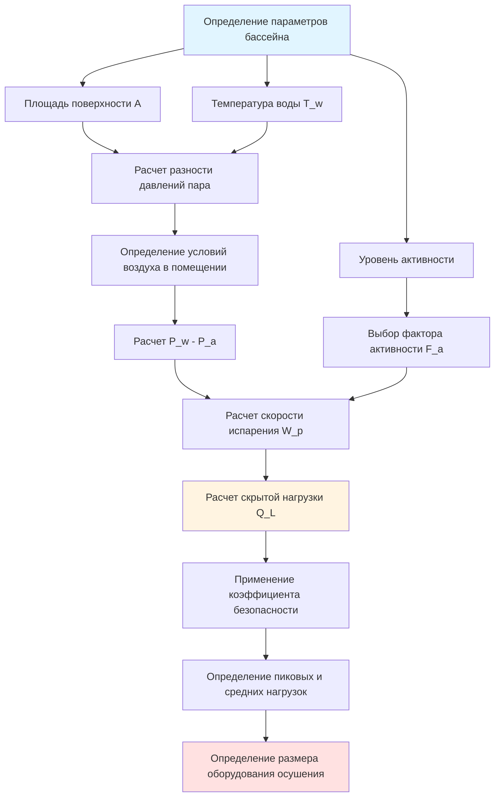

## Обзор

Расчет нагрузки испарения составляет критическую основу для определения размеров систем HVAC нататориума. Скрытая нагрузка от испарения воды в бассейне обычно доминирует в общей охлаждающей нагрузке объектов крытых бассейнов, часто составляя 60-80% от общих требований мощности HVAC. Точный расчет этой нагрузки обеспечивает надлежащую мощность осушения, комфорт занимающихся лиц и защиту строительного ограждения.

## Основное уравнение нагрузки испарения

Скрытая охлаждающая нагрузка от испарения воды из бассейна преобразует скорость испарения (масса в единицу времени) в тепловую энергию, используя скрытую теплоту парообразования:

$$Q_L = W_p \cdot h_{fg}$$

Где:
- $Q_L$ = Скрытая охлаждающая нагрузка (кДж/ч)
- $W_p$ = Скорость испарения воды (кг/ч)
- $h_{fg}$ = Скрытая теплота парообразования при температуре воды в бассейне (кДж/кг)

При типичных температурах воды в бассейне 26-29°C скрытая теплота парообразования составляет приблизительно 2 450 кДж/кг. Для воды 27°C используйте $h_{fg} = 2 448$ кДж/кг.

## Метод расчета скорости испарения ASHRAE

Справочник ASHRAE—Применение HVAC предоставляет основное уравнение для расчета скорости испарения воды:

$$W_p = A \cdot F_a \cdot (P_w - P_a) \cdot Y$$

Где:
- $A$ = Площадь поверхности воды в бассейне (м²)
- $F_a$ = Фактор активности (безразмерный)
- $P_w$ = Давление насыщенного пара при температуре воды в бассейне (кПа)
- $P_a$ = Парциальное давление пара в помещении (кПа)
- $Y$ = Коэффициент испарения (кг/ч·м²·кПа)

Коэффициент испарения $Y$ обычно находится в диапазоне 0,15-0,22 кг/ч·м²·кПа для крытых бассейнов с минимальным движением воздуха. ASHRAE рекомендует $Y = 0,15$ для неподвижных бассейнов.

## Процесс расчета

## Факторы активности по типам бассейна

Уровень активности в бассейне резко влияет на скорость испарения. Повышенная активность увеличивает возмущение поверхности, площадь контакта воздуха и воды и скорость передачи влаги.

| Тип бассейна | Уровень активности | Фактор активности ($F_a$) | Типичный режим использования | Множитель расчетной нагрузки |
|-----------|----------------|------------------------|---------------------|----------------------|
| Жилой | Минимальный | 0,5 | Личное использование, низкая занятость | 1,0 |
| Терапевтический/Реабилитационный | Легкий | 0,65 | Контролируемые упражнения, умеренное движение | 1,1 |
| Гостиничный/Кондоминиум | Умеренный | 0,8 | Рекреационное плавание, переменная занятость | 1,15 |
| Общественный рекреационный | Активный | 1,0 | Непрерывное использование, плавание на длинные дистанции, игры | 1,25 |
| Спортивный | Очень активный | 1,2 | Тренировка, гонки, высокая турбулентность | 1,3 |
| Волновой бассейн/Водный парк | Экстремальный | 1,5-2,0 | Максимальное возмущение поверхности | 1,4-1,5 |

## Рассмотрение пиковых и средних нагрузок

Системы HVAC нататориума должны обрабатывать как среднюю, так и пиковую нагрузку испарения:

**Средние нагрузки** представляют типичные условия эксплуатации при нормальном использовании бассейна. Эти нагрузки определяют:
- Оценки потребления энергии в год
- Прогнозы эксплуатационных затрат
- Ожидаемое время работы оборудования
- Требования производительности при частичной нагрузке

**Пиковые нагрузки** возникают при максимальной занятости с высокими уровнями активности. Пиковые условия устанавливают:
- Выбор мощности оборудования
- Наихудшие требования осушения
- Максимальные скорости удаления влаги
- Пределы установки системы управления

Расчеты проектирования должны использовать условия пиковой нагрузки для определения размера оборудования. Надлежащим образом подобранная система поддерживает условия воздуха в помещении при проектировании (обычно 50-60% относительной влажности при 28-30°C) в сценариях наихудшего случая.

## Факторы разнесения и коэффициенты безопасности

**Факторы разнесения** учитывают статистическую маловероятность того, что все площади бассейна работают при пиковых условиях одновременно на объектах с несколькими бассейнами:

- Один бассейн: коэффициент разнесения = 1,0 (без снижения)
- Два бассейна: коэффициент разнесения = 0,95
- Три или более бассейнов: коэффициент разнесения = 0,90

Применяйте факторы разнесения только на объектах с отдельно управляемыми зонами бассейна с различными графиками использования.

**Коэффициенты безопасности** компенсируют неопределенности расчетов и деградацию оборудования:

- Стандартная практика: добавьте 10-15% к рассчитанной пиковой скрытой нагрузке
- Условия высокой неопределенности: добавьте коэффициент безопасности 20%
- Минимум рекомендуемый: 10% выше рассчитанного пика

Консервативные коэффициенты проектирования предотвращают недостаточный размер при одновременном избежании чрезмерного превышения мощности, которое увеличивает первоначальную стоимость и снижает эффективность при частичной нагрузке.

## Компонент явного тепла

Хотя скрытая нагрузка доминирует, передача явного тепла с поверхности воды в бассейне вносит вклад в общую нагрузку испарения:

$$Q_s = 0,48 \cdot W_p \cdot (T_w - T_a)$$

Где:
- $Q_s$ = Явная охлаждающая нагрузка (кДж/ч)
- 0,48 = Коэффициент преобразования, учитывающий массовый расход и удельную теплоемкость
- $T_w$ = Температура воды в бассейне (°C)
- $T_a$ = Температура воздуха в помещении (°C)

Явная нагрузка обычно составляет 5-10% от общей нагрузки испарения, когда температура воздуха превышает температуру воды. Когда $T_a < T_w$, явное тепло передается от воды к воздуху.

## Общая нагрузка испарения

Общая тепловая нагрузка от испарения в бассейне объединяет компоненты скрытого и явного тепла:

$$Q_{total} = Q_L + Q_s$$

Для выбора оборудования осушения укажите оба:
- **Скрытая мощность**: должна соответствовать или превышать $Q_L$ с применением коэффициента безопасности
- **Явная мощность**: достаточна для поддержания желаемого дифференциала температуры воздуха и воды

## Скорость испарения в день проектирования

Рассчитайте условия дня проектирования, используя:

1. **Максимально предполагаемую занятость** для типа бассейна
2. **Соответствующий фактор активности** из установленных значений
3. **Условия воздуха в помещении при проектировании** (обычно 50-60% относительной влажности при 28-30°C)
4. **Температура воды в бассейне** при нормальной уставке эксплуатации
5. **Коэффициент испарения** подходящий для распределения воздуха в объекте

Расчеты дня проектирования устанавливают пиковую мощность осушения, необходимую. Оборудование должно постоянно поддерживать приемлемые уровни влажности в помещении в этих условиях.

## Расчет скорости удаления влаги

Преобразуйте скрытую нагрузку в скорость удаления влаги для спецификации осушителя:

$$\dot{m} = \frac{Q_L}{h_{fg}} \times 24 = W_p \times 24$$

Где:
- $\dot{m}$ = Скорость удаления влаги (кг/день)
- Множитель 24 преобразует почасовой расход в дневной расход

Большинство осушителей указывают мощность в килограммах в день.

## Примечания по применению

- Проверьте расчеты давления пара, используя психрометрические диаграммы или программное обеспечение при фактических рабочих температурах
- Рассчитайте периметральные поверхности (спа, гидромассажные ванны) отдельно с надлежащими давлениями пара на основе температуры
- Рассмотрите неиспользуемые периоды с пониженными факторами активности для моделирования энергии
- Оцените влияние покрытий бассейна на скорость испарения во время закрытия
- Проверьте мощность осушителя производителя при фактических рабочих условиях (не при условиях стандартного номинального значения)

## Ссылки

Справочник ASHRAE—Применение HVAC, Глава 6: Нататориумы предоставляет всеобъемлющее освещение методов расчета испарения, факторов активности и соображений проектирования для объектов крытых бассейнов.
