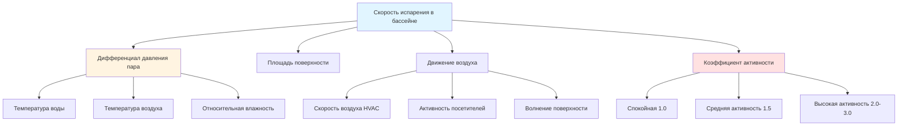

## Фундаментальные механизмы испарения

Испарение воды в бассейне представляет основной источник скрытой охлаждающей нагрузки в среде нататориума. Скорость передачи влаги с поверхности бассейна в окружающий воздух зависит от трех фундаментальных движущих сил: дифференциала парциального давления пара между водой и воздухом, коэффициента конвективной передачи массы (зависит от скорости воздуха) и открытой площади поверхности воды.

## Стандартное уравнение испарения ASHRAE

Справочник ASHRAE—Приложение HVAC, глава 5 содержит отраслевое стандартное уравнение для расчета скоростей испарения в бассейнах:

$$W_p = A(p_w - p_a)(0.089 + 0.0782V)/Y$$

**Определения переменных:**

- $W_p$ = Скорость испарения воды (кг/ч)
- $A$ = Площадь поверхности воды в бассейне (м²)
- $p_w$ = Давление насыщенного пара при температуре воды в бассейне (мм рт. ст.)
- $p_a$ = Парциальное давление пара в воздухе помещения (мм рт. ст.)
- $V$ = Скорость воздуха над поверхностью воды (м/мин)
- $Y$ = Скрытая теплота испарения при температуре воды в бассейне (кДж/кг)

Это уравнение применяется к неиспользуемым бассейнам с минимальным волнением поверхности. Терм $(0.089 + 0.0782V)$ представляет коэффициент конвективной передачи массы, который линейно увеличивается со скоростью воздуха над поверхностью бассейна.

## Дифференциал парциального давления

Движущей силой испарения является разница давлений пара $(p_w - p_a)$. Давление насыщенного пара на поверхности воды зависит только от температуры воды и может быть получено из психрометрических таблиц или уравнения Антуана. Парциальное давление пара воздуха помещения рассчитывается из:

$$p_a = \phi \cdot p_{sat}$$

где $\phi$ — относительная влажность (в десятичной форме) и $p_{sat}$ — давление насыщения при температуре воздуха в помещении.

Надлежащий контроль влажности (обычно 50-60% ОВ) ограничивает дифференциал давления пара и снижает чрезмерные скорости испарения. Более низкие уровни влажности ускоряют испарение и увеличивают нагрузки на осушение.

## Коэффициенты активности

Базовое уравнение ASHRAE предполагает спокойные условия. Используемые бассейны испытывают увеличенное испарение из-за волнения поверхности, брызг и повышенного движения воздуха. Коэффициенты активности модифицируют базовый расчет:

$$W_{p,actual} = W_p \times AF$$

где $AF$ — безразмерный коэффициент активности.

| Условие в бассейне | Коэффициент активности | Типичные применения | Множитель скорости испарения |
|----------------|----------------|---------------------|---------------------------|
| Спокойное (неиспользуемое) | 1.0 | Часы неиспользования, гостиничные бассейны | Базовое значение |
| Средняя активность | 1.5 | Рекреационное плавание, жилые бассейны | 1.5× базовое |
| Высокая активность | 2.0 - 3.0 | Бассейны с волнами, зоны прыжков | 2-3× базовое |
| Соревновательное плавание | 2.0 - 2.5 | Спортивное плавание, тренировки | 2-2.5× базовое |
| Терапевтические/оздоровительные бассейны | 1.5 - 2.0 | Водная аэробика, физиотерапия | 1.5-2× базовое |
| Джакузи/спа-бассейны | 1.0 - 1.5 | Гидромассажные ванны (рассчитываются отдельно) | 1-1.5× базовое |

Консервативная проектная практика использует AF = 2.0 для выбора оборудования осушения, чтобы обеспечить адекватную производительность в периоды пиковой посещаемости.

## Альтернатива уравнения Shah

Уравнение Shah предоставляет альтернативную формулировку с прямым включением коэффициентов активности:

$$W_p = A \times AF \times (95 + 0.425V)(p_w - p_a)$$

где переменные соответствуют определениям ASHRAE, а коэффициент 0.425 учитывает повышенную передачу массы при более высоких скоростях. Это уравнение дает результаты в пределах 10% от уравнения ASHRAE для типичных условий нататориума.

## Уравнение Carrier (исторический метод)

Уравнение Carrier, исторически использовавшееся до широкого распространения стандарта ASHRAE:

$$W_p = 0.1 \times A \times AF \times (p_w - p_a)$$

Эта упрощенная форма предполагает пренебрежимые эффекты скорости воздуха и дает консервативные результаты. Современная проектная практика отдает предпочтение уравнению ASHRAE за его явную обработку конвективной передачи массы.

## Преобразование скрытой нагрузки

Скорость испарения в кг/ч должна быть преобразована в скрытую охлаждающую нагрузку для выбора оборудования HVAC:

$$Q_{latent} = W_p \times h_{fg}$$

где:
- $Q_{latent}$ = Скрытая охлаждающая нагрузка (кДж/ч)
- $h_{fg}$ = Скрытая теплота испарения (≈ 2,442 кДж/кг при типичных температурах бассейна)

Для типичного рекреационного бассейна площадью 139 м² работающего при 27.8°C с условиями в помещении 27.8°C и 60% ОВ, при условии средней активности:

1. Рассчитайте базовое испарение: $W_p$ ≈ 20.4 кг/ч
2. Примените коэффициент активности: $W_{p,actual}$ = 20.4 × 1.5 = 30.6 кг/ч
3. Преобразуйте в скрытую нагрузку: $Q_{latent}$ = 30.6 × 2,442 = 74,691 кДж/ч (≈ 20.8 кВт)

Эта скрытая нагрузка определяет выбор оборудования осушения и представляет непрерывное требование к удалению влаги во время работы бассейна.

## Соображения проектирования

**Факторы точности:**
- Точность измерения температуры воды экспоненциально влияет на расчет $p_w$
- Предположения о скорости воздуха значительно влияют на результаты при V > 50 м/мин
- Выбор коэффициента активности представляет наибольшую неопределенность в расчетах проектирования

**Консервативный подход к проектированию:**
- Используйте AF = 2.0 для выбора оборудования, если подробные графики посещаемости не оправдывают более низкие значения
- Добавьте коэффициент безопасности 10-15% для систем осушения с переменной скоростью
- Рассмотрите отдельные расчеты для джакузи и спа-ванн с повышенными температурами воды

**Проверка:**
- Сравните результаты различных уравнений (ASHRAE, Shah, Carrier)
- Результаты в пределах 15-20% указывают на разумные проектные значения
- Значительные расхождения требуют пересмотра входных параметров

Уравнение ASHRAE предоставляет наиболее широко принятый метод для расчетов испарения в бассейнах и формирует основу надлежащего проектирования систем HVAC нататориума. Понимание физических принципов—дифференциала давления пара, конвективной передачи массы и вызванной активностью турбулентности—обеспечивает точное применение этих эмпирических соотношений.

## Компоненты

- Испарение по уравнению Shah
- Компоненты формулы Shah
- Коэффициент активности Shah
- Уравнение Biasin Krumme
- Формула Biasin Krumme
- Уравнение Carrier (исторический метод)
- Эмпирические модели испарения
- Единицы скорости испарения кг в час
- Преобразование скорости испарения
