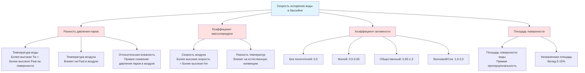

## Физические принципы испарения воды в бассейне

Испарение воды в бассейне — это сложный процесс массопередачи, управляемый разностью давления паров между поверхностью воды и окружающим воздухом. Скорость испарения зависит от шести основных факторов, которые непосредственно влияют на этот градиент давления паров и коэффициент конвективной массопередачи.

Основной движущей силой испарения является разность парциального давления водяного пара на поверхности бассейна и парциального давления в окружающем воздухе. Эта зависимость выражается как:

$$\Delta P_v = P_{w,sat}(T_w) - \phi \cdot P_{sat}(T_a)$$

Где:
- $\Delta P_v$ = разность давления паров (Па)
- $P_{w,sat}(T_w)$ = давление насыщенных паров при температуре поверхности воды
- $P_{sat}(T_a)$ = давление насыщенных паров при температуре воздуха
- $\phi$ = относительная влажность воздуха (десятичная дробь)

## Влияние температуры воды

Температура воды — это единственный наиболее влиятельный фактор скорости испарения. Давление насыщенных паров на поверхности воды экспоненциально возрастает с температурой согласно уравнению Антуана. Для типичных условий бассейна:

- Каждое повышение температуры воды на 1°C увеличивает скорость испарения примерно на 3-5%
- Терапевтические бассейны (33-37°C) испаряют на 40-60% больше, чем развлекательные бассейны (26-28°C)
- Гидромассажные ванны и спа (38-40°C) могут иметь скорость испарения в 2-3 раза выше, чем стандартные бассейны

Экспоненциальная зависимость означает, что небольшие повышения температуры воды при более высоких базовых температурах вызывают непропорционально большое увеличение испарения.

## Температура воздуха и относительная влажность

Температура воздуха и относительная влажность действуют совместно, определяя давление паров в окружающем воздухе. Парциальное давление водяного пара в воздухе выражается как:

$$P_v = \phi \cdot P_{sat}(T_a)$$

Критические соображения:

- **Разность температур**: Разница $(T_w - T_a)$ влияет как на градиент давления паров, так и на конвективный теплопередачу. Большие разности увеличивают испарение, но могут вызвать проблемы с комфортом и риск конденсации.
- **Относительная влажность**: Напрямую снижает градиент давления паров. Каждое повышение относительной влажности на 10% снижает скорость испарения примерно на 10-15%.
- **Оптимальный диапазон управления**: ASHRAE рекомендует поддерживать температуру воздуха на 1-2°C выше температуры воды и относительную влажность от 50-60% для обеспечения комфорта и контроля конденсации.

## Скорость воздуха над поверхностью воды

Движение воздуха над поверхностью бассейна непрерывно удаляет насыщенный воздух и заменяет его более сухим воздухом, увеличивая коэффициент массопередачи. Зависимость приблизительно выражается как:

$$h_m \propto V^{0.8}$$

Где $h_m$ — коэффициент конвективной массопередачи, а $V$ — скорость воздуха у поверхности воды.

Практические последствия:

- Естественная конвекция (неподвижный воздух): базовая скорость испарения
- Низкая скорость воздуха (100-150 м³/ч): 10-20% увеличение
- Умеренная скорость воздуха (250-375 м³/ч): 30-50% увеличение
- Высокая скорость воздуха (>500 м³/ч): может удвоить скорость испарения

Диффузоры подающего воздуха никогда не должны направлять воздух высокой скорости через поверхность бассейна. Рекомендуемая скорость воздуха у поверхности воды менее 150 м³/ч для занятых бассейнов.

## Коэффициент активности бассейна

Коэффициент активности ($F_a$) количественно определяет увеличение скорости испарения из-за нарушения поверхности воды, увеличения площади поверхности от волн и брызг, а также увлажненных площадок вокруг бассейна. ASHRAE предоставляет следующие диапазоны:

| Тип бассейна | Коэффициент активности ($F_a$) | Описание |
|-----------|-------------------------|-------------|
| Без посетителей | 0,5 | Неподвижная вода, минимальное нарушение поверхности |
| Жилой | 0,5 - 0,65 | Легкое использование, случайные пловцы |
| Общественный развлекательный | 0,65 - 1,0 | Среднее использование, типичная активность |
| Общественный активный | 1,0 - 1,3 | Интенсивное использование, прыжки, игры |
| Волновой бассейн | 1,5 - 2,0 | Механическое волнение, высокое нарушение поверхности |
| Гидромассажная ванна/Спа | 1,0 - 1,5 | Действие форсунок, высокая турбулентность |

Коэффициент активности включается в уравнение скорости испарения как множитель:

$$W = F_a \cdot A \cdot C \cdot (P_{w,sat} - \phi \cdot P_{sat})$$

Где:
- $W$ = скорость испарения (кг/ч)
- $F_a$ = коэффициент активности (безразмерный)
- $A$ = площадь поверхности воды (м²)
- $C$ = коэффициент испарения (функция скорости воздуха)

## Площадь и геометрия поверхности воды

Скорость испарения прямо пропорциональна площади поверхности воды. Однако соображения эффективной площади включают:

- **Основная поверхность бассейна**: Основная испаряющаяся площадь
- **Периметровые эффекты**: Усиленное испарение по краям из-за моделей циркуляции воздуха (обычно пренебрежимо для бассейнов площадью > 9,3 м²)
- **Увлажненная площадь**: Брызги воды на окружающей палубе могут вносить дополнительное испарение на 5-15%, особенно при высоких коэффициентах активности
- **Особенности поверхности**: Водопады, фонтаны и форсунки значительно увеличивают эффективную площадь через образование капель

Для расчетов проектирования используйте фактическую площадь поверхности воды и учитывайте эффекты увлажненной площади через коэффициент активности, а не добавляйте площадь палубы напрямую.

## Интегрированные взаимоотношения факторов

Следующая диаграмма иллюстрирует, как все факторы взаимодействуют, чтобы определить окончательную скорость испарения:

## Последствия для проектирования

При выборе размеров систем HVAC нататориума инженеры должны тщательно рассмотреть условия проектирования для каждого фактора:

1. **Выбор соответствующего коэффициента активности**: Используйте консервативные (более высокие) значения при выборе размеров для мощности осушения. Многие отказы являются результатом недооценки коэффициентов активности.

2. **Стратегия управления**: Поддерживайте температуру воздуха на 1-2°C выше температуры воды, чтобы минимизировать риск конденсации, одновременно контролируя скорость испарения через контроль относительной влажности (целевой диапазон 50-60%).

3. **Распределение воздуха**: Спроектируйте модели подачи воздуха, чтобы избежать высокоскоростного потока воздуха через поверхность бассейна. Используйте вентиляцию с низкой скоростью вытеснения или подачу воздуха у боковой стенки по периметру.

4. **Регулируемая мощность**: Системы должны справляться с большим диапазоном между условиями без посетителей (0,5 × базовая) и условиями пиковой загруженности. Оборудование переменной производительности для осушения воздуха необходимо.

5. **Размещение датчиков**: Датчики относительной влажности и температуры должны быть размещены вдали от непосредственной зоны бассейна, чтобы измерять репрезентативные условия в помещении, а не насыщенный пограничный слой над водой.

Глава ASHRAE Handbook—HVAC Applications по нататориумам содержит подробные процедуры расчета, включающие все эти факторы. Уравнение Carrier и уравнение Shah — это две наиболее широко используемые эмпирические корреляции для испарения воды в бассейне, обе учитывающие обсуждаемые выше факторы через измеренные коэффициенты и коэффициенты активности.
