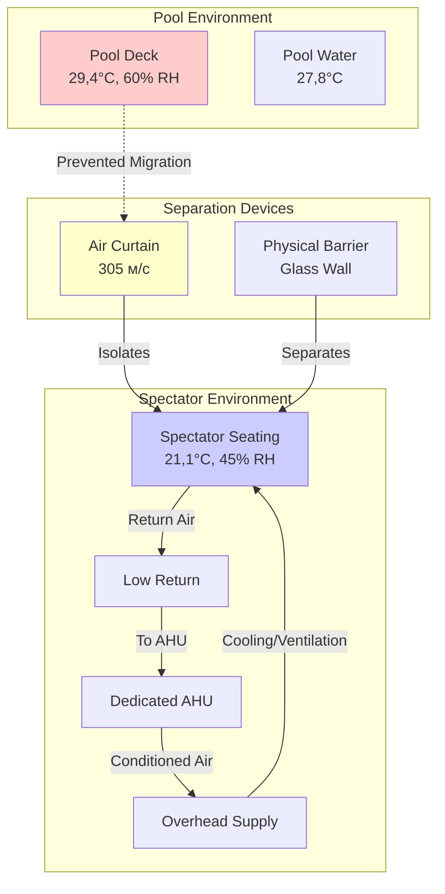

Зоны зрителей в соревновательных нататориумах представляют отличительные от кондиционирования площадки бассейна HVAC-задачи. Эти пространства требуют экологической изоляции от влажной среды бассейна при одновременном обеспечении комфорта малоподвижных пользователей, которые имеют принципиально иные требования к температуре, чем пловцы или персонал площадки.

## Требования к экологическому разделению

Зоны зрительских мест должны быть экологически изолированы от пространства бассейна во избежание миграции теплого влажного воздуха в более холодные зоны зрителей. Это разделение решает три критические задачи:

**Управление температурным дифференциалом**
Площадки бассейнов обычно работают при температуре 27,8–30°C для предотвращения дискомфорта пловцов, в то время как зоны зрителей требуют 20–22°C для комфорта малоподвижных пользователей. Разница в 5,6–8,3°C создаёт значительную движущую силу для переноса воздуха и влагопередачи.

**Контроль влажности**
Зоны бассейнов поддерживают 50–60% ОВ при повышенных температурах (15,6–18,3°C точка росы), в то время как зоны зрителей нацелены на 40–50% ОВ при более низких температурах (10–12,8°C точка росы). Без надлежащего разделения конденсация образуется на поверхностях зоны зрителей и возникает дискомфорт.

**Соотношение давлений**
Зоны зрителей должны поддерживать небольшое избыточное давление (+5,0–12,5 Па) относительно пространства бассейна, чтобы предотвратить инфильтрацию влажного воздуха. Эта герметизация требует тщательной координации с системой вытяжки бассейна.

## Расчёты холодильной нагрузки

Нагрузки в зоне зрителей значительно отличаются от расчётов площадки бассейна из-за различий в метаболизме и конверте здания.

**Теплоотдача пользователей**
Малоподвижные зрители генерируют:

$$q_{sensible} = 73 \text{ Вт/чел}$$

$$q_{latent} = 59 \text{ Вт/чел}$$

Для зоны зрителей на 500 мест при 80% заполнении:

$$Q_{occupant} = 400 \times (73 + 59) = 52{,}800 \text{ Вт}$$

**Освещение и оборудование**
Типичное освещение зоны зрителей работает при мощности 16,1–21,5 Вт/м², с электронными табло и видеодисплеями, добавляющими сконцентрированные нагрузки в определённые зоны.

**Учёт конверта здания**
Зоны зрителей с внешным остеклением испытывают значительные солнечные поступления. Для остекления, ориентированного на юг:

$$Q_{solar} = A \times SHGC \times SC \times CF$$

где SHGC = коэффициент солнечного теплопоступления, SC = коэффициент затенения, CF = коэффициент охладительной нагрузки из таблиц ASHRAE.

**Требования к вентиляции**
ASHRAE 62.1 требует 7,5 CFM/чел (12,7 м³/ч) для сборных помещений. Для 500 мест:

$$CFM_{OA} = 500 \times 7{,}5 = 3{,}750 \text{ CFM (6{,}359 м³/ч)}$$

Этот наружный воздух должен быть осушен до условий зоны зрителей, а не условий пространства бассейна.

## Архитектура системы

## Стратегии физического разделения

**Воздушные завесы**
Высокоскоростные воздушные завесы (скорость выхода 244–366 м/с) создают эффективный барьер на проёмах между зонами бассейна и зрителей. Эти устройства должны:

- Работать непрерывно во время работы бассейна
- Выпускать воздух при температуре зоны зрителей (не при температуре бассейна)
- Охватывать 100% ширины проёма
- Достигать минимум 0,8 отношения скорости струи к поперечной скорости потока

**Остекленные перегородки**
Полнопролётные стеклянные стены обеспечивают визуальную связь при полном экологическом разделении. Эти барьеры должны:

- Использовать изолированное остекление (минимум U = 5,28 Вт/(м²·К)) для предотвращения конденсации
- Соответствовать закалённому защитному стеклу в соответствии со строительными нормами
- Включать минимальные операционные сечения с эффективными уплотнениями
- Противостоять влажности зоны бассейна без деградации

**Тамбуры**
Входные тамбуры с двойными дверьми между зонами минимизируют воздухообмен во время прохода. Эффективные тамбуры поддерживают:

- Промежуточные условия температуры и влажности
- Оборудование самозакрывающихся дверей на обеих дверях
- Минимум 1,8 м глубины между поворотами двери
- Адекватное освещение и ясные линии видимости

## Варианты HVAC-систем

| Тип системы | Преимущества | Недостатки | Лучшее применение |
|-------------|-----------|---------------|------------------|
| **Выделенный AHU с прямым охлаждением** | Независимый контроль, точное осушение, более низкая первоначальная стоимость | Более высокое энергопотребление, требует отдельного устройства наружного воздуха | Малые и средние объекты (<1000 мест) |
| **AHU с охлаждённой водой** | Эффективность центральной установки, возможность переподогрева, интеграция с системами здания | Более высокая первоначальная стоимость, сложность, требует центральную установку | Крупные объекты, кампусы |
| **Переменный поток хладагента (VRF)** | Зональный контроль, потенциал рекуперации тепла, сокращение воздуховодов | Ограниченное осушение, сложность трубопроводов хладагента | Реконструкция, многозональные зоны зрителей |
| **Выделенная система наружного воздуха (DOAS) + локальные устройства** | Разделение вентиляции, рекуперация энергии, снижение размеров устройств | Сложность координации, несколько точек управления | Высокопроизводительные конструкции, цель нулевого баланса |

## Конструктивные соображения

**Распределение воздуха**
Распределение подачи воздуха сверху с боковыми стенами с низким спадом или возвратом под сиденьем обеспечивает эффективную температурную стратификацию. Температуры подачи воздуха 13–15,6°C с скоростями выпуска 2,0–2,5 м/с достигают смешивания без сквозняков.

**Стратегия управления**
Системы зоны зрителей требуют независимого управления температурой и влажностью, отдельного от систем зоны бассейна. Задержка с учётом занятости в незанятые периоды снижает энергопотребление при одновременном поддержании минимального осушения.

**Акустические требования**
Зоны зрителей требуют низкий фоновый шум (максимум NC 35–40 в соответствии с Справочником приложений ASHRAE) для поддержки разборчивости речи во время событий. Это требует:

- Конструкция низкоскоростных воздуховодов (максимум 5,5–6,1 м/с)
- Звукопоглощающие устройства на выходе AHU и основных ветвях
- Изолированное крепление оборудования
- Акустические потолочные материалы

**Аварийная вентиляция**
Во время событий химического выброса в бассейне зоны зрителей должны поддерживать избыточное давление и работать в режиме 100% наружного воздуха для предотвращения миграции загрязнённого воздуха из бассейна.

## Рекомендуемый подход

Успешное кондиционирование зоны зрителей требует рассмотрения этих пространств как отдельных сборных объектов, а не расширений среды бассейна. Выделенные HVAC-системы, рассчитанные на комфорт малоподвижных пользователей, устойчивое экологическое разделение от пространства бассейна и независимый контроль, оптимизированный для прерывистого высокого использования, обеспечивают надёжную производительность и удовлетворённость пользователей.

Инвестиции в надлежащее разделение и выделенные системы предотвращают хронические жалобы на комфорт, повреждения от конденсации и операционные трудности, которые мучают нататориумы, где зоны зрителей рассматриваются как вторичные зоны HVAC-системы бассейна.
