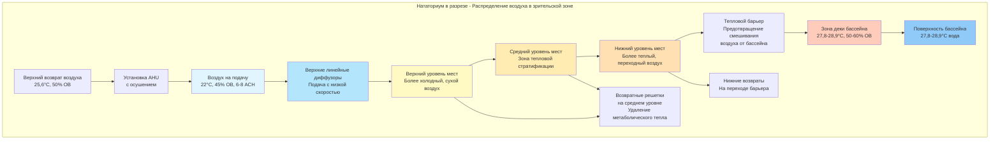

## Системы распределения воздуха в зрительских зонах нататориумов

Распределение воздуха в зрительские места нататориумов создает уникальные инженерные вызовы из-за близости к среде с высокой влажностью у бассейна, повышенной плотности занятых мест и вертикальной стратификации воздуха на ступенчатых сиденьях. Система должна обеспечивать адекватную вентиляцию, предотвращая сквозняки, поддерживая тепловой комфорт и избегая смешивания теплого воздуха зрителей с холодным влажным воздухом от бассейна.

## Требования к вентиляции для зон общего пользования

ASHRAE Standard 62.1 определяет требования к вентиляции для зон общего пользования. Для зрительских мест:

**Требования наружного воздуха:**
- Минимальная норма вентиляции: $V_{oz} = R_p \times P_z + R_a \times A_z$
- Где $R_p = 0,83$ м³/(ч·ч) (требование к зоне дыхания)
- $R_a = 0,65$ м³/(ч·м²) (компонент площади)
- Для вместимости 500 человек: $V_{oz} = 0,83(500) + 0,65(A_z) = 415 + 0,65A_z$ м³/ч

**Учет кратности воздухообмена:**
Зрительские зоны обычно требуют 6-10 кратной смены воздуха в час (ACH) для управления метаболическими нагрузками и предотвращения накопления CO₂:

$$ACH = \frac{Q \times 60}{V_{room}}$$

Где $Q$ — полный расход воздуха (м³/ч) и $V_{room}$ — объем зоны (м³).

## Сравнение методов распределения воздуха

| Метод распределения | Место подачи | Преимущества | Недостатки | Типичное применение |
|---------------------|--------------|------------|-----------|---------------------|
| **Верхнее перемешивающее** | Потолок/высокая боковая стена | Простой монтаж, хорошее покрытие | Риск высокой скорости струи, смешивание с воздухом от бассейна | Малые объекты (<300 мест) |
| **Распределение воздуха под полом (UFAD)** | Напольные спиральные диффузоры | Низкая скорость, эффект вытеснения, отличный комфорт | Выше стоимость монтажа, требует приподнятого пола | Объекты премиум-класса, новое строительство |
| **Распределение у спинки/ступени сиденья** | Отдельные выходы у мест | Индивидуальный комфорт, минимальные сквозняки | Сложная разводка воздуховодов, доступ при обслуживании | Спортивные арены |
| **Боковой выход на среднем уровне** | Периметровые стены на уровне мест | Хороший контроль горизонтальной дальности подачи | Ограниченное вертикальное перемешивание, риск короткого замыкания | Переоборудование существующих объектов |

## Расчеты дальности подачи воздуха для ступенчатого расположения мест

Дальность подачи воздуха от выходных отверстий должна достигать зоны, занятой людьми, при сохранении приемлемых конечных скоростей. Для верхних систем:

**Дальность подачи:**
$$L = \frac{V_o \times A_k}{K \times V_t}$$

Где:
- $L$ = дальность подачи до конечной скорости (м)
- $V_o$ = скорость на выходе (м/с)
- $A_k$ = эффективная площадь выхода (м²)
- $K$ = константа диффузора (обычно 2,5-4,0 для потолочных диффузоров)
- $V_t$ = конечная скорость в зоне, занятой людьми (максимум 0,25 м/с для зрителей)

**Пример расчета:**
Для потолочного диффузора на высоте 6,1 м над сиденьями:
- Требуемая дальность подачи: $L = 6,1$ м
- Требуемая конечная скорость: $V_t = 0,25$ м/с
- Константа диффузора: $K = 3,0$
- Эффективная площадь: $A_k = 0,14$ м²

Требуемая скорость на выходе: $V_o = \frac{L \times K \times V_t}{A_k} = \frac{6,1 \times 3,0 \times 0,25}{0,14} = 32,8$ м/с

## Характер потоков воздуха в зрительских зонах

## Стратегии предотвращения сквозняков

**Критические пределы скорости:**
- Зона, занятая людьми (сидячее положение): $V_{max} = 0,25$ м/с (предпочтительно 0,15 м/с)
- Уровень шеи/головы: $V_{max} = 0,15$ м/с
- Уровень щиколоток: $V_{max} = 0,41$ м/с (менее чувствительна)

**Методы проектирования:**
1. **Диффузоры с низкой скоростью:** использовать выходы с большой площадью и низким коэффициентом сужения для снижения импульса струи
2. **Увеличение дальности подачи:** устанавливать диффузоры дальше от зоны, занятой людьми, для обеспечения затухания скорости
3. **Диффузоры с перфорированной лицевой панелью:** распределять воздухоток по нескольким малым отверстиям вместо сосредоточенных струй
4. **Контроль температурного перепада:** ограничить разницу температур подачи и помещения до 5,6-8,3°C максимум

$$\Delta T_{max} = T_{space} - T_{supply} \leq 8,3°C$$

Более холодный воздух подачи требует более высоких скоростей для поддержания дальности подачи, что повышает риск сквозняков.

## Тепловой барьер между зрителями и бассейном

Критический элемент конструкции разделяет кондиционируемую зону зрителей (22-24,4°C, 40-50% ОВ) от влажной среды бассейна (27,8-28,9°C, 50-60% ОВ):

**Конструкция воздушного барьера:**
- Вертикальная воздушная завеса на границе мест/деки
- Отдельная подача, доставляющая скорость вниз 0,76-1,02 м/с
- Низкоуровневый возврат, расположенный на стороне деки бассейна
- Предотвращает миграцию влажного воздуха от бассейна в зону зрителей

**Эффективность барьера:**
$$\eta = \frac{C_{pool} - C_{spectator}}{C_{pool} - C_{supply}} \times 100\%$$

Где $C$ обозначает влажностное отношение или концентрацию загрязняющего вещества. Эффективные барьеры достигают $\eta > 80\%$.

## Вентиляция вытеснением для приложений премиум-класса

Для высокоуровневых соревновательных объектов вентиляция вытеснением обеспечивает превосходный комфорт:

**Принципы работы:**
- Подача воздуха на уровне пола: 20-21,1°C, низкая скорость (<0,25 м/с)
- Воздух поднимается естественным образом через зону зрителей благодаря тепловой плавучести от занятых мест
- Возвраты, расположенные в потолке, захватывают теплый загрязненный воздух
- Поддерживает вертикальный температурный градиент: увеличение 1,1-2,2°C от щиколотки до головы

**Расход на место:**
$$q_{seat} = \frac{Q_{sensible}}{1,2 \times \Delta T \times N_{seats}}$$

Где $Q_{sensible}$ — полная сенсибельная нагрузка (кДж/ч), $\Delta T$ — разница температур подачи и возврата, и $N_{seats}$ — вместимость мест.

## Рекомендации по проектированию

**Системы верхнего распределения:**
- Использовать для вместимости до 500 мест
- Выбирать линейные щелевые диффузоры для равномерного распределения вдоль рядов мест
- Располагать выходы на 5,5-7,3 м выше мест для обеспечения надлежащего затухания скорости
- Предусмотреть возврат воздуха в задней/верхней части зоны мест для захвата поднимающегося тепла

**Системы распределения воздуха под полом/вытеснением:**
- Применять для объектов >500 мест или объектов премиум-класса
- Проектировать на 6-8 ACH с температурой подачи на 1,1-2,2°C ниже установленной температуры помещения
- Использовать спиральные диффузоры (коэффициент характера 0,24-0,36) для содействия перемешиванию на уровне пола
- Установить возвраты на уровне потолка, минимум 3,7 м выше мест

**Отдельные выходы у спинки мест:**
- Резервировать для олимпийских или международных соревновательных объектов
- Обеспечивать 4,7-9,4 м³/ч на место с возможностью регулирования пользователем (±30%)
- Подавать воздух при 21,1-22,2°C для предотвращения чрезмерного охлаждения
- Интегрировать возвраты в ступень сиденья для захвата шлейфа CO₂

**Последовательности управления:**
- Переменный объемный расход (VAV) на основе датчиков занятости и мониторинга CO₂
- Поддерживать CO₂ <1000 ppm во время мероприятий
- Снижать до 50% расхода во время отсутствия занятости
- Координировать с системой осушения зоны бассейна для предотвращения перекрестного загрязнения

## Акустические соображения

Зрительские зоны требуют низких уровней фонового шума (NC-35 до NC-40) для предотвращения помех объявлениям и общению:

**Пределы скорости для низкого уровня шума:**
- Скорость в главных воздуховодах: максимум 7,6-10,2 м/с
- Ответвления воздуховодов: 5,1-7,6 м/с
- Скорость на лице диффузора: 2,0-3,0 м/с

Звукоизоляция через обшитые воздуховоды или глушители обычно требуется в пределах 6,1 м от диффузоров, обслуживающих зрительские зоны.

## Пусконаладка и проверка

**Метрики производительности:**
- Траверсы скорости воздуха в зоне, занятой людьми: подтверждение $V < 0,25$ м/с
- Температурная однородность: $\pm 1,1°C$ вдоль рядов мест на одной высоте
- Относительная влажность: поддерживать 40-50% во время занятости
- Эффективность вентиляции: $\varepsilon_v > 0,9$ для систем вытеснения, $> 0,8$ для верхнего перемешивания

Дымовое тестирование во время пусконаладки проверяет структуру воздушных потоков и подтверждает, что тепловой барьер предотвращает инфильтрацию воздуха от бассейна в зрительские зоны.
