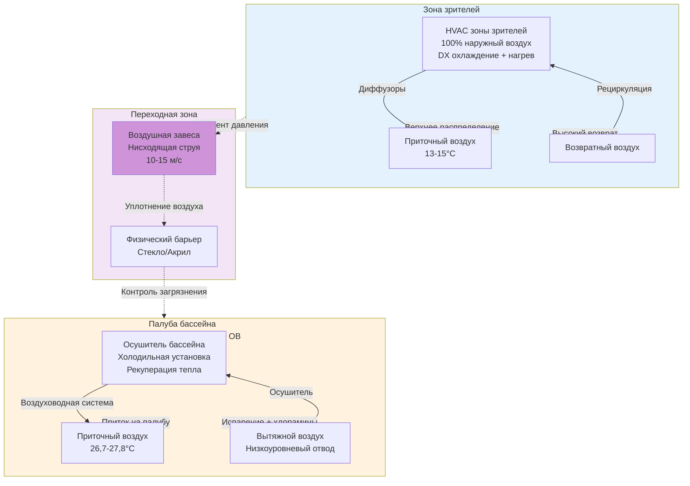

## Техническое обоснование разделения систем

Зоны зрителей в бассейнах требуют выделенных HVAC систем, отдельных от зон палубы бассейна, из-за принципиально несовместимых условий окружающей среды и требований к качеству воздуха. ASHRAE Applications Handbook, глава 6 (Нататориумы), требует такого разделения для объектов со значительной численностью зрителей, что обусловлено тремя критическими факторами: различными уставками температуры и влажности, пределами воздействия хлорамина и уровнями активности людей.

Окружение палубы бассейна работает при температуре на 1,1–2,2°C выше температуры воды (обычно 27,8–28,9°C) с влажностью воздуха 50–60% для минимизации испарения и обеспечения комфорта пловцов. Зоны зрителей требуют существенно других условий: 20–22°C и 30–50% ОВ для малоподвижных посетителей. Попытка обслуживать обе зоны из одной системы создает тепловой дискомфорт и потери энергии.

Более критично то, что концентрация хлоранула (трихлорамина) на поверхности палубы бассейна часто превышает 0,3 ppm — пороговое значение запаха и уровень раздражителя для дыхания. Зрители, особенно дети и люди с респираторной чувствительностью, требуют качества воздуха, соответствующего стандартам ASHRAE 62.1 для занятых помещений, которое воздух палубы бассейна не может обеспечить без существенного разбавления.

## Изоляция нагрузки и анализ энергии

Различие в тепловой нагрузке между зоной зрителей и зоной бассейна требует отдельного расчета производительности. Нагрузки в зонах зрителей следуют обычным схемам для сборочных пространств:

$$Q_{\text{spectator}} = Q_{\text{sensible}} + Q_{\text{latent}} = \left(\dot{m}c_p\Delta T\right)_{\text{people}} + \left(h_{fg}\dot{m}_v\right)_{\text{people}} + Q_{\text{envelope}} + Q_{\text{solar}}$$

Где:
- $Q_{\text{sensible}}$ = явная теплота от людей, освещения, ограждающей конструкции и солнечных поступлений
- $Q_{\text{latent}}$ = влажностная нагрузка от людей (низкая по сравнению с палубой бассейна)
- $Q_{\text{envelope}}$ = нагрузка от ограждающей конструкции при уставке для зрителей (20–22°C)
- $Q_{\text{solar}}$ = солнечный прирост тепла через остекление

Нагрузки палубы бассейна определяются в основном испарительной влагой:

$$Q_{\text{pool}} = \dot{m}_{\text{evap}} \cdot h_{fg} + Q_{\text{sensible,deck}}$$

Где испарительный массовый расход $\dot{m}_{\text{evap}}$ следует уравнению Carrier:

$$\dot{m}_{\text{evap}} = 0.1 \cdot A_{\text{pool}} \cdot \left(p_{w,sat} - p_{w,air}\right) \cdot \left(1 + 0.2V_{\text{wind}}\right)$$

Скрытая нагрузка от испарения обычно составляет 60–75% от общей нагрузки палубы бассейна, в то время как скрытые нагрузки зрителей редко превышают 25% от общей. Это различие делает контроль влажности единой системой невозможным без сильного переохлаждения одной зоны или недостаточной осушки другой.

Анализ энергии подтверждает преимущества разделения. Объединенная система должна подавать воздух при условиях, удовлетворяющих наиболее требовательной зоне (точке росы палубы бассейна), а затем повторно нагревать его для комфорта зрителей. Штраф на этот повторный нагрев может составлять 15–30% от общего потребления энергии HVAC в объединенных конструкциях. Отдельные системы устраняют эту нагрузку повторного нагрева и позволяют независимое использование рекуператора тепла для зоны зрителей в мягкую погоду.

## Конфигурация зонирования

Следующая диаграмма иллюстрирует надлежащее разделение HVAC с взаимосвязями давления и размещением воздушной завесы:

Зона зрителей работает при положительном давлении (+5 до +10 Па) относительно палубы бассейна, чтобы предотвратить миграцию хлоранула. Палуба бассейна поддерживает отрицательное давление (-5 до -10 Па) относительно соседних помещений, чтобы содержать загрязнители. Этот каскад давлений требует тщательной балансировки и мониторинга.

## Стратегии интерфейса и сравнение

Существует несколько подходов к управлению интерфейсом зрителей и бассейна. Выбор зависит от архитектурных ограничений, бюджета и приемлемости сложности эксплуатации.

| Стратегия | Реализация | Эффективность | Влияние на энергию | Капитальные затраты | Техническое обслуживание |
|-----------|-----------|---------------|-------------------|---------------------|------------------------|
| **Воздушная завеса** | Высокоскоростная нисходящая струя (10–15 м/с) в проеме | 75–85% содержания с контролем давления | +8–12% энергии вентилятора | Средние (8–15 тыс. руб. за проем) | Замена фильтров, техническое обслуживание мотора |
| **Контроль давления** | Датчики дифференциального давления с автоматическим управлением заслонками | 80–90% при надлежащей наладке | Минимален при правильной настройке | Низкие (3–5 тыс. руб. за зону) | Ежегодная калибровка |
| **Физический барьер** | Закаленное стекло или акриловая перегородка с дверями | 95–98% разделение | Отсутствует (пассивное) | Высокие (150–300 за м², установка) | Очистка, замена уплотнений |
| **Вход тамбура** | Двойная дверь с местной вытяжкой | 90–95% эффективность | +5–8% на кондиционирование тамбура | Средние–Высокие (25–40 тыс. руб.) | Операторы дверей, уплотнения |
| **Комбинированный подход** | Физический барьер + воздушная завеса + контроль давления | >98% содержания | +10–15% всего | Наибольшие | Несколько систем |

Лучшая практика для конкурентных центров водных видов спорта и крупных объектов со зрителями объединяет физический барьер (стеклянная стена) с контролем дифференциального давления. Стекло обеспечивает визуальное соединение при достижении почти полного разделения воздуха. Контроль давления справляется с открытиями дверей и обеспечивает последовательное направление воздуха.

Для более мелких объектов или модификации, где полные барьеры нецелесообразны, воздушные завесы в сочетании с агрессивными дифференциалами давления (15–20 Па) обеспечивают приемлемую производительность. Воздушная завеса должна быть рассчитана по ширине проема с минимальной скоростью нагнетания 10 м/с и объемом воздуха, соответствующим 75–100% площади поперечного сечения проема.

## Смягчение воздействия хлорамина

Трихлорамин (NCl₃) является основным загрязнителем воздуха в нататориумах. Его летучесть и раздражающие свойства обусловливают требование разделения системы зрителей. Воздух палубы бассейна обычно содержит 0,2–0,5 ppm трихлорамина, в то время как безопасные пределы непрерывного воздействия для широкой публики находятся ниже 0,1 ppm.

Отдельные системы для зрителей снижают воздействие тремя механизмами:

1. **Изоляция источника**: Физическое и аэродинамическое разделение предотвращает массовый транспорт хлорамина в зоны зрителей
2. **Выделенная вентиляция**: Системы зрителей вводят 100% наружного воздуха при пиковой занятости, разбавляя любые миграционные загрязнители до незначительных уровней
3. **Контроль давления**: Положительное давление в зонах зрителей обеспечивает, чтобы любое утечка воздуха текла из зоны зрителей в сторону палубы бассейна, а не наоборот

Требование наружного воздуха системы зрителей следует расчетам ASHRAE 62.1 на основе численности (обычно 2,4–3,3 л/(с·чел) для сборочных пространств), не повышенным нормам нататориума (минимум 6–8 кратного воздухообмена в час). Это различие позволяет применять рекуперацию энергии на вытяжке системы зрителей без опасений перекрестного загрязнения хлорамином, которые исключают рекуперацию энергии на вытяжке палубы бассейна.

## Требования норм и стандартов

ASHRAE 62.1 Вентиляция для приемлемого качества воздуха в помещениях требует выделенной вытяжки с палубы бассейна без рециркуляции в занятые помещения, не предназначенные для использования бассейна. Это эффективно требует отдельных систем, когда существуют зоны зрителей. Международный механический кодекс (IMC), раздел 403.2, укрепляет это требование через определяемые численностью требования к наружному воздуху, которые не могут быть удовлетворены воздухом палубы бассейна.

Государственные и местные санитарные кодексы часто налагают дополнительные ограничения. Многие юрисдикции запрещают любую рециркуляцию между палубой бассейна и зонами зрителей или требуют физического разделения, когда численность зрителей превышает 50–100 человек. California Title 24 и подобные энергетические кодексы часто требуют рекуператоры тепла для систем зрителей, одновременно запрещая их для систем палубы бассейна из-за требований контроля влажности — еще один фактор, обусловивший разделение систем.

Коды доступности (ADA, местные эквиваленты) влияют на проектирование интерфейса. Проемы, требующие доступного прохода, не могут использовать только воздушные завесы; им нужны физические барьеры с доступной фурнитурой дверей. Это ограничение часто благоприятствует подходу со стеклянной перегородкой с автоматическими или маловозмездными операторами дверей.

## Лучшие практики конфигурации системы

Системы HVAC для зрителей должны использовать обычное оборудование для комфортного охлаждения: пакетные крышные установки, сплит-системы или выделенные воздухоприемные установки с DX охлаждением и газовым нагревом. Избегайте переоборудования; нагрузки в зонах зрителей предсказуемы и размер должен следовать ACCA Manual J или основам ASHRAE. Обеспечьте контроль влажности правильным выбором охлаждающего элемента (контроль точки росы) и избегайте специализированного оборудования осушки, требуемого для палуб бассейна.

Распределение приточного воздуха использует верхнюю доставку с высокоиндукционными диффузорами для содействия перемешиванию и избежания стратификации. Решетки возврата воздуха монтируются высоко на стены или потолки, вдали от интерфейса бассейна. Эта компоновка поддерживает градиент положительного давления и обеспечивает, чтобы любая инфильтрация с палубы бассейна происходила на низких уровнях, где она может быть захвачена до достижения дыхательной зоны.

Зонирование в пределах зоны зрителей должно следовать схемам занятости. Отдельное управление для верхних уровней сидений позволяет снижение нагрузки в непроизводственные периоды. Управляемая вентиляция, основанная на определении CO₂, крайне эффективна для зон зрителей с переменной посещаемостью, снижая наружный воздух при низкой занятости, сохраняя при этом надлежащую вентиляцию во время мероприятий.

Интеграция управления между системами зрителей и бассейна позволяет скоординированное управление давлением. Система автоматизации зданий контролирует дифференциальное давление на интерфейсе и модулирует скорости вентиляторов вытяжки/приточки для поддержания целевого градиента. Блокировки предотвращают одновременное использование рекуператора или изменение давления во время отказов оборудования.

## Заключение

Отдельные HVAC системы для зон зрителей представляют надлежащую инженерную практику, обусловленную принципиально несовместимыми требованиями окружающей среды. Различие в температуре, требования к контролю влажности и опасения по воздействию хлорамина не могут быть надлежащим образом решены с помощью общих систем. Хотя разделение систем увеличивает начальные затраты и сложность управления, оно обеспечивает превосходный комфорт занятых, качество воздуха и долгосрочную производительность энергии. Для любого нататориума с регулярным использованием зрителей, превышающим 25–50 человек, выделенные системы HVAC для зрителей должны считаться обязательными, а не дополнительными.
