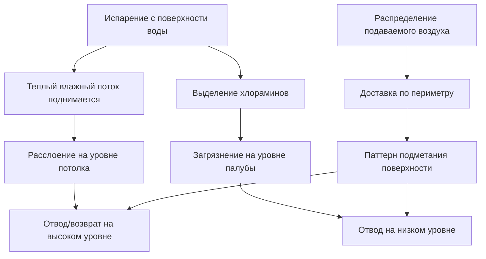
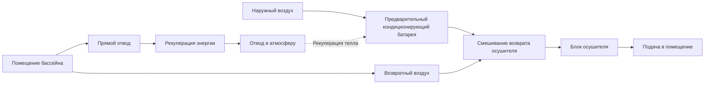

Крытые бассейны создают уникальные проблемы вентиляции, которые отличают их от обычных занятых помещений. Сочетание высоких влажностных нагрузок, содержащихся в воздухе химических загрязнителей и строгих требований к комфорту требует систем вентиляции, разработанных для решения как проблем качества воздуха, так и термодинамических ограничений.

## Основные факторы вентиляции

Вентиляция нататориума выполняет три основные функции: разбавление содержащихся в воздухе загрязнителей, контроль влажности и управление давлением в помещении. В отличие от типичных коммерческих помещений, где вентиляция в основном решает проблему выделения СО₂ от людей, учреждения с бассейнами должны бороться с непрерывным выделением хлораминов и других побочных продуктов дезинфекции с поверхности воды.

**Образование и выделение хлораминов**

Когда дезинфицирующие средства на основе хлора реагируют с азотсодержащими соединениями, поступающими от пловцов (мочевина, пот, косметика), они образуют комбинированные хлорсодержащие соединения, известные как хламины. Наиболее проблематичным является трихлорид азота (NCl₃), который легко испаряется при типичных температурах воды в бассейне.

Скорость массопередачи хлораминов из воды в воздух описывается следующим образом:

$$\dot{m}_{NCl_3} = k_L \cdot A \cdot (C_L - C_L^*)$$

Где:
- $\dot{m}_{NCl_3}$ = скорость массопередачи трихлорамина (кг/ч)
- $k_L$ = общий коэффициент массопередачи (м/ч)
- $A$ = площадь поверхности воды (м²)
- $C_L$ = концентрация в основной жидкости (мг/м³)
- $C_L^*$ = равновесная концентрация на границе раздела (мг/м³)

Коэффициент массопередачи увеличивается с турбулентностью поверхности воды (волны, фонтаны, горки) и скоростью воздуха над поверхностью. Это объясняет, почему активные бассейны генерируют более высокие нагрузки загрязнителей, чем спокойные водоемы.

## Требования норм к минимальным расходам наружного воздуха

**Минимальные расходы ASHRAE 62.1**

Стандарт ASHRAE 62.1 определяет минимальные расходы вентиляции для нататориумов на основе площади палубы и численности зрителей:

| Тип помещения | Расход наружного воздуха | Применение |
|-----------|------------------|-------------|
| Палуба бассейна (неактивная) | 8,1 м³/(ч·м²) | Метод площади палубы |
| Палуба бассейна (активная/соревновательная) | 8,1 м³/(ч·м²) + компонент численности | Площадь + численность |
| Зрительские зоны | На основе таблицы 6-1 численности | Сборочные помещения |

Для типичного бассейна 25 м × 12 м (площадь водной поверхности 116 м²) с площадью палубы 140 м²:

$$V_{OA,min} = 8,1 \times 140 = 1134 \text{ м³/ч}$$

Это представляет абсолютный минимум. Фактические требования часто превышают минимум кодекса из-за необходимости контроля загрязнителей.

**Требования Международного механического кодекса (IMC)**

IMC раздел 403.3.2 требует, чтобы нататориумы поддерживали отрицательное давление относительно соседних занятых помещений, требуя дисбаланса воздуха вытяжки и подачи. Большинство юрисдикций требуют 5-15% избытка вытяжки.

## Требования по разбавлению загрязнителей

Критический фактор вентиляции — контроль концентрации хлораминов. Рекомендуемые максимальные концентрации трихлорамина:

- Рекреационные бассейны: 0,5 мг/м³
- Соревновательные учреждения: 0,3 мг/м³
- Лечебные/оздоровительные бассейны: 0,2 мг/м³

Требуемый расход вентиляции для разбавления:

$$Q_{dil} = \frac{\dot{m}_{NCl_3}}{\rho_{air} \cdot (C_{max} - C_{OA})}$$

Где:
- $Q_{dil}$ = расход вентиляции для разбавления (м³/ч)
- $\rho_{air}$ = плотность воздуха (кг/м³)
- $C_{max}$ = максимально допустимая внутренняя концентрация (мг/м³)
- $C_{OA}$ = концентрация наружного воздуха (обычно нулевая)

Для типичных рекреационных бассейнов этот расчет дает 4-8 кратной смены воздуха в час (ACH), что значительно превышает минимумы ASHRAE 62.1. Соревновательные бассейны и объекты с плохой химией воды могут требовать 8-12 ACH.

## Стратегия отвода воздуха и распределение воздуха

Эффективное удаление загрязнителей требует стратегического расположения отводов. Хламины немного плотнее воздуха (молекулярный вес ~120 против 29 для воздуха), что способствует их оседанию к уровню палубы. Однако тепловое расслоение от теплых поверхностей воды создает восходящие конвективные потоки.

**Рекомендуемое распределение отводов:**

| Расположение отвода | Процент от общего | Функция |
|-----------------|---------------------|----------|
| Уровень палубы (< 0,9 м) | 30-40% | Прямой захват хлораминов |
| Поверхность воды (< 2,4 м) | 20-30% | Перехват восходящего потока |
| Уровень потолка | 30-50% | Общее разбавление/контроль влажности |

Отвод на низком уровне должен поддерживать скорость 0,25-0,3 м/с по поверхностям палубы без создания сквозняков в занятых зонах. Отвод на высоком уровне интегрируется с возвратом осушителя.

## Контроль давления в помещении

Нататориумы должны работать при отрицательном давлении (-5-12 Па) относительно соседних помещений, чтобы предотвратить миграцию влажного воздуха, содержащего хламины, в коридоры, раздевалки и механические помещения. Это давление достигается путем дисбаланса вытяжки и подачи.

**Расчет дифференциала давления:**

$$\Delta P = \frac{\rho \cdot v^2}{2} + \rho \cdot g \cdot h \cdot \Delta T_{adj}$$

Где компонент динамического давления доминирует в надлежащим образом герметизированных помещениях. Требуемый избыток вытяжки:

$$Q_{exhaust} = Q_{supply} + Q_{excess}$$

Типичный $Q_{excess}$ = 10-15% от подачи, скорректированный на основе:
- Герметичность строительной оболочки (плотнее = требуется меньше избытка)
- Интенсивность дверного движения (высокая интенсивность = больше избытка)
- Требования к давлению в соседних помещениях

Датчики дифференциального давления с модуляцией прямого цифрового управления (DDC) вытяжных вентиляторов поддерживают заданное значение при изменяющихся условиях.

## Энергетические соображения

Вентиляция представляет доминирующую энергетическую нагрузку в системах HVAC нататориумов. Для объекта с палубой площадью 186 м² в отопительном климате:

**Годовая энергетическая нагрузка вентиляции (отопительный сезон):**

$$Q_{vent,heating} = \dot{m}_{OA} \cdot c_p \cdot (T_{indoor} - T_{outdoor}) \cdot t_{heating}$$

При расходе наружного воздуха 710 м³/ч, внутренней температуре 27,8°C, средней наружной температуре 1,7°C, 6000 часов отопления:

$$Q_{vent,heating} = \frac{710}{3,6} \times 1005 \times (27,8-1,7) \times 6000 = 2,41 \times 10^9 \text{ кДж}$$

Это исключает кондиционирование скрытой нагрузки (обычно 2-3× от явной нагрузки) и представляет ~40-60% от общей энергии отопления объекта.

**Стратегии рекуперации энергии:**

1. **Энтальпийные колеса**: 60-75% общей эффективности
2. **Пластинчатые теплообменники**: 50-65% эффективность по явной теплоте
3. **Тепловые трубки**: 45-55% эффективность по явной теплоте
4. **Циркуляционные контуры**: 50-60% эффективность по явной теплоте

Коррозия от хлораминов ограничивает опции рекуперации. Энтальпийные колеса создают риск кросс-загрязнения; пластинчатые теплообменники требуют коррозионностойких материалов (алюминий или покрытие). Многие разработчики указывают циркуляционные контуры с гликолью с разделением между вытяжным и подаваемым воздушными потоками.

## Интеграция с системами осушения

Специализированные осушители для бассейнов обеспечивают большинство циркуляции воздуха в помещении (8-12 ACH), в то время как система вентиляции подает наружный воздух и отводит загрязненный воздух. Системы интегрируются на возврате осушителя:

Доля наружного воздуха в возврате осушителя обычно находится в диапазоне 15-35%, модулирующие заслонки поддерживают давление в помещении при соблюдении минимальных расходов вентиляции.

## Резюме

Расходы вентиляции нататориумов определяются требованиями по разбавлению хлораминов, а не расчетами на основе численности людей. Типичные объекты требуют минимум 4-8 ACH, со стратегическим расположением отводов на нескольких уровнях для захвата как загрязнителей на уровне палубы, так и расслоения на потолке. Отрицательное давление, создаваемое избытком вытяжки, предотвращает миграцию в соседние помещения. Рекуперация энергии необходима для контроля эксплуатационных расходов, но должна решать проблемы коррозии, присущие хлорированной среде.

Надлежащее проектирование системы вентиляции сбалансирует качество воздуха, комфорт, контроль давления и энергоэффективность — задача, значительно более сложная, чем традиционные коммерческие приложения HVAC.
