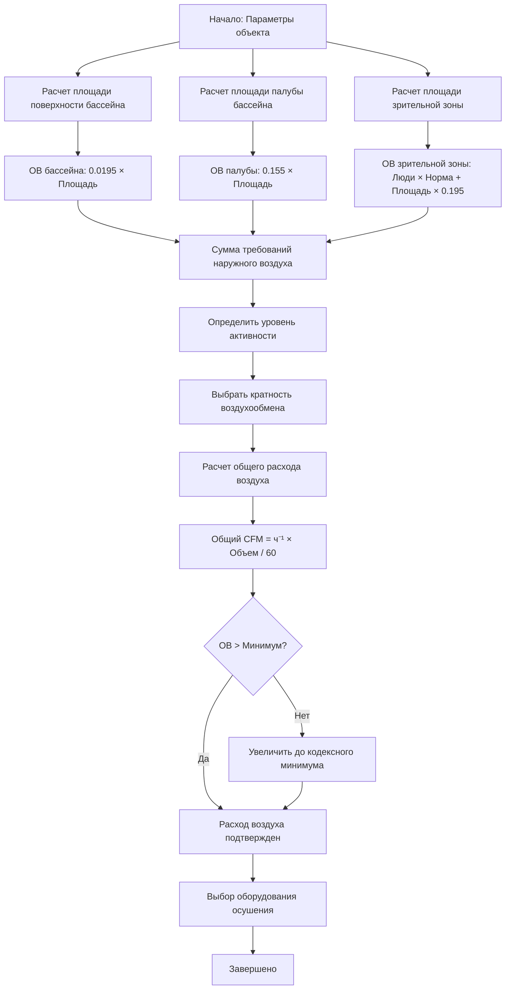

Кратность воздухообмена в проектировании нататориума служит двум отчетливым, но перекрывающимся целям: разбавлению переносимых по воздуху загрязнителей (в основном хлораминов) и контролю влажности путем вентиляции. В отличие от обычных занятых помещений, где вентиляция в основном решает проблемы метаболического CO₂ и запахов, вентиляция нататориума должна управлять химическим выделением газов из процессов очистки воды, одновременно поддерживая системы механического осушения. Понимание физики образования загрязнителей, их рассеивания и удаления определяет правильный выбор кратности воздухообмена.

## Требования вентиляции ASHRAE 62.1

Стандарт ASHRAE 62.1 устанавливает минимальные требования к наружному воздуху для нататориумов на основе площади пола, а не на основе числа людей, признавая, что поверхность бассейна генерирует основную нагрузку загрязнителей. Стандарт дифференцирует зоны палубы бассейна и зрительные зоны из-за их принципиально различных профилей воздействия.

### Минимальные расходы наружного воздуха

**Палуба бассейна** (область в пределах 3 м от периметра бассейна, где находятся пловцы и персонал):

$$V_{oa,deck} = 0.155 \times A_{deck}$$

где $V_{oa,deck}$ — расход наружного воздуха в CFM (м³/ч), $A_{deck}$ — площадь палубы бассейна в м².

**Поверхность воды бассейна**:

$$V_{oa,pool} = 0.0195 \times A_{pool}$$

где $V_{oa,pool}$ — расход наружного воздуха в CFM (м³/ч), $A_{pool}$ — площадь поверхности воды бассейна в м².

**Зрительные зоны** (трибуны, галереи просмотра, отделенные от палубы бассейна):

Применяется стандартная вентиляция на основе числа людей, обычно 2.4–3.8 CFM (4.1–6.4 м³/ч) на человека в зависимости от возрастной группы и активности.

### Расчет общего наружного воздуха

Полное требование к наружному воздуху объединяет поверхность бассейна, площадь палубы и вентиляцию зрительной зоны:

$$V_{oa,total} = (0.0195 \times A_{pool}) + (0.155 \times A_{deck}) + (R_p \times P) + (R_a \times A_{spectator})$$

где:
- $R_p$ — норма наружного воздуха для людей (CFM/человека или м³/ч на человека)
- $P$ — число людей в зрительной зоне
- $R_a$ — норма наружного воздуха для площади (м³/ч на м²), обычно 0.195 м³/ч на м²
- $A_{spectator}$ — площадь зрительной зоны (м²)

## Физическое обоснование требований к воздухообмену

Требования к кратности воздухообмена вытекают из принципов образования и удаления загрязнителей. Трихлорамин (NCl₃), основной раздражитель в воздухе бассейна, образуется на поверхности воды в результате химических реакций между свободным хлором и азотсодержащими соединениями (моча, пот, косметика), которые вносят пловцы. Скорость массопередачи из воды в воздух зависит от:

1. **Концентрации трихлорамина в воде бассейна** (обычно 0.1–0.5 мг/л)
2. **Закона Генри**, определяющего разделение газа и жидкости
3. **Коэффициента массопередачи** на границе раздела вода-воздух (функция турбулентности)
4. **Площади поверхности воды бассейна**

После попадания в воздух концентрация трихлорамина в пространстве нататориума следует установившемуся массовому балансу:

$$C_{ss} = \frac{G}{Q_{vent} + k \cdot V}$$

где:
- $C_{ss}$ — установившаяся концентрация (мг/м³)
- $G$ — скорость образования (мг/ч)
- $Q_{vent}$ — расход вентиляции (м³/ч)
- $k$ — константа скорости удаления при фильтрации/разложении (ч⁻¹)
- $V$ — объем помещения (м³)

Для поддержания трихлорамина ниже 0.5 мг/м³ достаточная вентиляция должна разбавлять постоянное образование из воды бассейна. Более высокие уровни активности увеличивают образование за счет волнения воды и нагрузки пловцами, требуя увеличения кратности воздухообмена.

## Вентиляционные нормы на основе активности

Эмпирические данные из работающих нататориумов показывают, что минимальная кодексная вентиляция часто недостаточна в периоды высокой активности. Корректировки на основе активности учитывают увеличенное образование загрязнителей:

| Уровень активности | Использование бассейна | Кратность воздухообмена | Доля наружного воздуха |
|---|---|---|---|
| Низкий | Минимальное использование, спокойная вода | 4–6 ч⁻¹ | 30–40 % |
| Средний | Рекреационное плавание | 6–8 ч⁻¹ | 40–50 % |
| Высокий | Спортивное плавание, уроки | 8–12 ч⁻¹ | 50–70 % |
| Пиковый | Синхронное плавание, водное поло | 12–15 ч⁻¹ | 70–90 % |

Эти нормы предполагают надлежащее функционирование оборудования осушения. Вентиляция чистым наружным воздухом без механического осушения требует существенно более высоких норм (15–30 ч⁻¹) и работает только в сухих климатических условиях или определенных сезонных условиях.

## Зонные требования

Нататориумы обычно содержат различные зоны, требующие дифференцированных стратегий вентиляции:

### Зона палубы бассейна

Зона палубы бассейна испытывает наибольшее воздействие загрязнителей и уровни влажности. Распределение воздуха должно обеспечивать:

- **Минимум 6 ч⁻¹** для разбавления загрязнителей
- **0.155 м³/ч на м²** наружного воздуха согласно ASHRAE 62.1
- **Скорость воздуха 0.25–0.50 м/с** на высоте дыхания для комфорта посетителей
- **Температура на 1–2 °C выше температуры воды бассейна** для минимизации испарения

Зоны палубы с гидромассажными ваннами или терапевтическими бассейнами требуют дополнительной вентиляции (добавить 7–9 м³/ч на человека в гидромассажной ванне) из-за повышенной температуры воды, увеличивающей скорость испарения.

### Зона зрительной зоны

Зрительные зоны могут быть изолированы от воздуха палубы бассейна путем стратегического распределения приточного воздуха и размещения вытяжки. Это разделение обеспечивает две выгоды:

1. **Сниженное воздействие** хлораминов (концентрации на 50–70 % ниже, чем на палубе)
2. **Более низкая влажность** для улучшенного комфорта (40–50 % ОВ против 50–60 % на палубе)

Рекомендуемый подход:

- **Раздельная обработка воздуха** с выделенной приточной и вытяжной системой
- **Небольшое избыточное давление** относительно палубы бассейна (5–7.5 Па)
- **2.4–3.8 м³/ч на человека** наружного воздуха согласно нормам занятости ASHRAE 62.1
- **4–6 ч⁻¹** всего для комфорта и качества воздуха

Физическое разделение между зонами должно включать:

$$\Delta P = \frac{\rho \cdot v^2}{2} \cdot C_f$$

где перепад давления $\Delta P$ через барьер разделения предотвращает миграцию хлораминов в зрительные зоны. Избыточное давление 0.03 дюйма вод. ст. (7.5 Па) в зрительной зоне относительно палубы бассейна обеспечивает эффективную изоляцию.

## Методология расчета вентиляционной нормы

### Практический пример

**Параметры объекта**:
- Площадь поверхности бассейна: 140 м² (25 м × 25 м конкурсный бассейн)
- Площадь палубы бассейна: 232 м² (включает периметр 2.5–3 м)
- Площадь зрительной зоны: 112 м² (120 мест)
- Высота потолка: 5.5 м
- Ожидаемая активность: Высокая (спортивное плавание)

**Требования к наружному воздуху**:

Вклад поверхности бассейна:
$$V_{oa,pool} = 0.0195 \times 140 = 2.73 \text{ м³/ч}$$

Вклад палубы бассейна:
$$V_{oa,deck} = 0.155 \times 232 = 35.96 \text{ м³/ч}$$

Вклад зрительной зоны (3.8 м³/ч на человека):
$$V_{oa,spec} = 3.8 \times 120 + 0.195 \times 112 = 456 + 21.84 = 477.84 \text{ м³/ч}$$

Общий наружный воздух:
$$V_{oa,total} = 2.73 + 35.96 + 477.84 = 516.53 \text{ м³/ч}$$

**Проверка кратности воздухообмена**:

Объем палубы бассейна:
$$V_{deck} = 232 \times 5.5 = 1276 \text{ м³}$$

Требуемая кратность для высокой активности = 8–12 ч⁻¹. Используя 10 ч⁻¹:
$$Q_{deck} = \frac{10 \times 1276}{1} = 12760 \text{ м³/ч}$$

Доля наружного воздуха:
$$\frac{V_{oa,deck}}{Q_{deck}} = \frac{35.96}{12760} = 0.282 \text{ или } 28.2\%$$

Это ниже рекомендуемых 50–70 % ОВ для высокой активности, указывая на необходимость усиленной фильтрации (активированный уголь или УФ) для управления хлораминами со сниженным штрафом на энергию наружного воздуха. Альтернатива: увеличить наружный воздух до 50 % (6380 м³/ч) для разбавления-ориентированного управления.

## Оперативные соображения

Кратность воздухообмена должна быть регулируемой на основе фактического использования объекта:

**Вентиляция с управлением спросом**: Модулирование наружного воздуха на основе измеренной концентрации хлорамина или занятости бассейна снижает энергопотребление в периоды низкого использования при сохранении качества воздуха. Датчики хлорамина (диапазон 0–1 ppm или 0–1 мг/м³) обеспечивают прямую обратную связь для управления вентиляцией.

**Ночной режим**: Снижение вентиляции до 50–60 % от занятых норм в неиспользуемые периоды (бассейн накрыт) поддерживает контроль влажности при сокращении энергии отопления/охлаждения. Минимум 2–4 ч⁻¹ предотвращает чрезмерное накопление влаги.

**Предварительная очистка перед оккупацией**: Работа на 100 % наружного воздуха в течение 1–2 часов перед оккупацией разбавляет накопившиеся хлорамины, особенно важно после периодов интенсивного использования или обработки воды.

## Рекомендации по проектированию

Для оптимального качества воздуха нататориума и энергоэффективности:

1. **Соответствовать минимальным нормам ASHRAE 62.1** (0.155 м³/ч на м² палубы + 0.0195 м³/ч на м² бассейна) как базовая норма
2. **Проектировать для 8–10 ч⁻¹** на палубе бассейна для конкурсных/высоконагруженных объектов
3. **Разделить зрительные зоны** с независимой обработкой воздуха и небольшим избыточным давлением
4. **Предусмотреть регулируемые заслонки наружного воздуха** (диапазон 20–100 %) для управления спросом
5. **Обеспечить 50–70 % доля наружного воздуха** в периоды пиковой нагрузки или установить дополнительное удаление хлорамина
6. **Выбрать размер оборудования осушения** для общего расхода воздуха, не только компоненты наружного воздуха
7. **Включить мониторинг качества воздуха** (хлорамин, влажность, температура) для проверки и оптимизации

Правильный выбор кратности воздухообмена обеспечивает баланс качества воздуха, комфорта, энергоэффективности и надежности оборудования. Консервативное проектирование (более высокая кратность) обеспечивает оперативный резерв для пиковых условий, в то время как стратегии управления спросом минимизируют энергетические потери при типовой эксплуатации. Инвестиция в адекватную вентиляционную мощность предотвращает хронические жалобы на качество воздуха и долгосрочный коррозионный ущерб, которые мучают недостаточно вентилируемые нататориумы.

## Резюме соответствия кодексам

| Код/Стандарт | Требование | Применение |
|---|---|---|
| ASHRAE 62.1 | 0.155 м³/ч на м² палубы | Минимальный наружный воздух |
| ASHRAE 62.1 | 0.0195 м³/ч на м² поверхности бассейна | Минимальный наружный воздух |
| ASHRAE 62.1 | 3.8 м³/ч на человека зрители | Возраст >18, сидячее положение |
| IMC Раздел 403.3.3 | Требуется механическая вентиляция | Объекты с бассейнами |
| CDC MAHC | <0,5 мг/м³ трихлорамина | Целевое качество воздуха |

Общие кратности воздухообмена (4–15 ч⁻¹ в зависимости от активности) объединяют требования наружного воздуха с рециркуляцией через оборудование осушения для одновременного достижения контроля влажности и разбавления загрязнителей.
