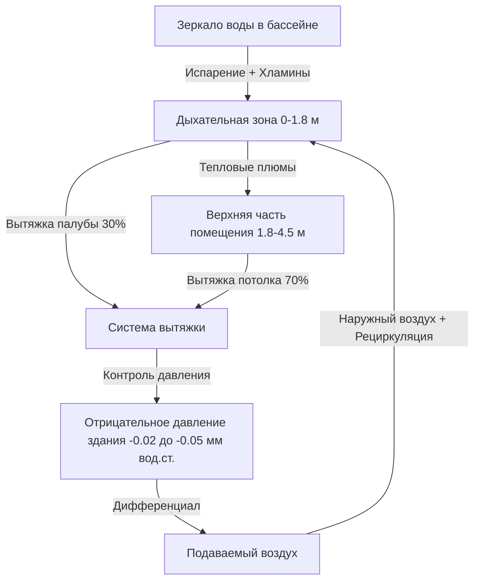

Определение объема вытяжного воздуха в системах HVAC бассейнов контролирует концентрацию хлораминов, предотвращает миграцию влаги и поддерживает комфорт людей. Стратегия вытяжки должна обеспечивать удаление загрязняющих веществ у источника, одновременно контролируя давление в здании для предотвращения деградации конструкций.

## Фундаментальные требования к вытяжке

Системы вытяжки воздуха в бассейнах выполняют три критические функции: удаление хлораминов из дыхательной зоны, контроль влажности за счет массопередачи и защита ограждающей конструкции здания путем управления давлением. Общий объем вытяжки определяется наибольшим требованием среди этих трех факторов.

### Основа расчета объема вытяжки

ASHRAE 62.1 устанавливает минимальные расходы вентиляции на основе плотности людей и площади помещения. Для бассейнов расчет учитывает площадь зеркала воды и площадь палубы:

$$Q_{exhaust} = (A_{pool} \times R_{pool}) + (A_{deck} \times R_{deck}) + Q_{occupant}$$

Где:
- $Q_{exhaust}$ = общий расход вытяжного воздуха (м³/ч)
- $A_{pool}$ = площадь зеркала воды бассейна (м²)
- $R_{pool}$ = нормируемый расход вентиляции от зеркала воды (м³/ч·м²)
- $A_{deck}$ = площадь палубы (м²)
- $R_{deck}$ = нормируемый расход вентиляции палубы (м³/ч·м²)
- $Q_{occupant}$ = вентиляция на основе плотности людей (м³/ч)

| Тип зоны | Минимальный норматив вентиляции | Примечания |
|----------|----------------------------------|-----------|
| Площадь зеркала воды | 0.34–2.72 м³/ч·м² | Варьируется в зависимости от интенсивности использования |
| Площадь палубы | 0.34 м³/ч·м² | Базовое значение ASHRAE 62.1 |
| Зона зрителей | 3.54 м³/ч на человека | Плюс составляющая по площади |
| Раздевалки | 2.83 м³/ч·м² | Рекомендуется отдельная вытяжка |

### Нормативы для зеркала воды в зависимости от активности

Активность использования бассейна напрямую влияет на образование загрязняющих веществ через интенсификацию испарения и нагрузку от пловцов. Норматив вентиляции зеркала воды масштабируется в зависимости от интенсивности использования:

$$R_{pool} = 0.34 + (2.37 \times AF)$$

Где AF — коэффициент активности (0 для спокойной воды, 1.0 для интенсивного использования, таких как соревнования или аквапарки).

## Стратегия расположения вытяжек

Стратификация загрязняющих веществ в бассейнах создает отчетливые градиенты концентрации, требующие зонной вытяжки. Хламины, будучи немного тяжелее воздуха при типовых температурах воды, проявляют сложное поведение, зависящее от тепловых плюмов, поднимающихся от зеркала воды.

### Вытяжка на уровне палубы

Вытяжка на уровне палубы улавливает загрязняющие вещества в дыхательной зоне до того, как конвективные потоки распределяют их по всему помещению. Располагайте вытяжные входы на высоте 60–90 см от чистого пола по периметру бассейна.

**Требования к скорости вытяжки на палубе:**
- Скорость входного сечения: 120–180 м/мин
- Расстояние захвата: 1.8–3.0 м от входа
- Охват: один вход на 12–18 м периметра

Скорость захвата на расстоянии $x$ от вытяжного входа следует соотношению:

$$V_x = V_0 \times \frac{A_{inlet}}{A_{inlet} + 10x^2}$$

Где $V_0$ — скорость входного сечения (м/мин), $A_{inlet}$ — площадь входного сечения (м²), и $x$ — расстояние от входа (м).

### Вытяжка на уровне потолка

Вытяжка на уровне потолка удаляет теплый влажный воздух, накапливающийся на верхней границе помещения. Этот стратифицированный слой формируется из плавучих плюмов, поднимающихся от зеркала воды и несущих влагу и остаточные хламины.

Скорость плюма на высоте $h$ над зеркалом воды:

$$V_h = 0.34 \times Q_{conv}^{1/3} \times h^{-1/3}$$

Где $Q_{conv}$ — конвективный тепловой поток от зеркала воды (кДж/ч·м²).

## Соотношения распределения вытяжки

Оптимальное удаление загрязняющих веществ требует координированной работы вытяжек палубы и потолка. Полевые измерения показывают, что вытяжка на уровне палубы обеспечивает непропорционально большое удаление хлораминов относительно процента расхода воздуха.

### Рекомендуемое распределение вытяжки

| Расположение вытяжки | Процент от общего расхода | Эффективность удаления |
|----------------------|--------------------------|------------------------|
| На уровне палубы (60–90 см) | 25–35% | 60–70% хлораминов |
| На уровне потолка | 65–75% | 30–40% хлораминов |
| Итого | 100% | Производительность системы |

Это распределение использует принцип массопередачи, где эффективность захвата загрязняющих веществ достигает максимума близко к источнику образования. Вытяжка палубы перехватывает хламины до того, как конвективное перемешивание разбавляет градиенты концентрации.

## Эффективность удаления хлораминов

Снижение концентрации хлораминов зависит от расположения вытяжки, объемного обмена воздуха и характеров циркуляции. Эффективность удаления загрязняющих веществ $\epsilon$ связана с конфигурацией вытяжки:

$$\epsilon = \frac{C_{breathing} - C_{exhaust}}{C_{generation} - C_{exhaust}}$$

Где концентрации измеряются в дыхательной зоне, на входе вытяжки и в точке образования соответственно.

**Целевая эффективность удаления:**
- Система вытяжки палубы: $\epsilon$ = 0.6–0.8
- Система вытяжки потолка: $\epsilon$ = 0.3–0.5
- Комбинированная система: $\epsilon$ = 0.7–0.9

Более высокие значения эффективности указывают на лучший захват загрязняющих веществ до разбавления. Вытяжка палубы достигает высшей эффективности благодаря близости к источнику образования.

## Соотношение вытяжки к подаче воздуха

Управление давлением в здании предотвращает миграцию влаги в конструктивные элементы при поддержании комфорта людей. Соотношение вытяжка-подача устанавливает перепады давления.

### Стандартные рабочие соотношения

$$\frac{Q_{exhaust}}{Q_{supply}} = 1.05 \text{ to } 1.15$$

Этот избыток вытяжки на 5–15% создает отрицательное давление в диапазоне -0.02 до -0.05 мм вод.ст. относительно смежных помещений. Разность давлений направляет поток воздуха у проемов и отверстий.

**Зоны контроля давления:**

### Динамический контроль давления

Изменения плотности людей и операции с дверями нарушают баланс давления. Модуляция вентиляторов вытяжки и подачи через датчики давления в здании поддерживает заданное значение в пределах ±0.0025 мм вод.ст.

**Последовательность управления:**
1. Измерить статическое давление в помещении относительно контрольной зоны
2. Сравнить с заданным значением (–0.07 мм вод.ст. типовое)
3. Модулировать вентилятор вытяжки с VFD для увеличения/уменьшения расхода
4. Отрегулировать VFD подачи с сохранением постоянного смещения

## Вытяжка зон зрителей и раздевалок

Зоны зрителей требуют отдельного расчета вытяжки на основе плотности людей ASHRAE 62.1. Раздевалки требуют выделенной вытяжки для предотвращения переноса запахов в зону бассейна.

| Тип помещения | Основание вытяжки | Типовой норматив |
|---------------|-------------------|------------------|
| Зоны зрителей | Люди + площадь | 3.54 м³/ч на человека + 0.34 м³/ч·м² |
| Раздевалки | 100% наружный воздух | Минимум 2.83 м³/ч·м² |
| Душевые | Удаление влаги | 23.6 м³/ч на душевую сетку |

Вытяжка раздевалок не должна рециркулировать в помещения бассейна. Выделенные системы вытяжки предотвращают перекрестное загрязнение и перенос запахов.

## Баланс и проверка вытяжного воздуха

Балансировка проверяет соответствие проекту путем измерения расхода воздуха и перепадов давления. Процедуры испытаний и балансировки вытяжки в бассейнах:

**Протокол тестирования:**
1. Проверить общий расход вытяжки в пределах ±10% проектного значения
2. Подтвердить распределение палуба/потолок в пределах ±5% от заданного соотношения
3. Измерить статическое давление в здании в 5+ местах
4. Проверить каскад давления от смежных помещений к бассейну
5. Задокументировать все измерения при присутствии людей

**Критерии приемки:**
- Общая вытяжка: 90–110% от проектного м³/ч
- Давление в здании: -0.02 до -0.05 мм вод.ст.
- Распределение вытяжки палубы: 25–35% от общего расхода
- Все входы вытяжки в пределах ±20% от среднего расхода

Сезонная проверка подтверждает производительность системы при различных наружных условиях. Зимняя работа представляет наибольший вызов для контроля давления из-за увеличенного эффекта дымовой трубы.

## Контрольный список реализации проекта

- [ ] Рассчитать вытяжку от зеркала воды на основе коэффициента активности
- [ ] Проектировать вытяжку палубы для 25–35% от общего расхода при скорости входного сечения 120–180 м/мин
- [ ] Расположить входы палубы на высоте 60–90 см, максимальный интервал 15 м
- [ ] Проектировать вытяжку потолка для 65–75% от общего объема
- [ ] Задать соотношение вытяжка-подача 1.05–1.15
- [ ] Предусмотреть контроль давления в здании с точностью ±0.0025 мм вод.ст.
- [ ] Выделить вытяжку раздевалок отдельно от рециркуляции в зону бассейна
- [ ] Включить положения для проверки испытаний и балансировки

Проектирование объема вытяжного воздуха интегрирует физику контроля загрязняющих веществ, требования к управлению влажностью и защиту ограждающей конструкции здания в единую системную стратегию, которая поддерживает здоровые условия и предотвращает деградацию конструкций.
