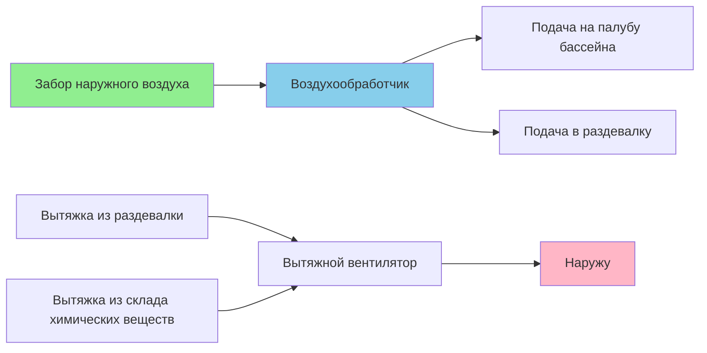
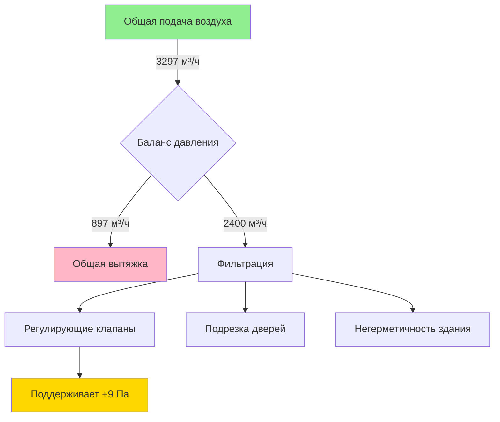

Требования к наружному воздуху для плавательных комплексов превышают показатели типичных коммерческих помещений из-за повышенного образования загрязняющих веществ из хлораминов, необходимости подачи приточного воздуха для уравновешивания вытяжных систем и требований создания избыточного давления для предотвращения миграции влаги. Эти требования вытекают из нескольких источников кодексов, которые регулируют здоровье жильцов, качество воздуха и защиту ограждающей конструкции здания.

## Минимальные расходы наружного воздуха, установленные кодексами

ASHRAE Standard 62.1 устанавливает базовые требования к наружному воздуху для плавательных комплексов через два компонента: расходы на единицу площади и расходы на основе численности. Общее требование к наружному воздуху определяется по формуле:

$$V_{ot} = R_p \times P_z + R_a \times A_z$$

Где:
- $V_{ot}$ = Общее требование к наружному воздуху (м³/ч)
- $R_p$ = Наружный воздух на одного человека (м³/ч на человека)
- $P_z$ = Численность людей в зоне
- $R_a$ = Наружный воздух на единицу площади (м³/ч на м²)
- $A_z$ = Площадь пола зоны (м²)

### Расходы ASHRAE 62.1 по типам помещений

| Классификация помещения | $R_a$ (м³/ч на м²) | $R_p$ (м³/ч на человека) | Плотность занятости (человек на 100 м²) |
|----------------------|-----------------|---------------------|-------------------------------------|
| Палуба бассейна (без зрителей) | 5.15 | 0.22 | 13 |
| Палуба бассейна с местами для зрителей | 5.15 | 0.22 | 150 (площадь мест) |
| Лечебный бассейн | 5.15 | 0.22 | 13 |
| СПА/гидромассажная ванна | 5.15 | 0.22 | 13 |

Компонент на основе площади ($R_a = 5.15$ м³/ч на м²) доминирует в плавательных комплексах. Для палубы бассейна площадью 465 м² с 20 пловцами:

$$V_{ot} = 0.22 \times 20 + 5.15 \times 465 = 4.4 + 2395 = 2399 \text{ м}^3\text{/ч}$$

Компонент площади обеспечивает 94% требования, что отражает, что испарение с поверхности и дегазация превышают загрязняющие вещества, образуемые жильцами.

## Требования Международного кодекса механических систем

Раздел 403.3.1 IMC устанавливает минимальные расходы наружного воздуха, но ссылается на ASHRAE 62.1 для конкретных значений. Раздел 403.3.1.1 IMC включает положения для управляемой вентиляции, но исключает плавательные комплексы из этого варианта из-за того, что источник загрязнения зависит от площади.

Раздел 403.4 IMC требует, чтобы забор наружного воздуха располагался так, чтобы избежать загрязнения, на расстоянии минимум 3 м от выпускных отверстий и источников опасности. Для плавательных комплексов это предотвращает рециркуляцию отработанного воздуха, насыщенного хлораминами.

## Требования к разбавлению хлораминов

Концентрация трихлорамина (NCl₃) определяет фактические потребности в наружном воздухе сверх минимальных требований кодекса. Трихлорамин испаряется с поверхности воды при взаимодействии хлора с соединениями азота, создавая характерный "запах хлора" и раздражение дыхательных путей.

Массовый баланс для разбавления загрязняющих веществ устанавливает требования к наружному воздуху:

$$V_{oa} = \frac{G}{C_s - C_{oa}}$$

Где:
- $V_{oa}$ = Требуемый расход наружного воздуха (м³/ч)
- $G$ = Скорость образования загрязняющего вещества (мг/ч)
- $C_s$ = Максимально допустимая концентрация в помещении (мг/м³)
- $C_{oa}$ = Концентрация загрязняющего вещества в наружном воздухе (мг/м³)

Для трихлорамина рекомендуемые концентрации в помещении варьируются от 0,2–0,5 мг/м³. Скорости образования зависят от нагрузки пловцов, химического состояния воды и температуры воды. Типичные скорости образования:

- Развлекательный бассейн: 5–15 мг/ч на одного пловца
- Спортивный бассейн: 15–25 мг/ч на одного пловца
- Лечебный/СПА бассейн: 20–40 мг/ч на одного пользователя

Развлекательный бассейн с 20 пловцами, образующими 10 мг/ч каждый, требует:

$$V_{oa} = \frac{20 \times 10}{(0.3 - 0.02)} = \frac{200}{0.28} = 714 \text{ м}^3\text{/ч}$$

Этот расчет предполагает концентрацию трихлорамина в наружном воздухе 0,02 мг/м³ и целевую концентрацию в помещении 0,3 мг/м³.

На практике площадь поверхности воды более надежно коррелирует с образованием хлораминов. Эмпирические рекомендации предполагают 3,2–5,4 м³/ч на м² поверхности воды в качестве минимума для приемлемого качества воздуха.

## Приточный воздух для вытяжных систем

Плавательные комплексы требуют вытяжной вентиляции для раздевалок, санузлов и складов химических веществ. HVAC система должна обеспечивать приточный воздух, равный полной вытяжке, чтобы предотвратить разрежение в здании.

Общий наружный воздух должен удовлетворять:

$$V_{oa,total} = \max(V_{oa,62.1}, V_{oa,разбавление}) + \sum V_{вытяжка}$$

Для объекта с:
- Требование ASHRAE 62.1: 2 400 м³/ч
- Вытяжка из раздевалки: 755 м³/ч
- Вытяжка из склада химических веществ: 142 м³/ч

$$V_{oa,total} = 2400 + 755 + 142 = 3297 \text{ м}^3\text{/ч}$$

## Стратегия создания избыточного давления

Поддержание небольшого избыточного давления (5–12 Па) в помещении бассейна предотвращает миграцию влаги в соседние помещения и полости строительной конструкции. Это требует подачи наружного воздуха, превышающей общую вытяжку на 5–10%.

### Расчет баланса давления

Для предыдущего примера с подачей наружного воздуха 3 297 м³/ч и вытяжкой 897 м³/ч:

$$V_{подача} = V_{oa,total} = 3297 \text{ м}^3\text{/ч}$$
$$V_{вытяжка} = 897 \text{ м}^3\text{/ч}$$
$$V_{избыток} = 3297 - 897 = 2400 \text{ м}^3\text{/ч}$$

Этот избыточный воздух вытекает через двери, регулирующие клапаны и негерметичность здания, создавая избыточное давление. Разность давлений связана с потоком через отверстия:

$$\Delta P = K \times Q^2$$

Где $K$ зависит от геометрии отверстия и площади. Для типичной конструкции плавательного комплекса с регулирующими клапанами избыточный поток 1 890–2 835 м³/ч создает избыточное давление 5–12 Па.

## Методология выбора

Определите требования к наружному воздуху в следующей последовательности:

1. **Рассчитайте минимум ASHRAE 62.1**, используя расходы по площади и численности
2. **Оцените потребности в разбавлении хлораминов** на основе площади поверхности воды (3,2–5,4 м³/ч на м²)
3. **Сложите все требования к вытяжке** из вспомогательных помещений
4. **Применить коэффициент создания избыточного давления** (на 5–10% дополнительную подачу)
5. **Выберите определяющее требование** (обычно компенсация вытяжки плюс создание избыточного давления)

Большинство плавательных комплексов требуют расходов наружного воздуха 5,4–8,1 м³/ч на м² площади палубы бассейна для одновременного соответствия минимумам кодекса, разбавлению загрязняющих веществ, компенсации вытяжки и созданию избыточного давления. Объекты с высокой интенсивностью использования и большой нагрузкой пловцов могут требовать расходов до 10,8 м³/ч на м² для адекватного контроля хлораминов.

Оборудование рекуперации энергии экономически обоснованно при таких высоких расходах наружного воздуха, при этом годовая экономия энергии компенсирует стоимость оборудования в течение 3–5 лет в большинстве климатических зон. Однако оборудование рекуперации должно сопротивляться коррозии от воздействия хлораминов и поддерживать разделение между потоками приточного и вытяжного воздуха для предотвращения перекрестного загрязнения.
