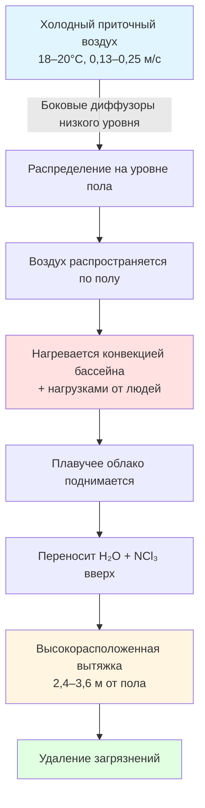

Эффективность вентиляции количественно оценивает, насколько эффективно наружный воздух удаляет загрязнители и обеспечивает свежий воздух в занимаемых зонах. В бассейнах, где доминируют влага, хлорамины и тепловая стратификация, понимание эффективности вентиляции отличает функциональные системы от неудачных конструкций.

## Коэффициент эффективности воздухообмена

Эффективность воздухообмена ($\varepsilon_a$) сравнивает фактическое удаление загрязнений с идеальными условиями поршневого потока:

$$\varepsilon_a = \frac{\tau_n}{\bar{\tau}} = \frac{C_e - C_s}{C_r - C_s}$$

Где:
- $\tau_n$ = номинальная постоянная времени (объём помещения / скорость вентиляции)
- $\bar{\tau}$ = средний возраст воздуха в занимаемой зоне
- $C_e$ = концентрация загрязнителя в вытяжном воздухе
- $C_s$ = концентрация загрязнителя в приточном воздухе
- $C_r$ = средняя концентрация загрязнителя в помещении

При идеальном смешивании вентиляции $\varepsilon_a = 1,0$. Вентиляция вытеснением в правильно спроектированных бассейнах достигает $\varepsilon_a = 1,2–1,4$, что указывает на превосходное удаление загрязнений. Значения ниже 0,9 указывают на короткое замыкание потока или мёртвые зоны.

## Производительность вентиляции вытеснением и смешиванием

| Стратегия вентиляции | Диапазон $\varepsilon_a$ | Дифференциал температуры приточного воздуха | Типичное применение | Удаление загрязнений |
|---------------------|---------------------|--------------------------------|-------------------|-------------------|
| Смешивание (верхний приток/вытяжка) | 0,85–1,05 | 8–14 °C ниже помещения | Стандартные бассейны | Среднее |
| Вытеснение (боковой приток низкой скорости) | 1,15–1,40 | 1–3 °C ниже помещения | Спортивные комплексы | Отличное |
| Стратифицированное (верхний приток, низкая вытяжка) | 0,60–0,85 | Переменное | Не рекомендуется | Плохое |
| Гибридное (вытеснение + верхнее смешивание) | 1,05–1,25 | 3–6 °C ниже помещения | Комбинированные бассейны/спа | Хорошее |

**Физика вентиляции вытеснением:**

Системы вытеснения используют стратификацию, вызванную плавучестью. Холодный приточный воздух ($\rho_{приток} > \rho_{помещение}$) поступает близ пола на низкой скорости (0,13–0,25 м/с), распространяется по полу и нагревается конвективными нагрузками от поверхности воды, людей и оборудования. Нагретый воздух поднимается, создавая стабильный тепловой градиент:

$$\frac{dT}{dz} = \frac{q}{kA}$$

Где:
- $dT/dz$ = вертикальный температурный градиент
- $q$ = конвективный тепловой поток от поверхности воды
- $k$ = эффективная теплопроводность воздушного слоя
- $A$ = площадь поверхности воды

Этот восходящий поток переносит влагу и хлорамины к высокорасположенным вытяжным решёткам. Нейтральная плоскость формируется на высоте примерно 1,8–2,4 м над полом бассейна в правильно спроектированных системах.

## Эффекты стратификации и тепловые градиенты

Бассейны естественно стратифицируются из-за большого восходящего сенсибельного теплового потока от поверхности бассейна (обычно 47–95 кВт/м²). Число Ричардсона количественно определяет стабильность стратификации:

$$Ri = \frac{g \beta \Delta T H}{U^2}$$

Где:
- $g$ = ускорение свободного падения (9,81 м/с²)
- $\beta$ = коэффициент теплового расширения (1/T абсолютная)
- $\Delta T$ = вертикальная разница температур
- $H$ = характеристическая высота (высота помещения)
- $U$ = скорость приточного воздуха

При $Ri > 1,0$ силы плавучести доминируют и стратификация стабильна. При $Ri < 0,1$ механическое смешивание доминирует. Бассейны с вентиляцией вытеснением обычно работают при $Ri = 2–5$, поддерживая контролируемую стратификацию, которая улучшает удаление загрязнений.

**Проблемная стратификация** возникает при:
1. Слишком низкой скорости приточного воздуха ($U < 0,1$ м/с), вызывающей чрезмерное $Ri$ и застойные слои
2. Слишком высокой температуре приточного воздуха, исключающей необходимый дифференциал плотности для распространения по полу
3. Слишком низком размещении вытяжки, приводящем к короткому замыканию плавучего облака

## Эффективность удаления загрязнений

Эффективность удаления загрязнений ($\varepsilon_c$) конкретно адресует извлечение загрязнителей:

$$\varepsilon_c = \frac{C_r - C_s}{C_b - C_s}$$

Где $C_b$ = концентрация загрязнителя в дыхательной зоне.

Для хлораминов (NCl₃) в бассейнах системы вытеснения достигают $\varepsilon_c = 1,3–1,6$ по сравнению с $\varepsilon_c = 0,9–1,1$ для систем смешивания. Это улучшение удаления загрязнений на 40–50% напрямую коррелирует с уменьшением жалоб пользователей и раздражением дыхательных путей.

Массовый баланс для стационарной концентрации хлорамина в дыхательной зоне:

$$C_b = C_s + \frac{G}{\varepsilon_c \cdot Q}$$

Где:
- $G$ = скорость образования хлорамина (кг/ч)
- $Q$ = скорость подачи наружного воздуха (м³/ч)

Это уравнение демонстрирует, что увеличение эффективности вентиляции ($\varepsilon_c$) снижает концентрацию в дыхательной зоне без увеличения воздушного потока, экономя энергию.

## Расчёты возраста воздуха и тестирование с использованием трассирующего газа

Средний возраст воздуха ($\bar{\tau}$) в точке представляет среднее время, прошедшее с момента поступления молекул воздуха в помещение. Локальный средний возраст воздуха рассчитывается из распада трассирующего газа:

$$\bar{\tau}(x,y,z) = \int_0^\infty \left(1 - \frac{C(t)}{C_0}\right) dt$$

Где:
- $C(t)$ = концентрация трассирующего газа в момент времени $t$
- $C_0$ = начальная концентрация трассера

**Протокол тестирования трассирующим газом для бассейнов:**

Мёртвые зоны существуют там, где $\bar{\tau} > 2\tau_n$. В бассейнах типичные мёртвые зоны включают:
- Углы с неадекватной циркуляцией воздуха
- Области под трамплинами или платформами
- Пространства позади крупного оборудования бассейна
- Ниши с бассейнами и спа

## CFD моделирование для оптимизации конструкции

Вычислительная гидродинамика (CFD) численно решает уравнения Навье–Стокса для предсказания схем воздушного потока, распределения температуры и переноса загрязнений:

**Сохранение массы:**
$$\frac{\partial \rho}{\partial t} + \nabla \cdot (\rho \mathbf{u}) = 0$$

**Сохранение импульса:**
$$\rho \frac{D\mathbf{u}}{Dt} = -\nabla p + \mu \nabla^2 \mathbf{u} + \rho \mathbf{g}$$

**Сохранение энергии:**
$$\rho c_p \frac{DT}{Dt} = k \nabla^2 T + \dot{q}$$

**Транспорт загрязнений:**
$$\frac{\partial C}{\partial t} + \mathbf{u} \cdot \nabla C = D \nabla^2 C + S$$

Где $S$ представляет образование хлорамина от поверхности бассейна.

| Параметр CFD анализа | Типичное разрешение сетки | Граничное условие | Выходная метрика |
|------------------------|------------------------|-------------------|---------------|
| Поле скорости | 0,3–0,9 м ячейки | Приток: inlet velocity Вытяжка: pressure outlet | Линии тока, величина скорости |
| Распределение температуры | 0,3–0,6 м ячейки | Поверхность бассейна: 28–29°C Стены: измеренные значения | Вертикальный градиент, $dT/dz$ |
| Концентрация хлорамина | 0,6–1,2 м ячейки | Поверхность бассейна: скорость образования Приток: нулевая концентрация | $\varepsilon_c$, уровни в дыхательной зоне |
| Средний возраст воздуха | 0,6–1,2 м ячейки | Приток: нулевой возраст Стены: нулевой поток | Распределение $\bar{\tau}$, мёртвые зоны |

CFD моделирование выявляет проблемы до строительства:
- Предсказывает скорость воздуха на уровне головы пловца (целевое значение < 0,25 м/с для предотвращения сквозняка)
- Определяет расположение плоскостей тепловой стратификации
- Оптимизирует размещение диффузоров для максимального $\varepsilon_a$
- Количественно определяет уровни хлорамина в зонах для зрителей

## Сводка метрик эффективности вентиляции

| Метрика | Символ | Идеальное значение | Целевой показатель для бассейна | Метод измерения |
|--------|--------|-------------|-------------------|-------------------|
| Эффективность воздухообмена | $\varepsilon_a$ | 1,0 (идеальное смешивание) | 1,15–1,35 | Распад трассера |
| Эффективность удаления загрязнений | $\varepsilon_c$ | > 1,0 | 1,20–1,50 | Стационарная концентрация |
| Индекс эффективности вентиляции | VEI | 1,0 | 1,10–1,30 | Комбинированное измерение |
| Эффективность воздухообмена | $\varepsilon_{AE}$ | 50% | 55–65% | Распределение возраста воздуха |

**Практическое руководство по проектированию:**

Для достижения высокой эффективности вентиляции в бассейнах:

1. **Подача приточного воздуха:** используйте диффузоры вытеснения низкой скорости (0,13–0,25 м/с скорость на выходе), расположенные на высоте 30–60 см над полом на боковых стенах перпендикулярно длинной оси бассейна

2. **Температура приточного воздуха:** поддерживайте на 1–3 °C ниже установленной температуры пола бассейна для обеспечения распространения по полу без чрезмерного неудобства от температурного градиента

3. **Расположение вытяжки:** разместите вытяжные решётки на высоте 2,4–3,6 м над чистовым полом, распределённые по периметру бассейна для захвата поднимающихся облаков влаги и хлорамина

4. **Скорость воздухообмена:** спроектируйте минимум 6 воздухообменов в час на основе площади поверхности воды и численности, но проверьте расчётами образования загрязнителей

5. **Валидация:** выполните комиссионирование систем с использованием тестирования трассирующим газом для подтверждения $\varepsilon_a \geq 1,1$ в занимаемых зонах перед окончательной приёмкой

Эффективность вентиляции преобразует скорость вентиляции из простой метрики объёмного обмена в оценку производительности на основе контроля загрязнений, напрямую улучшая качество воздуха в помещении при одновременной возможности снижения потребления энергии за счёт более эффективного удаления загрязнений.
