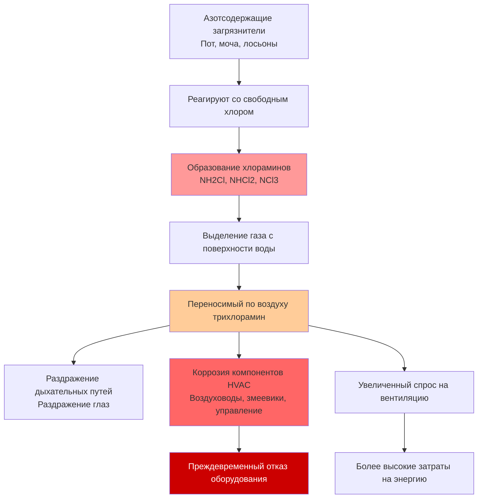

Химия воды в бассейне напрямую определяет производительность системы HVAC, долговечность и качество воздуха в нататориях. Взаимодействие между дезинфектантами, уровнем pH и температурой создает коррозионные переносимые по воздуху соединения, требующие специализированной вентиляции и выбора материалов.

## Образование хлораминов и выделение газов

Когда дезинфектанты на основе хлора реагируют с азотсодержащими загрязнителями (пот, моча, косметика), они образуют хлорамины посредством последовательных реакций замещения:

$$NH_3 + HOCl \rightarrow NH_2Cl + H_2O \quad \text{(монохлорамин)}$$

$$NH_2Cl + HOCl \rightarrow NHCl_2 + H_2O \quad \text{(дихлорамин)}$$

$$NHCl_2 + HOCl \rightarrow NCl_3 + H_2O \quad \text{(трихлорамин)}$$

Трихлорамин ($NCl_3$) является основной проблемой для систем HVAC. Это летучее соединение имеет давление паров примерно в 100 раз выше, чем у воды при типичных температурах бассейна, что вызывает его легкий переход с поверхности воды в воздушное пространство. Скорость выделения газа подчиняется закону Генри и экспоненциально возрастает с повышением температуры воды и перемешиванием.

## Стандарты качества воздуха ASHRAE

Стандарт ASHRAE 62.1 устанавливает требования к качеству воздуха для нататориев, хотя конкретные пределы трихлорамина не установлены законодательно в Соединенных Штатах. Лучшая практика отрасли, основанная на европейских стандартах и медицинских исследованиях, предусматривает максимальные концентрации трихлорамина 0,5 мг/м³, с предпочтительными уровнями ниже 0,2 мг/м³.

Для достижения этих целей ASHRAE рекомендует минимальные скорости вентиляции:

- **Площади палубы:** 0,48 CFM/м² (минимум 6 воздухообменов в час)
- **Поверхность воды бассейна:** 0,06 CFM/м² дополнительного наружного воздуха

Эти скорости предполагают надлежащее управление химией воды. Плохая химия воды может требовать скорости вентиляции в 2-3 раза выше для поддержания приемлемого качества воздуха.

## Влияние pH на коррозию и выделение газов

pH воды влияет как на скорость образования хлораминов, так и на потенциал коррозии HVAC двумя механизмами:

**Образование хлораминов:** Более низкий pH (6,5-7,0) способствует образованию трихлорамина над моно- и дихлораминами, увеличивая скорость выделения газа на 40-60% по сравнению с pH 7,4-7,6.

**Ускорение коррозии:** Одновременное присутствие ионов хлорида и кислых условий (из продуктов гидролиза $NCl_3$ и $HCl$) создает агрессивную коррозию на металлических поверхностях:

$$NCl_3 + 3H_2O \rightarrow NH_3 + 3HOCl$$

$$HOCl \rightarrow H^+ + OCl^-$$

Эта реакция производит соляную кислоту в конденсате, снижая pH поверхности до 2-4 на охлаждающих змеевиках и воздуховодах. Оцинкованная сталь испытывает скорость коррозии в 8-12 раз выше при этих условиях по сравнению с нейтральной средой.

## Сравнение методов дезинфекции

| Метод дезинфекции | Первичное химическое вещество | Образование хлораминов | Риск коррозии HVAC | Влияние на вентиляцию | Требования к материалам |
|---------------------|-----------------|----------------------|---------------------|--------------------|-----------------------|
| **Хлорный газ** | $Cl_2$ | Высокое (при плохом контроле) | Очень высокое | 1,0× исходное | 316 SS, специальные покрытия |
| **Гипохлорит натрия** | $NaOCl$ | Высокое (при плохом контроле) | Высокое | 1,0× исходное | 316 SS, эпоксидное покрытие |
| **Кал-гипо** | $Ca(OCl)_2$ | Высокое (при плохом контроле) | Высокое | 1,0× исходное | 316 SS, эпоксидное покрытие |
| **Хлорирование морской воды** | $HOCl$ (генерируется) | Умеренное-высокое | Очень высокое (хлориды) | 0,9-1,1× исходное | 316 SS требуется, титан предпочтителен |
| **УФ + хлор** | $HOCl$ (сниженный) | Низко-умеренное | Умеренное | 0,5-0,7× исходное | 304 SS приемлем, эпоксид рекомендуется |
| **Озон + хлор** | $O_3$ + $HOCl$ (сниженный) | Низкое | Низко-умеренное | 0,4-0,6× исходное | Озоностойкие материалы, 304 SS |
| **Бром** | $HOBr$ | Очень низкое (бромамины менее летучи) | Умеренное | 0,6-0,8× исходное | Аналогично системам с хлором |

**Примечания:**
- Исходная вентиляция = минимальные скорости ASHRAE 62.1
- Все гибридные системы (УФ, озон) поддерживают остаточный галогеновый дезинфектант
- Спецификации материалов: 316 SS = нержавеющая сталь тип 316; 304 SS = нержавеющая сталь тип 304

## Требования к вентиляции на основе химии воды

Взаимосвязь между управлением химией воды и требуемой вентиляцией следует эмпирическим корреляциям, полученным из измеренных концентраций трихлорамина:

$$\text{Требуемый НВ} = \text{НВ}_{\text{исходный}} \times \left(1 + 2,5 \times \frac{[\text{Связанный Cl}]}{[\text{Свободный Cl}]}\right)$$

Где:
- $\text{НВ}_{\text{исходный}}$ = минимальная скорость наружного воздуха ASHRAE
- $[\text{Связанный Cl}]$ = концентрация связанного хлора (мг/л)
- $[\text{Свободный Cl}]$ = концентрация свободного хлора (мг/л)

Хорошо обслуживаемые бассейны поддерживают связанный хлор ниже 0,2 мг/л со свободным хлором 1-3 мг/л, получая коэффициент ниже 0,1 и минимальное увеличение вентиляции. Плохо обслуживаемые бассейны с коэффициентами более 0,5 требуют вентиляции в 2,25× исходного уровня для достижения эквивалентного качества воздуха.

## Последствия для проектирования HVAC

**Выбор материалов:**
- Змеевики: нержавеющая сталь тип 316, медно-никелевые сплавы (70/30) или эпоксидное покрытие алюминия
- Воздуховоды: нержавеющая сталь тип 316, армированный стекловолокном пластик (FRP) или ПВХ-покрытая оцинкованная сталь
- Крепежные элементы: исключительно нержавеющая сталь тип 316
- Управление: корпуса NEMA 4X с конформным покрытием на платах управления

**Конфигурация системы:**
- Системы выделенного наружного воздуха (DOAS) отделены от рециркуляции для предотвращения перекрестного загрязнения
- Минимум 60% доля наружного воздуха для разбавления хлораминов
- Скорость потока через охлаждающий змеевик ограничена 2,0-2,3 м/с для минимизации увлечения конденсата
- Поддоны с непрерывным уклоном (минимум 3,2 мм на 0,3 м) и запечатанные стоки

**Емкость осушения:**
- Учитывайте повышенные скорости испарения из-за химии воды, вызывающей снижение поверхностного натяжения
- Выбирайте по 125-150% рассчитанной скорости испарения, когда связанный хлор превышает 0,3 мг/л

**Рекуперация энергии:**
- Избегайте гигроскопических ротационных теплообменников (загрязнение и коррозия)
- Используйте пластинчатые теплообменники с коррозионностойкими материалами
- Проектируйте для удобного доступа и периодической промывки поверхностей

Надлежащее управление химией воды снижает затраты на оборудование HVAC на 30-40% посредством снижения требований к материалам и продлевает срок службы оборудования с 8-12 лет до 15-20 лет. Энергетический штраф в операции для плохой химии воды составляет 15-35% из-за повышенных требований к вентиляции и снижения эффективности теплообменника из-за коррозии.
