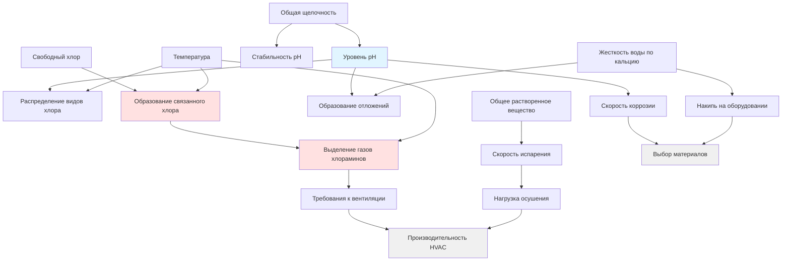

## Обзор

Химия воды в бассейне напрямую влияет на производительность системы HVAC, выбор материалов и требования к эксплуатации объектов наторториумов. Химические параметры определяют скорость образования хлораминов, коррозионный потенциал окружающей среды и требуемые расходы вентиляции. Понимание этих взаимосвязей необходимо для проектирования систем HVAC, которые поддерживают качество воздуха при воздействии суровой химической среды.

## Химия хлора и влияние на HVAC

### Свободный хлор и связанный хлор

Свободный хлор существует в равновесии между гипохлорной кислотой (HOCl) и гипохлоритным ионом (OCl⁻), регулируемым pH:

$$\ce{HOCl <=> H+ + OCl-}$$

Константа диссоциации составляет:

$$K_a = \frac{[\ce{H+}][\ce{OCl-}]}{[\ce{HOCl}]} = 3.0 \times 10^{-8} \text{ при } 25°\text{C}$$

Когда свободный хлор реагирует с содержащими азот соединениями от посетителей (мочевина, пот, косметика), образуется связанный хлор:

$$\ce{HOCl + NH3 -> NH2Cl + H2O}$$ (монохлорамин)

$$\ce{NH2Cl + HOCl -> NHCl2 + H2O}$$ (дихлорамин)

$$\ce{NHCl2 + HOCl -> NCl3 + H2O}$$ (трихлорамин)

Дихлорамин и трихлорамин летучи и выделяются в воздушное пространство, создавая характерный запах бассейна и увеличивая требуемый расход наружного воздуха для вентиляции. Более высокие концентрации связанного хлора увеличивают скорость выделения газов и требуют повышенной вентиляции наружным воздухом.

### Влияние pH на проектирование системы

Уровень pH влияет как на распределение видов хлора, так и на скорость коррозии материалов. Уравнение Гендерсона-Хассельбаха описывает равновесие хлора:

$$\text{pH} = \text{pK}_a + \log\left(\frac{[\ce{OCl-}]}{[\ce{HOCl}]}\right)$$

Где pK_a = 7,52 при 25°C. При pH 7,5 примерно 50% свободного хлора существует в виде HOCl (более эффективного дезинфицирующего средства). Более низкий pH увеличивает процент HOCl, но также увеличивает коррозионный потенциал компонентов HVAC. Более высокий pH снижает эффективность дезинфекции, что может потребовать более высоких уровней общего хлора и увеличивает образование хлораминов.

## Критические параметры химии

## Диапазоны параметров и последствия для HVAC

| Параметр | Допустимый диапазон | Влияние на HVAC | Стратегия контроля |
|-----------|------------------|-------------|------------------|
| **pH** | 7,2 - 7,8 | Коррозия увеличивается ниже 7,0; образование отложений выше 8,0 | Указать материалы, устойчивые к коррозии; системы мониторинга |
| **Свободный хлор** | 1,0 - 3,0 мг/л | Более высокие уровни увеличивают потенциал образования хлораминов | Адекватная вентиляция для ожидаемых нагрузок |
| **Связанный хлор** | < 0,2 мг/л | Выше 0,4 мг/л значительно увеличивает выделение газов | Проектировать для минимум 0,5 м³/ч на м² при повышенных уровнях |
| **Общая щелочность** | 80 - 120 мг/л | Низкая щелочность вызывает нестабильность pH и коррозию | Емкость буфера pH влияет на долговечность материалов |
| **Жесткость воды по кальцию** | 200 - 400 мг/л | Ниже 150 мг/л увеличивает коррозию; выше 500 мг/л вызывает образование отложений | Выбор материалов теплообменника и спирали |
| **Общее растворенное вещество (TDS)** | < 1500 мг/л | Более высокий TDS увеличивает скорость испарения и коррозионный потенциал | Влияет на требования к производительности осушения |
| **Циануровая кислота** | 30 - 50 мг/л (открытые бассейны) | Не рекомендуется для внутренних бассейнов; снижает эффективность хлора | Избегать в наторториумах для минимизации образования хлораминов |
| **Окислительно-восстановительный потенциал (ORP)** | 650 - 750 мВ | Указывает эффективность дезинфицирующего средства; низкий ORP требует более высокого хлора | Мониторить для проверки химического контроля |

## Соображения проектирования

### Совместимость материалов

Коррозионная среда, создаваемая видами хлора, низким pH и повышенной влажностью, требует тщательного выбора материалов:

- **Воздуховоды**: нержавеющая сталь 316L, пластик, армированный стекловолокном (FRP), или ПВХ-покрытая оцинкованная сталь
- **Спирали**: медно-никелевый сплав с покрытием, полимер-покрытый алюминий или титан для экстремальных условий
- **Крепежи**: нержавеющая сталь марки 316 минимум; избегать оцинкованного крепежа
- **Изоляция**: пена с закрытыми порами, устойчивая к деградации хлором

### Щелочность и емкость буфера pH

Общая щелочность обеспечивает буферную емкость pH. Недостаточная щелочность (ниже 80 мг/л) приводит к нестабильности pH, вызывая быстрые колебания, которые ускоряют коррозию компонентов HVAC. Взаимосвязь:

$$\text{Буферная емкость} \propto [\ce{HCO3-}] + 2[\ce{CO3^2-}]$$

Низкая буферная емкость требует более частых химических корректировок, потенциально подвергая материалы HVAC переходным коррозионным условиям во время коррекции pH.

### Жесткость воды по кальцию и образование отложений

Индекс насыщения Лангелье (LSI) предсказывает тенденцию к образованию отложений или коррозии:

$$\text{LSI} = \text{pH} - \text{pH}_s$$

Где pH_s - это pH насыщения. Положительный LSI указывает на тенденцию к образованию отложений; отрицательный LSI указывает на тенденцию к коррозии. Для проектирования HVAC:

- LSI между -0,3 и +0,3 является идеальным
- Отрицательный LSI ускоряет коррозию теплообменников и спиралей
- Положительный LSI вызывает накопление отложений, снижая эффективность теплопередачи

### Влияние TDS на испарение

Более высокий TDS снижает давление паров воды, слегка снижая скорость испарения. Однако повышенный TDS обычно указывает на плохое качество воды с более высоким потенциалом образования хлораминов. Модифицированное уравнение испарения, учитывающее TDS:

$$E = A \times (P_{w,adj} - P_a) \times F$$

Где $P_{w,adj}$ - это скорректированное давление паров воды, учитывающее растворенные вещества.

## Рекомендации ASHRAE

В главе 6 "Места собрания" справочника приложений ASHRAE рекомендуется поддерживать связанный хлор ниже 0,4 мг/л для минимизации проблем с качеством воздуха. Когда связанный хлор превышает этот порог, увеличьте вентиляцию наружным воздухом с базовой точки 0,48 м³/ч на м² до 0,5-0,6 м³/ч на м² или выше на основе фактических измерений.

Стандарт подчеркивает координацию между операторами бассейна и специалистами HVAC для поддержания химии воды в приемлемых диапазонах, так как химические отклонения напрямую влияют на качество воздуха и долговечность системы.

## Интеграция эксплуатации

Эффективное проектирование HVAC наторториума учитывает неизбежные вариации параметров химии:

1. **Мониторинг**: Установить датчики непрерывного мониторинга pH и ORP с трендовым анализом данных для выявления паттернов, влияющих на качество воздуха
2. **Резервирование**: Указать материалы, способные выдерживать кратковременные отклонения за пределы нормальных диапазонов
3. **Доступ для обслуживания**: Обеспечить доступные места для проверки компонентов, подверженных коррозии
4. **Документирование**: Установить журналы химии воды, коррелированные с записями техническое обслуживания HVAC для выявления паттернов химического воздействия

Взаимозависимость между химией воды и производительностью HVAC требует постоянной координации между командами обслуживания бассейна и управления объектами для оптимизации как качества воды, так и долговечности системы.
