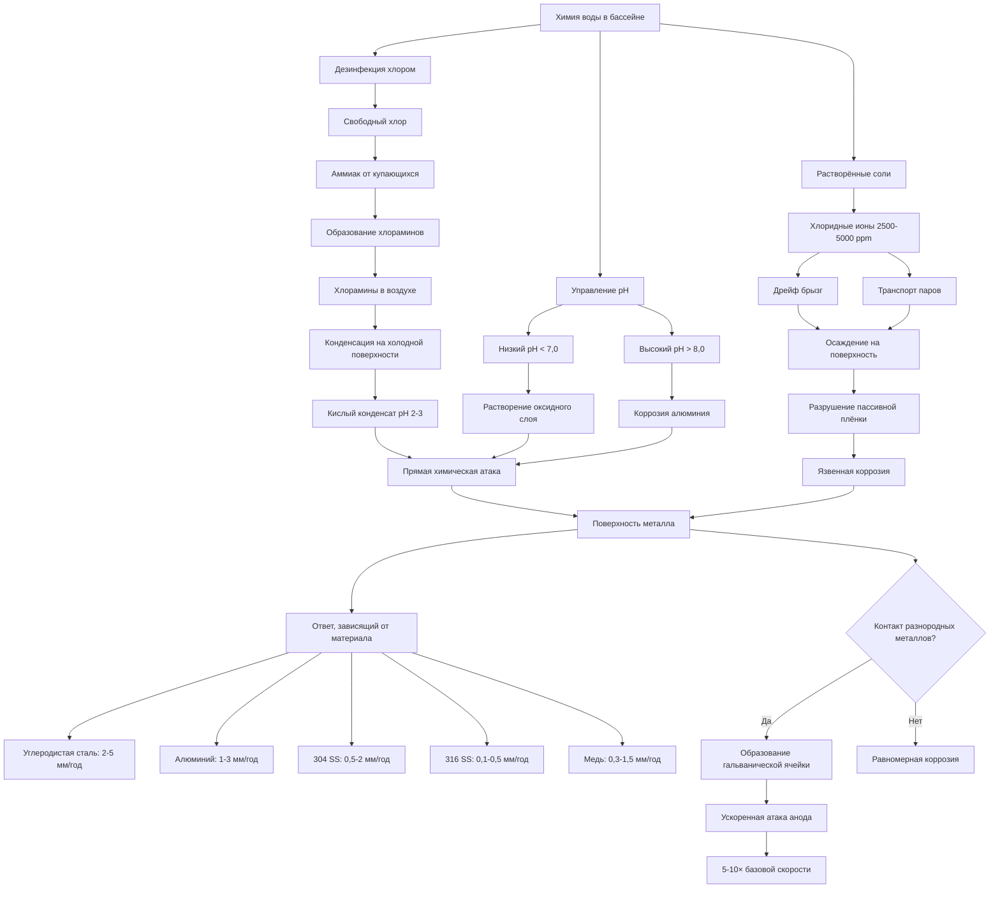

Химия воды в бассейне создает одну из наиболее коррозионных сред для оборудования HVAC. Комбинация хлорированных соединений, растворённых солей, температуры и влажности производит электрохимические и химические механизмы атаки, которые на порядок превышают условия типичных коммерческих зданий. Понимание этих путей коррозии необходимо для надлежащего выбора материалов и долговечности системы.

## Механизмы атаки хлораминов

Хлорамины образуются, когда свободный хлор реагирует с азотистыми соединениями из нагрузки купающихся. Эти летучие соединения испаряются в воздушный поток и вызывают агрессивную коррозию:

$$\ce{NH3 + HOCl -> NH2Cl + H2O}$$

Образование монохлорамина из аммиака и гипохлорной кислоты.

$$\ce{NH2Cl + HOCl -> NHCl2 + H2O}$$

Образование дихлорамина, который обладает высокой летучестью и коррозионной активностью.

Концентрации трихлорамина (NCl₃) выше 0,2 мг/м³ указывают на плохую вентиляцию и агрессивные условия коррозии. Эти соединения осаждаются на холодных металлических поверхностях в приточных установках, образуя кислый конденсат с значениями pH всего 2-3. Скорость коррозии растёт экспоненциально с концентрацией хлоразидов:

$$CR_{Cl} = k \cdot C_{NCl_3}^{1.5} \cdot e^{-E_a/RT}$$

Где:
- $CR_{Cl}$ = скорость коррозии (мм/год)
- $k$ = специфичная для материала константа
- $C_{NCl_3}$ = концентрация трихлорамина (мг/м³)
- $E_a$ = энергия активации (кДж/моль)
- $R$ = газовая константа (8,314 Дж/моль·К)
- $T$ = температура (К)

## Эффекты хлоридных ионов

Вода в бассейне содержит 2500-5000 ppm хлорида в системах на основе соли, в сравнении с <100 ppm в типичной питьевой воде. Хлоридные ионы проникают через пассивные оксидные слои на металлах и инициируют язвенную коррозию:

$$\text{Инициирование язвы: } \ce{Cl^- + Fe^{2+} -> FeCl2}$$

Потенциал критической язвы снижается с концентрацией хлорида:

$$E_{pit} = E_0 - \beta \log(C_{Cl^-})$$

Где $E_{pit}$ — потенциал язвы (мВ), $E_0$ — базовый потенциал, $\beta$ — материальная константа (обычно 150-300 мВ/декаду), и $C_{Cl^-}$ — концентрация хлорида (ppm).

Дрейф брызг и конденсат переносят эти хлориды по механическому пространству, атакуя оборудование далеко от самого бассейна.

## Влияние pH на коррозию

pH воды в бассейне напрямую влияет на скорость коррозии посредством множественных механизмов:

**Условия низкого pH (< 7,0):**
- Увеличивает коррозию за счёт выделения водорода
- Растворяет защитные оксидные слои
- Ускоряет активность гальванических ячеек
- Скорость коррозии удваивается при каждом снижении pH на 1,0 единицу ниже 7,0

**Условия высокого pH (> 8,0):**
- Способствует образованию масштаба карбоната кальция
- Защищает сталь, но атакует алюминий
- Повышает восприимчивость к коррозии под напряжением
- Скорость коррозии алюминия экспоненциально возрастает выше pH 8,5

Зависящая от pH скорость коррозии следует:

$$CR_{pH} = CR_0 \cdot 10^{|pH_{actual} - pH_{neutral}|/\alpha}$$

Где $\alpha$ — коэффициент, зависящий от материала (обычно 1,5-3,0 для обычных сплавов).

## Пути гальванической коррозии

Контакт разнородных металлов во влажной среде, богатой хлоридами, вызывает гальваническую коррозию. Разность потенциалов между металлами определяет поток тока:

$$i_{galv} = \frac{E_{cathode} - E_{anode}}{R_{total}}$$

Типичные гальванические пары в бассейнах включают медь/сталь, нержавеющую сталь/углеродистую сталь и алюминий/стальные соединения. Плотность тока коррозии на аноде возрастает с соотношением площадей:

$$i_{anode} = i_{galv} \cdot \frac{A_{cathode}}{A_{anode}}$$

Небольшие аноды, соединённые с большими катодами, испытывают ускоренные темпы атаки, превышающие 5-10 мм/год.

## Пути коррозии в системе HVAC бассейна

## Устойчивость материалов к коррозии в средах бассейнов

| Материал | Скорость коррозии (мм/год) | Рейтинг устойчивости | Критические режимы отказа | Рекомендуемые применения |
|----------|------------------------|-------------------|------------------------|--------------------------|
| Углеродистая сталь (без покрытия) | 2,0-5,0 | Плохо | Равномерная коррозия, ржавые пятна | Не рекомендуется |
| Углеродистая сталь (эпоксидное покрытие) | 0,2-0,5 | Хорошо | Отслаивание покрытия, язвы | Воздуховоды, конструкции |
| Оцинкованная сталь | 0,5-1,5 | Удовлетворительно | Истощение цинка, красная ржавчина | Ограниченно, вдали от бассейна |
| Алюминий 3003 | 1,0-3,0 | Удовлетворительно | Язвенная коррозия, щелевая коррозия | Избегать в зонах бассейна |
| Алюминий 6061 | 0,8-2,0 | Удовлетворительно-Хорошо | Язвы в сварных швах | Жалюзи при наличии покрытия |
| Медь | 0,3-1,5 | Хорошо | Расслаивание цинка (латунь), язвы | Теплообменники (медь-никель) |
| 304 Нержавеющая сталь | 0,5-2,0 | Удовлетворительно | Щелевая коррозия, язвы | Ограниченное внутреннее использование |
| 316 Нержавеющая сталь | 0,1-0,5 | Отлично | Редкая щелевая коррозия | Компоненты AHU, крепежи |
| 6% молибденовая SS (AL-6XN) | <0,05 | Отлично | Минимальная при надлежащих условиях | Критические компоненты |
| Титан | <0,01 | Отлично | Редкое поглощение водорода | Теплообменники, премиум |
| PVC/CPVC | Пренебрежимо | Отлично | Деградация УФ, ползучесть | Воздуховоды, трубопроводы |
| FRP (стеклопластик) | Пренебрежимо | Отлично | Деградация смолы, расслаивание | Воздуховоды, кожухи |

**Примечания:**
- Скорости коррозии предполагают температуру воздуха 26-29°C, относительную влажность 60-70%, концентрацию трихлорамина 0,3-0,5 мг/м³
- Фактические скорости варьируются в зависимости от концентрации хлорамина, воздействия хлорида и pH
- Щелевая и язвенная коррозия могут проникнуть быстрее, чем предполагают равномерные скорости

## Рекомендации по выбору материалов

В ASHRAE Handbook - HVAC Applications (Глава 6: Бассейны) указаны минимальные стандарты материалов:

1. **Приточные установки:** Конструкция из нержавеющей стали 316 или алюминий с тяжёлым эпоксидным покрытием
2. **Воздуховоды:** FRP, PVC или горячеоцинкованная сталь с фенольным или эпоксидным покрытием
3. **Теплообменники:** Медь-никель (90/10 или 70/30), титан или полимер-покрытые
4. **Крепежи:** Минимум нержавеющая сталь 316, избегайте контакта разнородных металлов
5. **Управление и приборостроение:** Рейтинг NEMA 4X, конформные покрытия электроники

Защитные меры включают:
- Физическую изоляцию разнородных металлов с прокладками
- Жертвенные аноды, где гальванические пары неизбежны
- Тяжёлые эпоксидные или полиуретановые покрытия (минимум 200-250 мкм толщины сухого слоя)
- Регулярное техническое обслуживание и переоборудование на цикле 2-3 года

## Соображения проектирования

Минимизируйте коррозию посредством проектирования системы:

- Поддерживайте трихлорамин ниже 0,2 мг/м³ посредством адекватной вентиляции (минимум 6-8 ВОЗ)
- Держите точку росы оборудования выше температуры поверхности металла, чтобы предотвратить конденсацию
- Изолируйте AHU от помещения бассейна в отдельное механическое пространство, если возможно
- Указывайте материалы на один класс выше рассчитанного минимума для коэффициента безопасности
- Избегайте резьбовых соединений, где инициируется щелевая коррозия

Управление химией воды в бассейне остаётся первичной защитой: поддержание pH 7,2-7,8, свободного хлора 1-3 ppm и минимизация образования связанного хлора посредством надлежащего окисления снижает количество воздушных коррозионных видов в источнике.

## Ссылки

**Стандарты ASHRAE:**
- ASHRAE Handbook - HVAC Applications, Глава 6: Бассейны
- ASHRAE Standard 62.1: Вентиляция для приемлемого качества внутреннего воздуха

**Руководства отрасли:**
- NACE International SP0487: "Рассмотрение микробиологической коррозии в деаэраторах и резервуарах хранения"
- ASTM G48: "Стандартные методы испытаний устойчивости к язвенной и щелевой коррозии нержавеющих сталей"
- ASTM G78: "Стандартное руководство по испытанию щелевой коррозии железных и никелевых нержавеющих сплавов"

**Технические справочники:**
- Pourbaix, M. "Atlas of Electrochemical Equilibria in Aqueous Solutions" (NACE, 1974)
- Fontana, M.G. "Corrosion Engineering" (McGraw-Hill, 3-е издание)
