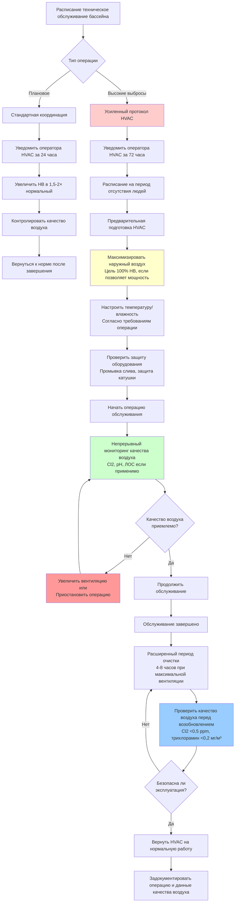

Операции технического обслуживания бассейна генерируют экстремальные условия выделения химических веществ, которые превышают нормальные параметры конструкции HVAC. Координирование этих операций с корректировками HVAC защищает оборудование от коррозионного повреждения, поддерживает приемлемое качество воздуха в помещении и обеспечивает безопасность занимающихся во время событий с высоким уровнем выбросов.

## Суперхлорирование и шоковая обработка

Суперхлорирование повышает уровень свободного хлора в 10-20 раз выше нормальных концентраций (10-30 ppm), чтобы окислить накопленные хлорамины и органические загрязнители. Этот процесс создает временные условия, при которых выделение хлора и испарение остаточных хлораминов резко увеличивают концентрацию раздражающих веществ в воздухе.

### Выделение газов во время шоковой обработки

Скорость передачи хлора и хлорамина в воздушное пространство во время суперхлорирования следует принципам массопередачи, при этом поток увеличивается пропорционально градиенту концентрации:

$$\dot{m} = k_L \cdot A \cdot (C_{\text{water}} - C_{\text{air}}/H)$$

Где:
- $\dot{m}$ = Скорость массопередачи хлорных соединений (кг/ч)
- $k_L$ = Коэффициент массопередачи (м/ч), обычно 0,09-0,24 для неподвижных бассейнов
- $A$ = Площадь поверхности воды (м²)
- $C_{\text{water}}$ = Концентрация хлора в воде (ppm)
- $C_{\text{air}}$ = Концентрация хлора в воздухе (ppm)
- $H$ = Константа закона Генри (безразмерная), ~0,09 для $HOCl$ при 26,7°C

Во время шоковой обработки с $C_{\text{water}} = 20$ ppm движущая сила увеличивается в 10-15 раз по сравнению с нормальной работой (1,5-2 ppm), требуя пропорционального увеличения вентиляции для поддержания приемлемых концентраций в воздухе ниже 1 ppm.

### Требуемые корректировки вентиляции

Системы HVAC должны увеличить подачу наружного воздуха для разбавления повышенных скоростей выделения газов. Требуемая скорость вентиляции во время суперхлорирования составляет:

$$Q_{\text{shock}} = Q_{\text{normal}} \times \left(3 + 1.5 \times \frac{C_{\text{shock}}}{C_{\text{normal}}}\right)$$

Где:
- $Q_{\text{shock}}$ = Требуемый наружный воздух во время шоковой обработки (CFM)
- $Q_{\text{normal}}$ = Нормальная скорость наружного воздуха согласно ASHRAE 62.1 (CFM)
- $C_{\text{shock}}$ = Концентрация хлора при шоковой обработке (ppm)
- $C_{\text{normal}}$ = Нормальная концентрация свободного хлора (ppm), обычно 2 ppm

**Пример расчета:**

Для бассейна площадью 185,8 м² с требуемой базовой вентиляцией 272 CFM (8,1 CFM/м² площади палубы + 1,02 CFM/м² поверхности воды) во время шоковой обработки до 20 ppm:

$$Q_{\text{shock}} = 272 \times \left(3 + 1.5 \times \frac{20}{2}\right) = 272 \times 18 = 4,896 \text{ CFM}$$

Это представляет собой 18-кратное увеличение наружного воздуха, что превышает мощность большинства систем HVAC натториума. Поэтому шоковая обработка обычно проводится в период отсутствия людей с максимальной вентиляцией и расширенными периодами очистки перед возобновлением работы.

## Корректировки HVAC во время технического обслуживания бассейна

| Операция техническое обслуживания | Продолжительность | Требование наружного воздуха | Рециркуляция | Уставка температуры | Контроль влажности | Защита оборудования |
|---------------------|----------|------------------------|---------------|---------------------|------------------|---------------------|
| **Суперхлорирование (10-20 ppm)** | 8-24 часа | 15-20× нормальный, 100% НВ если возможно | Минимизировать или исключить | Поддерживать 25,6-27,8°C | Поддерживать осушение | Контролировать pH катушки, увеличить промывку слива |
| **Хлорирование до точки излома (5-10× комбинированный Cl)** | 4-12 часов | 10-15× нормальный | 50% максимум | Поддерживать 25,6-27,8°C | Нормальная работа | Проверить сливы на наличие отложений |
| **Кислотная промывка (pH 1-2)** | 2-6 часов | 8-12× нормальный, требуется 100% НВ | Изолировать область бассейна, если возможно | Нормальная | Снизить или остановить осушение | Отключить, если пары кислоты достигают воздухообработчика |
| **Добавление соляной кислоты (коррекция pH)** | 1-2 часа | 3-5× нормальный | Поддерживать | Нормальная | Нормальная | Контролировать pH конденсата |
| **Слив и заполнение** | 1-3 дня | Нормальный (бассейн накрыт) | Нормальный | Снизить до 21,1-23,9°C | Минимальное осушение | Убедиться, что тройники слива остаются заполненными |
| **Восстановление поверхности (эпоксидная/штукатурная)** | 3-14 дней | 6-10× нормальный во время отверждения | 100% НВ, без рециркуляции | Поддерживать 21,1-23,9°C согласно спецификации покрытия | Контролировать согласно требованиям покрытия | Изолировать впуск АГП при обнаружении ЛОС |
| **Обратная промывка фильтра** | 15-30 минут | Нормальный + 20% | Нормальный | Нормальная | Нормальная | Не требуется |
| **Чистка плиток (на основе кислоты)** | 2-4 часа | 5-8× нормальный | Поддерживать | Нормальная | Нормальная | Контролировать качество воздуха возле возвратов |

**Примечания:**
- Все скорости наружного воздуха предполагают надлежащее разбавление для поддержания паров хлора/кислоты <1 ppm
- Корректировки температуры и влажности зависят от спецификаций производителя покрытия во время восстановления
- Меры защиты оборудования должны быть реализованы за 30 минут до начала обслуживания

## Рабочий процесс координации обслуживания

## Рассмотрения кислотной промывки

Кислотная промывка использует соляную кислоту (хлористоводородную кислоту, концентрация 15-30%) для удаления минеральных отложений, пятен и водорослей с поверхностей бассейна. Этот процесс генерирует пары $HCl$, которые создают серьезные риски коррозии для оборудования HVAC.

### Генерация паров

Давление паров хлористоводородной кислоты следует закону Рауля, где парциальное давление пропорционально концентрации раствора и температуре:

$$P_{HCl} = x_{HCl} \cdot P°_{HCl} \cdot \gamma$$

Где:
- $P_{HCl}$ = Парциальное давление паров $HCl$
- $x_{HCl}$ = Мольная доля $HCl$ в растворе
- $P°_{HCl}$ = Давление паров чистого $HCl$
- $\gamma$ = Коэффициент активности (учитывает неидеальное поведение)

Для 20% соляной кислоты при 21,1°C равновесная концентрация $HCl$ в воздухе может достигать 200-400 ppm на поверхности жидкости, что значительно превышает потолочный предел OSHA в 5 ppm для профессионального воздействия.

### Протокол защиты HVAC

**Перед кислотной промывкой:**
1. Увеличить наружный воздух до максимальной мощности (100% если возможно)
2. Убедиться, что все сливы конденсата свободно текут
3. Промыть поддоны слива охлаждающей катушки чистой водой
4. Рассмотреть временное перемещение впуска, если кислотная промывка происходит рядом с впусками воздухообработчика
5. Непрерывно контролировать pH конденсата (цель >6,0)

**Во время кислотной промывки:**
1. Поддерживать максимальную вентиляцию на протяжении всего процесса
2. Если pH конденсата падает ниже 5,0, рассмотреть отключение механического охлаждения во избежание повреждения катушки
3. Контролировать качество воздуха в местах возврата воздуха (цель $HCl$ <2 ppm)
4. Обеспечить персонал бассейна надлежащей дыхательной защитой

**После кислотной промывки:**
1. Продолжить максимальную вентиляцию на 4-6 часов после нейтрализации кислоты
2. Снова промыть все поддоны слива чистой водой или разбавленным раствором бикарбоната натрия
3. Проверить доступные участки воздуховодов и поверхности катушек на видимую коррозию
4. Задокументировать показания pH конденсата и любые воздействия на оборудование

## Требования вентиляции при восстановлении поверхности

Восстановление поверхности бассейна эпоксидными покрытиями, штукатуркой или конгломератными финишами генерирует летучие органические соединения (ЛОС) во время нанесения и отверждения. Эти выбросы требуют устойчивых высоких скоростей вентиляции в течение продолжительных периодов.

### Выбросы эпоксидных покрытий

Эпоксидные покрытия для бассейнов выделяют ЛОС, включая:
- Ксилол и толуол (ароматические углеводороды)
- Метилэтилкетон (МЭК)
- Алифатические углеводороды
- Аминовые отвердители

Максимальные скорости выбросов происходят в первые 24-48 часов с убывающими скоростями в течение 7-14 дней до полного отверждения. Общие концентрации ЛОС могут достигать 10-50 ppm во время нанесения и первоначального отверждения, требуя непрерывной высокой вентиляции для поддержания <1 ppm в занятых пространствах.

### Управление HVAC в период отверждения

Температура и влажность во время отверждения значительно влияют на характеристики покрытия:

**Эпоксидные системы:**
- Температура: 21,1-29,4°C (специфично для производителя)
- Относительная влажность: максимум 40-60%
- Время отверждения: 5-7 дней перед заполнением водой, 14 дней для полного отверждения
- Вентиляция: 8-10× нормальный наружный воздух непрерывно

**Штукатурные/цементные финиши:**
- Температура: 15,6-26,7°C
- Относительная влажность: поддерживать влажность поверхности в первые 24-48 часов (водяной спрей или влажная мешковина)
- Время отверждения: 28 дней для полной прочности, можно заполнять после 7-14 дней специальными процедурами
- Вентиляция: адекватны нормальные скорости, сосредоточиться на контроле температуры

## Интеграция автоматического управления

Современные системы автоматизации зданий могут координировать операции технического обслуживания бассейна с работой HVAC посредством:

**Предварительно запрограммированные режимы обслуживания:**
- "Режим шоковой обработки": увеличивает наружный воздух до максимума, продлевает время работы, отсрочивает расписания занятости
- "Режим кислотной промывки": максимальная вентиляция, удержание температуры, тревоги мониторинга pH конденсата
- "Режим восстановления": устойчивая высокая вентиляция, точный контроль температуры/влажности согласно спецификациям покрытия

**Требования блокировок:**
- Блокировки системы дозирования химикатов к выбору режима HVAC
- Срабатывание датчиков качества воздуха (хлор, $HCl$, общий ЛОС) переопределяет нормальное расписание
- Блокировка занятости до завершения проверки качества воздуха
- Автоматическая документация событий обслуживания и ответов HVAC

## Интеграция графика профилактического обслуживания

Координировать операции технического обслуживания бассейна и HVAC для минимизации операционных прерываний:

**Еженедельно:**
- Тестирование и коррекция химии воды (нормальная работа HVAC)
- Обратная промывка фильтра (минимальное воздействие на HVAC)
- Очистка скиммера и корзины насоса (координация HVAC не требуется)

**Ежемесячно:**
- Детальное тестирование баланса воды (нормальная работа)
- Проверка фильтра и тестирование давления (нормальная работа)
- Замена воздушного фильтра HVAC (координировать для минимизации воздействия пыли на область бассейна)

**Ежеквартально:**
- Суперхлорирование, если комбинированный хлор >0,4 ppm (усиленный протокол HVAC)
- Проверка и чистка катушки HVAC (осушить область бассейна при доступе к воздухообработчикам)
- Чистка плиток и поверхностей кислотными продуктами (умеренные корректировки HVAC)

**Ежегодно:**
- Комплексный анализ химии воды, включая общее растворенное вещество, жесткость кальция, щелочность
- Слив и кислотная промывка, если явны минеральные отложения (полный протокол координации HVAC)
- Комплексная проверка системы HVAC, включая воздуховоды, средства управления и оценку коррозии
- Координировать крупные ремонты бассейна с периодами отключения HVAC, если возможно

## Проверка качества воздуха

Перед возобновлением нормальной эксплуатации натториума после высокоэмиссионного обслуживания, проверить:

**Хлорные соединения:**
- Пар свободного хлора: <0,5 ppm (среднее значение за 1 минуту)
- Трихлорамин: <0,2 мг/м³ (среднее значение за 15 минут)

**Пары кислоты:**
- $HCl$: <1 ppm (среднее значение за 1 минуту)
- pH конденсата: >5,5 во всех местах слива

**ЛОС (если восстановление):**
- Общий ЛОС: <1 ppm (непрерывное измерение)
- Специфические соединения ниже ПДК OSHA: ксилол <100 ppm, МЭК <200 ppm, толуол <200 ppm

Надлежащая координация между техническим обслуживанием бассейна и работой HVAC предотвращает повреждение оборудования, контролирует эксплуатационные расходы и защищает занимающихся от вредного воздействия химических веществ во время необходимого технического обслуживания.
