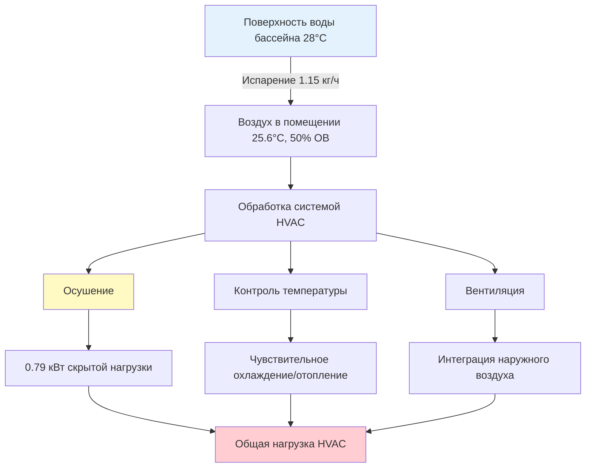
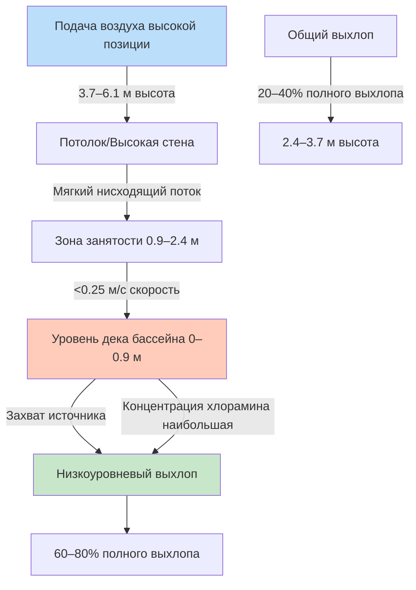
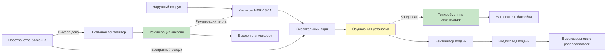

## Уникальные проблемы сред нататориумов

Объекты крытых плавательных бассейнов предъявляют чрезвычайные требования к проектированию HVAC, несопоставимые со стандартными коммерческими помещениями. Сочетание больших испаряющихся поверхностей воды, повышенных требований к влажности, коррозионноактивных загрязнений воздуха и высоких ожиданий посетителей создает сложную инженерную среду, требующую специализированных знаний и тщательной интеграции систем.

Три фундаментальных физических явления определяют проектирование HVAC нататориумов:

1. **Массивные скрытые нагрузки** от непрерывного испарения воды (45–135 кг/ч - типично)
2. **Образование загрязнений воздуха** от реакций хлора и азота
3. **Ускоренная коррозия** от влажного воздуха, насыщенного химикатами

Эти проблемы требуют систем значительно более сложных, чем стандартное комфортное HVAC, с типичной стоимостью установки $270–540 на м² для площадей бассейна и дека.

## Фундаментальные термодинамические принципы

### Физика испарения воды

Молекулы воды покидают жидкую поверхность, когда кинетическая энергия превышает силы межмолекулярного притяжения. Скорость испарения зависит от градиента давления пара между насыщенным воздухом на поверхности воды и объемным воздухом в помещении:

$$\dot{m}_{evap} = k_m \cdot A \cdot \rho_{air} \cdot (W_{sat,pool} - W_{air})$$

где:
- $\dot{m}_{evap}$ = скорость испарения (кг/ч)
- $k_m$ = коэффициент массопередачи (м/ч)
- $A$ = площадь поверхности воды (м²)
- $\rho_{air}$ = плотность воздуха (кг/м³)
- $W_{sat,pool}$ = коэффициент влажности у поверхности бассейна (кг/кг)
- $W_{air}$ = коэффициент влажности воздуха в помещении (кг/кг)

Коэффициент массопередачи увеличивается с увеличением скорости воздуха над поверхностью воды:

$$k_m = k_0 \cdot (1 + Bv^{0.9})$$

где $v$ — скорость воздуха (м/с) и $B$ — эмпирическая константа (0.00062 в метрических единицах). Эта зависимость объясняет, почему минимизация движения воздуха над поверхностью бассейна снижает испарение.

### Метод расчета испарения ASHRAE

Справочник Applications Handbook Chapter 6 ASHRAE предоставляет эмпирическую корреляцию стандарта индустрии:

$$E = A \cdot F_a \cdot (p_{w,pool} - p_{w,air}) \cdot (0.0295 + 0.00259v)$$

где:
- $E$ = скорость испарения (кг/ч)
- $A$ = площадь поверхности воды бассейна (м²)
- $F_a$ = коэффициент активности (безразмерный)
- $p_{w,pool}$ = давление насыщенного пара при температуре воды бассейна (кПа)
- $p_{w,air}$ = парциальное давление пара воздуха в помещении (кПа)
- $v$ = скорость воздуха над поверхностью воды (типично 3–9 м/с)

**Коэффициенты активности** учитывают турбулентность, создаваемую пловцами:
- $F_a = 0.5$ для незанятых бассейнов
- $F_a = 0.65$ для жилых бассейнов с минимальной активностью
- $F_a = 1.0$ для общественных/соревновательных бассейнов с высокой активностью
- $F_a = 1.5$ для волновых бассейнов, водных горок, терапевтических форсунок

### Расчет скрытой тепловой нагрузки

Тепловая энергия, требуемая для испарения воды, равна:

$$Q_{latent} = \dot{m}_{evap} \cdot h_{fg}$$

где $h_{fg}$ = теплота парообразования ≈ 2 460 кДж/кг при типичных температурах бассейна.

Для конкурентного бассейна 23 м × 14 м (322 м²) при 28°C с условиями в помещении 25.6°C и 50% ОВ:

**Шаг 1**: Определение давлений паров из психрометрических таблиц:
- $p_{w,pool}$ при 28°C = 3.765 кПа (насыщенный)
- $p_{w,air}$ при 25.6°C, 50% ОВ = 1.720 кПа

**Шаг 2**: Расчет скорости испарения с $F_a = 1.0$ и $v = 4.6$ м/с:

$$E = 322 \times 1.0 \times (3.765 - 1.720) \times (0.0295 + 0.00259 \times 4.6)$$
$$E = 322 \times 1.0 \times 2.045 \times 0.0414 = 27.5 \text{ кг/ч}$$

**Шаг 3**: Преобразование в скорость удаления влаги:

$$\dot{m}_{moisture} = \frac{27.5}{24} = 1.15 \text{ кг/ч в среднем}$$

**Шаг 4**: Расчет скрытой нагрузки:

$$Q_{latent} = 1.15 \times 2460 = 2,829 \text{ кДж/ч} = 0.79 \text{ кВт}$$

Это представляет только компонент удаления влаги; общая емкость осушения должна также обрабатывать чувствительное охлаждение, нагрузки вентиляции и коэффициенты безопасности.

## Параметры проектирования и уставки управления

Стандарты ASHRAE 62.1 (Вентиляция) и Applications Handbook Chapter 6 устанавливают фундаментальные критерии проектирования.

### Уставки температуры и влажности

| Параметр | Рекомендуемый диапазон | Обоснование проектирования |
|-----------|----------------------|---------------------------|
| Температура воды бассейна | 26–28°C | Тепловой комфорт пловцов |
| Температура воздуха | 26–29°C | На 1–2°C выше воды предотвращает озноб |
| Относительная влажность | 50–60% | Баланс между комфортом и испарением |
| Максимальная влажность | 65% ОВ | Предотвращает конденсацию и плесень |
| Минимальная влажность | 40% ОВ | Избегает чрезмерной сухости дыхательных путей |
| Разница температур воздух-вода | +1 до +2°C | Воздух теплее снижает испарение и озноб |

**Физика температурного дифференциала**: Когда температура воздуха равна или превышает температуру воды на 1–2°C, пловцы, выходящие из бассейна, не испытывают дискомфорта от испарительного охлаждения. Более низкие дифференциалы вызывают ощущение "холода" несмотря на адекватную температуру воздуха.

### Требования к вентиляции

ASHRAE 62.1 определяет минимум наружного воздуха на основе площади бассейна:

$$Q_{OA,min} = 0.48 \times A_{pool} + 0.06 \times A_{deck}$$

где:
- $Q_{OA,min}$ = минимум наружного воздуха (м³/ч) (CFM конвертировать: 1 CFM = 1.699 м³/ч)
- $A_{pool}$ = площадь поверхности воды бассейна (м²)
- $A_{deck}$ = площадь дека (м²)

Для примера бассейна 322 м² с деком 232 м²:

$$Q_{OA,min} = 0.48 \times 322 + 0.06 \times 232 = 154.6 + 13.9 = 168.5 \text{ м³/ч (99 CFM)}$$

Эта скорость разбавляет хлорамины и поддерживает приемлемое качество воздуха в помещении. Более высокие скорости (2–3× минимума) могут быть необходимы для:
- Плохой химии воды с повышенным образованием хлораминов
- Высокой загруженности пловцами (>30 одновременных пловцов)
- Неадекватных мер контроля источника
- Зон для зрителей, требующих дополнительной вентиляции

### Контроль давления в здании

Нататориумы должны работать под отрицательным давлением относительно смежных пространств для предотвращения миграции влаги и запахов:

$$\Delta P = -0.0005 \text{ до } -0.0012 \text{ кПа}$$

Это требует того, чтобы расход воздуха вытяжки превышал расход воздуха подачи:

$$Q_{exhaust} = Q_{supply} + Q_{pressurization}$$

где $Q_{pressurization}$ обычно составляет 5–10% расхода подачи.

## Выбор системы осушения

Две основные технологии обрабатывают нагрузки влажности в нататориумах: системы на основе хладагента и системы на основе десиканта.

### Системы осушения на основе хладагента

Системы на основе хладагента охлаждают воздух ниже его точки росы, чтобы конденсировать влажный пар, затем повторно нагревают воздух для предотвращения избыточного охлаждения помещения.

**Цикл работы:**

1. Возвратный воздух из пространства бассейна входит в испаритель
2. Охлаждение до 7–13°C конденсирует водяной пар
3. Конденсат сливается в отходы или рекуперацию тепла
4. Холодный, сухой воздух проходит через конденсатор
5. Повторный нагрев восстанавливает подающий воздух до 26–29°C
6. Теплый, сухой воздух возвращается в помещение

**Энергетический баланс:**

$$Q_{evap} = Q_{latent} + Q_{sensible,cooling}$$
$$Q_{cond} = Q_{evap} + W_{comp}$$

где $W_{comp}$ — работа компрессора. Рекуперация тепла конденсатора обеспечивает "бесплатный" повторный нагрев, достигая энергетических коэффициентов эффективности 1.6–2.3 кг влаги удалено на кВт·ч.

### Системы осушения на основе десиканта

Системы на основе десиканта используют гигроскопичные материалы (силикагель, молекулярные сита, хлорид лития) для адсорбции водяного пара химически.

**Рабочие принципы:**

- **Поток процесса**: Влажный воздух контактирует с вращающимся барабаном десиканта, вода адсорбируется, сухой воздух сбрасывается
- **Поток регенерации**: Нагретый воздух (82–121°C) вытесняет влагу из десиканта, выхлоп в наружный воздух
- **Непрерывная работа**: Барабан вращается медленно (6–20 об/ч) для одновременной сушки и регенерации

**Энергетические соображения:**

Требуемое тепло регенерации:

$$Q_{regen} = \dot{m}_{water} \cdot (h_{fg} + q_{ads}) + Q_{sensible,heating}$$

где $q_{ads}$ = теплота адсорбции ≈ 2 550–2 670 кДж/кг (превышает теплоту парообразования из-за тепла смачивания).

### Сравнение систем

| Критерии | Система на хладагенте | Система на десиканте |
|----------|----------------------|----------------------|
| **Емкость удаления влаги** | 4.5–11 кг/ч на кВт | 3.6–9 кг/ч на кВт |
| **Диапазон рабочих температур** | 10–32°C (ограничено хладагентом) | -29 до 49°C (неограничено) |
| **Точность контроля влажности** | ±5% ОВ | ±2% ОВ |
| **Источник энергии** | Электричество (компрессор) | Тепло (газ, пар, горячая вода) |
| **Первоначальная стоимость** | Ниже ($166–275/кг/день емкости) | Выше ($275–440/кг/день емкости) |
| **Эксплуатационные расходы** | Ниже при тарифах <$0.12/кВт·ч | Конкурентоспособны при низкой стоимости тепла |
| **Сложность обслуживания** | Умеренная (опыт в области холодильной техники) | Выше (очистка барабана, уплотнения) |
| **Встроенная рекуперация тепла** | Встроенная (тепло конденсатора) | Требует отдельный теплообменник |
| **Производительность при низкой температуре** | Плохая (обледенение катушки) | Отличная |
| **Эффективность при частичной нагрузке** | Хорошая с управлением VFD | Отличная (модулирующая регенерация) |

**Рекомендации по выбору:**

- **Системы на хладагенте** подходят для большинства приложений с умеренным климатом, объектов только с электричеством и стандартными требованиями влажности (45–60% ОВ)
- **Системы на десиканте** превосходны в холодном климате, требования низкой влажности (<40% ОВ) или объектов с низкостоящими источниками тепловой энергии

## Образование хлораминов и их контроль

Хлорамины представляют наиболее сложную проблему качества воздуха в нататориумах.

### Химия образования

Свободный хлор (HOCl) реагирует с содержащими азот органическими соединениями (мочевина, пот, косметика), вносимыми пловцами:

$$\text{HOCl} + \text{NH}_3 \rightarrow \text{NH}_2\text{Cl} \text{ (монохлорамин)}$$
$$\text{HOCl} + \text{NH}_2\text{Cl} \rightarrow \text{NHCl}_2 \text{ (дихлорамин)}$$
$$\text{HOCl} + \text{NHCl}_2 \rightarrow \text{NCl}_3 \text{ (трихлорамин)}$$

Трихлорамин ($\text{NCl}_3$) легко испаряется из воды в воздух из-за низкой постоянной Генри закона, вызывая:

- Раздражение глаз и дыхательных путей при 0.02–0.05 мг/м³
- Сильное восприятие "хлорного" запаха
- Коррозионное воздействие на строительные материалы и оборудование HVAC

### Иерархия стратегий контроля

**Первичная (снижение источника):**
- Поддержание надлежащей химии воды (свободный хлор 1–3 ppm, pH 7.2–7.6, комбинированный хлор <0.2 ppm)
- Принудительные предварительные душевые (удаляют 60–80% загрузки загрязнений)
- Точечное хлорирование для окисления хлораминов
- UV-фотолиз или озоновое окисление хлораминов в циркуляционном контуре

**Вторичная (вентиляция):**
- Адекватный наружный воздух согласно минимуму ASHRAE 62.1 (0.48 м³/ч/м² площади бассейна)
- Основанная на производительности вентиляция с целевым содержанием <0.05 мг/м³ трихлорамина
- Стратегическое распределение воздуха с выхлопом на уровне дека и подачей высоко

**Третичная (обработка воздуха):**
- Фильтрация с активированным углем (60–85% удаление в одном проходе)
- Усиленные наружные воздушные скорости (2–3× минимум ASHRAE)
- Системы промывки воздуха или скруббирования для тяжелых случаев

## Защита от коррозии и выбор материалов

Влажная среда с хлорированием ускоряет коррозию строительных материалов и компонентов HVAC.

### Механизмы коррозии

**Коррозия, вызванная хлоридом,** атакует пассивные слои оксидов на металлах:

$$\text{Fe} + \text{Cl}^- + \text{O}_2 + \text{H}_2\text{O} \rightarrow \text{Fe(OH)}_3 + \text{Cl}^-$$

Ион хлорида действует каталитически, регенерируясь для атаки на дополнительный металл. Высокая влажность поддерживает пленки влаги на поверхности, позволяющие электрохимическим реакциям.

### Рекомендации по выбору материалов

| Компонент | Избегать | Указать |
|-----------|----------|---------|
| **Воздуховоды** | Оцинкованная сталь (5–7 лет срока) | Нержавеющая сталь 304/316, стекловолокно, покрытый алюминий |
| **Крепежи** | Углеродная сталь | Нержавеющая сталь 316, горячеоцинкованная |
| **Конструкционная сталь** | Неокрашенная сталь | Эпоксидно-покрытая, горячеоцинкованная или заключенная |
| **Трубопровод** | Черная сталь, медь | Нержавеющая сталь, CPVC, PVC, HDPE |
| **Катушки HVAC** | Голый алюминий, медь | Покрытые катушки (эпоксидные, фенольные) с заголовками из нержавеющей стали |
| **Электрооборудование** | Стандартные корпуса | Корпуса NEMA 4X из нержавеющей стали или стекловолокна |
| **Подвески/опоры** | Голая сталь | Пластиковое покрытие, эпоксидная окраска, нержавеющая сталь |
| **Распределители/решетки** | Алюминий, сталь | Нержавеющая сталь, PVC, порошковое покрытие алюминия |

**Требования к покрытиям:**

- Открытая сталь: 3-слойная система эпоксидной краски (минимум 0.25 мм DFT)
- Воздуховоды: Заводская эпоксидная краска или наносимая в полевых условиях мастика
- Регулярный осмотр и подкраска каждые 2–3 года

## Интеграция рекуперации энергии

Нататориумы требуют существенного наружного воздуха, создавая значительные нагрузки на кондиционирование. Системы рекуперации энергии снижают эксплуатационные расходы.

### Тепловой барабан рекуперации (Энтальпийный барабан)

Вращающийся барабан с покрытием десиканта передает как чувствительное тепло, так и скрытую энергию между потоками воздуха выхлопа и подачи.

**Общая эффективность:**

$$\varepsilon_{total} = \frac{h_{supply,out} - h_{supply,in}}{h_{exhaust} - h_{supply,in}}$$

Типичные значения: 70–85% в зависимости от размера барабана, скорости вращения и расхода воздуха.

**Годовая экономия энергии:**

$$\text{Сбережения} = Q_{OA} \times \varepsilon \times (h_{exhaust} - h_{OA}) \times \text{часы} \times \text{стоимость}$$

Для 2360 м³/ч (1389 CFM) наружного воздуха при 8000 годовых часов и эквивалентной стоимости энергии $0.10/кВт·ч:

$$\text{Сбережения} = 2.36 \times 0.75 \times 8 \times 8000 \times 0.10 = $11,350/\text{год}$$

### Рекуперация тепла воды бассейна

Конденсат из осушения переносит значительную тепловую энергию, которая может предварительно нагреть воду бассейна:

$$Q_{condensate} = \dot{m}_{condensate} \times c_p \times (T_{condensate} - T_{pool})$$

Для конденсата 45 кг/ч при 13°C входящего в бассейн 27°C:

$$Q_{condensate} = 45 \times 4.18 \times (27 - 13) = 2,634 \text{ кДж/ч}$$

Интегрировано с рекуперацией тепла горячего газа хладагента системы:

$$Q_{total,recovery} = Q_{condenser} + Q_{condensate}$$

Надлежащо спроектированные системы восстанавливают 50–70% энергии осушения для нагрева воды бассейна, снижая газ или электрическое сопротивление отоплению.

## Проектирование распределения воздуха

Стратегическое размещение подачи и выхлопа максимизирует комфорт и удаление загрязнений.

### Принципы проектирования

**Подающий воздух:**
- Подача на высоком уровне (3.7–6.1 м) создает мягкий нисходящий вытеснительный поток
- Низкая скорость сброса (<7.6 м/с) предотвращает чрезмерную турбулентность над бассейном
- Температура на 1–2°C выше воды бассейна для минимизации испарения

**Вытяжной воздух:**
- 60–80% на уровне дека (0–15 см над деком) захватывает загрязнения у источника
- 20–40% на общем уровне (2.4–3.7 м) обеспечивает общую циркуляцию воздуха
- Непрерывный периметральный выхлоп вдоль края бассейна наиболее эффективен

**Управление скоростью воздуха:**
- Уровень дека: <0.25 м/с для минимизации увеличения скорости испарения
- Зона занятости: 0.13–0.25 м/с для комфорта без сквозняков
- Над поверхностью бассейна: минимизировать до 0.05–0.1 м/с

## Типовая схема системы

## Процедура размера системы

**Шаг 1: Расчет скорости испарения**
- Использование метода ASHRAE с надлежащим коэффициентом активности
- Учет укрытий бассейна при необходимости в периоды закрытия

**Шаг 2: Определение требования наружного воздуха**
- Минимум ASHRAE 62.1 (0.48 м³/ч/м² площади бассейна + 0.06 м³/ч/м² дека)
- Увеличение для контроля хлорамина при неправильной химии воды

**Шаг 3: Расчет общей нагрузки влажности**
$$\dot{m}_{total} = \dot{m}_{evap} + \dot{m}_{OA} + \dot{m}_{occupants} + \dot{m}_{infiltration}$$

**Шаг 4: Размер емкости осушения**
- Базовая емкость = общая нагрузка влажности
- Коэффициент безопасности: 15–25% для неопределенности условий проектирования
- Будущее расширение: 10–15% при необходимости

**Шаг 5: Определение чувствительного охлаждения/отопления**
- Чувствительное охлаждение: нагрузки от занятости + солнечное + освещение + оборудование
- Отопление: потери конверта + наружный воздух + испарительное охлаждение бассейна
- Интеграция рекуперации тепла конденсатора в энергетический баланс

**Шаг 6: Выбор типа оборудования**
- Хладагент для стандартных приложений
- Десикант для экстремальных условий или специальных требований

**Шаг 7: Проектирование распределения воздуха**
- Расход подающего воздуха: достаточный для отопления/охлаждения и повторного нагрева осушения
- Расход выхлопа: подача + припуск на давление (5–10%)
- Размер воздуховода для низкой скорости (<7.6 м/с) для минимизации шума

## Требования к техническому обслуживанию

Долгосрочная производительность зависит от строгих протоколов обслуживания.

### Критические задачи техническом обслуживании

| Периодичность | Задача | Обоснование |
|---|------|-----------|
| **Ежедневно** | Проверка химии воды | Предотвращает образование хлорамина |
| **Еженедельно** | Осмотр катушек и фильтров | Определяет раннюю коррозию или забивание |
| **Ежемесячно** | Проверка баланса воздуха на месте | Обеспечивает поддержание проектных расходов воздуха |
| **Ежеквартально** | Комплексная проверка TAB | Подтверждает производительность системы |
| **Ежеквартально** | Осмотр коррозии | Определяет отказы покрытия на ранней стадии |
| **Раз в полгода** | Замена углеродного фильтра | Поддерживает удаление хлорамина |
| **Ежегодно** | Комплексная комиссионка системы | Проверяет все элементы управления и последовательности |
| **Ежегодно** | Подкраска покрытия | Предотвращает ускоренную коррозию |

### Типичные режимы отказов

**Неадекватное осушение:**
- Недостаточное оборудование по фактическим нагрузкам
- Плохая химия воды, увеличивающая испарение
- Загрязненные катушки, снижающие емкость
- Потеря заряда хладагента или отказ компрессора

**Плохое качество воздуха:**
- Недостаточный объем наружного воздуха
- Дисбаланс выхлопного воздуха, создающий положительное давление
- Отказавшие угольные фильтры
- Неадекватный контроль источника (химия воды)

**Ускоренная коррозия:**
- Отказы покрытия из-за плохого нанесения или механического повреждения
- Чрезмерная влажность из-за отказа осушения
- Неправильные спецификации материалов
- Неадекватная вентиляция, создающая локальные зоны высокой влажности

## Заключение

Системы HVAC нататориумов требуют специализированного инжиниринга, интегрирующего термодинамические принципы, знание химии воды, науку коррозии и управление качеством воздуха в помещении. Успешные проекты балансируют массивные скрытые нагрузки (типично 36–54 кг/ч на 93 м² площади бассейна), поддерживают точный контроль влажности (50–60% ОВ), обеспечивают отличное качество воздуха (<0.05 мг/м³ хлораминов) и защищают инфраструктуру здания от коррозионного воздействия.

Ключевые факторы успеха включают:

- **Точный расчет нагрузки** с использованием методов ASHRAE с надлежащими коэффициентами активности и фактическими режимами работы
- **Надлежащий выбор оборудования**, соответствующий технологию хладагента или десиканта климату, стоимости энергии и требованиям производительности
- **Стратегическое распределение воздуха**, подчеркивающее захват источника с выхлопом на уровне дека и высокой подачей
- **Надежный выбор материалов**, указывающий коррозионностойкие материалы и защитные покрытия на всем протяжении
- **Интеграция рекуперации энергии**, захватывающая 50–70% энергии кондиционирования через тепловые колеса, рекуперацию конденсата и рекуперацию горячего газа хладагента
- **Проактивное обслуживание**, включающее ежедневное управление химией воды, регулярную проверку баланса воздуха и программы осмотра покрытий

Надлежащее выполнение этих принципов создает надежные, эффективные среды нататориумов, поддерживающие комфорт пловцов, впечатления зрителей и долгосрочную прочность объекта.
