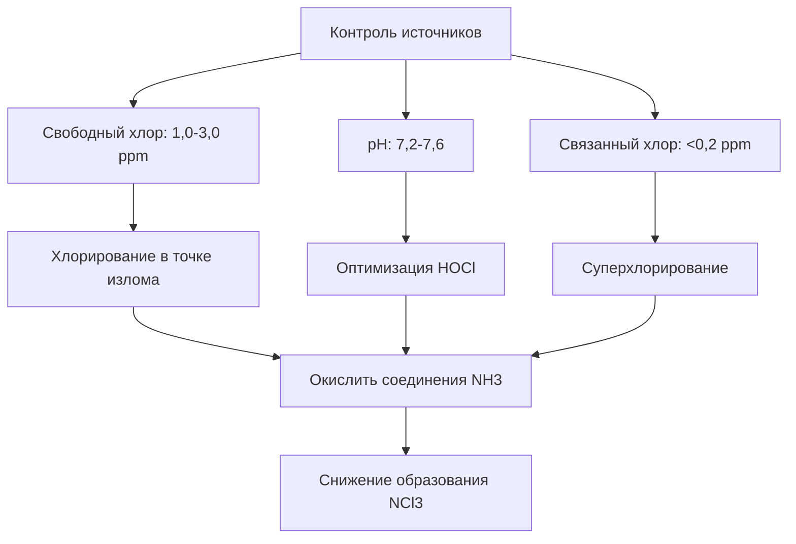
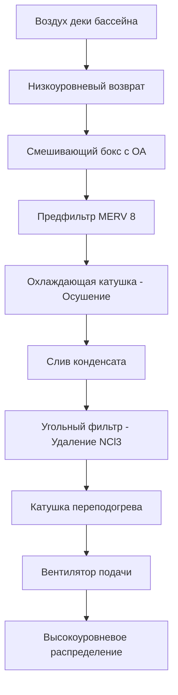

## Обзор

Хламинамы представляют наиболее значительный вызов качеству воздуха в среде крытых бассейнов, вызывая раздражение дыхательных путей, дискомфорт в глазах и коррозию строительных систем. Эффективный контроль требует интегрированных стратегий, охватывающих управление химией воды, проектирование системы вентиляции и целевое распределение воздуха для удаления загрязнений у их источника. Стандарт ASHRAE 62.1 и специализированные руководства по проектированию крытых бассейнов устанавливают основу для поддержания безопасных уровней воздействия.

## Химия образования хлораминов

Хламинамы образуются в результате химических реакций между дезинфицирующими средствами на основе свободного хлора и содержащими азот соединениями, которые вносят пловцы, в основном мочевину, пот и косметику.

### Пути реакции

Образование происходит в результате последовательных реакций хлорирования:

$$\text{NH}_3 + \text{HOCl} \rightarrow \text{NH}_2\text{Cl} + \text{H}_2\text{O}$$

$$\text{NH}_2\text{Cl} + \text{HOCl} \rightarrow \text{NHCl}_2 + \text{H}_2\text{O}$$

$$\text{NHCl}_2 + \text{HOCl} \rightarrow \text{NCl}_3 + \text{H}_2\text{O}$$

Где:
- $\text{NH}_2\text{Cl}$ = монохлорамин (низкая летучесть)
- $\text{NHCl}_2$ = дихлорамин (умеренная летучесть)
- $\text{NCl}_3$ = трихлорамин (высокая летучесть, основной загрязнитель воздуха)

### Механизм испарения

Низкая константа закона Генри трихлорамина ($H = 0,015$ атм·м³/моль при 25°C) облегчает передачу из водной фазы в газовую фазу. Скорость переноса массы следует:

$$J = k_L \times (C_w - \frac{C_a}{H})$$

Где:
- $J$ = массовый поток (мг/м²·с)
- $k_L$ = коэффициент переноса массы в жидкой фазе (м/с)
- $C_w$ = концентрация в воде (мг/л)
- $C_a$ = концентрация в воздухе (мг/м³)
- $H$ = константа закона Генри (безразмерная)

Движение воздуха над поверхностью воды увеличивает $k_L$ пропорционально $v^{0,5}$, где $v$ — скорость воздуха, что объясняет, почему неподвижная вода снижает выбросы.

## Эффекты для здоровья и пределы воздействия

### Физиологические воздействия

Воздействие трихлорамина производит зависящие от концентрации эффекты для здоровья:

| Концентрация (мг/м³) | Продолжительность | Эффекты |
|----------------------|----------|---------|
| 0,02-0,05 | Хроническое | Мягкое раздражение глаз, ощутимый запах |
| 0,05-0,20 | Часы | Умеренное раздражение дыхательных путей, конъюнктивит |
| 0,20-0,50 | Минуты | Тяжелое раздражение, затрудненное дыхание, кашель |
| >0,50 | Немедленно | Острый респираторный дистресс, потенциальное повреждение легких |

### Нормативные стандарты

Текущие руководства по воздействию различаются в зависимости от юрисдикции:

- **Стандарт ANSI/ASHRAE 62.1**: Не указывает числовой предел, но требует контроля воспринимаемого качества воздуха
- **Рекомендации ВОЗ**: Максимум 0,5 мг/м³ (кратковременное воздействие)
- **Французский стандарт**: Максимум 0,3 мг/м³ (бассейны)
- **Немецкий стандарт DIN 19643**: Максимум 0,2 мг/м³ (общественные бассейны)

Воздействие на операторов бассейна должно оставаться ниже 0,05 мг/м³ для 8-часового взвешенного по времени среднего значения.

## Стратегии снижения источников

Минимизация образования хлораминов у источника обеспечивает наиболее эффективный подход к контролю.

### Управление химией воды

**Оптимальные химические параметры:**

**Хлорирование в точке излома** достигает полного окисления аммиака, когда свободный хлор достигает соотношения 10:1 с азотсодержащими соединениями:

$$\text{Требуется Cl}_2 = 10 \times [\text{NH}_3\text{-N}]$$

Эта "точка излома" временно исключает образование хлораминов, но требует тщательного контроля, чтобы избежать передозировки.

### Системы продвинутого окисления

**Системы УФ-фотолиза**, расположенные в циркуляционных петлях, разрушают хламинамы:

$$\text{NCl}_3 + h\nu \rightarrow \text{продукты}$$

Требования к УФ-дозе:
- Лампы среднего давления: 40-100 мДж/см² для 90% снижения
- Эффективный диапазон длин волн: 200-280 нм
- Скорость потока: 30-60 секунд времени контакта

**Впрыск озона** обеспечивает дополнительное окисление:

$$\text{O}_3 + \text{NCl}_3 \rightarrow \text{продукты}$$

Типичное дозирование: 0,2-0,8 мг O₃ на мг связанного хлора с временем контакта 3-5 минут перед дехлорированием.

### Управление нагрузкой пловцов

Введение пловцами загрязнителей напрямую коррелирует с производством хлораминов:

$$R_{\text{NCl}_3} = k \times N_b \times t$$

Где:
- $R_{\text{NCl}_3}$ = скорость образования трихлорамина (мг/ч)
- $k$ = коэффициент загрязнения пловцом (2-5 мг/человека·ч)
- $N_b$ = количество пловцов
- $t$ = продолжительность (часы)

**Меры контроля:**
- Предварительные душевые перед плаванием (удаляет 60-80% загрязнителей)
- Требования к стирке купальных костюмов
- Ограничения на косметику (солнцезащитный крем, лосьоны)
- Надлежащие заведения для подгузников для детей
- Соблюдение максимальной нагрузки пловцов

## Проектирование системы вентиляции

Адекватная вентиляция наружным воздухом разбавляет и удаляет переносимые по воздуху хламинамы для поддержания приемлемых концентраций.

### Расчеты скорости вентиляции

Стандарт ASHRAE 62.1 указывает минимальные скорости:

$$Q_{\text{min}} = 0,48 \times A_{\text{бассейн+дека}}$$

Где:
- $Q_{\text{min}}$ = минимальный наружный воздух (м³/ч, основано на преобразовании из CFM)
- $A_{\text{бассейн+дека}}$ = площадь поверхности воды бассейна + площадь деки (м²)

Для конкурентного бассейна 25 м × 25 м (625 м²) с декой 280 м²:

$$Q_{\text{min}} = 0,48 \times (625 + 280) = 435 \text{ м³/ч}$$

Это представляет базовую линию; фактические требования зависят от мощности источника и целевой концентрации.

### Вентиляция на основе производительности

Продвинутое проектирование основывает вентиляцию на скорости образования загрязнителя:

$$Q = \frac{G}{C_t - C_o}$$

Где:
- $Q$ = требуемая скорость вентиляции (м³/ч)
- $G$ = скорость образования хлорамина (мг/ч)
- $C_t$ = целевая внутренняя концентрация (мг/м³)
- $C_o$ = наружная концентрация (мг/м³, обычно ≈0)

Преобразование в стандартные единицы и нацеливание на $C_t = 0,05$ мг/м³:

$$Q = \frac{G \times 2,119}{C_t}$$

Для типичных скоростей образования 30-80 мг/ч (умеренное использование):

$$Q = \frac{50 \times 2,119}{0,05} = 2 119 \text{ м³/ч}$$

Более высокие нагрузки пловцов или проблемы с химией воды могут потребовать 6 000-10 000 м³/ч для крупных объектов.

### Метод воздухообмена

Альтернативная спецификация использует объемный обмен:

$$\text{ACH} = \frac{Q \times 60}{V}$$

Рекомендуемые скорости:
- Конкурентные бассейны: 4-6 ACH
- Развлекательные бассейны: 6-8 ACH
- Терапевтические бассейны (более высокие температуры): 8-12 ACH

## Распределение воздуха для удаления загрязнителей

Стратегическое размещение подачи и вытяжки воздуха максимизирует эффективность удаления.

### Принципы захвата у источника

Хламинамы концентрируются у границы раздела вода-воздух (0-1,8 м над декой). Оптимальное размещение вытяжки захватывает выбросы перед их смешиванием в верхних зонах:

**Принципы проектирования:**

1. **Размещение вытяжки**: 60-80% от общей вытяжки в пределах 0,9 м от уровня деки
2. **Размещение подачи**: Крепление на боковой стене высокого уровня или потолка (3,7-6,1 м) создает нисходящий вытесняющий поток
3. **Управление скоростью**: Скорости на уровне деки <0,25 м/с предотвращают чрезмерное испарение
4. **Картины воздуха**: Ламинарный нисходящий поток направляет загрязнители к низким вытяжкам

### Анализ вентиляции вытеснением

Коэффициент эффективности $\varepsilon$ количественно определяет эффективность удаления:

$$\varepsilon = \frac{C_e - C_s}{C_o - C_s}$$

Где:
- $C_e$ = концентрация на вытяжке
- $C_s$ = концентрация подачи
- $C_o$ = концентрация в зоне пребывания

Системы вытеснения достигают $\varepsilon = 1,2$ до $1,4$ (на 20-40% лучше, чем смешивание), снижая требуемую вентиляцию:

$$Q_{\text{вытеснение}} = \frac{Q_{\text{смешивание}}}{\varepsilon}$$

### Конфигурация вытяжки на уровне деки

Типичное размещение решетки:

| Местоположение | Процент от общей вытяжки | Высота крепления | Расстояние |
|----------|------------------------------|-----------------|---------|
| Периметр бассейна | 40-50% | 0-15 см над декой | 3-4,6 м по центрам |
| Желоб/перелив | 20-30% | На уровне воды | Непрерывное |
| Площади деки | 10-20% | 0,6-0,9 м над декой | 4,6-6,1 м по центрам |
| Общая вытяжка | 10-20% | 2,4-3,7 м | По мере необходимости |

Решетки периметральной вытяжки должны включать съемные крышки для очистки и защиты от коррозии.

## Интеграция с системами осушения

Удаление хлорамина координируется с контролем влажности в механических осушающих установках.

### Последовательность обработки

Современные осушители бассейнов включают снижение хлорамина:

**Угольная фильтрация** удаляет газообразные хламинамы:

- **Активированный уголь**: 0,23-0,45 кг углерода на 280 м³/ч
- **Время контакта**: Минимум 0,05-0,10 секунд
- **Эффективность удаления**: 60-85% однопроходное
- **Интервал замены**: 6-12 месяцев в зависимости от загрузки

### Интеграция наружного воздуха

Выделенные системы наружного воздуха (DOA) предотвращают избыточную вентиляцию кондиционированного пространства:

$$Q_{\text{ОА,полный}} = Q_{\text{вент}} + Q_{\text{пополнение}}$$

Где:
- $Q_{\text{вент}}$ = минимум ASHRAE 62.1 (4 000+ м³/ч)
- $Q_{\text{пополнение}}$ = Пополнение вытяжки (обычно 90% вентиляции)

Рекуперация энергии снижает нагрузки на кондиционирование:

$$Q_{\text{восстановлено}} = Q_{\text{ОА}} \times \varepsilon_{\text{ERV}} \times (h_{\text{вытяжка}} - h_{\text{ОА}})$$

Эффективность колеса рекуперации $\varepsilon_{\text{ERV}} = 0,70$ до $0,80$ для применения в крытых бассейнах с устойчивыми к хлораминам материалами (эпоксидно-покрытый алюминий, синтетические среды).

## Контроль и мониторинг

Постоянный мониторинг обеспечивает производительность системы.

### Размещение датчиков

- **Датчики хлорамина**: Электрохимические или оптические, расположены 0,9-1,8 м над декой в зоне дыхания
- **Температура/влажность**: Несколько местоположений на уровне деки и на возвышенных уровнях
- **CO₂**: Зоны зрителей при наличии
- **Станции воздухомера**: Воздуховоды подачи и вытяжки с мониторингом дифференциального давления

### Стратегии управления

**Модуляция вентиляции** на основе измеренной концентрации хлорамина:

$$Q = Q_{\text{min}} + (Q_{\text{max}} - Q_{\text{min}}) \times \frac{C_{\text{измерено}} - C_{\text{низко}}}{C_{\text{высоко}} - C_{\text{низко}}}$$

Где:
- $C_{\text{низко}}$ = 0,02 мг/м³ (минимальное уставка)
- $C_{\text{высоко}}$ = 0,05 мг/м³ (максимальное уставка)
- $Q_{\text{min}}$ = минимум ASHRAE
- $Q_{\text{max}}$ = максимум дизайна (обычно в 2-3 раза больше минимума)

Приводы с переменной скоростью на вентиляторах подачи и вытяжки поддерживают давление в здании при модуляции потока.

## Требования к техническому обслуживанию

Долгосрочная производительность зависит от строгого обслуживания:

**Ежедневно/еженедельно:**
- Проверка химии воды (свободный/связанный хлор, pH)
- Визуальная проверка решеток и возвратов
- Проверка измерения воздушного потока

**Ежемесячно:**
- Замена/очистка фильтров (предфильтры MERV 8)
- Мониторинг падения давления угольного фильтра
- Проверка слива конденсата

**Ежеквартально:**
- Полная проверка баланса воздуха
- Калибровка датчика хлорамина
- Проверка осмотра воздуховодов

**Ежегодно:**
- Замена угольного фильтра
- Всеобщий отчет о балансировке и наладке
- Замена УФ-лампы (если установлена)
- Проверка покрытия/коррозии

## Заключение

Эффективный контроль хлорамина в крытых бассейнах требует скоординированного применения снижения источников через оптимизацию химии воды, адекватной вентиляции согласно ASHRAE 62.1 с корректировками на основе производительности, стратегического распределения воздуха с акцентом на вытяжку на уровне деки и непрерывного мониторинга для поддержания воздействия ниже 0,05 мг/м³. Интеграция принципов продвинутого окисления, угольной фильтрации и вентиляции вытеснением достигает превосходного качества воздуха при одновременной оптимизации энергетической производительности в этих сложных условиях.
