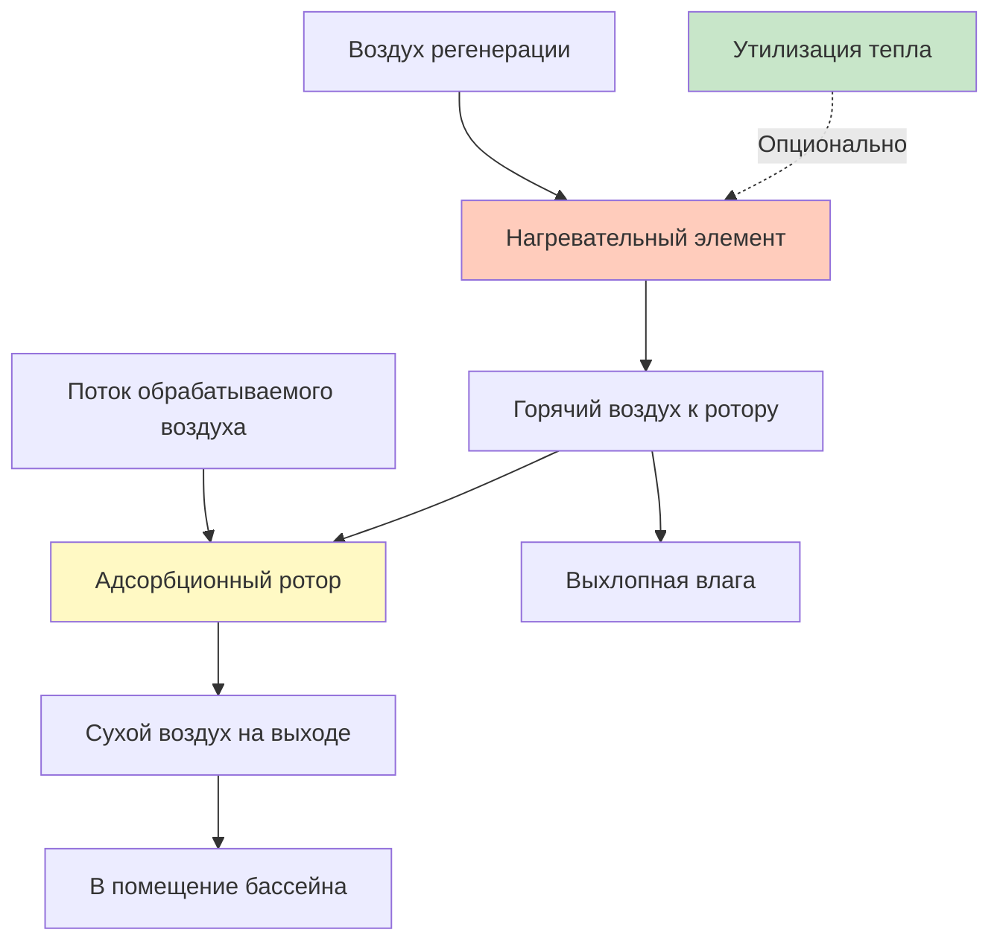

## Фундаментальная физика испарения из бассейна

Испарение воды с поверхности бассейна представляет основную влажностную нагрузку в помещениях с бассейнами. Скорость испарения зависит от разности парциального давления водяного пара между насыщенным воздухом на поверхности воды и окружающим воздухом.

Движущая сила массопередачи определяется следующим образом:

$$\dot{m}_{evap} = h_m \cdot A \cdot (W_{sat,pool} - W_{air})$$

где:
- $\dot{m}_{evap}$ = скорость испарения (кг/ч)
- $h_m$ = коэффициент массопередачи (м/ч)
- $A$ = площадь поверхности бассейна (м²)
- $W_{sat,pool}$ = влагосодержание при температуре поверхности бассейна (кг/кг)
- $W_{air}$ = влагосодержание воздуха помещения (кг/кг)

### Расчет скорости испарения по ASHRAE

Справочник ASHRAE Applications Handbook предоставляет эмпирические корреляции с учетом уровня активности в бассейне:

$$E = A \cdot F_a \cdot (p_{w,pool} - p_{w,air}) \cdot \left(0.089 + 0.0782v\right)$$

где:
- $E$ = скорость испарения (кг/ч)
- $A$ = площадь бассейна (м²)
- $F_a$ = коэффициент активности (0,5 неиспользуемый, 0,65 жилой, 1,0 общественные бассейны)
- $p_{w,pool}$ = давление насыщенного водяного пара при температуре бассейна (кПа)
- $p_{w,air}$ = парциальное давление водяного пара в воздухе помещения (кПа)
- $v$ = скорость воздуха над поверхностью воды (обычно 3,1-9,1 м/с)

Разность парциального давления водяного пара обеспечивает непрерывное добавление влаги. Общественный бассейн площадью 279 м² при температуре 27,8°C с воздухом при 50% ОВ и температуре 25,6°C генерирует приблизительно 23-31 кг/ч влаги, требующей удаления.

## Хладагентное осушение воздуха

Хладагентные осушители работают по циклу паровой компрессии, охлаждая воздух ниже точки росы для конденсации влаги.

### Принципы работы

Цикл холодильной машины удаляет скрытое тепло, в то время как переохладитель конденсатора обеспечивает компенсацию чувствительного охлаждения:

$$Q_{latent} = \dot{m}_{water} \cdot h_{fg}$$

где $h_{fg}$ = 2 464 кДж/кг при типичных условиях.

При удалении 9 кг/ч влаги:

$$Q_{latent} = 9 \times 2 464 = 22 176 \text{ кДж/ч} = 6,16 \text{ кВ}$$

Система хладагента одновременно обеспечивает:
- Охлаждение испарителем: конденсирует влагу + чувствительное охлаждение
- Переохлаждение конденсатором: восстанавливает чувствительное тепло для предотвращения избыточного охлаждения

Эффективность утилизации энергии обычно достигает 50-70%, снижая требования к отоплению.

### Производительность хладагентной системы

| Параметр | Типичный диапазон | Примечания |
|----------|-------------------|-----------|
| Температура испарителя | 7-13°C | Ниже точки росы для конденсации |
| Температура конденсации | 40-52°C | Определяет мощность переохлаждения |
| Удаление влаги | 4,5-11 кг/ч на кВт | Зависит от входных условий |
| Энергетическая эффективность | 3,5-5,0 кг/кВч | Включая преимущество переохлаждения |
| Диапазон работы | 10-32°C подсух. | Ограничено свойствами хладагента |
| Диапазон контроля влажности | 40-60% ОВ | Оптимальные условия для бассейна |

## Адсорбционное осушение воздуха

Адсорбционные системы используют гигроскопичные материалы для адсорбции водяного пара посредством химического притяжения, а не охлаждающей конденсации.

### Термодинамика адсорбции

Адсорбенты (силикагель, молекулярные сита, хлорид лития) притягивают молекулы воды через:

1. **Физическая адсорбция**: силы Ван-дер-Ваальса на пористых поверхностях
2. **Химическая адсорбция**: молекулярная связь с активными центрами

Процесс адсорбции выделяет тепло адсорбции:

$$q_{ads} = h_{fg} + q_{wetting}$$

где $q_{wetting}$ = 116-233 кДж/кг дополнительное выделение тепла.

Регенерация требует нагрева для обратного процесса:

$$Q_{regen} = \dot{m}_{water} \cdot (h_{fg} + q_{wetting}) + Q_{sensible}$$

### Характеристики адсорбционной системы

| Параметр | Типичный диапазон | Примечания |
|----------|-------------------|-----------|
| Удаление влаги | 3,6-9 кг/ч на кВт | Выше при низкой влажности |
| Температура регенерации | 82-121°C | Определяет энергопотребление |
| Скорость вращения ротора | 6-20 об/ч | Влияет на производительность |
| Снижение точки росы | 11-22°C | Ниже входных условий |
| Диапазон работы | -29 до 49°C | Без ограничений по замерзанию |
| Диапазон влажности | 10-90% ОВ | Эффективна при низкой влажности |

## Анализ сравнения систем

| Критерий | Хладагентная система | Адсорбционная система |
|----------|----------------------|----------------------|
| **Начальная стоимость** | Ниже (6,8-11,4 тыс. руб/кг/сут) | Выше (11,4-18,2 тыс. руб/кг/сут) |
| **Операционная стоимость** | Ниже при электроэнергии | Переменная в зависимости от источника топлива |
| **Контроль влажности** | Хороший (40-60% ОВ) | Отличный (20-80% ОВ) |
| **Низкая температура** | Плохой (риск замерзания) | Отличный |
| **Утилизация энергии** | Интегрированный конденсатор | Требует теплообменника |
| **Техническое обслуживание** | Средняя сложность | Высокая сложность |
| **Эффективность при частичной нагрузке** | Хорошая с ПЧ | Отличная |
| **Требования к площади** | Компактная | Больший занимаемый объем |

## Влияние защитных покрытий бассейна

Защитные покрытия бассейна резко снижают скорость испарения через физический барьер водяному пару и подавление активности.

### Коэффициенты снижения испарения

| Тип покрытия | Снижение испарения | Типичное применение |
|--------------|-------------------|-------------------|
| Без покрытия | 0% (базовое) | Периоды активного использования |
| Плавающие диски | 30-40% | Во время работы |
| Ручное покрытие | 90-95% | Ночь/выходные |
| Автоматическое покрытие | 95-98% | Автоматизированный режим |
| Жесткое покрытие | 98-99% | Полное закрытие |

Для бассейна с испарением 9 кг/ч в открытом состоянии автоматическое покрытие во время 12-часового ночного закрытия снижает среднюю влажностную нагрузку до:

$$\dot{m}_{avg} = 9 \times 0,5 + 9 \times 0,02 \times 0,5 = 4,59 \text{ кг/ч}$$

Это снижение на 49% трансформируется в:
- Снижение на 49% требуемой мощности осушения
- Меньший размер оборудования и начальная стоимость
- Сниженное энергопотребление при эксплуатации
- Продленный срок служб оборудования

## Интеграция утилизации тепла

Утилизация тепла существенно улучшает экономику осушения воздуха в помещениях с бассейнами.

### Ротор утилизации энергии

Вращающиеся энтальпийные роторы передают чувствительную и скрытую энергию между выхлопным и приточным потоками:

$$\varepsilon_{total} = \frac{h_{supply,leaving} - h_{supply,entering}}{h_{exhaust} - h_{supply,entering}}$$

Типичная эффективность: 70-85% полная утилизация энергии.

### Тепловая труба

Пассивные трубы, заполненные хладагентом, передают чувствительное тепло:

$$Q_{recovered} = \varepsilon \cdot \dot{m}_{air} \cdot c_p \cdot (T_{exhaust} - T_{supply})$$

Типичная эффективность: 50-70% утилизация чувствительного тепла.

### Преимущества утилизации энергии

| Стратегия | Годовая экономия энергии | Период окупаемости |
|-----------|-------------------------|-------------------|
| Ротор утилизации энергии | 30-45% | 3-6 лет |
| Теплообменник с тепловыми трубами | 20-30% | 4-7 лет |
| Утилизация тепла конденсатора | 15-25% | 2-4 года |
| Автоматическое покрытие бассейна | 40-60% | 1-3 года |
| Комбинированные стратегии | 60-75% | 2-5 лет |

## Методология расчета размера системы

**Шаг 1**: Рассчитайте максимальную скорость испарения, используя метод ASHRAE с коэффициентами активности.

**Шаг 2**: Определите требуемую вентиляцию наружного воздуха по ASHRAE 62.1 (0,48 CFM (0,81 м³/ч) на м² бассейна + 0,06 CFM (0,10 м³/ч) на м² палубы).

**Шаг 3**: Рассчитайте полную влажностную нагрузку:

$$\dot{m}_{total} = \dot{m}_{evap} + \dot{m}_{ventilation} + \dot{m}_{occupants}$$

**Шаг 4**: Подберите мощность осушения с коэффициентом безопасности 15-25%.

**Шаг 5**: Выберите хладагентную или адсорбционную систему на основе климата, стоимости энергии и требований к влажности.

**Шаг 6**: Интегрируйте утилизацию энергии для оптимизации экономики.

## Рекомендации ASHRAE по проектированию

По справочнику ASHRAE Applications Handbook, глава 6 (Natatoriums):

- Помещение бассейна: 26-28°C, 50-60% ОВ
- Температура воды в бассейне: 26-28°C (1-2°C теплее воздуха)
- Скорость воздуха над поверхностью бассейна: минимизировать до 3,1-6,1 м/с
- Наружный воздух: 0,48 CFM (0,81 м³/ч) на м² площади бассейна минимум
- Воздух на выхлоп: поддерживать отрицательное давление (-5-12 Па)
- Мощность осушения: справляться с максимальной нагрузкой + 25% запас
- Аварийная вентиляция: 6 воздухообменов в час
- Контроль хлораминов: усиленная вентиляция наружного воздуха или вторичная обработка

Правильный выбор и расчет размера системы осушения воздуха обеспечивают комфортные условия, защиту строительной конструкции и энергоэффективную работу на протяжении всего жизненного цикла объекта.
