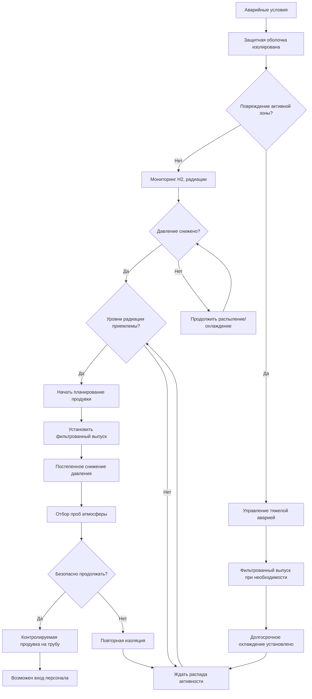

## Обзор

При аварийных условиях системы вентиляции защитной оболочки атомного реактора переходят с нормального режима работы на аварийные режимы, предназначенные для сохранения целостности защитной оболочки, удаления остаточного тепла, управления горючими газами и защиты окружающей среды от радиоактивных выбросов.

## Изоляция защитной оболочки при сигнале аварии

### Логика автоматической изоляции

Изоляция защитной оболочки происходит в течение нескольких секунд после обнаружения аварийных условий:

**Сигналы изоляции:**
- Высокое давление в защитной оболочке (обычно >21 кПа изб.)
- Высокие уровни радиации в атмосфере защитной оболочки
- Сигнал инициирования впрыска теплоносителя (SIAS)
- Низкое давление в системе теплоносителя реактора
- Высокий дифференциальный перепад давления на паропроводе

**Закрытие запорных органов:**
- Изоляция фазы A: неосновные проходки закрываются немедленно
- Изоляция фазы B: основные системы изолируются при высоком давлении в защитной оболочке
- Избыточные запорные органы в последовательном расположении на каждой проходке
- Время закрытия запорного органа: 4–10 секунд (типичное значение)
- Источники питания: системы постоянного и переменного тока, связанные с безопасностью

### Классификация проходок

| Тип проходки | Способ изоляции | Время закрытия | Резервирование |
|-------------|-----------------|-----------------|-----------------|
| Подвод/отвод воздуха на продувку | Электроприводные задвижки | 5 секунд | Две последовательно |
| Люк оборудования | Ручное болтовое закрытие | До аварии | Одиночный барьер |
| Шлюз персонала | Взаимоблокированные двери | Поддерживается | Двойная дверь |
| Трубопроводы диаметром <5 см | Обратные клапаны | Мгновенно | Одиночный/двойной |
| Электрические | Герметизированная проходка | Постоянно | Граница давления |
| Контрольно-измерительные | Запорные органы | 10 секунд | Два последовательно |

## Управление водородом после аварии

### Механизмы образования водорода

При авариях с повреждением активной зоны реакции металл-вода генерируют водород:

$$Q_{H_2} = n_{Zr} \times \Delta H_{rxn}$$

Где:
- $Q_{H_2}$ = энергия, выделяемая при образовании водорода (кДж)
- $n_{Zr}$ = количество молей окисляемого циркония
- $\Delta H_{rxn}$ = энтальпия реакции (586 кДж/моль для Zr + 2H₂O)

**Реакция циркония с водой:**
$$Zr + 2H_2O \rightarrow ZrO_2 + 2H_2 + \text{энергия}$$

### Системы управления водородом

**Пассивные автокаталитические рекомбинеры (ПАР):**
- Каталитическая поверхность способствует реакции H₂ + ½O₂ → H₂O при окружающей температуре
- Не требуется электропитание, самоинициирующееся выше 1–2% H₂
- Выделение тепла: примерно 242 кДж/моль рекомбинированного H₂
- Распределение: 50–100+ установок по всей защитной оболочке
- Проектная производительность: предотвращает концентрацию H₂ >10%

**Системы намеренного зажигания:**
- Калильные зажигатели активируются при заданной концентрации H₂
- Контролируемое сгорание предотвращает дефлаграцию/детонацию
- Типичная активация: 8–10% H₂ по объему
- Требования к питанию: батареи, связанные с безопасностью

**Системы перемешивания:**
- Вентиляторы рециркуляции воздуха в защитной оболочке
- Предотвращают расслоение и локальное скопление
- Расходы воздуха: 10 000–50 000 CFM (17 000–84 500 м³/ч) на вентилятор
- Избыточные вентиляторы на отдельных питающих подсистемах

## Методы охлаждения защитной оболочки

### Удаление остаточного тепла после аварии

Общее остаточное тепло после остановки реактора:

$$Q_{decay}(t) = Q_0 \times \left(0.066 \times \frac{t^{-0.2} - (t+T)^{-0.2}}{T^{0.2}}\right)$$

Где:
- $Q_{decay}(t)$ = остаточное тепло в момент времени t (МВт)
- $Q_0$ = тепловая мощность реактора перед остановкой (МВт)
- $t$ = время после остановки (секунды)
- $T$ = время работы реактора перед остановкой (секунды)

### Конфигурации системы охлаждения

**Системы распыления в защитной оболочке:**
- Расходы распыления: 7,6–15,1 м³/мин на поезд
- Покрытие распылением: >95% объема защитной оболочки
- Размер капель: 500–1 000 микрон для оптимального теплообмена/массопередачи
- Температура распыления: изначально близка к окружающей, повышается до 65–93°C
- Добавление химикатов: гидроксид натрия или тринатрийфосфат для удаления йода

Удаление тепла распылением:

$$Q_{spray} = \dot{m}_{spray} \times c_p \times (T_{vapor} - T_{spray,in})$$

Где:
- $Q_{spray}$ = мощность удаления тепла (кДж/ч)
- $\dot{m}_{spray}$ = массовый расход распыления (кг/ч)
- $c_p$ = удельная теплоемкость воды (4,18 кДж/кг·°C)
- $T_{vapor}$ = температура атмосферы защитной оболочки (°C)
- $T_{spray,in}$ = температура входа распыления (°C)

**Охладители воздуха защитной оболочки:**
- Избыточные установки: 2–4 на защитную оболочку
- Холодопроизводительность: 5,9–14,6 МВт на установку
- Расход воздуха: 40 000–70 000 CFM (68 000–118 800 м³/ч) на вентилятор
- Источник охлаждающей воды: служебная вода или контур охлаждения компонентов
- Работает при небольших течах, когда защитная оболочка остается недогретой

**Системы ледяного конденсатора (специфично для ВКР):**
- Масса льда: 900–1 350 т
- Поглощение тепла: примерно 334 кДж/кг (скрытая теплота плавления)
- Пассивная работа, инициируемая дифференциальным перепадом давления
- Давление открытия дверцы: 7–14 кПа изб.

## Системы фильтрованного выпуска

### Назначение и конструкция

Системы фильтрованного выпуска защитной оболочки предотвращают разрушение из-за избыточного давления во время продолжительных тяжелых аварий при минимизации радиоактивных выбросов.

**Критерии активации выпуска:**
- Давление в защитной оболочке приближается к проектному пределу (310–410 кПа)
- Альтернативное питание переменного тока недоступно
- Системы охлаждения защитной оболочки неработоспособны
- Повреждение активной зоны подтверждено или весьма вероятно

**Технологии фильтрации:**

| Тип фильтра | Эффективность удаления | Целевые вещества | Конфигурация |
|-----------|----------------------|-----------------|--------------|
| Металлический волокнистый предфильтр | >99% для частиц >1 мкм | Крупные частицы | Входная ступень |
| Вентури-скруббер | 95–99,9% для аэрозолей | Соединения цезия, йода | Первичная |
| Металлический волокнистый HEPA | >99,9% для частиц >0,3 мкм | Тонкие аэрозоли | Вторичная |
| Молекулярное сито | >95% для элементарного йода | I₂, органические йодиды | Третичная |

**Коэффициенты дезактивации:**
- Общий коэффициент удаления аэрозолей: 1 000–10 000
- Элементарный йод: 100–1 000
- Инертные газы: 1 (нет удержания)

## Рассмотрение тяжелых аварий

### Механизмы воздействия на защитную оболочку

**Угрозы избыточного давления:**
- Образование пара от взаимодействия активной зоны с бетоном
- Накопление инертных газов (H₂, CO, CO₂)
- Потеря охлаждения защитной оболочки
- Проектное давление обычно 310–410 кПа; прогнозируемое разрушение при 620–1 030 кПа

**Тепловые нагрузки:**
- Прямой нагрев защитной оболочки при выбросе расплава под высоким давлением
- Сгорание водорода
- Обломки активной зоны на полу защитной оболочки

**Проникновение в основание:**
- Взаимодействие расплавленного кориума с бетоном (MCCI)
- Скорость разрушения: 5–15 см/ч в зависимости от типа бетона
- Образование газа усугубляет проблему избыточного давления

### Стратегии смягчения последствий

**Затопление полости:**
- Намеренное затопление полости реактора 0,9–1,8 м воды
- Стабилизирует обломки активной зоны, предотвращает проникновение в основание
- Образование пара управляемо системами распыления

**Управление воспламенением водорода:**
- Контролируемое сгорание предпочтительнее отложенной дефлаграции
- Инертные защитные оболочки (ВКР с азотом) исключают риск горения

## Последовательности восстановительной вентиляции

### Восстановление атмосферы защитной оболочки после аварии

### Восстановление системы продувки

**Предварительные условия для продувки:**
- Давление в защитной оболочке <7 кПа выше атмосферного
- Концентрация водорода <2% по объему
- Уровни радиации позволяют работать HEPA/угольным фильтрам
- Удаление остаточного тепла установлено и стабильно
- Одобрение организацией экстренного реагирования

**Последовательность продувки:**
1. **Выравнивание системы** (0–2 часа):
   - Проверить целостность и перепад давления фильтровального поезда
   - Установить способность создания отрицательного давления в защитной оболочке
   - Подтвердить рабочее состояние мониторинга на трубе

2. **Начальный выпуск** (2–24 часа):
   - Расход: 100–500 CFM (170–850 м³/ч) изначально
   - Сохранять отрицательное давление: -25–127 Па
   - Непрерывный мониторинг стека и атмосферы защитной оболочки

3. **Полная работа продувки** (1–7 суток):
   - Увеличить расход на проектные значения: 2 000–10 000 CFM (3 398–16 990 м³/ч)
   - Несколько смен объема для снижения загрязнения
   - Цель: <1% начальной активности в воздухе перед входом

**Параметры защитной оболочки во время восстановления:**

| Параметр | Пик аварии | Начало продувки | Вход разрешен |
|---------|-----------|-----------------|---------------|
| Давление (кПа изб.) | 310–410 | <7 | <0,7 |
| Температура (°C) | 121–177 | <65 | <49 |
| Влажность (%) | 100 | <95 | <80 |
| Концентрация H₂ (%) | 0–10+ | <2,0 | <0,5 |
| Уровень радиации (Зв/ч) | >2,76 | <0,276 | <0,000276 |
| Загрязнение в воздухе | Высокое | Среднее | Низкое |

## Заключение

Вентиляция защитной оболочки при аварийных условиях приоритизирует безопасность населения благодаря автоматической изоляции, удалению остаточного тепла, контролю горючих газов и путям фильтрованного выпуска. Восстановительная вентиляция позволяет получить доступ к защитной оболочке при сохранении радиологической защиты. Стратегии проектной основы и управления тяжелыми авариями обеспечивают целостность защитной оболочки во всем спектре постулируемых событий.
