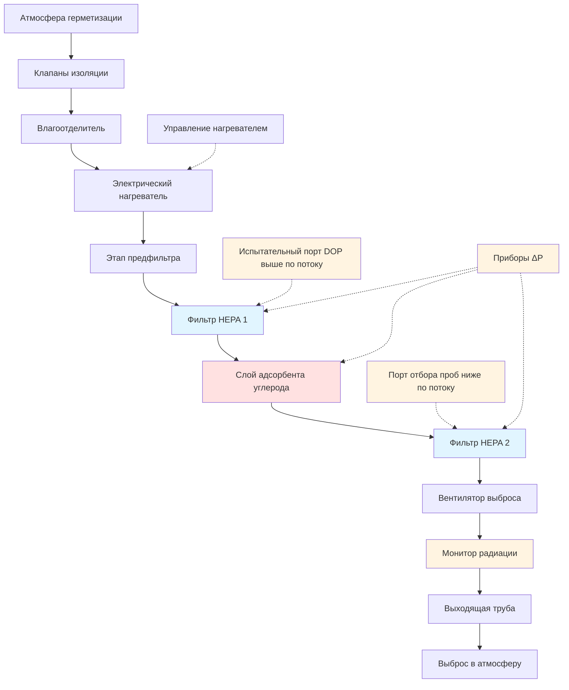

Системы фильтруемого выброса для ядерной герметизации представляют собой финальный инженерный барьер против выброса радиоактивного материала в окружающую среду. Эти системы должны достичь чрезвычайно высокой степени удаления радионуклидных частиц и газообразных изотопов йода как при нормальных условиях эксплуатации, так и в сценариях после аварии с повышенной температурой, влажностью и уровнями радиации.

## Требования к фильтрам HEPA

Высокоэффективные фильтры для удаления частиц воздуха (HEPA) образуют первичную защиту от выброса радиоактивных продуктов деления. Ядерные фильтры HEPA должны соответствовать строгим критериям производительности, установленным ASME AG-1 (Кодекс по ядерной обработке воздуха и газов), и должны быть проверены через индивидуальные испытания фильтра в соответствии с MIL-STD-282 или эквивалентными методами.

### Стандарты эффективности

Ядерные фильтры HEPA достигают минимальной эффективности удаления 99,97% для частиц размером 0,3 мкм, наиболее проникающего размера частиц (MPPS), где механизмы сбора переходят между диффузионно-доминирующим и пересечением-доминирующим режимами. Проникновение через фильтр HEPA рассчитывается как:

$$P = 1 - \eta = 0,0003$$

где $\eta$ представляет эффективность удаления. Для многоступенчатых конфигураций HEPA общее проникновение системы следует:

$$P_{total} = P_1 \times P_2 = (1 - \eta_1)(1 - \eta_2)$$

Двухступенчатая система HEPA достигает комбинированную эффективность:

$$\eta_{total} = 1 - (0,0003)^2 = 0,9999999 = 99,99999\%$$

Это соответствует коэффициенту дезактивации (DF):

$$DF = \frac{1}{P_{total}} = \frac{1}{9 \times 10^{-8}} \approx 11 000 000$$

### Конструкция и материалы

Ядерные фильтры HEPA используют глубокогофрированный медиа из боросиликатного стекловолокна с органическими связующими, устойчивыми к деградации от радиации. Стандартные размеры включают блоки 61 см × 61 см × 29 см, обеспечивающие примерно 4 700 CFM (м³/ч) производительности при перепаде давления 25 мм вод. ст. в чистом состоянии. Рамки фильтров, изготовленные из огнестойких материалов (обычно нержавеющей стали или фанеры с огнезащитной обработкой), обеспечивают конструктивную целостность в аварийных условиях.

Разделители между складками предотвращают контакт медиа при дифференциальной нагрузке давлением. Алюминиевые разделители преобладают в большинстве приложений, хотя конструкция из гофрированного медиа в некоторых современных конструкциях исключает разделители.

## Адсорбент на основе активированного угля для удаления йода

Радиоактивные изотопы йода (в основном I-131, I-132, I-133, I-135) представляют наиболее значительную опасность летучих продуктов деления. Эти изотопы концентрируются в щитовидной железе после вдыхания, что делает эффективность удаления критической для ограничения дозы. Адсорбенты на основе активированного угля захватывают йод посредством физической адсорбции на активированном угле, пропитанном химическими веществами для повышения удержания.

### Типы пропиток

Уголь для ядерного применения использует специфические пропитки, оптимизированные для видов йода:

**Углерод, пропитанный триэтилендиамином (TEDA):**
- Стандартная пропитка: 2–5% TEDA по весу
- Повышенная производительность для метилиодида (CH₃I)
- Эффективность: 95–99% для органического йода при глубине слоя 5–10 см
- Рекомендуется для большинства ядерных приложений

**Углерод, пропитанный йодидом калия (KI):**
- Историческое использование в ранних установках
- Лучшая производительность элементарного йода (I₂)
- Более низкая эффективность органического йода, чем TEDA
- Проблемы с чувствительностью к влаге

### Параметры конструкции слоя

Слои адсорбента на основе активированного угля следуют специфическим геометрическим параметрам и параметрам потока для достижения конструктивной эффективности:

| Параметр | Значение конструкции | Основание |
|-----------|----------------------|----------|
| Глубина слоя | 5–10 см | Требование времени пребывания |
| Лицевая скорость | 12 м/мин макс. | Перепад давления, эффективность |
| Время пребывания | 0,10–0,25 сек | Кинетика адсорбции |
| Относительная влажность | <70% при слое | Предотвращение загрязнения влагой |
| Температура | <121°C | Безопасность воспламенения углерода |
| Размер сетки углерода | 8×16 или 12×30 | Оптимизация площади поверхности |

Эффективность удаления йода связана с временем пребывания посредством эмпирической корреляции:

$$\eta = 1 - e^{-kt}$$

где $k$ — константа скорости адсорбции (зависит от типа углерода, пропитки и вида йода) и $t$ — время пребывания, рассчитываемое как:

$$t = \frac{L}{v} = \frac{L}{Q/A}$$

где $L$ — глубина слоя, $v$ — лицевая скорость, $Q$ — объемный расход, $A$ — площадь поверхности слоя.

## Конструкция предфильтра для защиты HEPA

Этапы предфильтрации защищают дорогостоящие фильтры HEPA от преждевременного загрязнения путем удаления более крупных частиц и капель аэрозоля, которые быстро увеличили бы перепад давления HEPA.

### Влагоотделители

Влагоотделители (демистеры) удаляют захваченные капли воды из смесей пара-воздуха после аварии перед достижением фильтров HEPA. Эти устройства достигают 99% эффективности удаления капель диаметром более 3 мкм посредством инертного удара о плотно расположенные гофрированные поверхности.

Соображения при проектировании включают:

- Лицевая скорость: 90–150 м/мин
- Перепад давления: 13–38 мм вод. ст. в чистом состоянии
- Материалы: Нержавеющая сталь для устойчивости к коррозии
- Дренаж: Гравитационные дренажи, предотвращающие повторное захватывание

### Предфильтры

Предфильтры стандартной эффективности (рейтинг MERV 8–11) удаляют грубую пыль и мусор, продлевая срок службы HEPA. Типичные расположения включают:

**Двухступенчатая предфильтрация:**
1. Черновой фильтр (MERV 8): 30–40% эффективность @ 1,0 мкм
2. Промежуточный фильтр (MERV 11): 60–75% эффективность @ 1,0 мкм

Предфильтры требуют регулярной замены на основе мониторинга дифференциального давления, обычно когда ΔP превышает 51 мм вод. ст. или удваивается от чистого состояния.

## Испытание фильтров и замена

### Испытание на месте установки

Фильтровальные тракты подвергаются комплексному испытанию на месте установки после монтажа и периодически во время эксплуатации для проверки продолжающейся производительности. ASME N510 устанавливает протоколы испытаний, включая:

**Тест проникновения аэрозоля DOP/PAO:**
- Вводит монодисперсный аэрозоль 0,3 мкм выше по потоку
- Измеряет проникновение ниже по потоку с помощью фотометра
- Приемка: <0,05% проникновение (99,95% эффективность)
- Частота: После установки, ежегодно, после обслуживания

**Тест галогенированного углеводорода (фреон) для активированного угля:**
- Вводит газ хладагента (исторически R-11, теперь R-134a)
- Измеряет концентрацию ниже по потоку с помощью газовой хроматографии
- Приемка: Соответствует конструктивной эффективности (обычно >95%)
- Частота: После установки, ежегодно, после замены углерода

**Тест перепада давления:**
- Измеряет ΔP на каждом этапе фильтра
- Определяет загруженные фильтры, требующие замены
- Устанавливает тенденции данных для прогнозирующего обслуживания

### Лабораторные испытания

Удаленные образцы активированного угля подвергаются лабораторному анализу в соответствии с ASTM D3803 для определения остаточной адсорбционной способности:

**Тест проникновения метилиодида:**
- Подвергает образец углерода потоку воздуха, нагруженного CH₃I
- Измеряет концентрацию ниже по потоку
- Рассчитывает коэффициент дезактивации: $DF = C_{in}/C_{out}$
- Приемка: DF >100 при глубине слоя 5 см, 21°C, 95% ОВ

Слои углерода требуют замены, когда испытания указывают на эффективность ниже административных пределов (обычно 95% конструктивной эффективности) или после воздействия дозы радиации превышает пределы производителя (обычно 10⁸ рад поглощенной дозы).

### Критерии замены фильтра HEPA

Фильтры HEPA требуют замены при:

1. Испытание на месте показывает >0,05% проникновение
2. Дифференциальное давление превышает максимальное конструктивное значение (обычно 102–152 мм вод. ст.)
3. Визуальная проверка выявляет повреждение медиа
4. Доза радиации достигает конструктивного предела (обычно 10⁸ рад)
5. Подозревается повреждение от влаги или огня

## Мониторинг выброса в атмосферу

Непрерывный мониторинг фильтруемых выбросов обеспечивает обнаружение в реальном времени аномального выброса радиоактивного материала и документирование соответствия нормативным требованиям.

### Системы мониторинга радиации

**Мониторинг частиц:**
- Фиксированная фильтровальная бумага непрерывно собирает частицы
- Детектор бета-гамма контролирует накопленную активность
- Типичная чувствительность: 10⁻¹¹ мкКи/см³
- Точки срабатывания сигнала тревоги на административных пределах

**Мониторинг йода:**
- Угольный картридж адсорбирует изотопы йода
- Гамма-спектрометрия определяет конкретные изотопы
- Отдельный канал для обнаружения йода в реальном времени

**Мониторинг благородных газов:**
- Непрерывный гамма-детектор в потоке образца
- Компенсирован за естественное фоновое излучение
- Определяет Kr-85, Xe-133 и другие благородные газы

### Конструкция системы отбора проб

Представительный отбор проб требует изокинетического извлечения из выходящей трубы:

$$v_{sample} = v_{stack} \cdot \frac{A_{probe}}{A_{sample}}$$

где согласование скорости обеспечивает точный сбор частиц. Зонды образца располагаются в местах профиля равномерного потока (обычно 7–10 диаметров воздуховода ниже по потоку от нарушений потока) с усредненными несколькими точками извлечения для выходных труб большого диаметра.

## Пределы выброса в атмосферу

### Нормативные пределы дозы

Правила NRC в соответствии с 10 CFR 20 и 10 CFR 50 Приложение I устанавливают пределы дозы для плановых выбросов радиоактивных материалов:

| Путь | Предел дозы | Нормативное основание |
|------|-------------|----------------------|
| Все тело | ≤250 мЗв/год | 10 CFR 50 Прил. I (жидкое) |
| Щитовидная железа | ≤750 мЗв/год | 10 CFR 50 Прил. I (газообразное) |
| Любой орган | ≤250 мЗв/год | 10 CFR 50 Прил. I (жидкое) |
| Граница площадки | ≤5 000 мЗв/год | 10 CFR 20.1301 |
| Цель ALARA | <10% пределов | Руководство по регулированию 1.109 |

Эти пределы применяются к нормальной эксплуатации; критерии дозы после аварии следуют 10 CFR 50.67 (альтернативный исходный терм), допуская 250 мЗв щитовидной железы, 50 мЗв общего эквивалента эффективной дозы (TEDE) на границе зоны исключения.

### Пределы технических спецификаций

Технические спецификации каждого объекта устанавливают административные пределы выброса на основе моделирования дозы с учетом конкретных площадок, используя утвержденные методологии (обычно GASPAR II или эквивалентные коды). Пределы выброса учитывают:

- Метеорология площадки (значения χ/Q в критических местах расположения рецепторов)
- Распределение население
- Смесь радионуклидов (изотопный состав)
- Несколько путей выброса
- Консервативные коэффициенты преобразования дозы

Типичные годовые пределы выброса могут определять:

- Благородные газы: <10–20 Кi продуктов деления газов
- Йод: <0,1–1,0 Кi эквивалента I-131
- Частицы: <0,1–0,5 Кi брутто-активность

Системы фильтруемого выброса обеспечивают, что фактические выбросы остаются малыми долями этих пределов благодаря продемонстрированной высокой эффективности удаления и непрерывной проверке производительности.

## Поток технологического процесса системы

## Спецификации фильтровального тракта

| Компонент | Спецификация | Производительность |
|-----------|--------------|-------------------|
| **Влагоотделитель** | Пластины из нержавеющей стали | 99% @ 3 мкм капли |
| **Электрический нагреватель** | 20–50 кВт мощность | Снизить ОВ до <70% |
| **Предфильтр** | MERV 11, 61×61×10 см | 65% @ 1,0 мкм |
| **Этап HEPA 1** | Тип A, 61×61×29 см | 99,97% @ 0,3 мкм |
| **Слой углерода** | TEDA-пропитанный, 5 см глубина | 95% метилиодид |
| **Этап HEPA 2** | Тип A, 61×61×29 см | 99,97% @ 0,3 мкм |
| **Датчики ΔP** | Диапазон 0–250 мм вод. ст. | ±1% точность |
| **Вентилятор выброса** | Центробежный, 4 700 CFM (м³/ч) | 380 мм вод. ст. статическое |
| **Монитор выходящей трубы** | Бета-гамма, йод, благородный газ | 10⁻¹¹ мкКи/см³ чувствительность |

Системы фильтруемого выброса для ядерной герметизации демонстрируют наивысший уровень инженерной строгости при проектировании HVAC, сочетая избыточные этапы фильтрации, непрерывный мониторинг производительности и консервативные конструктивные припуски для обеспечения безопасности общественности при всех условиях эксплуатации и аварийных сценариях проектирования.
