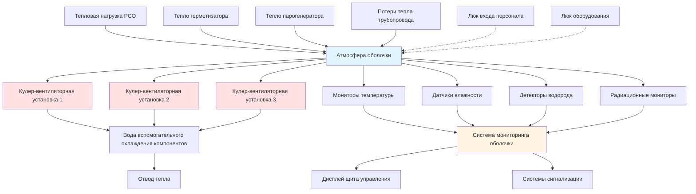

## Системы охлаждения воздуха оболочки

Во время нормальной эксплуатации оболочки ядерного реактора требуется непрерывное охлаждение для поддержания приемлемых уровней температуры и влажности. Система охлаждения оболочки удаляет тепло, производимое оборудованием системы охлаждения реактора, насосами, клапанами и трубопроводами посредством комбинации явного и скрытого теплообмена.

Общая тепловая нагрузка состоит из излучения оборудования, потерь конвекции и фильтрации окружающего воздуха:

$$Q_{total} = Q_{equipment} + Q_{radiation} + Q_{convection} + Q_{infiltration}$$

Типичные тепловые нагрузки оболочки во время нормальной эксплуатации составляют от 5,3 до 15,9 ГДж/ч в зависимости от размера и конструкции реактора. Система охлаждения должна поддерживать температуру оболочки ниже предельных значений конструкции, обычно 49-54°C, чтобы обеспечить работоспособность оборудования и целостность конструкции.

## Эксплуатация кулер-вентиляторных установок

Кулер-вентиляторные установки оболочки (CFCU) служат основным механизмом удаления тепла во время нормальной эксплуатации. Эти установки состоят из центробежных или осевых вентиляторов, которые циркулируют воздух оболочки через оребренные теплообменники, охлаждаемые водой вспомогательного охлаждения компонентов или технической водой.

Каждая CFCU работает в конфигурации низкой скорости во время нормальных условий:

$$Q_{cooler} = \dot{m}_{air} \cdot c_p \cdot (T_{in} - T_{out})$$

Где расходы воздуха обычно составляют от 1020 до 1700 CFM (м³/ч) на единицу. Большинство конструкций оболочек включают 3-5 CFCU, из которых 2-3 работают непрерывно, а остальные находятся в резерве. Удаление тепла со стороны охлаждающей воды следует:

$$Q_{water} = \dot{m}_{water} \cdot c_p \cdot (T_{out} - T_{in})$$

Кулер-вентиляторные установки позиционируются для создания оптимальных схем циркуляции воздуха, направляя холодный воздух в области с высокими тепловыми нагрузками и устанавливая тепловую стратификацию, которая предотвращает возникновение горячих зон. Размещение установки учитывает доступ к оборудованию, защиту от излучения и помехи воздушного потока.

## Мониторинг атмосферы оболочки

Непрерывный мониторинг состава атмосферы оболочки обеспечивает раннее обнаружение аномальных условий. Система мониторинга отслеживает несколько параметров через стратегически расположенные точки отбора проб.

Датчики температуры по всей оболочке измеряют как температуру общей атмосферы, так и температуру локальных горячих зон. Датчики влажности обнаруживают увеличение влаги, которое может указывать на утечку из систем охлаждения реактора. Радиационные мониторы обеспечивают немедленное указание на отказ оболочки топлива или нарушение первичной системы.

Системы отбора воздуха непрерывно анализируют атмосферу оболочки на наличие радиоактивных благородных газов, йода и твердых частиц. Эти системы включают зонды изокинетического отбора, фильтры для твердых частиц, картриджи с активированным углем и оборудование гамма-спектрометрии.

## Контроль концентрации водорода

Во время нормальной эксплуатации концентрация водорода в атмосфере оболочки остается незначительной, но системы мониторинга сохраняют бдительность в отношении любого накопления. Радиолиз воды или химические реакции могут производить небольшие количества водорода.

Стратегия контроля водорода во время нормальной эксплуатации включает:

- Непрерывный мониторинг концентрации водорода детекторами чувствительностью 0,1%
- Пассивные автокаталитические рекомбайнеры (PAR), расположенные по всей оболочке
- Возможность продувки водорода через систему продувки и выхлопа оболочки
- Административные пределы, требующие действия, если концентрация превышает 0,5%

Большинство современных конструкций оболочек ограничивают концентрацию водорода менее чем 2% по объему во всех режимах работы, чтобы предотвратить риск дефлаграции.

## Вентиляция входа персонала

Доступ персонала к оболочке во время работы на мощности происходит только под строгим административным контролем и обычно ограничен по продолжительности. Когда требуется вход, временные вентиляционные меры обеспечивают безопасность работников.

Система вентиляции входа персонала обеспечивает:

1. Положительное давление в люках доступа для предотвращения распространения загрязнения
2. Системы подачи дыхательного воздуха для работников в зонах высокой радиации
3. Временные портативные вентиляционные установки для локального охлаждения
4. Непрерывный мониторинг воздуха в точках входа и выхода

Дифференциальное давление люка обычно поддерживает 63-127 Па относительно оболочки. Последовательность доступа включает несколько дверей с блокировками, предотвращающими одновременное открытие.

## Удаление тепловой нагрузки оборудования

Отдельные элементы оборудования создают различные тепловые нагрузки, требующие целевых подходов охлаждения. Основные источники тепла включают насосы системы охлаждения реактора, герметизатор, парогенераторы и связанные трубопроводы.

| Оборудование | Тепловая нагрузка (кДж/ч) | Метод охлаждения |
|-----------|-------------------|----------------|
| Моторы насосов РСО (каждый) | 1269000 | Прямое воздушное охлаждение |
| Герметизатор | 845000 | Естественная конвекция |
| Парогенераторы (каждый) | 634000 | Излучение/конвекция |
| Трубопровод РСО | 2113000 | Циркуляция окружающего воздуха |
| Клапаны и проходки | 528000 | Локальное движение воздуха |

Эффективность удаления тепла зависит от схем воздушного потока, установленных эксплуатацией CFCU:

$$h_{conv} = \frac{Nu \cdot k}{L}$$

Где число Нуссельта (Nu) варьируется в зависимости от числа Рейнольдса и геометрии поверхности. Вынужденная конвекция от эксплуатации CFCU значительно улучшает коэффициенты теплопередачи по сравнению с одной только естественной конвекцией.

Отделения оборудования получают выделенный воздушный поток через тщательно спроектированные вентиляционные пути. Конструктивные элементы, такие как полы, стены и шкафы оборудования, направляют воздух, чтобы обеспечить адекватное охлаждение всех компонентов при поддержании приемлемых температур окружающей среды для приборов и электрического оборудования.

## Параметры нормальной эксплуатации

Поддержание условий оболочки в пределах установленных лимитов обеспечивает работоспособность оборудования и запас по конструкции. Следующая таблица представляет типичные параметры нормальной эксплуатации:

| Параметр | Нормальный диапазон | Предельное значение конструкции | Уровень действия |
|-----------|--------------|--------------|--------------|
| Температура | 21-43°C | 54°C | 49°C |
| Относительная влажность | 30-70% | 90% | 80% |
| Давление | -3,4 до +3,4 кПа | 345 кПа | ±6,9 кПа |
| Концентрация водорода | <0,1% | 4% | 0,5% |
| Уровень радиации | <0,01 мЗв/ч | Н/Д | 0,05 мЗв/ч |
| Воздухообмены | 2-4 в час | Н/Д | <1 в час |
| Емкость охлаждения CFCU | 60-80% | 100% | >95% |

Система вентиляции поддерживает эти параметры посредством автоматического управления эксплуатацией CFCU, расходами охлаждающей воды и периодической продувкой при приближении водорода или влажности к уровням действия. Непрерывный мониторинг с избыточной приборостроением обеспечивает операторов информацией о статусе оболочки в режиме реального времени и ранним предупреждением о деградирующих условиях.
