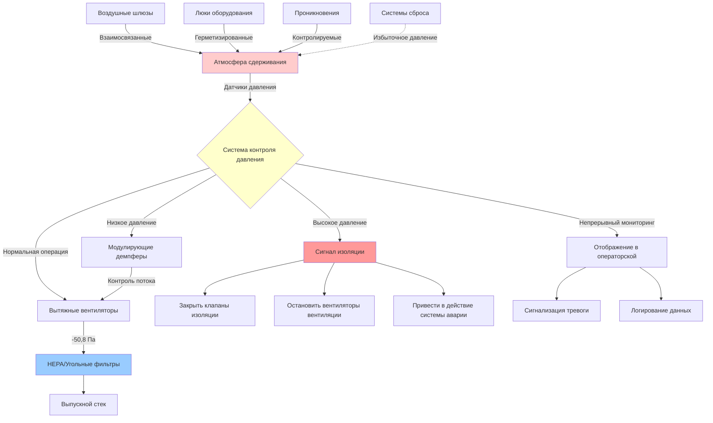

Контроль давления в зданиях ядерного сдерживания представляет одну из наиболее критических функций безопасности в конструкции HVAC ядерных объектов. Система вентиляции сдерживания должна поддерживать точные дифференциальные давления для предотвращения выброса радиоактивного материала при нормальной эксплуатации и в аварийных сценариях.

## Требования поддержания отрицательного давления

Здания ядерного сдерживания работают под отрицательным давлением относительно прилегающих областей, чтобы обеспечить движение воздушного потока в направлении областей с более высоким радиоактивным потенциалом. Этот каскад давлений предотвращает выход загрязненного воздуха в занятые или чистые помещения.

Первичные конструкции сдерживания обычно поддерживают давления в диапазоне от -25,4 до -63,5 Па ниже атмосферного давления при нормальной работе. Вторичное сдерживание или вспомогательные здания поддерживают промежуточные давления, создавая ступенчатый профиль давления.

Требуемый дифференциал давления $\Delta P$ через границы сдерживания рассчитывается на основе сценариев аварии, определяющих основу проектирования:

$$\Delta P = P_{\text{ref}} - P_{\text{cont}} \geq \Delta P_{\text{min}}$$

где $P_{\text{ref}}$ — референсное давление (обычно атмосферное или давление в прилегающем помещении), $P_{\text{cont}}$ — давление в сдерживании, и $\Delta P_{\text{min}}$ — минимальный требуемый дифференциал, обычно составляющий 25,4–63,5 Па для условий эксплуатации.

## Мониторинг дифференциального давления

Системы непрерывного мониторинга давления отслеживают дифференциалы через все границы сдерживания с избыточным приборостроением. Датчики давления измеряют дифференциалы в нескольких местах для обнаружения локализованных колебаний давления и обеспечения согласованной работы каскада давления.

Системы мониторинга обеспечивают:

- Индикацию дифференциального давления в реальном времени с разрешением 0,254 Па
- Уставки сигналов тревоги для условий высокого и низкого дифференциального давления
- Тренирование и логирование данных для документации нормативного соответствия
- Входные сигналы автоматической системы управления для регулирования давления
- Срабатывание систем безопасности при аномальных условиях

Датчики давления проходят периодическую калибровку и испытания в соответствии с нормативными требованиями, обычно ежеквартальные функциональные испытания и ежегодные калибровки с документированной прослеживаемостью до стандартов NIST.

## Требования давления сдерживания по областям

| Тип области | Дифференциал давления | Допуск | Частота мониторинга |
|-----------|----------------------|-----------|---------------------|
| Первичное сдерживание | -25,4 до -63,5 Па | ±5,1 Па | Непрерывно |
| Вторичное сдерживание | -25,4 до -38,1 Па | ±5,1 Па | Непрерывно |
| Здание обработки топлива | -12,7 до -25,4 Па | ±3,8 Па | Непрерывно |
| Вспомогательное здание | -7,6 до -20,3 Па | ±3,8 Па | Непрерывно |
| Люки оборудования | -25,4 до -50,8 Па | ±5,1 Па | Во время эксплуатации |
| Воздушные шлюзы персонала | Переменное | ±7,6 Па | За цикл |

## Аспекты воздушных шлюзов и входа персонала

Воздушные шлюзы персонала и оборудования поддерживают целостность сдерживания во время операций доступа через взаимосвязанные системы двойных дверей. Объем воздушного шлюза проходит уравнивание давления перед открытием двери, предотвращая скачки давления, которые могли бы нарушить сдерживание.

Последовательности контроля давления воздушного шлюза:

1. **Последовательность входа**: Внешняя дверь открывается при атмосферном давлении, персонал входит, внешняя дверь закрывается и блокируется, воздушный шлюз снижает давление до давления сдерживания, внутренняя дверь разблокируется и открывается
2. **Последовательность выхода**: Внутренняя дверь закрывается, воздушный шлюз повышает давление до атмосферного, внешняя дверь разблокируется после уравнивания давления
3. **Режим аварии**: Быстрое уравнивание с возможностями отмены и сигналами тревоги

Испытание герметичности воздушного шлюза проводится во время периодического интегрального испытания герметичности сдерживания (ILRT) с критериями приемки, определенными в 10 CFR 50 Приложение J.

## Испытания герметичности сдерживания

Интегральное испытание герметичности проверяет целостность сдерживания посредством испытания нагнетанием при условиях давления, определяющих основу проектирования. Испытание типа A происходит приблизительно с интервалом в 10 лет, в то время как испытания местной герметичности типов B и C происходят более часто на проникновениях и изолирующих клапанах.

Допустимая скорость утечки $L_a$ рассчитывается как процент объема сдерживания в день:

$$L_a = \frac{V_{\text{cont}} \times 0,01}{24 \text{ часа}} \times \frac{P_{\text{test}}}{P_{\text{atm}}}$$

где $V_{\text{cont}}$ — объем сдерживания и $P_{\text{test}}$ — давление испытания. Общая утечка должна оставаться ниже $L_a$ для демонстрации приемлемой производительности.

## Аварийный сброс давления

Конструкции сдерживания включают возможности сброса давления для предотвращения условий избыточного давления при авариях, определяющих основу проектирования. Системы сброса могут включать:

- **Дисковые разрывные клапаны**: Пассивные устройства, выходящие из строя при заранее установленных пороговых давлениях
- **Приводимые давлением клапаны сброса**: Активные системы с избыточной актуацией
- **Системы фильтруемого выпуска**: Контролируемые пути выпуска с удалением частиц и йода
- **Бассейны подавления**: Подавление давления путем конденсации пара

Уставки сброса устанавливаются значительно выше рабочих давлений, но ниже конструкционного давления сдерживания, обычно 90–95% от давления аварии, определяющей основу проектирования.

## Изоляция системы HVAC при высоком давлении

Клапаны изоляции сдерживания автоматически закрываются при сигналах высокого давления сдерживания для прекращения нормальной вентиляции и предотвращения путей выпуска. Логика изоляции включает:

- Избыточные датчики давления с логикой голосования 2-из-3
- Автоматическое закрытие демпферов изоляции подачи и выпуска
- Остановка вентиляторов нормальной вентиляции
- Срабатывание систем распыления сдерживания (если оборудовано)
- Запуск системы аварийной фильтрации для контролируемых выпусков

Уставка давления для изоляции обычно находится в диапазоне от -12,7 до +25,4 Па выше нормального рабочего давления, обеспечивая раннюю изоляцию до значительного подъема давления.

## Интеграция системы управления

Современные системы контроля давления сдерживания интегрируются с распределенными системами управления объекта (DCS), обеспечивая комплексный мониторинг и автоматическое регулирование. Контрольные циклы непрерывно регулируют скорости вытяжных вентиляторов и положения демпферов для поддержания целевых дифференциалов давления несмотря на колебания в утечке, тепловом расширении и операционной деятельности.

Система управления реализует алгоритмы пропорционально-интегрально-дифференциальные (PID) с плотными параметрами настройки для минимизации колебаний давления при избежании нестабильности управления. Типичное время отклика контрольного цикла составляет 30–60 секунд для небольших отклонений давления.

Системы контроля давления подвергаются обширному испытанию во время пуска объекта и плановых остановов на перезагрузку, с требуемой документированной проверкой производительности для нормативного соответствия и обеспечения безопасности эксплуатации.
