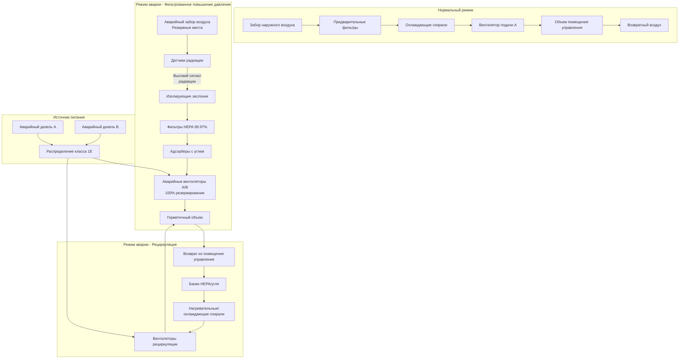

## Обзор систем аварийной вентиляции ядерных объектов

Системы аварийной вентиляции на атомных электростанциях поддерживают обитаемость помещений управления, центров технической поддержки и других критически важных областей во время сценариев аварий, включая проектные аварии (DBA), аварии с потерей теплоносителя (LOCA) и внешние опасности. Эти системы переходят из нормального режима в режимы аварии в течение нескольких секунд, обеспечивая фильтрованную рециркуляцию и повышение давления для защиты персонала от загрязнения воздуха радиоактивными веществами и токсичными газами.

Нормативно-правовые акты NRC в 10 CFR 50 Приложение A, Общий критерий проекта 19 и указания в NUREG-0800 Раздел 6.4 устанавливают требования к системам обитаемости помещения управления, гарантирующие, что операторы могут безопасно управлять реактором на протяжении всей аварии. Системы аварийной вентиляции должны функционировать независимо от нормальной HVAC, питаться от аварийных дизельных генераторов с сейсмической квалификацией и резервированием.

## Конструкция системы обитаемости помещения управления

### Нормативная база

**10 CFR 50 Приложение A, ОКП 19** требует, чтобы конструкция помещения управления:
- Обеспечивала занятость и эксплуатацию в условиях аварии без получения персоналом дозы радиации, превышающей 5 бэр ТЭКД (Полная эквивалентная доза) на протяжении всей аварии
- Защищала от опасности токсичных газов
- Обеспечивала надлежащую обитаемость для длительных сценариев аварий (минимум 30 суток)

**Критерии приемки NUREG-0800** для обитаемости помещения управления включают:
- Максимальная нефильтрованная утечка ≤10 CFM (16,99 м³/ч) для герметичного объема
- Эффективность фильтрованной рециркуляции ≥99% для частиц, ≥95% для галогенов
- Повышение давления ≥31 Па относительно смежных областей
- Активация режима аварии в течение 30 секунд после сигнала аварии

### Конфигурация системы

### Требования к целостности объема

Конструкция герметичного объема помещения управления поддерживает повышение давления в условиях нефильтрованной утечки:

$$Q_{leak} = C \cdot A_{leak} \cdot \sqrt{\Delta P}$$

Где:
- $Q_{leak}$ = нефильтрованная утечка (CFM)
- $C$ = коэффициент потока (CFM/√Па) в зависимости от геометрии утечки
- $A_{leak}$ = эквивалентная площадь утечки (см²)
- $\Delta P$ = перепад давления (Па)

**Типичные критерии целостности объема:**
- Измеренная утечка ≤10 CFM (16,99 м³/ч) при давлении испытания +31 Па
- Испытание на утечку в соответствии с ASTM E741 (метод повышения давления) или ASTM E779 (испытание вентилятором под давлением)
- Объем включает помещение управления, зоны отдыха операторов и аварийные объекты
- Герметизация проходов: кабельные лотки, кабелепроводы, трубопроводы, двери

**Расчет расхода повышения давления:**

$$Q_{press} = Q_{leak} + Q_{exfiltration} + Q_{makeup}$$

Где:
- $Q_{press}$ = требуемый расход повышения давления (CFM)
- $Q_{exfiltration}$ = проектная экспирация через шлюзы (CFM)
- $Q_{makeup}$ = наружный воздух для занятого персонала (обычно минимум 2,4-4,7 м³/ч на человека)

## Режимы ответа при аварии

### Логика переключения режимов

Системы аварийной вентиляции работают в нескольких режимах в зависимости от условий аварии:

| Режим | Сигнал активации | Наружный воздух | Рециркуляция | Фильтрация | Повышение давления |
|-------|------------------|-----------------|--------------|------------|-------------------|
| Нормальный | По умолчанию | 100% или смешанный | Да | Только предварительные фильтры | Опционально |
| Фильтрованное повышение давления | Высокая радиация или токсичный газ | Фильтрованный наружный воздух через HEPA/уголь | Да | HEPA + уголь | Да, ≥31 Па |
| Только рециркуляция | Экстремальное загрязнение | Изолирован | 100% | HEPA + уголь | Да, сниженный расход |
| После LOCA | Сигнал LOCA + таймер | Фильтрованный наружный воздух (с задержкой) | Да | HEPA + уголь | Да |

### Сценарии проектной аварии

**Авария с потерей теплоносителя (LOCA):**
- Немедленная изоляция нормальной вентиляции
- Активация аварийной рециркуляции в течение 30 секунд
- Первоначальный режим 100% рециркуляции на первые 30 минут
- Переход на фильтрованное повышение давления с минимальным наружным воздухом для персонала
- Уставки датчика радиации: 1-10 мбэр/ч для изоляции забора

**Авария при обращении с ядерным топливом:**
- Закрытие изолирующих заслонок при высокой радиации в выпускном отверстии здания реакторного отделения
- Переключение помещения управления на фильтрованное повышение давления
- Критична фильтрация йода-131 и частиц
- Расширенная продолжительность эксплуатации (дни-недели)

**Выброс ядовитого газа:**
- Обнаружение хлора, аммиака или другого опасного химического вещества
- Немедленная изоляция заборов наружного воздуха
- 100% рециркуляция до устранения опасности
- Мониторы ядовитых газов в местах забора с уставкой <10 млн⁻¹ для хлора

### Расчеты радиационной дозы

Анализ дозы в помещении управления в соответствии с Regulatory Guide 1.183:

$$TEDE = TEDE_{external} + TEDE_{inhalation}$$

**Компонент внешней дозы:**

$$TEDE_{external} = \int_0^{t_{mission}} \dot{D}_{shine}(t) \cdot SF_{shield} \, dt$$

Где:
- $\dot{D}_{shine}(t)$ = мощность дозы прямого излучения от облака и поверхностей (бэр/ч)
- $SF_{shield}$ = коэффициент экранирования для конструкции помещения управления
- $t_{mission}$ = время миссии (обычно 30 суток)

**Компонент дозы при ингаляции:**

$$TEDE_{inhalation} = \sum_{i} \int_0^{t_{mission}} \chi_i(t) \cdot BR \cdot DCF_i \, dt$$

Где:
- $\chi_i(t)$ = концентрация радионуклида $i$ в воздухе помещения управления (мкКи/м³)
- $BR$ = скорость дыхания (1,26×10⁻⁴ м³/с при легкой активности)
- $DCF_i$ = коэффициент пересчета дозы при ингаляции (бэр/мкКи)

**Влияние нефильтрованной утечки:**

$$\chi_{CR}(t) = \frac{Q_{leak} \cdot \chi_{ambient}(t) + Q_{filtered} \cdot \eta \cdot \chi_{ambient}(t)}{V_{CR} / t_{exchange}}$$

Где:
- $\chi_{CR}(t)$ = концентрация в помещении управления
- $\chi_{ambient}(t)$ = наружная концентрация
- $Q_{leak}$ = нефильтрованная утечка (CFM)
- $Q_{filtered}$ = расход фильтрованного забора (CFM)
- $\eta$ = эффективность фильтрации (0,99 для HEPA, 0,95 для угля/галогенов)
- $V_{CR}$ = объем помещения управления (м³)

## Конструкция системы фильтрованной рециркуляции

### Конфигурация фильтров HEPA и угля

**Двухступенчатые фильтрационные тракты:**
1. Влагоотделители/предварительные фильтры (MERV 8-11)
2. Фильтры HEPA первой ступени (99,97% при 0,3 мкм в соответствии с ASME AG-1)
3. Адсорберы с углем для радиойода (глубина слоя 5-10 см)
4. Фильтры HEPA второй ступени (99,97% захвата угольной пыли)

**Спецификации адсорберов с углем:**
- Активированный углерод, пропитанный йодидом калия (KI) или триэтилендиамином (TEDA)
- Минимальное время контакта: 0,25 секунды при проектном расходе
- Эффективность удаления: ≥95% для метилйода (CH₃I) в соответствии с ASTM D3803
- Максимальная скорость на фронте: 3,4 м/мин для предотвращения канализирования
- Контроль относительной влажности: 30-70% для оптимальной адсорбции

**Требования к корпусу фильтра:**
- Сейсмический дизайн категории I и испытания квалификации
- Герметичный корпус с портами испытания
- Способность к испытаниям аэрозолем DOP (диоктилфталат) в соответствии с ASME N510
- Мониторинг перепада давления на каждой ступени фильтра
- Противопожарная конструкция с минимальной устойчивостью 1,5 часа

### Испытания производительности и наблюдение

**Испытание HEPA на месте (ASME N510):**
- Испытание на аэрозоль DOP с проверкой эффективности 99,97%
- Максимальное проникновение: 0,05% (500 млн⁻¹ выше по потоку, 0,25 млн⁻¹ ниже по потоку допустимо)
- Частота испытаний: 18 месяцев или после замены фильтра
- Проверка распределения потока в пределах ±20% от среднего

**Испытание адсорбера с углем (ASME N509, ASTM D3803):**
- Испытание на проникновение метилйода на репрезентативных образцах
- Лабораторный анализ каждые 18 месяцев
- Максимально допустимое проникновение: 5% (95% эффективность удаления)
- Замена угля, если эффективность падает ниже 95% или после 4-8 лет

**Требования к наблюдению:**
- Непрерывный мониторинг перепада давления
- Автоматический сигнал тревоги при высоком перепаде давления (загрязнение фильтров) или низком (отказ фильтра)
- Ежемесячные визуальные проверки корпусов и заслонок
- Ежеквартальное отслеживание тенденций эффективности фильтра

## Интеграция аварийного дизельного генератора

### Требования к источнику питания класса 1E

Системы аварийной вентиляции подключаются к распределению электроэнергии класса 1E:

**Резервирование и разделение:**
- Независимые энергетические тракты Division A и Division B
- Каждый тракт питается отдельным аварийным дизельным генератором
- Физическое и электрическое разделение в соответствии с IEEE 384
- Соответствие критерию единственного отказа—потеря одного тракта поддерживает обитаемость

**Последовательность запуска дизельного генератора:**
- Нагрузки аварийной вентиляции помещения управления на первый цикл нагрузки (обычно 0-10 секунд)
- Приоритет равный или выше, чем у систем аварийного охлаждения активной зоны
- Непрерывный режим работы для миссии длительностью 7-30 суток
- Профиль нагрузки включает двигатели вентиляторов, приводы заслонок, приборы, нагревание/охлаждение

### Пример расчета нагрузки

**Электрические нагрузки аварийной вентиляции Division A:**

| Компонент | кВт | Коэффициент нагрузки | Рабочая мощность | Пусковая мощность |
|-----------|------|---------------------|-----------------|-----------------|
| Вентилятор подачи аварийный | 14,9 | 0,85 | 10,7 | 70,7 |
| Вентилятор рециркуляции A | 11,2 | 0,80 | 8,0 | 53,6 |
| Насос холодной воды | 7,5 | 0,70 | 4,7 | 35,8 |
| Приводы заслонок (10) | — | — | 0,4 | — |
| Система управления/мониторинга | — | — | 1,5 | — |
| **Всего Division A** | — | — | **25,3 кВ** | **70,7 кВА пусковой** |

Дизельный генератор должен обеспечивать одновременный пуск наибольшего двигателя (вентилятор подачи аварийный) плюс рабочие нагрузки.

### Последовательности пуска и управления

**Логика автоматического пуска:**
1. Сигнал впрыска безопасности (LOCA) ИЛИ датчик высокой радиации ИЛИ обнаружение ядовитого газа
2. Автоматический пуск дизельного генератора (целевое значение: 10 секунд до номинального напряжения и частоты)
3. Энергоснабжение аварийной шины и последовательность запуска
4. Закрытие изолирующих заслонок помещения управления (забор/выброс нормальной HVAC)
5. Последовательный пуск аварийных вентиляторов: вентилятор рециркуляции первым (0-5 сек), затем вентилятор фильтрованной подачи (5-10 сек)
6. Повышение давления достигнуто в течение 30 секунд после сигнала
7. Непрерывная эксплуатация до ручного сброса или завершения аварии

**Ручное управление:**
- Переключатели вручную в помещении управления для выбора режима с возможностью отмены
- Возможность ручного управления на месте у блоков вентиляторов
- Режим испытания для ежемесячного наблюдения без изоляции

## Нагревание и охлаждение в режиме аварии

Удаление тепла помещения управления во время аварийной эксплуатации поддерживает обитаемость:

**Источники тепловой нагрузки при аварии:**
- Занятой персонал: 1,17 кВт на человека явное тепло, 0,59 кВт на человека скрытое тепло (30-50 человек)
- Приборы и панели управления: 50-150 кВт
- Освещение: 6,8-17 Вт/м² (23-58 Вт/м²)
- Внешний приток тепла через объем: минимизирован экранированием конструкции

**Пример общей тепловой нагрузки (139 м² помещение управления):**

$$Q_{total} = Q_{occupants} + Q_{equipment} + Q_{lights} + Q_{envelope}$$

$$Q_{total} = (30 \times 1,76) + 100 + (10 \times 139 \times 10) + 4,4 = 1,45 \text{ МВт} = 412 \text{ кВт}$$

**Методы охлаждения:**
- Спирали охлажденной воды в тракте рециркуляции (наиболее распространено, сейсмически квалифицированные клапаны)
- Прямое расширение (DX) охлаждение с резервными компрессорами на аварийном питании
- Пассивное удаление тепла через проводимость в соседние охлаждаемые области (ограниченная емкость)

**Обеспечение нагревания:**
- Электронагреватели сопротивления в воздуховоде рециркуляции для холодной погоды
- Обычно емкость 10-30 кВт для поддержания минимума 21-24°C
- Терморегуляторное управление для предотвращения избыточного охлаждения при низкой нагрузке оборудования

## Нормативно-правовой базис NRC

### Ключевые нормативные акты и документы руководства

**10 CFR 50 Приложение A, Общие критерии проекта:**
- ОКП 2: Сейсмический и экологический дизайн
- ОКП 4: Конструкционные базы для экологических и динамических эффектов
- ОКП 19: Обитаемость помещения управления
- ОКП 60: Контроль выбросов радиоактивных материалов

**Руководства NRC:**
- RG 1.52: Критерии конструкции, контроля и испытания блоков воздушной фильтрации и адсорбции
- RG 1.95: Защита операторов помещения управления атомной электростанции от случайного выброса хлора
- RG 1.183: Альтернативные радиологические исходные термины для оценки проектных аварий
- RG 1.197: Демонстрация целостности конверта помещения управления на атомных электростанциях

**Документы NUREG:**
- NUREG-0800 План стандартного рассмотрения Раздел 6.4: Система обитаемости помещения управления
- NUREG-0737: Уточнение требований плана действий TMI (улучшения после TMI)

### Лицензирование и соответствие

**Требования сертификации конструкции:**
- FSAR (Окончательный отчет об анализе безопасности) Глава 6.4 описывает обитаемость помещения управления
- Радиологический анализ дозы, демонстрирующий <5 бэр ТЭКД для операторов
- Анализ единственного отказа, доказывающий адекватность резервирования
- Экологическая квалификация компонентов в соответствии с 10 CFR 50.49

**Испытания и наблюдение:**
- Предэксплуатационные испытания в соответствии с ASME N510 перед загрузкой топлива
- Испытание утечки Типа C конверта помещения управления в соответствии с 10 CFR 50 Приложение J (частота 6 лет)
- Технические спецификации требуют ежемесячное циклирование заслонок, ежеквартальные проверки перепада давления фильтра, испытание эффективности фильтра каждые 18 месяцев
- Ежемесячные контрольные пуски аварийного дизельного генератора с нагрузкой аварийной вентиляции

**Проверка и исполнение:**
- Инспекторы NRC убеждают в соответствии Техническим спецификациям
- Трехлетняя оценка обитаемости помещения управления в соответствии с RG 1.197
- Примеры нарушений: чрезмерная утечка, деградировавшая эффективность фильтра, отказы дизельного генератора

## Соображения по оптимизации конструкции

**Минимизация нефильтрованной утечки:**
- Доступ персонала через шлюзы с блокированными дверями
- Непрерывный мониторинг давления в объеме и корректировка расхода подпитки
- Герметизация всех проходов: расширяющаяся пена, силиконовый герметик, уплотненные пластины
- Ежеквартальное испытание трассирующего газа (SF₆) для выявления и устранения утечек

**Улучшения надежности:**
- Испытуемые изолирующие заслонки с индикацией положения и герметичным перекрытием
- Непрерывный мониторинг эффективности фильтра (детекторы радиации ниже по потоку)
- Автоматическое переключение между резервными вентиляторами при обнаружении отказа
- Резервное питание от батареи для критических заслонок и приборов (батареи класса 1E)

**Операционная гибкость:**
- Регулируемые расходы наружного воздуха для переменной занятости
- Возможность ручного управления балансом забора/выброса для оптимизации давления
- Портативные фильтровальные установки HEPA для дополнительной фильтрации во время обслуживания

Интеграция сейсмического дизайна, резервированного аварийного питания, высокоэффективной фильтрации и строгого тестирования гарантирует, что системы аварийной вентиляции помещения управления защищают операторов при самых суровых условиях аварии, обеспечивая безопасное отключение реактора и долгосрочное управление инвентаризацией теплоносителя.
