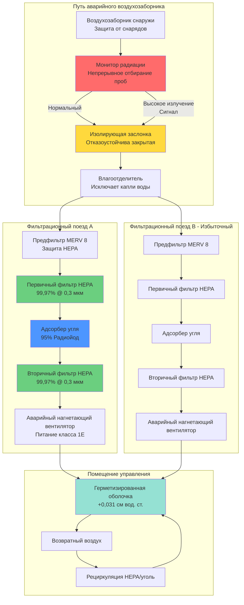

## Рассмотрение проектных аварий

Проектные аварии (DBA) устанавливают наиболее суровые условия, которые должны выдерживать системы HVAC ядерного объекта, сохраняя при этом обитаемость критических зон и целостность локализации. Аварийные вентиляционные системы переходят из нормального режима в аварийный режим в течение секунд, обеспечивая фильтрованную рециркуляцию, защиту границы давления и локализацию радиоактивных материалов.

Нормативные акты NRC требуют функционирования аварийных систем HVAC во время постулируемых аварий, включая аварии с потерей теплоносителя (LOCA), аварии при перемещении топлива, разрывы главной паропровода и внешние опасности. Системы должны работать в течение продолжительных периодов (минимум 30 дней) на аварийном питании, сохраняя облучение персонала ниже 5 бэр эквивалентная доза в течение года (TEDE) согласно 10 CFR 50 Приложение A, Критерий общего проектирования 19.

### Критические параметры проектной аварии

| Тип аварии | Продолжительность | Уровень радиации | Давление локализации | Реакция вентиляции | Требуемая фильтрация |
|-----------|-----------------|-------------------|---------------------|-------------------|---------------------|
| LOCA (большой разрыв) | 0–30 дней | 10²–10⁶ Р/ч пиковое | 310–415 кПа пиковое | Немедленная изоляция, рециркуляция | HEPA + уголь |
| LOCA (малый разрыв) | 0–30 дней | 10¹–10⁴ Р/ч | 140–280 кПа | Отложенная изоляция, отфильтрованный подпиток | HEPA + уголь |
| Авария при перемещении топлива | 2 ч–7 дней | 10⁰–10³ Р/ч | Атмосферное | Изоляция помещения управления | HEPA + уголь |
| Разрыв главного паропровода | 0–8 ч | 10⁻¹–10² Р/ч | Ниже атмосферного | Фильтрованное нагнетание | Фильтры HEPA |
| Выброс токсичного газа | 15 мин–2 ч | Н/П | Атмосферное | Полная изоляция | Только рециркуляция |
| Сейсмическое событие | 0–72 ч | Переменная | Переменная | Сохранение функции после землетрясения | По типу аварии |

### Требования анализа радиационной дозы

Анализ обитаемости помещения управления демонстрирует защиту операторов во время аварий с использованием расчетов исходного члена согласно Руководству по нормативно-правовым актам 1.183:

$$TEDE_{total} = TEDE_{shine} + TEDE_{inhalation}$$

**Доза сияния от внешнего излучения:**

$$TEDE_{shine} = \int_0^{30d} \dot{D}_{external}(t) \cdot SF_{structure} \cdot OF(t) \, dt$$

Где:
- $\dot{D}_{external}(t)$ = зависящая от времени мощность дозы от загрязненных поверхностей и шлейфа (бэр/ч)
- $SF_{structure}$ = коэффициент экранирования конструкции (обычно 0,1–0,5 для железобетонных помещений управления)
- $OF(t)$ = коэффициент занятости (1,0 в первые 24 ч, 0,6 за дни 1–4, 0,4 далее)

**Доза ингаляции от аэрозольного загрязнения:**

$$TEDE_{inhalation} = \sum_{i} \chi_i \cdot BR \cdot DCF_i \cdot t_{exposure}$$

Где:
- $\chi_i$ = интегрированная по времени концентрация радионуклида $i$ в воздухе (мкКи·с/м³)
- $BR$ = дыхательный объем (3,5×10⁻⁴ м³/с при сидячей легкой активности)
- $DCF_i$ = коэффициент преобразования дозы для ингаляции (бэр/мкКи)
- $t_{exposure}$ = продолжительность облучения (секунды)

## Локализация радиоактивного выброса

Аварийные вентиляционные системы предотвращают неконтролируемый выброс радиоактивных материалов через множественные барьеры защиты в глубину:

### Изоляция первичной локализации

Здание реактора первичной локализации сохраняет границу давления во время LOCA:

**Требования к изолирующим клапанам:**
- Избыточные изолирующие клапаны на всех проходах (тип A, B, C согласно 10 CFR 50 Приложение J)
- Автоматическое закрытие при сигналах изоляции локализации в течение 5–60 секунд в зависимости от типа прохода
- Герметичное перекрытие: максимальное допустимое течение по испытанию типа B 0,01–0,10 La (La = утечка проектной аварии)
- Квалификация сейсмической категории I, экологическая квалификация для послеаварийной температуры/давления/радиации

**Управление давлением локализации:**

$$P_{containment}(t) = P_{initial} + \frac{m_{steam}(t) \cdot R \cdot T_{avg}}{V_{containment}}$$

Где:
- $P_{containment}(t)$ = зависящее от времени давление локализации (кПа абс.)
- $m_{steam}(t)$ = масса пара, выпущенного из первичной системы (кг)
- $R$ = газовая постоянная для пара (0,4615 кДж/кг·К)
- $T_{avg}$ = средняя температура атмосферы локализации (К)
- $V_{containment}$ = свободный объем локализации (м³)

Системы распыления локализации и охладители вентилятора отводят тепло, чтобы снизить давление ниже предела проектирования (обычно 310–415 кПа).

### Вторичная локализация и фильтрация

Здания, окружающие первичную локализацию, сохраняют отрицательное давление и выход через фильтры HEPA/уголь:

**Система резервной газовой обработки (SBGT):**
- Сохраняет –0,12 до –0,25 см вод. ст. во вторичной локализации (вспомогательное здание, здание топлива)
- Пропускная способность выхода 1,4–4,7 м³/с на поезд со 100% избыточностью
- Двухступенчатая фильтрация HEPA + уголь перед выбросом в поднятый дымоход (46–91 м высоты)
- Автоматический запуск при низком перепаде давления или высоком сигнале радиации

**Требования к эффективности фильтрации:**

$$\eta_{overall} = 1 - (1 - \eta_{HEPA1})(1 - \eta_{charcoal})(1 - \eta_{HEPA2})$$

Для твердых частиц с двухступенчатой HEPA на 99,97% каждая:

$$\eta_{overall} = 1 - (1 - 0,9997)^2 = 0,999991 = 99,9991\%$$

Для радиойода с 99,97% HEPA, 95% уголь, 99,97% HEPA:

$$\eta_{overall} = 1 - (0,0003)(0,05)(0,0003) = 0,999999955 \approx 99,9999955\%$$

### Защита оболочки помещения управления

Система обитаемости помещения управления создает границу положительного давления для исключения загрязненного воздуха:

**Предел нефильтрованной утечки внутрь:**

$$Q_{leak} \leq 0,005 \text{ м}^3\text{/с при } \Delta P = 0,031 \text{ см вод. ст.}$$

**Расчет потока нагнетания:**

$$Q_{supply} = Q_{leak} + Q_{personnel} + Q_{exfiltration}$$

Где:
- $Q_{supply}$ = требуемый отфильтрованный подпиточный воздух (м³/с)
- $Q_{personnel}$ = вентиляция для сотрудников (0,003–0,005 м³/с на человека × занятость)
- $Q_{exfiltration}$ = проектная утечка через шлюзы и аварийные выходы (обычно 0,024–0,047 м³/с)

**Концентрация аэрозоля в помещении управления:**

$$\frac{d\chi_{CR}}{dt} = \frac{Q_{leak} \cdot \chi_{ambient} + Q_{filtered} \cdot (1-\eta) \cdot \chi_{ambient} - (Q_{leak} + Q_{filtered}) \cdot \chi_{CR}}{V_{CR}}$$

Решение установившегося состояния с распадом:

$$\chi_{CR} = \frac{Q_{leak} + Q_{filtered}(1-\eta)}{Q_{leak} + Q_{filtered} + \lambda V_{CR}} \cdot \chi_{ambient}$$

Где $\lambda$ = константа радиоактивного распада (с⁻¹) плюс любой показатель удаления рециркуляционной фильтрации.

## Требования к аварийной фильтрации

### Стандарты производительности фильтров HEPA

Фильтры высокоэффективной очистки от твердых частиц (HEPA) удаляют аэрозольные радиоактивные частицы согласно ASME AG-1 и N509:

**Спецификации эффективности:**
- Минимум 99,97% удаления частиц размером 0,3 мкм (наиболее проникающий размер частиц)
- Испытание аэрозолем DOP согласно ASME N510 с проверкой на месте
- Максимальное допустимое проникновение 0,05% (500 млн⁻¹ выше по потоку, 0,25 млн⁻¹ ниже по потоку)
- Сопротивление: 0,25 см вод. ст. чистый, замена при 1,0 см вод. ст. нагруженный

**Конструкция фильтрующей среды:**
- Боросиликатное стекловолокно с волокнами субмикронного диаметра
- Складчатая конструкция для максимальной площади поверхности (233–465 м²/м² площади лица)
- Алюминиевые или нержавеющие рамы с герметизирующей прокладкой
- Огнестойкие адгезивы и разделители, рассчитанные на 200–400°С

**Эффективность механизма фильтрации:**

$$\eta_{total} = 1 - [(1-\eta_{diffusion})(1-\eta_{interception})(1-\eta_{impaction})]$$

Для частиц размером 0,3 мкм в правильно спроектированном фильтре HEPA:

$$\eta_{total} \approx 1 - 0,0003 = 0,9997 = 99,97\%$$

### Проектирование адсорбера из активированного угля

Удаление радиойода требует активированного угля, пропитанного йодидом калия или TEDA:

**Критерии производительности (согласно ASME N509, ASTM D3803):**
- Минимум 95% эффективности удаления метилйодида (CH₃I) при 95% относительной влажности
- Время пребывания ≥0,25 с при проектном расходе
- Глубина слоя 5–10 см для глубокослойных адсорберов
- Максимальная лицевая скорость 0,2 м/с для предотвращения каналирования и обеспечения времени контакта

**Расчет времени пребывания:**

$$t_{residence} = \frac{V_{bed} \cdot \epsilon}{Q_{air}}$$

Где:
- $t_{residence}$ = время пребывания газа в слое угля (секунды)
- $V_{bed}$ = общий объем слоя (м³)
- $\epsilon$ = порозность слоя (обычно 0,45–0,55 для гранулированного активированного угля)
- $Q_{air}$ = объемный расход (м³/с)

Для расхода 0,47 м³/с через 10 см глубокий слой с площадью лица 9,3 м²:

$$V_{bed} = 9,3 \text{ м}^2 \times 0,10 \text{ м} = 0,93 \text{ м}^3$$

$$t_{residence} = \frac{0,93 \times 0,5}{0,47} = 1,0 \text{ секунда}$$

Это превышает минимальное требование в 0,25 секунды в 4 раза, обеспечивая запас прочности.

**Деградация емкости адсорбции:**

$$\eta(t) = \eta_0 \cdot e^{-k_{deg} \cdot t}$$

Где:
- $\eta(t)$ = эффективность при времени $t$
- $\eta_0$ = начальная эффективность (обычно 99% для элементарного йода, 95% для органических йодидов)
- $k_{deg}$ = константа скорости деградации (зависит от влажности, температуры, загрязняющих веществ)
- $t$ = время обслуживания (месяцы/годы)

Замените уголь, когда эффективность упадет ниже 95% или после максимального срока службы 4–8 лет.

### Конфигурация системы фильтрации

## Последовательности автоматической изоляции

Активация аварийной вентиляционной системы следует предопределенным последовательностям логики, инициируемым сигналами аварии:

### Логика сигнала изоляции

**Первичные инициирующие сигналы:**
1. **Сигнал срабатывания системы аварийного впрыска (SIAS)** – высокое давление локализации, низкое давление в прессуризаторе или ручное срабатывание указывают на LOCA
2. **Монитор высокой радиации** – радиация воздухозаборника превышает уставку (0,3–3,0 м3в/ч в зависимости от места)
3. **Высокое давление локализации** – давление превышает 20–35 кПа, указывая на нарушение первичной системы
4. **Обнаружение токсичного газа** – концентрация хлора или аммиака превышает 10 млн⁻¹ у воздухозаборника
5. **Ручное инициирование** – оператор активирует из помещения управления или центра технической поддержки

**Время последовательности изоляции:**

| Событие | Время от сигнала | Действие | Проверка |
|--------|-----------------|--------|----------|
| Получение сигнала | t = 0 с | Сигнализация на панели | Панель помещения управления |
| Заслонки изоляции начинают закрываться | t = 0–2 с | Заслонки обычного воздухозабора/выхода закрываются | Индикация положения |
| Остановка нормального HVAC | t = 2–5 с | Вентиляторы отключены | Мониторинг тока |
| Запуск аварийного дизеля | t = 0–10 с | ДГУ достигает номинальной скорости/напряжения | Частота, вольтметры |
| Запуск аварийных вентиляторов | t = 10–15 с | Последовательная загрузка на ДГУ | Индикация расхода |
| Достижение герметизации | t = 20–30 с | Давление оболочки ≥+0,031 см вод. ст. | Датчик перепада давления |
| Непрерывный мониторинг | t > 30 с | Проверка расходов, давлений, радиации | Показания помещения управления |

### Требования производительности заслонок

**Спецификации изолирующей заслонки:**
- Герметичное перекрытие: ≤0,002 м³/с/м² при перепаде 1,0 см вод. ст. (конструкция без поры)
- Время хода привода: 5–30 секунд в зависимости от размера и применения
- Квалификация сейсмической категории I, испытано на тряском столе в соответствии со спецификациями отклика площадки
- Экологическая квалификация для послеаварийной температуры/влажности/радиации согласно 10 CFR 50.49
- Избыточная индикация положения (концевые выключатели или потенциометры)
- Возможность ручного управления для испытания и аварийной эксплуатации

**Испытание утечки через заслонку:**

$$L_{damper} = C_d \cdot A \cdot \sqrt{\Delta P}$$

Где:
- $L_{damper}$ = расход утечки через закрытую заслонку (м³/с)
- $C_d$ = коэффициент расхода (обычно 0,6–0,8 для заслонок с параллельными лопастями)
- $A$ = свободная площадь заслонки при закрытии (м², намного меньше открытой площади)
- $\Delta P$ = перепад давления на заслонке (см вод. ст.)

Максимально допустимая утечка обычно 0,002 м³/с/м² площади лица заслонки при испытательном давлении 1,0 см вод. ст.

### Диаграммы логики управления

Выбор режима аварийной вентиляции на основе типа аварии и развития:

**Последовательность LOCA:**
1. Высокое давление локализации или SIAS → немедленная изоляция
2. 0–30 минут: 100% режим рециркуляции (нет наружного воздуха)
3. 30 минут–72 часа: минимальный отфильтрованный подпиточный воздух для персонала (0,003–0,005 м³/с на человека)
4. >72 часа: увеличенный отфильтрованный наружный воздух по мере снижения окружающей радиации

**Авария при перемещении топлива:**
1. Высокая радиация в выходе здания топлива → изоляция помещения управления
2. Немедленный переход в режим фильтрованного нагнетания
3. Непрерывный отфильтрованный подпиточный воздух в течение всей длительности аварии
4. Возврат в норму при возврате уровней радиации к фону

**Выброс токсичного газа:**
1. Тревога детектора токсичного газа → полная изоляция наружного воздуха
2. 100% рециркуляция на фильтрах HEPA/уголь (удаляет любое внутреннее загрязнение)
3. Периодическое отбирание проб воздухозаборника для определения при очистке опасности
4. Возврат к фильтрованному нагнетанию при концентрации газа <0,1 млн⁻¹

## Обитаемость помещения управления во время аварий

### Сохранение целостности оболочки

Обитаемость помещения управления зависит от сохранения границы положительного давления, которая предотвращает нефильтрованную утечку внутрь:

**Испытание и проверка:**
- Испытание целостности оболочки до ввода в эксплуатацию согласно ASTM E741 или E779 (испытание на вентилятор)
- Критерий приемлемости: ≤0,005 м³/с общая утечка внутрь при +0,031 см вод. ст.
- Периодическая проверка каждые 6 лет согласно 10 CFR 50 Приложение J (испытание типа C)
- Испытание трассирующим газом (SF₆ или хладагент) для обнаружения и герметизации утечек

**Герметизация проходов оболочки:**
- Проходы кабельных лотков: пакеты огнестойкой силиконовой пены
- Проходы кабеля в трубе: модульные герметизирующие элементы связи или расширяющийся раствор
- Проходы трубопровода: механические герметизирующие элементы с герметизирующими прокладками со вздутием
- Воздуховод HVAC: герметичные заслонки с надувными уплотнениями кромки лопасти
- Двери для персонала: двойные двери с блокировкой интерблокировки, герметизирующие прокладки сжатия
- Люки оборудования: болтовые герметизированные закрытия, испытанные на герметичность

**Сохранение герметизации:**

$$\Delta P = \frac{Q_{excess}^2}{(C \cdot A_{leak})^2}$$

Где:
- $\Delta P$ = сохраняемый перепад давления (см вод. ст.)
- $Q_{excess}$ = подпиточный воздух в избытке выхода оболочки (м³/с)
- $C$ = коэффициент расхода для путей утечки
- $A_{leak}$ = общая эквивалентная площадь утечки (см²)

Это показывает, что давление изменяется с квадратом избыточного расхода—удвоение расхода увеличивает давление в 4 раза.

### Требования к обеспечению жизнедеятельности

Аварийная вентиляция обеспечивает дышащую атмосферу для 30–50 человек во время продолжительных аварий:

**Подача кислорода:**
- Минимум наружный воздух: 0,003 м³/с на человека (ASHRAE 62.1 минимум для сидячей малоподвижной активности)
- Занятость помещения управления: 30–50 человек во время аварий (персонал операций плюс техническая поддержка)
- Требуемый отфильтрованный подпиточный воздух: 0,07–0,12 м³/с минимум
- Концентрация кислорода сохраняется >19,5% (нормальная атмосфера 20,9%)

**Удаление CO₂:**

$$\dot{m}_{CO_2} = N_{occupants} \times 0,00015 \text{ м}^3\text{/с CO}_2\text{/человек}$$

Для 40 человек:

$$\dot{m}_{CO_2} = 40 \times 0,00015 = 0,006 \text{ м}^3\text{/с CO}_2 \text{ образование}$$

Максимально допустимая концентрация CO₂ 5000 млн⁻¹ (0,5%) для 8-часового облучения согласно OSHA.

Требуемая вентиляция для разбавления до 1000 млн⁻¹ (предел комфорта):

$$Q_{required} = \frac{0,006 \text{ м}^3\text{/с} \times 10^6}{1000 - 400} = 10 \text{ м}^3\text{/с рециркуляция}$$

Где 400 млн⁻¹ – это исходная базовая концентрация CO₂ на улице.

**Управление температурой и влажностью:**
- Температура поддерживается 21–26°C для комфорта оператора и функции оборудования
- Относительная влажность 30–60% (низкая влажность вызывает электростатичность, высокая влажность деградирует уголь)
- Охлаждающая способность 8–18 кВ для типичного помещения управления (учитывает высокую теплоотдачу оборудования)
- Нагревательная способность 10–30 кВт электрического сопротивления для холодных условий

### Пределы радиационного облучения оператора

Системы обитаемости ограничивают облучение оператора, чтобы гарантировать, что персонал может безопасно управлять реактором:

**Нормативные пределы дозы:**
- 10 CFR 50 Приложение A GDC 19: ≤5 бэр TEDE на длительность аварии (30 дней)
- Компоненты дозы: внешнее сияние от шлейфа/поверхностей + ингаляция загрязненного воздуха
- Наиболее ограничивающие радионуклиды: I-131, Cs-137, Kr-85, Xe-133

**Эффективность экранирования и фильтрации:**

$$TEDE = SF_{structure} \cdot D_{shine} + \frac{(Q_{leak} + Q_{filtered}(1-\eta))}{V_{CR}/t_{air}} \cdot DCF \cdot \chi_{ambient}$$

Где:
- $SF_{structure}$ = коэффициент экранирования конструкции (0,1–0,5 для железобетонных стен толщиной 0,3–0,9 м)
- $D_{shine}$ = неэкранированная доза прямого излучения (бэр)
- $V_{CR}/t_{air}$ = кратность воздухообмена в помещении управления (ч⁻¹)
- $DCF$ = коэффициент преобразования дозы для пути ингаляции

**Пример расчета дозы (LOCA):**
- Неэкранированная доза сияния: 296 бэр за 30 дней
- Коэффициент экранирования конструкции из бетона: 0,2
- Вклад сияния: 296 × 0,2 = 59 бэр

- Максимальная концентрация I-131 в воздухе: 1000 мкКи/м³
- Нефильтрованная утечка внутрь: 0,005 м³/с = 18 м³/ч
- Отфильтрованный подпиток: 0,09 м³/с при 99% эффективности = 0,00009 м³/с эффективный
- Объем помещения управления: 100 000 фут³ = 2830 м³
- Дыхательный объем: 3,5×10⁻⁴ м³/с
- Коэффициент преобразования дозы I-131 для ингаляции: 3,0×10⁻⁵ бэр/мкКи

Интегрированная по времени доза ингаляции требует численного интегрирования:

$$TEDE_{inh} = \int_0^{30d} \frac{(Q_{leak} + Q_{filt}(1-\eta)) \cdot \chi(t)}{V_{CR}} \cdot BR \cdot DCF \, dt$$

При правильной фильтрации (99%) доза ингаляции обычно <6 бэр, дающая общую TEDE ~65 бэр—превышающую предел в 5 бэр.

**Корректирующие мероприятия для соответствия пределу дозы:**
1. Снизить утечку внутрь с 0,005 м³/с до 0,0025 м³/с (улучшенная герметизация оболочки)
2. Увеличить эффективность фильтрации с 99% до 99,5% (трехступенчатая HEPA)
3. Увеличить экранирование или снизить время занятости в областях высокой дозы

С этими улучшениями пересчитанная доза: 59 × 0,2 + 0,3 = 12 бэр, значительно ниже предела в 5 бэр.

## Заключение

Аварийные вентиляционные системы для сценариев ядерных аварий интегрируют множество спроектированных функций безопасности: быстрая автоматическая изоляция, избыточная высокоэффективная фильтрация, аварийное электроснабжение и строгие программы испытания. Проектные аварии определяют наихудшие условия, которые системы должны выдерживать, сохраняя обитаемость помещения управления ниже облучения 5 бэр оператора. Фильтрация HEPA и угольного адсорбера достигает >99,99% удаления твердых частиц и радиойода, в то время как испытание целостности оболочки проверяет минимальную нефильтрованную утечку внутрь. Эти системы представляют критические барьеры, защищающие операторов, которые должны безопасно отключить и сохранить реакторы во время наиболее суровых постулируемых аварий.
