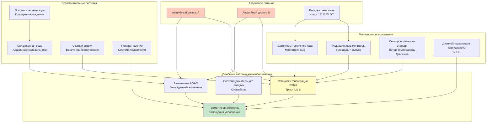

## Обзор систем жизнеобеспечения атомных станций

Системы жизнеобеспечения в атомных объектах обеспечивают возможность операторам помещений управления безопасно выполнять критические функции безопасности при проектных аварийных ситуациях и внешних опасностях в течение продолжительных периодов. Эти системы интегрируют защиту от токсичных газов, фильтрацию РХБН (радиологическая, химическая, биологическая, ядерная), системы подачи дыхательного воздуха, автономные установки HVAC и резервное питание для поддержания условий проживания минимум в течение 30 дней без внешней поддержки.

Критерий общего проектирования NRC 19 требует проектирования помещения управления, допускающего непрерывное проживание при аварийных условиях без превышения операторами дозы 5 Зв ЭОЭД (эффективная эквивалентная доза). Системы жизнеобеспечения обеспечивают защиту в несколько уровней от множественных одновременных опасностей: радиоактивного загрязнения, токсичных промышленных химикатов и отказа обычных систем здания.

## Требования защиты от токсичных газов

### Нормативная база и критерии проектирования

**Руководящие документы 1.78 и 1.95** устанавливают требования защиты от токсичных газов:
- Изоляция помещения управления от атмосферного выброса хлора, аммиака, диоксида серы и других опасных химикатов
- Пределы концентрации токсичных газов: ≤ИДВЖ (Немедленно опасны для жизни и здоровья) значения
- Время ответа обнаружения и изоляции: ≤30 секунд от сигнала тревоги до полной изоляции
- Минимальный безопасный период дыхания: 30 минут при 100% рециркуляции без деградации

**Типичные угрозы от токсичных газов:**
- Хлор: ИДВЖ = 10 ppm (объекты обработки воды)
- Аммиак: ИДВЖ = 300 ppm (системы холодоснабжения)
- Диоксид серы: ИДВЖ = 100 ppm (сжигание ископаемого топлива)
- Сероводород: ИДВЖ = 100 ppm (обработка сточных вод)

### Обнаружение и мониторинг токсичных газов

**Многоточечная система обнаружения:**
- Непрерывные мониторы на всех входах наружного воздуха (минимум 2 на каждый вход)
- Электрохимические или инфракрасные датчики с временем отклика <1 минуты
- Уставки тревог: 50% ИДВЖ для изоляции, 25% ИДВЖ для предварительной тревоги
- Автоматическая калибровка и проверка согласно ISA 12.13.01

**Интеграция метеорологических данных:**
- Датчики скорости и направления ветра для предсказания траектории облака
- Автоматический выбор входа на основе определения источника с наветренной стороны
- Моделирование рассеивания для конкретного объекта согласно NUREG/CR-6624

Концентрация токсичных газов в помещении управления при изоляции:

$$C_{CR}(t) = C_0 \cdot e^{-\lambda t} + \frac{Q_{leak} \cdot C_{ambient}}{\lambda \cdot V_{CR}} \cdot (1 - e^{-\lambda t})$$

Где:
- $C_{CR}(t)$ = концентрация в помещении управления в момент времени $t$ (ppm)
- $C_0$ = начальная концентрация в помещении управления (ppm)
- $\lambda$ = скорость изменения воздуха (ч⁻¹) = $(Q_{leak} + Q_{reaction}) / V_{CR}$
- $Q_{leak}$ = нефильтруемое внутреннее подсасывание (м³/ч)
- $V_{CR}$ = объем помещения управления (м³)
- $C_{ambient}$ = наружная концентрация (ppm)

**Проектная цель:** поддерживать $C_{CR}(t) < 0,1 \times ИДВЖ$ в течение минимум 30 минут.

## Возможности фильтрации РХБН

### Проектирование многоступенчатой фильтрации

Системы жизнеобеспечения включают фильтрацию РХБН военного уровня для защиты от боевых отравляющих веществ и промышленных опасностей:

**Четырехступенчатая конфигурация фильтрации:**

```mermaid
graph LR
    A[Аварийный воздухозаборник<br/>Несколько мест размещения] --> B[Предварительная ступень<br/>MERV 11-13]
    B --> C[Банк HEPA фильтров 1<br/>99,97% @ 0,3 мкм]
    C --> D[Активированные угольные адсорбенты<br/>Удаление химических веществ/газов]
    D --> E[Банк HEPA фильтров 2<br/>Захват угольной пыли]
    E --> F[Вентилятор подачи<br/>100% резервный]
    F --> G[Кондиционированный воздух<br/>в помещение управления]

    G --> H[Помещение управления<br/>Под давлением +0,031 кПа]
    H --> I[Возврат рециркуляции]
    I --> J[Охлаждающие/нагревающие змеевики]
    J --> K[HEPA/уголь рециркуляции]
    K --> C

    style H fill:#e1f5ff
    style D fill:#ffe1e1
```

### Технические характеристики РХБН фильтров

**Производительность HEPA фильтрации:**
- Минимальная эффективность: 99,97% при 0,3 мкм согласно тесту DOP MIL-STD-282
- Перепад давления: 0,25-0,50 кПа чистый, максимум 1,0 кПа загруженный
- Скорость через площадь поверхности: ≤1,27 м/с для оптимального сопротивления проникновению
- Конструкция: огнестойкий материал, непрерывное уплотнение по периметру

**Технические характеристики активированного угля для РХБН:**

| Параметр | Техническое требование | Метод испытания |
|----------|------------------------|-----------------|
| Тип угля | Пропитанный ASZM-TEDA | MIL-PRF-32016 |
| Глубина слоя | Минимум 5-10 см | ASTM D3467 |
| Время контакта | ≥0,25 секунд | Рассчитано при номинальном расходе |
| Удаление метилйодида | ≥95% @ 2,5 мг/м³ воздействие | ASTM D3803 |
| Удаление цианида хлора | ≥95% @ 150 мг/м³ | MIL-STD-282 |
| Удаление фосгена | ≥99% @ 10 000 мг·мин/м³ | NSF P248 |
| Относительная влажность | 30-70% оптимально | Непрерывный мониторинг |

**Защита от отравляющих веществ нервно-паралитического действия:**
- Нервно-паралитические агенты (зарин, VX): >99,9% удаления адсорбцией и каталитическим разложением
- Вещества кожно-резорбативного действия (иприт): >99% удаления слоем активированного угля
- Общеядовитые вещества (синильная кислота): >95% удаления углем, пропитанным TEDA
- Удушающие вещества (фосген, хлор): >99% удаления химической адсорбцией

### Испытание эффективности фильтрации

**Тестирование аэрозоля на месте установки (ASME N510):**

$$\eta_{HEPA} = \left(1 - \frac{C_{downstream}}{C_{upstream}}\right) \times 100\%$$

Где:
- $\eta_{HEPA}$ = эффективность HEPA фильтра (%)
- $C_{upstream}$ = концентрация DOP выше по потоку (мкг/л)
- $C_{downstream}$ = концентрация DOP ниже по потоку (мкг/л)

**Критерии приемлемости:** $\eta_{HEPA} \geq 99,95\%$ (максимум 0,05% проникновения)

## Системы дыхательного воздуха

### Система подачи сжатого дыхательного воздуха

Автономные системы дыхательного воздуха обеспечивают аварийную защиту органов дыхания независимо от фильтруемой вентиляции:

**Конфигурация системы:**
- Медицинский сжатый воздух класса D согласно CGA G-7.1 (19,5-23,5% O₂, <5 ppm CO, <25 ppm CO₂, <10 мг/м³ масляного тумана)
- Емкость хранения: 7600-20 400 стандартных м³ при 30 человеках × 0,047 м³/ч на человека = 10 700-32 300 стандартных м³
- Давление: 165-310 бар хранилище, редуцировано до 3,4 бара распределение
- Резервные баллонные батареи с автоматическим переключением

**Расчет потребления дыхательного воздуха:**

$$V_{BA} = N_{occ} \times Q_{person} \times t_{mission} \times SF$$

Где:
- $V_{BA}$ = общий требуемый объем дыхательного воздуха (стандартных м³)
- $N_{occ}$ = количество людей (30-50 типично)
- $Q_{person}$ = потребление дыхательного воздуха на человека (0,047 м³/ч при стандартных условиях)
- $t_{mission}$ = время миссии (480-1440 минут для 8-24 часов)
- $SF$ = коэффициент безопасности (1,5 типично)

**Пример:** $V_{BA} = 30 \times 0,047 \times 720 \times 1,5 = 1524 \text{ стандартных м}^3$

При давлении хранилища 165 бар требуемый объем баллона:

$$V_{cylinder} = \frac{V_{BA} \times P_{atm}}{P_{storage} \times \eta_{discharge}} = \frac{1524 \times 101}{165 \times 0,90} = 1034 \text{ л}$$

**Варианты распределения:**
- Полнолицевые респираторы с подачей воздуха (SAR) с аварийными баллонами выхода
- Маршруты подачи воздуха на рабочих местах операторов с быстроразъемными соединениями
- Автономные дыхательные аппараты (SCBA) для мобильности (30-60 минут емкость)

### Мониторинг кислорода и его пополнение

**Непрерывный мониторинг кислорода:**
- Электрохимические датчики O₂ на уровне дыхания
- Уставки тревог: <19,5% низкая тревога, <18,0% тревога эвакуации
- Калибровка газом сравнения ежеквартально согласно техническим требованиям производителя

**Поглощение CO₂ при продолжительном проживании:**

$$V_{CO_2} = N_{occ} \times 0,022 \text{ м}^3/\text{ч} \times 0,04 = N_{occ} \times 0,00088 \text{ м}^3/\text{ч генерирование CO}_2$$

Гидроксид лития (LiOH) поглотители удаляют CO₂ в герметичной среде:
- Емкость: 0,35 кг CO₂ на 0,45 кг LiOH потребленного
- Определение размера картриджа: 0,68 кг LiOH на человека в день для продолжительных миссий

## Автономные установки HVAC

### Проектирование упакованной системы жизнеобеспечения

Автономные установки HVAC интегрируют фильтрацию, кондиционирование и управление в квалифицированные по сейсмическому воздействию, резервные пакеты:

**Технические характеристики установки:**

| Компонент | Техническое требование | Резервирование |
|-----------|------------------------|-----------------|
| Расход подачного воздуха | 56-113 м³/ч на установку | 100% (2 установки, каждая 100% емкость) |
| Фильтрация | HEPA + уголь в корпусе | Два независимых тракта |
| Охлаждающая способность | 44-140 кВт DX или охлажденная вода | Резервные компрессоры/змеевики |
| Нагревающая способность | 22-44 кВт электрическое сопротивление | Два независимых элемента |
| Электродвигатель вентилятора | 11-22 кВт, класс 1E питание | ПЧ или многоскоростной |
| Сейсмическая квалификация | Категория сейсмического проектирования IBC D-F | Испытано на вибростоле |
| Приборостроение | ΔP, расход, температура, положение заслонки | Резервные датчики |

### Управление тепловой нагрузкой

**Тепловая нагрузка помещения управления при аварийной работе:**

$$Q_{total} = Q_{occupants} + Q_{equipment} + Q_{lights} + Q_{infiltration}$$

**Тепловые нагрузки компонентов:**

$$Q_{occupants} = N_{occ} \times (1,16 \text{ кВт сухое тепло} + 0,58 \text{ кВт скрытое тепло})$$

$$Q_{equipment} = P_{electrical} \text{ (кВ)}$$

$$Q_{lights} = A_{floor} \times 32 \text{ Вт/м}^2$$

**Пример расчета (помещение управления 185 м², 40 человек, 100 кВ нагрузка оборудования):**

$$Q_{total} = 40 \times 1,74 + 100 + 185 \times 32 + 1,46$$

$$Q_{total} = 69,6 + 100 + 5920 + 1,46 = 6091 \text{ кВ} = 5,4 \text{ кВ охлаждения}$$

**Проектирование системы охлаждения:**
- Резервные DX установки: 2 × 12,3 кВ емкость (110% каждая, конфигурация N+1)
- Альтернатива охлажденной воды: Двойные змеевики с независимыми аварийными холодильниками
- Метод конденсации: Воздушные конденсаторы на аварийном питании, повышенная установка
- Управление: Поэтапное охлаждение с мертвой зоной по температуре 22-24°C

### Управление влажностью

**Требования влажности для оборудования и комфорта:**
- Рабочий диапазон: 30-60% ОВ для надежности электронного оборудования
- Проблема высокой влажности: конденсация на холодных поверхностях, рост плесени >70% ОВ
- Проблема низкой влажности: статическое электричество, дискомфорт при дыхании <30% ОВ

**Осушение при рециркуляции:**

$$m_{water} = \frac{Q_{m^3/\text{ч}} \times \rho_{air} \times (W_{in} - W_{out})}{3600}$$

Где:
- $m_{water}$ = скорость удаления влаги (кг/ч)
- $Q_{m^3/\text{ч}}$ = расход воздуха (м³/ч)
- $\rho_{air}$ = плотность воздуха (1,2 кг/м³)
- $W_{in}$, $W_{out}$ = влажность вход/выход (кг воды/кг сухого воздуха)

Охлаждающие змеевики, работающие ниже точки росы, обеспечивают осушение; дополнительный нагрев поддерживает температуру.

## Дизельный резервный источник питания

### Распределение нагрузки дизельного генератора

**Электрические нагрузки системы жизнеобеспечения:**

| Описание нагрузки | Номинальная мощность | Пусковая кВА | Рабочая кВт | Последовательность нагрузки |
|-----------------|-------|--------------|------------|---------------|
| Вентилятор подачи A (аварийный) | 18,6 кВт | 89 | 12,5 | Первая (0-5 сек) |
| Вентилятор рециркуляции A | 14,9 кВт | 71 | 10,0 | Первая (5-10 сек) |
| Компрессор DX 1 | 22,4 кВт | 134 | 16,0 | Вторая (10-20 сек) |
| Компрессор DX 2 (резервный) | 22,4 кВт | 134 | 16,0 | По требованию |
| Банк электрического нагревателя | 40 кВт | — | 40,0 | По требованию |
| Насос охлажденной воды | 3,7 кВт | 18 | 2,5 | Вторая (15-25 сек) |
| Приводы заслонок/управление | — | — | 1,9 | Первая (0-5 сек) |
| Приборостроение | — | — | 0,7 | Непрерывно |
| **Итого Секция A** | — | **134** | **89,6** | — |

**Определение размера дизельного генератора:**
- Номинальная мощность: 112-150 кВт минимум на секцию для нагрузок жизнеобеспечения
- Пиковая пусковая емкость: обеспечить наибольший двигатель (компрессор DX 134 кВА) плюс рабочие нагрузки
- Общая аварийная нагрузка объекта: жизнеобеспечение типично 10-15% от общей емкости ДГ
- Расход топлива: 38-57 л/ч при 75% нагрузке, минимум 7-дневное хранилище топлива на объекте

### Последовательность нагрузки и управление

**Последовательность автоматического пуска:**

1. **0 секунд:** сигнал инициирования безопасности (LOCA, высокая радиация, токсичный газ)
2. **0-10 секунд:** ускорение аварийного дизельного генератора до номинальной скорости/напряжения
3. **10 секунд:** аварийная шина под напряжением, включен последовательник нагрузки
4. **10-15 секунд:** закрытие заслонок изоляции, пуск вентиляторов подачи/рециркуляции
5. **15-30 секунд:** достигнута герметизация, пуск системы охлаждения
6. **30+ секунд:** непрерывная работа до ручного прекращения

**Электрическая защита:**
- Защита от перегрузки согласована с автоматом ДГ по потоку вверх
- Реле перегрузки двигателя с характеристикой срабатывания класса 20
- Обнаружение замыкания на землю и тревога (без срабатывания при первом замыкании)
- Реле контроля низкого напряжения с перезапуском ДГ при устойчивом низком напряжении

## Требования пригодности на 30 дней

### Расходные материалы и жизнеобеспечение

**Минимальный 30-дневный запас расходников:**

| Расходный материал | Количество на человека | Итого (40 человек, 30 дней) |
|------------|---------------------|-------------------------------|
| Питьевая вода | 3,8 л/день | 4540 л |
| Продукты питания (эквивалент MRE) | 3 приема пищи/день | 3600 приемов пищи |
| Дыхательный воздух (резервный) | 0,47 м³/ч | 10 720 стандартных м³ (опционально) |
| Медикаменты | Аптечка первой помощи | 2 комплекта (основной + резервный) |
| Санитарные принадлежности | По необходимости | 30-дневный запас |
| LiOH поглотители CO₂ | 0,68 кг/человека-день | 816 кг (при герметичном режиме) |

### Системы водоснабжения и санитарии

**Система водоснабжения:**
- Хранилище на объекте: резервуары аварийной воды 5700-7600 л
- Аварийный колодец или соединение с системой водоснабжения безопасности
- Способность тестирования качества воды на радиологическое загрязнение
- Распределение: система водопровода низкого давления независимо от вспомогательного водоснабжения объекта

**Санитарно-техническое оборудование:**
- Автономные санузлы в герметичной оболочке помещения управления
- Резервуары сточных вод: 750-1500 л емкость (0,19 л/человека-день × коэффициент безопасности)
- Резервные санитарно-техническое оборудование: химические туалеты при отказе основной системы
- Хранилище отходов: герметичные контейнеры для 30-дневного накопления твердых отходов

### Мониторинг окружающей среды

**Непрерывный мониторинг пригодности:**

| Параметр | Диапазон | Уставка тревоги | Тип прибора |
|----------|-------|----------------|-----------------|
| Температура | 18-29°C | <18°C или >27°C | RTD или термопара |
| Относительная влажность | 20-70% | <25% или >65% | Емкостной датчик |
| Концентрация кислорода | 19,5-23,5% | <20% или >23% | Электрохимический |
| Концентрация CO₂ | 0-5000 ppm | >1000 ppm | NDIR датчик |
| Концентрация CO | 0-50 ppm | >25 ppm | Электрохимический |
| Мощность дозы радиации | 0-1000 мР/ч | Зависит от объекта | Ионная камера |
| Герметизация | 0-0,06 кПа | <0,025 кПа | Датчик дифференциального давления |

**Регистрация и анализ данных:**
- Минимум 30-дневная непрерывная регистрация с интервалом 1 минута
- Архивное хранилище для анализа после аварии согласно 10 CFR 50.47
- Резервные системы регистрации на отдельных силовых секциях
- Возможность удаленного мониторинга из Центра технической поддержки

### Медицинская поддержка и обеспечение персонала

**Медицинские возможности:**
- Медицинский пункт с расходниками экстренной помощи при травмах, сердечных событиях
- ДП (автоматический наружный дефибриллятор) с обученным персоналом
- Связь с внешними медицинскими учреждениями через выделенные линии
- Оборудование радиационной разведки загрязнения и дезактивационные расходники

**Удобства для отдыха и проживания:**
- Спальные помещения: 9-14 коек для смены смен
- Подготовка пищи: микроволновая печь, холодильник на аварийном питании
- Коммуникации: резервные телефонные линии, радиосвязь с EOF (Центр чрезвычайных операций)
- Освещение: аварийное LED освещение, 300 люкс минимум на рабочих местах операторов

## Интеграция системы жизнеобеспечения

### Координация с другими аварийными системами

**Интерфейсы и зависимости:**

**Критические интерфейсы:**
- Аварийные дизельные генераторы обеспечивают бесперебойное питание через распределение класса 1E
- Мониторы радиации и токсичного газа инициируют автоматические переходы режима
- SPDS обеспечивает операторам информацию о реальном состоянии объекта в реальном времени
- Система охлажденной воды поддерживает охлаждение несмотря на потерю обычных систем объекта
- Пожаротушение спроектировано для поддержания целостности оболочки во время пожаротушения

### Проверка производительности

**Программа предэксплуатационного тестирования:**
1. Испытание герметичности оболочки согласно ASTM E741 при давлении испытания +0,031 кПа
2. Испытание HEPA/углевых фильтров на месте установки согласно ASME N510 и N509
3. Интегрированное системное испытание: 72-часовая непрерывная работа на аварийном питании
4. Моделирование сценариев аварии: LOCA, токсичный газ и радиологический выброс
5. Проверка профиля нагрузки дизельного генератора с полными нагрузками жизнеобеспечения

**Требования периодического надзора:**
- Ежемесячно: циклирование заслонок, работа вентиляторов, работа ДГ с нагрузкой
- Ежеквартально: анализ тренда перепада давления фильтра, калибровка приборостроения
- Ежегодно: проверка ответа детектора токсичного газа, испытание качества дыхательного воздуха
- В 18 месяцев: испытание эффективности фильтра на месте (DOP для HEPA, лабораторные пробы для угля)
- В 6 лет: испытание герметичности типа C согласно 10 CFR 50 Приложение J

**Сводка критериев приемлемости:**
- Герметизация: ≥0,031 кПа достигнута в течение 30 секунд, поддерживается ±0,005 кПа
- Нефильтруемое внутреннее подсасывание: ≤0,283 м³/ч при давлении испытания (проверка трассерного газа)
- Эффективность HEPA: ≥99,95% по испытанию DOP на месте
- Эффективность угля: ≥95% удаления метилйодида по лабораторному испытанию
- Управление температурой: поддержание 21-26°C при максимальных условиях тепловой нагрузки
- Дизельный генератор: пуск и принятие нагрузки в течение 10 секунд, непрерывная работа 24 часа

Комплексная интеграция защиты от токсичных газов, фильтрации РХБН, систем дыхательного воздуха, автономного HVAC и аварийного питания обеспечивает выполнение систем жизнеобеспечения помещения управления атомной станции наиболее строгих нормативных требований для 30-дневной возможности реагирования на аварию, защищая операторов, которые поддерживают функции безопасного останова и смягчения при наиболее суровых предполагаемых условиях.
