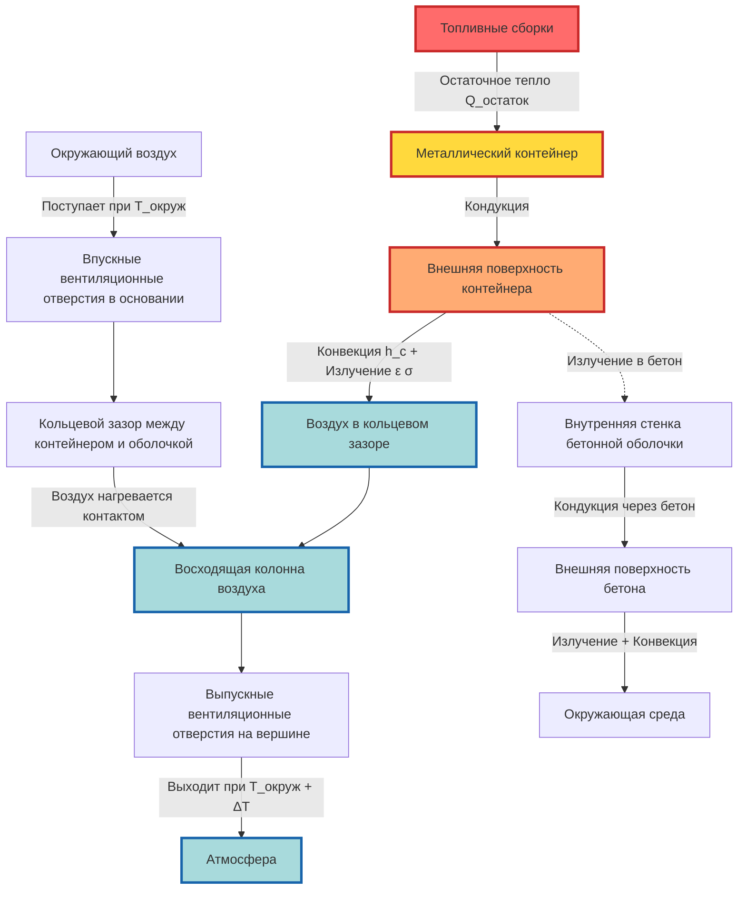

Системы хранения топлива в сухом хранилище (сухом снаряде) хранят отработанное ядерное топливо в герметичных, заполненных газом контейнерах, охлаждаемых пассивной естественной конвекцией, что исключает необходимость активной механической вентиляции или систем охлаждения. Независимые установки хранения отработанного топлива (МКСШ) полагаются на фундаментальные принципы теплопередачи — кондукцию через стенки корпуса, излучение к окружающим конструкциям и конвекцию от окружающего воздуха — для удаления остаточного тепла, генерируемого топливными сборками. Этот пассивный подход обеспечивает долгосрочную безопасность без зависимости от электроэнергии, механического оборудования или действий оператора, соответствуя строгим требованиям безопасности 10 CFR Part 72 (Требования к лицензированию независимого хранения отработанного ядерного топлива) и рекомендациям проектирования в NUREG-1536 (План стандартного анализа систем сухого хранения отработанного топлива).

## Физические принципы пассивного охлаждения

Отработанное ядерное топливо продолжает генерировать остаточное тепло в течение десятилетий после выгрузки из реактора. Топливные сборки, загруженные в корпуса сухого хранилища, обычно охлаждаются в течение 3-10 лет в бассейнах отработанного топлива перед передачей, снижая остаточное тепло до уровней, управляемых пассивным воздушным охлаждением.

**Характеристики остаточного тепла:**

Типичная топливная сборка реактора с водой под давлением (РВД) генерирует примерно:

- 1-2 кВт тепловой мощности через 1 год после выгрузки
- 0,5-0,8 кВт тепловой мощности через 5 лет после выгрузки
- 0,3-0,5 кВт тепловой мощности через 10 лет после выгрузки
- 0,2-0,3 кВт тепловой мощности через 20 лет после выгрузки

Стандартный корпус сухого хранилища содержит 24-32 топливные сборки РВД или 56-68 топливных сборок реактора с кипящей водой (РКВ), что приводит к общей тепловой нагрузке корпуса 10-25 кВт при загрузке минимально охлажденным топливом.

**Механизмы теплопередачи:**

Удаление тепла из корпуса в окружающую среду происходит через три последовательных процесса:

1. **Кондукция через топливо и конструкцию корпуса:** Остаточное тепло проводится от топливных пеллет через оболочку, металлическую конструкцию топливной корзины и стенки корпуса
2. **Излучение и конвекция с поверхности корпуса:** Тепло излучается от горячих внешних поверхностей корпуса и передается окружающему воздуху через естественную конвекцию
3. **Вентиляция, управляемая выталкивающей силой:** Нагретый воздух поднимается и выходит через верхние вентиляционные отверстия, в то время как прохладный окружающий воздух поступает через нижние отверстия, создавая непрерывную циркуляцию

Ограничивающее тепловое сопротивление обычно возникает на границе поверхность корпуса-воздух, что делает скорость расхода вентиляционного воздуха критическим параметром для контроля температуры.

## Анализ теплопередачи естественной конвекцией

Пассивное охлаждение полагается на эффект термосифона: воздух, нагретый контактом с горячими поверхностями, становится менее плотным и поднимается, втягивая прохладный воздух снизу.

**Поток воздуха, управляемый выталкивающей силой:**

Объемный расход воздуха через проходы естественной конвекции зависит от вертикального перепада высоты между впуском и выпуском, повышения температуры воздуха и сопротивления потоку пути вентиляции.

$$\dot{V} = C_d A \sqrt{2 g H \frac{\Delta T}{T_{\text{avg}}}}$$

Где:
- $\dot{V}$ = объемный расход воздуха (м³/с)
- $C_d$ = коэффициент расхода (0,6-0,8 для хорошо спроектированных проходов)
- $A$ = минимальная площадь потока (м²)
- $g$ = ускорение свободного падения (9,81 м/с²)
- $H$ = вертикальная высота между центральными линиями впуска и выпуска (м)
- $\Delta T$ = повышение температуры воздуха от впуска к выпуску (К)
- $T_{\text{avg}}$ = средняя абсолютная температура воздуха (К)

**Теплопередача конвекцией:**

Скорость удаления тепла естественной конвекцией равна тепловой емкости потока воздуха, умноженной на повышение температуры:

$$Q_{\text{conv}} = \dot{m} c_p \Delta T = \rho \dot{V} c_p \Delta T$$

Где:
- $Q_{\text{conv}}$ = удаление тепла конвекцией (Вт)
- $\dot{m}$ = массовый расход воздуха (кг/с)
- $\rho$ = плотность воздуха при средней температуре (кг/м³)
- $c_p$ = удельная теплоемкость воздуха при постоянном давлении (1005 Дж/кг·К)
- $\Delta T$ = повышение температуры воздуха (К)

Комбинируя эти отношения, получаем фундаментальное уравнение охлаждения естественной конвекцией:

$$Q_{\text{conv}} = \rho c_p C_d A \Delta T \sqrt{2 g H \frac{\Delta T}{T_{\text{avg}}}}$$

Это показывает, что удаление тепла масштабируется как $\Delta T^{3/2}$, что означает, что конвективное охлаждение становится более эффективным по мере увеличения температуры поверхности, обеспечивая присущую тепловую стабильность.

**Коэффициент теплопередачи поверхности:**

Коэффициент конвективной теплопередачи для естественной конвекции на вертикальных поверхностях зависит от числа Рэлея:

$$h_c = \frac{k}{L} \times 0,59 \left( \text{Ra}_L \right)^{0,25}$$

Для турбулентной естественной конвекции (Ra > 10⁹):

$$h_c = \frac{k}{L} \times 0,10 \left( \text{Ra}_L \right)^{0,33}$$

Где:
- $h_c$ = коэффициент конвективной теплопередачи (Вт/м²·К)
- $k$ = теплопроводность воздуха (0,026 Вт/м·К при 20°C)
- $L$ = характеристическая длина (высота корпуса для вертикальных поверхностей)
- $\text{Ra}_L$ = число Рэлея = $\frac{g \beta \Delta T L^3}{\nu \alpha}$
- $\beta$ = коэффициент теплового расширения (1/T для идеального газа)
- $\nu$ = кинематическая вязкость воздуха
- $\alpha$ = тепловая диффузивность воздуха

Типичные коэффициенты естественной конвекции варьируются от 5-15 Вт/м²·К в зависимости от ориентации поверхности, разности температур и условий ветра.

**Радиационная теплопередача:**

Высокотемпературные поверхности корпуса излучают значительную тепловую энергию к окружающим бетонным конструкциям:

$$Q_{\text{rad}} = \varepsilon \sigma A (T_{\text{cask}}^4 - T_{\text{surr}}^4)$$

Где:
- $Q_{\text{rad}}$ = радиационная теплопередача (Вт)
- $\varepsilon$ = эффективная степень черноты (0,4-0,7 для окрашенной стали, 0,7-0,9 для бетона)
- $\sigma$ = константа Стефана-Больцмана (5,67 × 10⁻⁸ Вт/м²·К⁴)
- $A$ = излучающая площадь поверхности (м²)
- $T_{\text{cask}}$ = температура поверхности корпуса (К)
- $T_{\text{surr}}$ = температура окружающей конструкции (К)

Для типичных температур поверхности корпуса 150-200°C и температур перекрытия из бетона 50-80°C, радиация обеспечивает 30-50% от общего отвода тепла.

## Сравнение конструкций систем сухого хранилища

Несколько конструкций систем хранения топлива в сухом хранилище лицензированы по 10 CFR Part 72, каждая с отличительными тепло-гидравлическими характеристиками.

| Тип системы | Пример производителя | Конфигурация охлаждения | Путь вентиляции | Максимальная тепловая нагрузка | Пиковая температура оболочки | Ключевые особенности |
|-------------|---------------------|------------------------|------------------|--------------------------------|------------------------------|----------------------|
| Вертикальная бетонная оболочка | HI-STORM 100 | Естественная конвекция через кольцевой зазор | 4 впускных вентиляционных отверстия в основании, 4 выпускных отверстия на вершине, ~5 м высоты | 25-40 кВт | 350-400°C | Бетонное радиационное экранирование, стальной контейнер с множественными целями внутри, окружающий воздух через кольцевой зазор |
| Модуль горизонтального хранилища | NUHOMS-HD | Естественная конвекция над контейнером | Боковые входные жалюзи, выпускные отверстия на крыше | 15-25 кВт | 350-380°C | Горизонтальный контейнер в бетонном модуле, поток воздуха над поверхностью контейнера |
| Голый металлический корпус | NAC-MPC | Прямая конвекция/радиация поверхности | Нет замкнутого пути вентиляции, открытое воздействие воздуха | 20-30 кВт | 380-420°C | Толстое экранирование из стали/свинца, циркуляция воздуха вокруг открытых поверхностей |
| Вентилируемый корпус хранилища | TN-32 | Улучшенная естественная конвекция | Периферийные ребра, множественные вентиляционные отверстия | 30-35 кВт | 340-370°C | Ребристый стальной корпус, оптимизирован для теплопередачи |
| Подземное хранилище | Конструкция хранилища (редко) | Принудительная или естественная вентиляция через подземную конструкцию | Подземные впускные каналы, вытяжной стек | 10-20 кВт | 300-350°C | Экранирование землей, требует активной вентиляции или большого естественного тяги |

**Критерии выбора конструкции:**

- **Температура окружающей среды на площадке:** Более высокие температуры окружающей среды снижают движущую силу естественной конвекции; требуют более низких пределов тепловой нагрузки
- **Сейсмическая квалификация:** Горизонтальные системы имеют более низкий центр тяжести; вертикальные системы требуют анализа устойчивости к опрокидыванию
- **Соображения безопасности:** Горизонтальные модули частично встроены; вертикальные корпуса более открыты
- **Будущая извлекаемость:** Горизонтальные системы требуют больше места для операций передачи; вертикальные могут быть подняты непосредственно
- **Тепловая производительность:** Вертикальные системы с высокими путями вентиляции генерируют более сильную естественную тягу; горизонтальные полагаются больше на площадь поверхности

## Требования к проектированию пути вентиляции

Надлежащее проектирование пути вентиляции обеспечивает адекватный поток воздуха, предотвращая попадание обломков, проникновение животных и накопление воды.

**Конфигурация впускного вентиляционного отверстия:**

Нижние впускные вентиляционные отверстия пропускают прохладный окружающий воздух в кольцевой зазор между топливным контейнером и бетонной оболочкой.

- **Местоположение:** Расположено на самой низкой практической высоте для максимизации тепловой подъемной силы
- **Размеры:** Общая впускная площадь обычно 0,3-0,6 м² для корпусов тепловой нагрузкой 25 кВт
- **Защита от обломков:** Экраны обломков с 50-70% свободной площади для предотвращения засорения при минимизации падения давления
- **Защита от погодных условий:** Наклонные жалюзи или дождевые колпаки предотвращают прямое попадание воды
- **Защита от снарядов:** Экраны, спроектированные для выдерживания обломков, генерируемых торнадо, согласно требованиям конкретной площадки

**Конфигурация выпускного вентиляционного отверстия:**

Верхние выпускные вентиляционные отверстия выпускают нагретый воздух в атмосферу, предотвращая попадание дождевой воды.

- **Местоположение:** Рядом с верхней частью оболочки для максимизации перепада высоты от впуска
- **Размеры:** Общая выпускная площадь равна или превышает впускную площадь (обычно 1,1-1,2× впуск для учета расширения воздуха)
- **Защита от дождя:** Горизонтальные жалюзи или конфигурации гусиного горла предотвращают вертикальное проникновение дождя
- **Барьеры для животных:** Сетчатые экраны предотвращают гнездование птиц при сохранении потока воздуха
- **Излучение потока:** Геометрия пути вентиляции включает изгибы или смещения для снижения прямого радиационного потока от корпуса в окружающую среду

**Проектирование кольцевого зазора:**

Вертикальный кольцевой зазор между внутренним контейнером и бетонной оболочкой образует основной проход потока воздуха.

- **Ширина зазора:** Обычно 150-300 мм по окружности
- **Площадь потока:** Поддерживается постоянной или постепенно увеличивающейся в восходящем направлении для минимизации падения давления
- **Шероховатость поверхности:** Гладкие бетонные поверхности снижают потери на трение
- **Выпрямители потока:** Некоторые конструкции включают внутренние дефлекторы для содействия равномерному распределению потока воздуха вокруг контейнера

## Тепловой мониторинг и надзор

Непрерывный мониторинг температуры демонстрирует соответствие установленным лимитам сертификата корпуса и обеспечивает раннее предупреждение о деградированной производительности охлаждения.

**Конструкция системы мониторинга:**

Согласно NUREG-1536 Section 4, тепловой мониторинг обеспечивает проверку того, что температуры корпуса остаются в пределах анализируемых лимитов.

**Местоположения измерения температуры:**

1. **Температура воздуха на входе:** Термопары во впускных вентиляционных отверстиях измеряют температуру окружающего воздуха, поступающего в систему
2. **Температура воздуха на выходе:** Термопары в выпускных вентиляционных отверстиях измеряют температуру нагретого воздуха; разница со входом указывает на скорость удаления тепла
3. **Температура поверхности бетона:** Встроенные термопары на половине высоты оболочки отслеживают температуры бетона (лимит обычно 150°C длительный)
4. **Обнаружение засорения вентиляции:** Дифференциальная температура между несколькими выпускными отверстиями указывает на препятствие потоку, если одно отверстие показывает пониженный ΔT

**Вычисляемые параметры:**

Из измеренных температур операторы вычисляют критические индикаторы тепловой производительности:

**Скорость удаления тепла:**

$$Q_{\text{removed}} = \dot{V} \rho c_p (T_{\text{outlet}} - T_{\text{inlet}})$$

Это должно быть равно или превышать рассчитанное остаточное тепло для топливной загрузки.

**Тепловой запас:**

$$\text{Запас} = \frac{T_{\text{limit}} - T_{\text{measured}}}{T_{\text{limit}}} \times 100\%$$

Где $T_{\text{limit}}$ — максимально допустимая температура на основе лицензии (обычно 400°C пиковой температуры оболочки).

**Требования надзора:**

- **Частота записи температуры:** Ежечасная автоматическая запись через логгер данных
- **Визуальный контроль:** Ежеквартальные обходы проверяют отсутствие обломков на экранах вентиляции, отсутствие видимых повреждений
- **Ежегодное тестирование потока:** Дополнительное тестирование дымом или тепловизионное обследование подтверждает характер потока воздуха
- **Обновление теплового анализа:** Если топливо загружается с более высоким остаточным теплом или температуры окружающей среды превышают проектную основу, может потребоваться повторный анализ

## Нормативно-правовая база соответствия

Лицензирование сухого хранилища в соответствии с 10 CFR Part 72 требует комплексного теплового анализа, демонстрирующего сохранение целостности топлива в нормальных, ненормальных и аварийных условиях.

**10 CFR 72.122 - Общие требования:**

- **72.122(h)(1):** Системы должны позволять адекватное удаление тепла без активных систем охлаждения
- **72.122(h)(4):** Оболочка топлива должна быть защищена во время хранения от деградации, приводящей к полному разрыву

**10 CFR 72.236 - Конкретные критерии для утверждения корпуса хранения отработанного топлива:**

- **72.236(f):** Возможность удаления тепла должна быть оценена для нормальных, ненормальных и аварийных условиях
- **72.236(g):** Корпус должен быть совместим с влажными и сухими объектами загрузки отработанного топлива

**Руководство по тепловой оценке NUREG-1536:**

Section 4 NUREG-1536 (План стандартного анализа систем сухого хранения отработанного топлива) устанавливает подробные критерии теплового анализа:

**Нормальные условия:**

- Лимит пиковой температуры оболочки топлива: 400°C для нормальной сушки и операций хранения
- Обоснование требуется, если температуры превышают 400°C из-за потенциала ускоренного окисления оболочки
- Лимит температуры бетона: 65°C (150°F) нормальный, 177°C (350°F) краткосрочный ненормальный

**Ненормальные условия:**

- Полное засорение одного пути вентиляции (впускные или выпускные отверстия)
- 100% засорение вентиляции на ограниченное время (демонстрирует выживание топлива при техническом обслуживании или временном засорении)
- Экстремальные температуры окружающей среды (конкретные для площадки, обычно -40°C до +46°C)

**Условия аварии:**

- Воздействие огня согласно 10 CFR 71.73 (пламя 800°C в течение 30 минут) для переносимых корпусов
- Частичное захоронение корпуса обломками от торнадо
- Полное погружение в воду (демонстрирует отсутствие неприемлемых температур от засоренных отверстий)

**Требования теплового анализа:**

Заявления о получении Свидетельства о соответствии должны включать:

- Детальную тепловую модель (обычно вычислительная динамика жидкостей в сочетании с анализом конечных элементов)
- Расчет источника остаточного тепла согласно ORIGEN или эквивалентный
- Валидацию на основе экспериментальных данных из тестирования прототипа
- Исследования чувствительности, оценивающие неопределенность ключевых параметров (излучательность, сопротивление потоку, температура окружающей среды)
- Определение максимальной тепловой нагрузки с документированным запасом до пределов температуры

**Операционные средства контроля:**

Технические спецификации для операции МКСШ определяют:

- Максимальное остаточное тепло на корпус на основе теплового анализа
- Минимальное время охлаждения перед тем, как топливо станет подходящим для сухого хранилища
- Пределы выгорания и обогащения, обеспечивающие сохранение безопасности критичности
- Требования теплового мониторинга и уровни действий

## Деградация производительности и восстановление

Системы пассивного охлаждения работают без механических компонентов, но производительность может ухудшиться из-за внешних факторов.

**Засорение вентиляции:**

Наиболее вероятная деградация производительности возникает из-за снижения расхода воздуха через пути вентиляции.

**Причины:**
- Накопление обломков на впускных экранах (листья, пыль, снег, лед)
- Гнездование животных в вентиляционных отверстиях (птицы, насекомые)
- Обломки наводнения, застрявшие в нижних отверстиях
- Осколки бетона, частично блокирующие проходы потока

**Последствия:**
- Снижение расхода воздуха увеличивает повышение температуры воздуха через корпус
- Более высокие температуры поверхности корпуса увеличивают радиационную теплопередачу (частично компенсируя)
- Полное засорение может привести к температурам, приближающимся к установленным лимитам или превышающим их в течение дней или недель в зависимости от остаточного тепла

**Обнаружение:**
- Инспекции надзора выявляют внешние засорения
- Мониторинг температуры показывает повышенные выходные температуры или сниженную разность температур, указывающие на более низкий расход воздуха
- Тепловизионная съемка при ежегодных инспекциях выявляет горячие точки от неравномерного охлаждения

**Восстановление:**
- Физическое удаление обломков из экранов и вентиляционных отверстий
- Временное увеличение мониторинга для проверки возврата температуры в нормальный диапазон
- Инженерное исследование, если засорение продолжалось достаточно долго, чтобы температуры превысили нормальную полосу работы

**Деградация бетона:**

Длительное воздействие бетона на повышенные температуры и атмосферное воздействие требует мониторинга.

- Периодический контроль растрескивания, осколков или структурной деградации
- Отбор образцов сердцевины, если визуальный контроль указывает на потенциальные проблемы
- Структурный анализ, если прочность бетона значительно деградирует (обычно требует десятилетий)

**Эффекты старения корпуса:**

При длительном хранении в течение 50-100 лет могут измениться свойства материала, влияющие на производительность:

- Деградация бетонного нейтронного экранирования от радиационного воздействия (требует периодических съемок дозовой скорости)
- Коррозия металлической поверхности, увеличивающая тепловое контактное сопротивление (обычно незначительна для окрашенных или нержавеющих поверхностей)
- Медленная утечка газа гелия через уплотнения (снижает внутреннюю теплопередачу, увеличивает температуры оболочки)

Системы сухого хранилища топлива демонстрируют, что надежные, полностью пассивные системы охлаждения могут безопасно удалять ядерное остаточное тепло в течение десятилетий без действий оператора, электроэнергии или механического оборудования. Поток воздуха естественной циркуляции, управляемый выталкивающей силой, надежно поддерживает температуру топлива в пределах нормативных лимитов, олицетворяя принцип защиты в глубину благодаря присущим характеристикам безопасности, а не активным спроектированным системам. Надлежащее проектирование пути вентиляции, тепловой мониторинг и периодический надзор обеспечивают продолжение этих систем для защиты здоровья и безопасности населения в течение расширенных периодов хранения, требуемых задержками в доступности постоянного хранилища.
