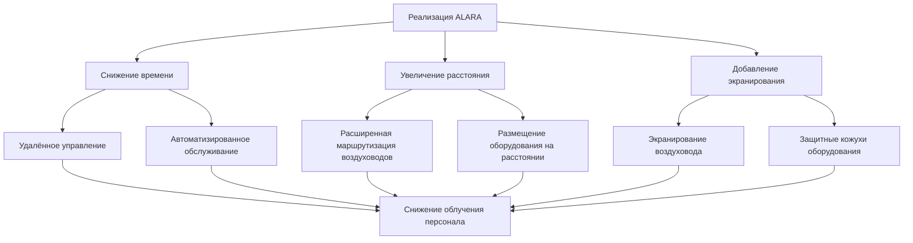
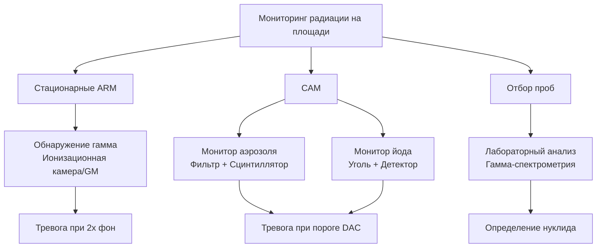

## Принципы ALARA в проектировании HVAC

Принцип "Настолько низко, насколько это разумно достижимо" (As Low As Reasonably Achievable, ALARA) определяет стратегию защиты от радиации в системах вентиляции обработки ядерного топлива. В соответствии с 10 CFR 20.1101 снижение облучения достигается минимизацией времени экспозиции, максимизацией расстояния и оптимизацией экранирования. Системы HVAC реализуют ALARA через локализацию загрязнения, каскады отрицательного давления, предотвращающие миграцию, и инженерные средства управления, снижающие близость рабочих к источникам радиации.

Фундаментальное соотношение мощности дозы определяет проектные решения:

$$H = \frac{\dot{H}_0 \cdot t}{d^2} \cdot e^{-\mu x}$$

Где $H$ — эффективная доза (мЗв), $\dot{H}_0$ — мощность дозы на опорном расстоянии (мЗв/ч), $t$ — время экспозиции (ч), $d$ — расстояние от источника (м), $\mu$ — коэффициент ослабления (см⁻¹), и $x$ — толщина экрана (см).

## Расчеты мощности дозы

Расчеты мощности дозы для загрязнённых воздуховодов требуют моделирования как поверхностного загрязнения, так и активности в воздухе. Вклад дозы от поверхности следует:

$$\dot{H}_{surf} = \frac{A_{surf} \cdot E_{avg} \cdot k}{2\pi d^2}$$

Где $A_{surf}$ — поверхностная активность (Бк/см²), $E_{avg}$ — средняя энергия гамма-излучения (МэВ), $k$ — коэффициент преобразования (5,76 × 10⁻⁷ мЗв·м²/МэВ·Бк), и $d$ — расстояние (м).

Для радионуклидов в воздухе в выхлопных потоках:

$$\dot{H}_{air} = C_{air} \cdot DCF \cdot BR$$

Где $C_{air}$ — концентрация в воздухе (Бк/м³), $DCF$ — коэффициент преобразования дозы (Зв/Бк), и $BR$ — скорость дыхания (1,2 м³/ч для типового рабочего).

| Радионуклид | Период полураспада | DCF при вдыхании (Зв/Бк) | Основной источник опасности |
|--------------|-----------|------------------------|-----------------|
| Co-60 | 5,27 г | 3,1 × 10⁻⁹ | Внешнее гамма-излучение |
| Cs-137 | 30,2 г | 3,2 × 10⁻⁹ | Внешнее гамма-излучение |
| I-131 | 8,02 д | 7,4 × 10⁻⁹ | Накопление в щитовидной железе |
| Sr-90 | 28,8 г | 2,3 × 10⁻⁸ | Накопление в костях |
| Pu-239 | 24 110 л | 2,5 × 10⁻⁵ | Альфа-доза в лёгких |

## Требования к экранированию воздуховодов

Расчеты экранирования загрязнённых воздуховодов следуют принципам экспоненциального ослабления. Требуемая толщина для гамма-излучающих загрязнителей:

$$x = \frac{1}{\mu} \ln\left(\frac{\dot{H}_0}{\dot{H}_{target}}\right)$$

Для бетонного экрана вокруг источника гамма-излучения 1,25 МэВ (Co-60), $\mu$ = 0,0595 см⁻¹. Для снижения 10 мЗв/ч до 0,025 мЗв/ч (предельная профессиональная доза):

$$x = \frac{1}{0,0595} \ln\left(\frac{10}{0,025}\right) = 100,8 \text{ см}$$

Практические подходы к экранированию включают:

- **Воздуховоды, облицованные свинцом**: 6–12 мм свинца для участков с высокой активностью
- **Бетонная защита**: 30–100 см в зависимости от интенсивности источника
- **Лабиринтная маршрутизация**: Несколько поворотов на 90° с использованием снижения рассеяния
- **Разделение по расстоянию**: Возвышенные или заглублённые участки с зазором >2 м

## Стратегия локализации загрязнения

Контроль загрязнения основан на различиях отрицательного давления и конструкции пути потока. Принцип каскада давления обеспечивает прогрессивную отрицательность в сторону источников загрязнения:

$$\Delta P_{total} = \sum_{i=1}^{n} \Delta P_i$$

Где каждая зона должна поддерживать минимальный перепад давления 12,5 Па к смежной зоне с меньшей опасностью в соответствии с NUREG-0800, раздел 9.4.1.

| Классификация зоны | Перепад давления | Воздухообмены в час | Ступень фильтрации |
|---------------------|----------------------|----------------------|------------------|
| Чистая зона | Справочное (0 Па) | 4–6 | Только предварительный фильтр |
| Потенциально загрязненная | -12,5 Па | 6–10 | Предварительный + HEPA |
| Загрязненная | -25 Па | 10–20 | Предварительный + HEPA + Уголь |
| Горячая камера | -50 Па | 20–40 | Двойной HEPA + Уголь |

Требования герметичности предотвращают утечку загрязнения. Для воздуховодов класса I ядерной категории в соответствии с ASME AG-1:

$$Q_{leak} \leq 0,1\% \text{ от расхода системы при } 1,5 \times P_{operating}$$

## Системы мониторинга радиации на площадях

Непрерывный мониторинг обеспечивает надзор мощности дозы в реальном времени и обнаружение загрязнения. Мониторы радиации на площади (ARM) измеряют мощность гамма-излучения с типичной характеристикой:

$$R = \frac{I - I_0}{S} \cdot CF$$

Где $R$ — мощность дозы (мЗв/ч), $I$ — ток детектора (нА), $I_0$ — фоновый ток, $S$ — коэффициент чувствительности (нА на мЗв/ч), и $CF$ — коэффициент калибровки.

Мониторы аэрозоля в воздухе (CAM) обнаруживают взвешенные частицы и газы в воздухе. Эффективность сбора для систем на основе фильтров:

$$\eta = 1 - e^{-k \cdot v \cdot t}$$

Где $\eta$ — эффективность сбора, $k$ — коэффициент осаждения (м⁻¹), $v$ — скорость на входе (м/с), и $t$ — время пребывания (с). Фильтры HEPA достигают $\eta$ > 99,97% при 0,3 мкм.

## Средства контроля облучения персонала

Инженерные средства управления минимизируют дозу персонала через автоматизацию и удалённое управление. Критерии контроля доступа в соответствии с 10 CFR 20.1601 требуют маркировки для зон, превышающих 0,05 мЗв/ч. Зоны высокой радиации (>1 мЗв/ч) требуют запертого доступа.

Административные средства управления реализуют планирование работ:

- Предварительные оценки дозы с использованием $H = \dot{H} \cdot t$
- Планирование работ в периоды низкой активности
- Ротация должностей, ограничивающая индивидуальное облучение
- Расчеты времени пребывания: $t_{max} = H_{allowable} / \dot{H}_{area}$

Личное защитное оборудование предназначено для предотвращения внутреннего поступления, а не внешнего экранирования. Коэффициенты защиты респираторов варьируются от 10 (полумаска) до 10 000 (подаваемый воздух с капюшоном).

Годовые предельные профессиональные дозы в соответствии с 10 CFR 20.1201 устанавливают границы: 50 мЗв эквивалента эффективной дозы, 500 мЗв дозы на конечности, 150 мЗв дозы на хрусталик глаза. Проектирование HVAC, нацеленное на <5 мЗв/год при плановых операциях, обеспечивает существенный запас прочности.

## Компоненты

- Вентиляция с контролем загрязнения
- Удаление частиц HEPA
- Удаление радиоактивного йода
- Мониторинг активности в воздухе
- Мониторы аэрозоля в воздухе CAM
- Системы отбора проб
- Защита персонала
