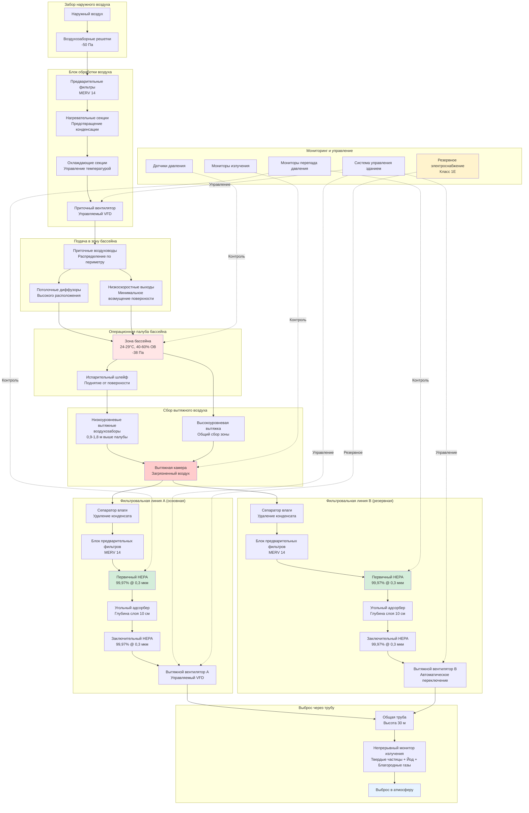

Системы вентиляции хранилищ отработанного топлива управляют сложной термической и радиологической средой, создаваемой подводным хранением облученных сборок ядерного топлива. Эти системы должны удалять влажный воздух, содержащий радиоактивные газы, поддерживать отрицательное давление для изоляции, контролировать влажность для предотвращения коррозии и обеспечивать непрерывную фильтрацию как при нормальной эксплуатации, так и при аварийных условиях. Проектирование интегрирует управление остаточным теплом, испарительный контроль влаги и удаление радиоактивных газов в соответствии с 10 CFR Part 50 Appendix A (Общие критерии проектирования) и 10 CFR 50.36 (Технические спецификации).

## Термическая и радиологическая среда хранилища отработанного топлива

Хранилище отработанного топлива создает уникальную среду, управляемую остаточным теплом от радиоактивного распада продуктов деления, передаваемым в воду бассейна.

**Генерирование остаточного тепла:**

Сразу после остановки реактора сборка топлива типичного реактора с водой под давлением (PWR) генерирует приблизительно 1,5% своей номинальной мощности от радиоактивного распада. Для реактора мощностью 3000 МВ(тепло) со 193 сборками:

$$P_{decay}(t) = P_{operating} \times 0.066 \times t^{-0.2}$$

где $P_{decay}$ — остаточная мощность в МВ, $P_{operating}$ — номинальная мощность реактора, и $t$ — время после остановки в сутках. В течение 7 суток после остановки полная выгрузка активной зоны генерирует приблизительно 12-15 МВ(тепло). На 30-е сутки это снижается до 7-9 МВ. Через один год бассейн, содержащий 300 сборок топлива, генерирует 1-2 МВ.

**Передача тепла в воду бассейна:**

Остаточное тепло передается от оболочки топливных стержней в окружающую воду посредством конвективного теплопередачи:

$$Q = h \cdot A \cdot (T_{clad} - T_{water})$$

где $h$ — коэффициент конвективного теплопередачи (типично 1000-3000 Вт/м²·К для естественной конвекции), $A$ — площадь поверхности топливного стержня, $T_{clad}$ — температура поверхности оболочки, и $T_{water}$ — температура воды в объеме. Системы охлаждения бассейна поддерживают температуру воды на уровне 49-60°C при нормальных условиях.

**Скорость испарения:**

Вода бассейна испаряется со скоростью, определяемой тепловым потоком и условиями окружающей среды:

$$\dot{m}_{evap} = \frac{Q_{decay} + Q_{ambient}}{h_{fg}}$$

где $\dot{m}_{evap}$ — скорость испарения (кг/с), $Q_{decay}$ — остаточное тепло, $Q_{ambient}$ — прирост тепла от воздуха окружающей среды и излучения, и $h_{fg}$ — теплота парообразования (2260 кДж/кг при атмосферном давлении). Бассейн с остаточным теплом 2 МВ испаряет приблизительно 0,9 кг/с (8 л/мин) непрерывно.

**Радиоактивные загрязнители в испаренном воздухе:**

Испарение переносит радиоактивные вещества из воды бассейна в воздух:

1. **Тритий (H-3):** Растворимый в воде изотоп испаряется пропорционально H₂O, создавая тритированный водяной пар (HTO)
2. **Благородные газы:** Криптон-85, ксенон-133, выделяемые из дефектов топливных стержней, остаются растворенными в воде до момента отделения при перемешивании
3. **Изотопы йода:** I-131, I-133, присутствующие от дефектов топлива, частично испаряются в зависимости от pH и химической формы
4. **Твердые частицы:** Активированные продукты коррозии (Co-58, Co-60, Cs-137), вносимые как аэрозоли

Система вентиляции должна захватывать и фильтровать этот загрязненный воздух перед выпуском в атмосферу.

## Конфигурация системы вентиляции

Системы вентиляции хранилищ отработанного топлива используют однопроходный поток воздуха с многоступенчатой фильтрацией.

**Путь приточного воздуха:**

Наружный воздух поступает через защищенные от атмосферных воздействий решетки с сетками от птиц. Предварительные фильтры удаляют атмосферные твердые частицы перед кондиционированием. Нагревательные секции повышают температуру воздуха в холодную погоду для предотвращения конденсации на холодных поверхностях бассейна. Охлаждающие секции удаляют явное и скрытое тепло в теплую погоду, поддерживая температуру подачи 24-29°C. Приточный вентилятор, управляемый VFD, доставляет воздух через низкоскоростные потолочные диффузоры вокруг периметра бассейна.

**Путь вытяжного воздуха:**

Загрязненный воздух выходит через вытяжные решетки, расположенные на высоте 0,9-1,8 м выше палубы бассейна, захватывая поднимающийся испарительный шлейф. Низкоуровневое расположение вытяжки критично — расположение вытяжек на уровне потолка позволяет загрязненному воздуху распространяться по всему пространству перед захватом. Вытяжная камера собирает воздух из нескольких точек забора перед распределением на две параллельные фильтровальные линии.

**Картина распределения воздуха:**

Приточный воздух поступает с краю здания с горизонтальной траекторией, течет по верхним пространствам, затем спускается к поверхности бассейна. Испарительный шлейф поднимается вследствие плавучести (теплый, влажный воздух менее плотный, чем окружающий воздух), нося радиоактивные загрязнители. Вытяжные решетки перехватывают это восходящее течение перед рассеиванием. Кратность воздухообмена 15-20 ACH обеспечивает полную смену воздуха каждые 3-4 минуты.

## Расчеты удаления радиоактивных газов

Система фильтрации должна удалять радиоактивные загрязнители до концентраций ниже пределов выброса по 10 CFR Part 20.

**Эффективность удаления твердых частиц:**

HEPA-фильтры удаляют твердые загрязнители четырьмя механизмами: перехватом, ударом, диффузией и электростатическим притяжением. Комбинированная эффективность двухступенчатой HEPA-фильтрации:

$$\eta_{total} = 1 - (1 - \eta_1)(1 - \eta_2)$$

Для двух фильтров 99,97% эффективности последовательно:

$$\eta_{total} = 1 - (1 - 0.9997)(1 - 0.9997) = 1 - (0.0003)(0.0003) = 0.9999991$$

Это обеспечивает коэффициент дезактивации (DF):

$$DF = \frac{1}{1 - \eta_{total}} = \frac{1}{0.0000009} \approx 1.1 \times 10^6$$

**Удаление радиойода:**

Слои угольного адсорбера удаляют летучий йод посредством физической адсорбции и хемисорбции. Проникновение через активированный уголь следует экспоненциальному затуханию:

$$P = e^{-k \cdot \tau}$$

где $P$ — доля проникновения, $k$ — константа скорости адсорбции (0,5-2,0 с⁻¹ для радиойода на импрегнированном углероде), и $\tau$ — время пребывания (секунды). Для слоя глубиной 10 см при скорости на фильтре 0,2 м/с:

$$\tau = \frac{bed\:depth}{velocity} = \frac{0.1\:м}{0.2\:м/с} = 0.5\:мин = 30\:с$$

Принимая $k = 1.0$ с⁻¹:

$$P = e^{-1.0 \times 30} = e^{-30} \approx 9.4 \times 10^{-14}$$

Это обеспечивает коэффициент дезактивации йода, превышающий $10^{13}$, далеко превосходящий требуемые характеристики.

**Удаление благородных газов:**

Благородные газы (Kr-85, Xe-133) химически инертны и не адсорбируются на углероде при комнатной температуре. Удаление требует криогенной дистилляции или резервных слоев, не обычно устанавливаемых в вентиляции хранилищ отработанного топлива. Вместо этого системы полагаются на разбавление и рассеивание при выпуске из трубы с повышенным расположением.

Коэффициент атмосферного разбавления на уровне земли по ветру от выпуска трубы:

$$\chi/Q = \frac{1}{2\pi \cdot u \cdot \sigma_y \cdot \sigma_z} \cdot exp\left(-\frac{H^2}{2\sigma_z^2}\right)$$

где $\chi/Q$ — коэффициент разбавления (с/м³), $u$ — скорость ветра (м/с), $\sigma_y$ и $\sigma_z$ — горизонтальные и вертикальные коэффициенты рассеивания (м), и $H$ — эффективная высота трубы (м). Для трубы высотой 30 м с типичным рассеиванием:

$$\chi/Q \approx 1 \times 10^{-5} \text{ до } 1 \times 10^{-6}\:с/м^3$$

Это разбавление, в сочетании с радиоактивным распадом во время транспорта, поддерживает концентрации на уровне земли ниже пределов дозы населения по 10 CFR Part 20.1301 (100 мрем/год).

**Управление тритием (H-3):**

Тритированный водяной пар не может быть удален HEPA-фильтрацией. Два подхода управляют выбросами трития:

1. **Уменьшение источника:** Минимизация испарения воды бассейна посредством плавающих крышек (уменьшение испарения на 80-90%)
2. **Разбавление:** Выпуск из трубы обеспечивает атмосферное перемешивание

Скорость выброса трития:

$$\dot{A}_{H-3} = C_{H-3} \cdot \dot{m}_{evap} \cdot \frac{\rho_{air}}{\rho_{water}}$$

где $\dot{A}_{H-3}$ — скорость выброса активности (Ки/с), $C_{H-3}$ — концентрация трития в воде бассейна (типично 0,1-1,0 мкКи/мл), $\dot{m}_{evap}$ — скорость испарения (кг/с), и отношение плотности учитывает преобразование пара в жидкость. Для бассейна с концентрацией трития 0,5 мкКи/мл и испарением 30 л/мин:

$$\dot{A}_{H-3} = 0.5\:\mu Ci/мл \times 30\:л/мин \times \frac{60\:мин}{1\:ч} \approx 900\:\mu Ci/ч$$

Годовой выброс: $900 \times 8760 = 7.9 \times 10^6$ мкКи/год = 7,9 мКи/год. Это остается значительно ниже типичных пределов технических спецификаций (1-10 Ки/год).

## Режимы работы вентиляции

Вентиляция хранилищ отработанного топлива работает в различных режимах в зависимости от статуса эксплуатации и радиологических условий.

### Сравнение режимов вентиляции

| Параметр | Нормальная эксплуатация | Операции перегрузки | Сигнал высокого излучения | Авария/потеря теплоносителя |
|-----------|-------------------------|---------------------|-----------------------------|--------------------------|
| **Кратность воздухообмена** | 15-20 ACH | 20-25 ACH | 20-25 ACH | 25-30 ACH |
| **Приточный расход** | 100% проектный | 100% проектный | 100% проектный | 100% проектный (от РИП) |
| **Конфигурация вытяжки** | Одна линия в работе | Обе линии в работе | Обе линии в работе | Обе линии в работе |
| **Перепад давления** | -25 до -38 Па | -38 до -50 Па | -50 до -63 Па | Максимально достижимое (может снизиться) |
| **Требование фильтрации** | Двойной HEPA + уголь | Двойной HEPA + уголь | Двойной HEPA + уголь | Двойной HEPA + уголь |
| **Мониторинг излучения** | Непрерывный, среднее за 15 мин | Непрерывный, среднее за 5 мин | Непрерывный, среднее за 1 мин | Непрерывный, среднее за 1 мин |
| **Сигнал в ЦУ** | Только высокое излучение | Тренд + высокий сигнал | Немедленный сигнал | Немедленный сигнал + логирование |
| **Статус манипулирования топливом** | Разрешено (с ограничениями) | Активное перемещение топлива | Приостановлено до расследования | Приостановлено неопределенно |
| **Изоляционные заслонки** | Нормальное положение | Нормальное положение | Нормальное положение | Закрыть только при угрозе конструкции |
| **Резервное электроснабжение** | Доступно в резерве | Доступно в резерве | Может включиться | Требуется для работы |
| **Установка температуры** | 24-29°C | 24-27°C (более строгий контроль) | 24-29°C | Не контролируется (режим выживания) |
| **Контроль влажности** | 40-60% ОВ | 40-50% ОВ | 40-60% ОВ | Не контролируется |

**Логика переходов между режимами:**

- **Нормальный в перегрузку:** Инициируется приказом по работам при перегрузке; увеличивает ACH и активирует обе вытяжные линии
- **Любой режим в высокое излучение:** Автоматический переход при сигнале датчика излучения зоны (типично 10× фон)
- **Высокое излучение в нормальный:** Только ручной сброс после расследования, подтверждающего источник и принятые корректирующие действия
- **Любой режим в авария:** Автоматический при сигнале впрыска, сигнале изоляции оболочки или потере уровня в бассейне

## Стратегия управления давлением

Поддержание отрицательного давления относительно соседних пространств обеспечивает, что загрязненный воздух не мигрирует в чистые зоны.

**Поддержание перепада давления:**

Система управления зданием контролирует скорость вытяжного вентилятора для поддержания постоянного перепада давления:

$$\Delta P_{setpoint} = P_{adjacent} - P_{pool\:area}$$

Датчик давления измеряет перепад давления через граничную стену. Контурный цикл регулирует VFD вытяжного вентилятора:

$$VFD_{output} = K_p \cdot (\Delta P_{setpoint} - \Delta P_{actual}) + K_i \int (\Delta P_{setpoint} - \Delta P_{actual}) dt$$

где $K_p$ — пропорциональный коэффициент и $K_i$ — интегральный коэффициент. Приточный расход отслеживает вытяжку со смещением для поддержания притока:

$$Q_{supply} = Q_{exhaust} - Q_{infiltration}$$

Типичная инфильтрация: 5-10% вытяжного расхода через дверные проемы, проходки и ограждение здания.

**Проверка каскада давления:**

Во время пусконаладки и ежегодно впоследствии проверяются связи давления:

1. Наружный воздух = 0,00 Па (эталон)
2. Чистые зоны (офисы) = +13 Па
3. Буферные зоны (коридоры) = -13 Па
4. Операционная палуба бассейна = -38 Па
5. Яма для загрузки контейнеров = -50 Па

Тестирование дымовой трубкой подтверждает направление потока воздуха у дверей и проходок.

## Требования нормативных документов NRC

Несколько нормативных требований управляют проектированием и эксплуатацией вентиляции хранилищ отработанного топлива.

**10 CFR Part 50 — Внутреннее лицензирование производственных и опытно-промышленных установок:**

- **Appendix A, GDC 60:** Управление выбросами радиоактивных материалов в окружающую среду должно быть спроектировано с надлежащими системами изоляции и фильтрации
- **Appendix A, GDC 61:** Системы хранения топлива и радиоактивных отходов должны включать возможность надлежащего контроля и мониторинга
- **Section 50.36:** Технические спецификации должны включать ограничивающие условия для работы (LCO), необходимые для обеспечения целостности хранилища топлива

**Требования технических спецификаций 10 CFR 50.36:**

Каждая станция разрабатывает специфичные для объекта технические спецификации, утвержденные NRC. Типичные LCO включают:

1. **Минимальная готовность вытяжной линии:** Одна линия в рабочем состоянии при операциях с топливом (обе линии при полной выгрузке активной зоны)
2. **Контроль перепада давления:** Ежедневная проверка при перегрузке; еженедельная при нормальной эксплуатации
3. **Испытание HEPA-фильтра в месте установки:** В течение 18 месяцев после установки и после каждой замены фильтра
4. **Работоспособность монитора излучения:** Непрерывная работа требуется, когда бассейн содержит облученное топливо

**Формулировки действий при нарушении LCO:**

- Если требуемая вытяжная линия неработоспособна: Восстановить в рабочее состояние в течение 7 суток или приостановить операции с топливом
- Если перепад давления ниже минимума: Восстановить в течение 1 часа или проверить установку альтернативной границы изоляции
- Если монитор излучения неработоспособен: Восстановить в течение 30 суток или внедрить программу компенсационного отбора проб

**10 CFR Part 20 — Стандарты защиты от излучения:**

- **Section 20.1201:** Пределы профессиональной дозы требуют внедрения ALARA (настолько низко, насколько разумно достижимо) через проектирование вентиляции
- **Section 20.1301:** Пределы дозы для населения (100 мрем/год) управляют требованиями выпуска из трубы и мониторингом излучения
- **Section 20.1501:** Мониторинг выбросов требует непрерывного измерения и записи радиоактивных выбросов

**Regulatory Guide 1.140 — Критерии проектирования, инспекции и испытания систем очистки воздуха:**

Обеспечивает специальное руководство для ядерных систем обработки воздуха:

- Давление в корпусе фильтра: 1,5 раза максимальное давление перекрытия вентилятора
- Скорость на фильтре HEPA: максимум 1,27 м/с
- Время пребывания на угольном адсорбере: минимум 0,25 секунды при проектном расходе
- Частота испытания в месте установки: минимум ежегодно
- Испытание перепада давления: демонстрирует целостность здания (типично ≤50% изменения объема в день)

**Требования высоты выпуска из трубы:**

Regulatory Guide 1.111 определяет расчеты высоты трубы на основе моделирования атмосферного рассеивания. Минимальные высоты типично 30-46 м выше отметки для обеспечения адекватного разбавления перед воздействием на уровне земли. Непрерывные мониторы излучения трубы измеряют:

1. Твердые частицы: Мониторинг в реальном времени с движущейся фильтровальной бумагой (сигнал при 10⁻⁸ мкКи/см³)
2. Радиойод: Отбор на угольный картридж (сигнал при 10⁻¹⁰ мкКи/см³ для I-131)
3. Благородный газ: Детектор бета-гамма (сигнал при 10⁻⁵ мкКи/см³ эквивалента Xe-133)

Системы вентиляции хранилищ отработанного топлива обеспечивают существенную изоляцию и фильтрацию для одной из наиболее опасных операций на ядерных объектах. Интеграция управления тепловыми процессами, контроля влаги, поддержания каскада давления и высокоэффективной фильтрации обеспечивает, что выбросы радиоактивного материала остаются на порядки ниже нормативных пределов при защите рабочих от внутреннего облучения. Соответствие техническим спецификациям 10 CFR Part 50 и непрерывный мониторинг демонстрируют защиту в глубину, фундаментальную для ядерной безопасности.
