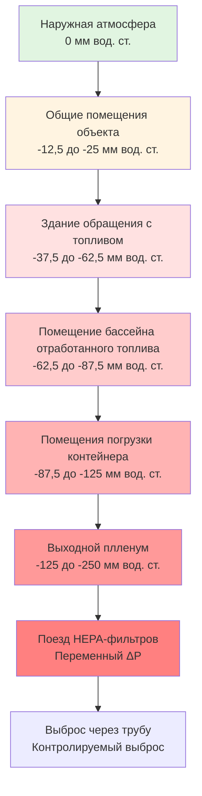

## Обзор

Системы вентиляции помещений обращения с топливом обеспечивают радиологическую герметизацию путем контролируемых потоков воздуха, спроектированных перепадов отрицательного давления и многоступенчатой фильтрации. Эти системы защищают персонал и окружающую среду во время операций передачи, хранения и обращения с топливом, сдерживая радиоактивные материалы в воздухе и направляя потенциальные выбросы через контролируемые пути.

Конструкция вентиляции устанавливает иерархию зон давления, которая обеспечивает поток воздуха от областей с более низким потенциалом загрязнения к областям с более высоким потенциалом загрязнения, при этом весь отходящий воздух подвергается HEPA-фильтрации и непрерывному мониторингу радиации перед выбросом.

## Требования к кратности воздухообмена

### Помещение бассейна отработанного топлива

Минимальные скорости вентиляции в помещениях бассейна отработанного топлива уравновешивают удаление остаточного тепла распада, контроль влажности и разбавление загрязнений. Кратность воздухообмена напрямую влияет на переходную характеристику времени очистки от загрязнений.

**Минимальные требования:**

| Тип помещения | ACH минимум | ACH типично | Основание |
|-----------|-------------|-------------|-------|
| Бассейн отработанного топлива | 4 | 6-10 | 10 CFR 20 ALARA |
| Канал передачи топлива | 6 | 8-12 | Контроль загрязнения |
| Яма погрузки контейнера | 8 | 10-15 | Высокоактивные операции |
| Этаж перезарядки | 4 | 6-8 | Разбавление общего воздуха |

Постоянная времени удаления загрязнителя следует экспоненциальному затуханию первого порядка:

$$C(t) = C_0 e^{-\lambda t}$$

где $\lambda = \frac{N}{60}$ и $N$ — кратность воздухообмена в час. Для 99% удаления:

$$t_{99\%} = \frac{-\ln(0.01)}{\lambda} = \frac{276}{N} \text{ мин}$$

При 10 ACH 99% удаление происходит за 27,6 минуты, обеспечивая быстрый ответ на события загрязнения.

### Конструктивные соображения

Скорости воздуха над поверхностью воды должны оставаться ниже 0,254 м/с, чтобы предотвратить чрезмерное испарение при сохранении адекватного перемешивания. Конвективный тепловой поток от бассейнов отработанного топлива создает естественную стратификацию, которую системы вентиляции должны преодолевать:

$$q_{conv} = h \cdot A \cdot (T_{water} - T_{air})$$

где $h$ — коэффициент конвективной теплопередачи (5,7-11,4 Вт/м²·°C для поверхностей бассейнов) и $A$ — площадь открытой поверхности воды.

## Поддержание отрицательного давления

### Иерархия перепадов давления

Ядерные объекты устанавливают каскадирующееся отрицательное давление, которое направляет воздушный поток от чистых областей к потенциально загрязненным зонам. Этот градиент давления обеспечивает основной барьер герметизации при нормальных операциях.

### Динамика управления давлением

Требуемый перепад давления зависит от площади утечки и объемного расхода:

$$\Delta P = \rho \left(\frac{Q}{C_d A}\right)^2 \frac{1}{2}$$

Для типичного качества конструкции с эффективной площадью утечки 0,1% площади оболочки поддержание -62,5 мм вод. ст. требует:

$$Q_{leak} = C_d A \sqrt{\frac{2\Delta P}{\rho}}$$

Этот расход утечки должен постоянно поставляться системой отвода для поддержания граничного давления. Системы управления обычно модулируют клапаны отвода в ответ на датчики перепада давления с мертвой зоной ±2,5 мм вод. ст.

### Целостность герметизации

NRC Regulatory Guide 1.140 указывает, что системы вентиляции герметизации поддерживают отрицательное давление в течение 10 секунд после активации режима аварии. Этот быстрый ответ требует:

- Резервные вентиляторы отвода с автоматической последовательностью запуска
- Аварийное электроснабжение от дизельных генераторов
- Непрерывный мониторинг давления с уставками сигналов тревоги
- Ежеквартальные испытания герметичности согласно 10 CFR 50 Приложение J

## Системы HEPA-фильтрации

### Многоступенчатый тренд фильтрации

Отходящий воздух из помещения обращения с топливом проходит через ступени резервной фильтрации перед атмосферным выбросом. Стандартная конфигурация включает:

### Эффективность фильтрации

HEPA-фильтры достигают минимальной эффективности 99,97% для частиц размером 0,3 мкм — наиболее проникающего размера частиц (MPPS). Эффективность системы для двух ступеней последовательно:

$$\eta_{total} = 1 - (1-\eta_1)(1-\eta_2) = 1 - (0,0003)^2 = 0,9999999$$

Это обеспечивает эффективность 99,99999% (коэффициент дезактивации 10⁷) для радиоактивных материалов в виде частиц.

Перепад давления фильтра увеличивается с накоплением пыли следующим образом:

$$\Delta P(t) = \Delta P_0 + k \cdot m_{dust}(t)$$

где $k$ — коэффициент сопротивления фильтра (обычно 0,5-1,5 мм вод. ст. на кг/м²) и $m_{dust}$ — накопленная масса пыли. Фильтры требуют замены, когда перепад давления достигает 100-150 мм вод. ст. или эффективность снижается ниже спецификации.

### Удаление йода

Радиоактивный йод (в основном I-131) существует как в форме частиц, так и в газообразной форме. Активированный уголь, пропитанный йодидом калия (KI) или триэтилендиамином (TEDA), адсорбирует газообразный йод путем хемосорбции:

$$\text{I}_2 + \text{C}_{активированный} \rightarrow \text{C-I}_2$$

Эффективность адсорбера зависит от:

- **Время пребывания**: Минимум 0,25 секунды при максимальном расходе
- **Относительная влажность**: Поддерживать ниже 70%, чтобы предотвратить закупорку пор
- **Глубина углерода**: Обычно 5-10 см
- **Размер сетки**: 8x16 или 12x30 меш для оптимального контакта

Правильно спроектированные адсорберы йода достигают эффективности удаления 95-99% для метилйодида (CH₃I) — наиболее сложного вида йода.

## Пределы загрязнения воздуха

### Производные концентрации в воздухе

10 CFR 20 Приложение B устанавливает значения производной концентрации в воздухе (DAC) для пределов профессионального воздействия. Для помещений обращения с топливом критические изотопы включают:

| Изотоп | DAC (мкКи/мл) | Физическая форма | Основной объект беспокойства |
|---------|--------------|---------------|-----------------|
| Kr-85 | 1 × 10⁻⁴ | Газ | Выброс инертного газа |
| I-131 | 2 × 10⁻⁸ | Газ/частица | Доза щитовидной железы |
| Cs-137 | 4 × 10⁻⁸ | Частица | Доза всего тела |
| Sr-90 | 9 × 10⁻⁹ | Частица | Тропный к костям |
| Pu-239 | 2 × 10⁻¹² | Частица | Альфа-излучатель |

### Требования к мониторингу

Непрерывные мониторы воздуха (CAMs) в помещениях обращения с топливом обнаруживают радиоактивность в воздухе в реальном времени. Уставки предупреждения обычно срабатывают при 10% DAC с эвакуацией при 30-50% DAC.

Интегрированная доза от загрязнения воздуха:

$$D = \int_0^T C(t) \cdot BR \cdot DCF \, dt$$

где $BR$ — скорость дыхания (3,3 × 10⁻⁴ м³/мин для легкой работы) и $DCF$ — коэффициент преобразования дозы (Зв/Бк), специфичный для каждого радионуклида.

## Мониторинг пути выброса

### Системы мониторинга выбросов

Весь отходящий воздух из помещений обращения с топливом выбрасывается через контролируемые трубы, оборудованные:

- **Мониторы твердых частиц**: Сбор фильтровальной бумаги с детектором бета/гамма
- **Мониторы йода**: Картридж с древесным углем с гамма-спектрометрией
- **Мониторы инертных газов**: Проточные ионизационные камеры или сцинтилляционные детекторы
- **Измерение расхода**: Массивы трубок Пито или тепловые анемометры

### Нормативные пределы выброса

10 CFR 20.1301 ограничивает дозу общественности 0,1 мбэр/год всеми путями. Выбросы через трубу должны соответствовать:

$$\frac{\Sigma C_i}{EC_i} \leq 1$$

где $C_i$ — измеренная концентрация изотопа $i$ и $EC_i$ — предел концентрации выбросов из 10 CFR 20 Приложение B Таблица 2.

**Типичные годовые пределы выброса:**

- Инертные газы: < 370 ГБк/реактор (основа воздушной дозы)
- Йоды и частицы: < 37 ГБк/реактор (основа органной дозы)
- Тритий: < 740 ГБк/реактор (основа дозы всего тела)

### Моделирование дисперсии

Расчеты атмосферной дисперсии определяют приземные концентрации с использованием моделей гауссова шлейфа:

$$C(x,y,z) = \frac{Q}{2\pi u \sigma_y \sigma_z} \exp\left(-\frac{y^2}{2\sigma_y^2}\right) \left[\exp\left(-\frac{(z-H)^2}{2\sigma_z^2}\right) + \exp\left(-\frac{(z+H)^2}{2\sigma_z^2}\right)\right]$$

где $Q$ — скорость выброса (Бк/с), $u$ — скорость ветра (м/с), $H$ — эффективная высота трубы (м), и $\sigma_y$, $\sigma_z$ — коэффициенты атмосферной дисперсии.

Высота трубы должна обеспечить адекватную дисперсию для соответствия пределам дозы на границе участка в наихудших метеорологических условиях (класс стабильности Паскилля F с скоростью ветра 1 м/с).

## Режимы аварийной работы

Системы вентиляции помещений обращения с топливом работают в нескольких режимах:

| Режим | Триггер | ACH | ΔP | Фильтрация |
|------|---------|-----|-------|------------|
| Нормальный | Плановые операции | 6-10 | -62,5 мм вод. ст. | Одиночная HEPA |
| Передача топлива | Активные передачи | 10-12 | -87,5 мм вод. ст. | Двойная HEPA + йод |
| Высокое излучение | Сигнал тревоги CAM | 15-20 | -125 мм вод. ст. | Двойная HEPA + йод |
| Аварийный | Потеря теплоносителя | Максимум | Максимум | Все ступени |

Режим аварии активируется автоматически при обнаружении высокого загрязнения воздуха, низкого уровня в бассейне отработанного топлива или сейсмических событий, превышающих пределы операционного базисного землетрясения (OBE).

## Испытание и контроль системы

### Испытания на месте

Код ASME N510 и AG-1 требует периодического испытания:

- **Испытание герметичности HEPA-фильтра**: Ежегодное испытание DOP или PAO с эффективностью 99,97%
- **Эффективность адсорбера**: Ежеквартальный тест проникновения метилйодида (≥ 95% удаления)
- **Расход системы**: Ежеквартальная проверка в пределах ±10% проектного значения
- **Граница давления**: Ежеквартальная скорость утечки < 10% объема в день при проектном ΔP

### Функциональное испытание

10 CFR 50 Приложение B требует:

- Ежемесячная проверка автоматического запуска
- Ежеквартальный переход в режим аварии (< 10 секунд)
- Ежегодный обзор баланса потоков и обследование давления
- Комплексная проверка системы при выполнении операции перезарядки

Результаты испытаний и корректирующие действия документируются в соответствии с требованиями контроля конфигурации 10 CFR 50.59.

---

**Системы вентиляции помещений обращения с топливом обеспечивают критически важную функцию безопасности — радиологическую герметизацию — посредством спроектированных перепадов давления, резервной фильтрации и непрерывного мониторинга. Соответствие нормативным требованиям NRC и строгие программы испытаний обеспечивают надежную работу этих систем как при плановых операциях, так и при условиях аварии.**
