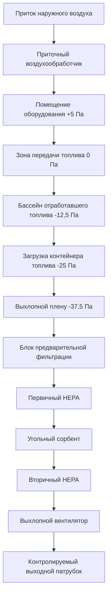

Помещения обращения с ядерным топливом требуют специализированных систем вентиляции, которые предотвращают выброс переносимого по воздуху радиоактивного загрязнения при поддержании теплового контроля вокруг бассейнов с отработавшим топливом. Эти системы работают в условиях строжайших требований к изоляции, разработанные согласно 10 CFR Part 50 Appendix A General Design Criterion 61 (Fuel Storage and Handling) и 10 CFR Part 72 (Licensing Requirements for the Independent Storage of Spent Nuclear Fuel).

## Конфигурация здания обращения с топливом

Здание обращения с топливом размещает бассейн с отработавшим топливом, канал передачи топлива, зону загрузки контейнеров и связанное оборудование. Проектирование вентиляции устанавливает несколько барьеров изоляции посредством каскадов давления и этапов фильтрации.

**Типичное размещение помещений:**

Это размещение создает четыре отдельные зоны давления с воздухом, движущимся прогрессивно к областям с наибольшим потенциалом загрязнения перед HEPA-фильтрацией и выбросом из патрубка.

## Вентиляция бассейна с отработавшим топливом

Помещение бассейна с отработавшим топливом представляет уникальные проблемы: высокую влажность от испарения воды из бассейна, остаточное тепло от хранящихся сборок топлива и потенциал переносимого по воздуху загрязнения во время операций обращения с топливом.

**Компоненты теплового напряжения:**

Общая тепловая нагрузка состоит из конвективных и испарительных компонентов с поверхности бассейна плюс лучистое тепло от топливных сборок во время операций передачи:

$$Q_{total} = Q_{conv} + Q_{evap} + Q_{rad} + Q_{lights} + Q_{equipment}$$

**Испарение с поверхности бассейна:**

Скорость испарения зависит от температуры поверхности бассейна, температуры воздуха, относительной влажности и скорости воздуха над поверхностью. Уравнение передачи массы определяет испарение:

$$\dot{m}_{evap} = h_m \cdot A_{pool} \cdot (W_{sat,pool} - W_{air})$$

Где:
- $h_m$ = коэффициент передачи массы (типично 0,0027-0,0054 кг/(с·м²))
- $A_{pool}$ = площадь поверхности бассейна (м²)
- $W_{sat,pool}$ = коэффициент влажности при условиях насыщения поверхности бассейна
- $W_{air}$ = коэффициент влажности помещаемого воздуха

Для типичного бассейна с отработавшим топливом при температуре поверхности 48,9°C в помещении 29,4°C при 50% OB:

$$\dot{m}_{evap} = 0,0045 \times 93 \times (0,0265 - 0,0118) = 0,0062 \text{ кг/с}$$

Требование удаления скрытого тепла становится:

$$Q_{evap} = \dot{m}_{evap} \cdot h_{fg} = 0,0062 \times 2454 = 15,2 \text{ кДж/с} = 15,2 \text{ кВт}$$

**Требования к воздухообмену:**

| Функция помещения | Минимум кратности воздухообмена | Типичное проектное значение кратности воздухообмена | Основание |
|---|---|---|---|
| Площадь бассейна с отработавшим топливом | 4 | 6-8 | Разбавление загрязнения + удаление влаги |
| Зона передачи топлива | 6 | 8-10 | Более высокая активность во время операций |
| Яма загрузки контейнера | 8 | 10-12 | Максимальный потенциал загрязнения |
| Помещения оборудования | 4 | 6 | Стандартная промышленная вентиляция |

Кратности воздухообмена уравновешивают требования разбавления загрязнения против чрезмерного охлаждения, которое может вызвать локальную конденсацию на холодных поверхностях.

**Стратегия контроля влажности:**

Относительная влажность помещения бассейна поддерживается в диапазоне 40-60% для предотвращения:
- Конденсации на оборудовании и конструктивных поверхностях (контроль точки росы)
- Чрезмерного высушивания, которое увеличивает взвешивание в воздухе частиц
- Коррозии топливных сборок и стеллажей хранения во время долгосрочного хранения

Точка росы приточного воздуха должна оставаться ниже самой холодной температуры поверхности в помещении:

$$T_{dp,supply} < T_{surface,min} - 2,8°C$$

Этот запас 2,8°C предотвращает конденсацию при переходных условиях, таких как перепады наружной температуры или циклирование оборудования.

## Поддержание каскада отрицательного давления

Здания обращения с топливом работают под отрицательным давлением относительно атмосферы, при этом внутренние каскады давления направляют воздушный поток из чистых в загрязненные зоны.

**Проектные дифференциалы давления:**

**Методология контроля давления:**

Дифференциальное давление на каждой границе поддерживается посредством уравновешивания приточного/вытяжного воздушного потока:

$$\Delta P = \frac{\rho \cdot v^2}{2} + \frac{12 \rho Q^2}{\rho_{std} \cdot A^2}$$

Для приложений с низкой скоростью через дверные проемы и открытия передачи применяется упрощенное уравнение расхода через отверстие:

$$Q = C_d \cdot A \cdot \sqrt{\frac{2 \Delta P}{\rho}}$$

Где:
- $Q$ = утечка воздушного потока (CFM)
- $C_d$ = коэффициент расхода (0,6-0,65 для дверных проемов)
- $A$ = площадь открытия (м²)
- $\Delta P$ = дифференциальное давление (Па)
- $\rho$ = плотность воздуха (кг/м³)

**Пример расчета:**

Для дверного проема персонала (0,91 м × 2,13 м) с зазором по периметру 0,64 см и дифференциальным давлением -12,5 Па:

Площадь утечки: $A = (2 \times 0,91 + 2 \times 2,13) \times (0,0064) = 0,0388 \text{ м}^2$

$$Q = 0,65 \times 0,0388 \times \sqrt{\frac{2 \times 12,5}{1,2}} = 0,81 \text{ м}^3/\text{с} = 50 \text{ CFM (1447 м}^3/\text{ч)}$$

Система вытяжки должна обеспечивать этот утечный расход плюс спроектированный расход вентиляции для поддержания дифференциального давления.

**Реализация контроля давления:**

1. **Управление приточным вентилятором:** Преобразователь частоты переменной скорости модулирует для поддержания заданного давления в помещении
2. **Управление вытяжным вентилятором:** ПЧ работает для поддержания постоянного расхода воздуха на выходе, незначительно превышающего приток
3. **Датчик давления:** Высокоточный датчик (±0,5 Па) непрерывно контролирует дифференциал
4. **Сигнализация:** Сигнал тревоги низкого дифференциального давления при 75% проектного, критическая тревога при 50%

Логика управления поддерживает расход на выходе как главный с отслеживанием расхода приточного воздуха:

$$Q_{supply} = Q_{exhaust} - Q_{leakage,design}$$

Это обеспечивает поддержание отрицательного давления даже при отказе приточного вентилятора (вытяжка продолжает работать при остановке приточного вентилятора).

## Проектирование HEPA-фильтрационной системы

Выхлоп здания обращения с топливом проходит через многоступенчатые фильтрационные системы, достигая минимум 99,97%-й эффективности удаления частиц.

**Конфигурация фильтрационной системы:**

| Этап | Тип фильтра | Эффективность | Типичное ΔP чистого | ΔP при замене |
|---|---|---|---|---|
| 1 | Предварительный фильтр (MERV 14) | 85-90% @ 0,3-1,0 мкм | 124 Па | 373 Па |
| 2 | Разделитель влаги | Удаление капель | 74 Па | 198 Па |
| 3 | Нагревательный элемент | Снижение ОВ до <70% | 50 Па | 50 Па |
| 4 | Первичный HEPA | 99,97% @ 0,3 мкм | 248 Па | 990 Па |
| 5 | Угольный сорбент | Удаление радиойода | 198 Па | 496 Па |
| 6 | Вторичный HEPA | 99,97% @ 0,3 мкм | 248 Па | 990 Па |

**Общее падение давления в системе:**

$$\Delta P_{system} = \sum_{i=1}^{n} \Delta P_i + \Delta P_{ductwork} + \Delta P_{fittings}$$

Для вышеуказанной системы при среднем сроке загрузки:

$$\Delta P_{total} = 248 + 124 + 50 + 620 + 347 + 620 + 298 = 2309 \text{ Па}$$

Вытяжные вентиляторы подбираются на 2980-3460 Па общего статического давления для компенсации прогрессии загрузки фильтров.

**Физика HEPA-фильтров:**

HEPA-фильтры захватывают частицы посредством четырех одновременно действующих механизмов:

1. **Перехват:** Частицы, следующие по линиям тока воздуха, контактируют с волокнами
2. **Инерционный удар:** Инерционные частицы отклоняются от линий тока, ударяясь о волокна
3. **Диффузия:** Броуновское движение вызывает контакт малых частиц (<0,1 мкм) с волокнами
4. **Электростатическое притяжение:** Заряженные частицы притягиваются к противоположно заряженным волокнам

Объединенная эффективность проявляет минимум при приблизительно 0,3 мкм диаметра, обозначаемый как "размер наиболее проникающей частицы" (MPPS):

$$\eta_{total} = 1 - (1-\eta_{interception})(1-\eta_{impaction})(1-\eta_{diffusion})(1-\eta_{electrostatic})$$

При 0,3 мкм перехват и удар достигают минимальной эффективности, тогда как диффузия полностью не доминирует, создавая наихудший случай размера частицы для тестирования.

**Скорость на поверхности фильтра:**

Скорость на поверхности HEPA-фильтров ограничена максимум 1,27 м/с для предотвращения повреждения среды и поддержания эффективности:

$$V_{face} = \frac{Q}{A_{filter}} \leq 1,27 \text{ м/с}$$

Для расхода на выходе 47 м³/ч:

$$A_{required} = \frac{47}{1,27} = 37 \text{ м}^2$$

Используя стандартные фильтры 0,61 м × 0,61 м × 0,29 м (0,372 м² площади поверхности каждый):

$$N_{filters} = \frac{37}{0,372} = 99 \text{ фильтров минимум}$$

Проектирование типично включает 12 фильтров (20% запас) расположенных в 2 рядах по 6 фильтров.

## Контроль переносимого по воздуху загрязнения

Операции обращения с топливом генерируют переносимые по воздуху радиоактивные частицы посредством движения топливных сборок, загрузки контейнеров и распыления воды из бассейна. Системы вентиляции минимизируют воздействие на рабочих посредством изоляции источников, разбавления и фильтрации.

**Источники загрязнения:**

- **Обращение с топливом:** Шлам (продукты коррозии) и продукты деления от поверхностей оболочки топлива
- **Аэрозолизация воды из бассейна:** Взвешенные частицы становятся переносимыми по воздуху посредством барботирования или распыления
- **Загрузка в сухие контейнеры:** Потенциал переносимого по воздуху выброса во время передачи топлива в контейнеры сухого хранения
- **Работы по техническому обслуживанию:** Нарушение загрязненных поверхностей во время работ с оборудованием

**Соответствие производной концентрации воздуха (DAC):**

10 CFR Part 20 устанавливает пределы DAC для переносимой по воздуху радиоактивности. Системы вентиляции поддерживают концентрации ниже этих пределов посредством разбавления:

$$C_{avg} = \frac{S + Q_{in} \cdot C_{in}}{Q_{out}}$$

Где:
- $C_{avg}$ = средняя концентрация в воздухе (мкКи/см³)
- $S$ = скорость генерирования источника (мкКи/с)
- $Q_{in}$ = приточный воздушный поток (см³/с)
- $C_{in}$ = концентрация входящего воздуха (типично ноль)
- $Q_{out}$ = вытяжной воздушный поток (см³/с)

Для соответствия: $C_{avg} < DAC_{limit}$

**Эффективность вентиляции:**

Локальная эффективность захвата на выходе в местах обращения с топливом выражается как:

$$\epsilon = \frac{Q_{captured}}{Q_{generated}}$$

Где $\epsilon$ должна приближаться к 1,0 (100% захват) посредством надлежащего проектирования и размещения зонта. Скорость захвата у источника должна превышать скорость перекрестного сквозняка:

$$V_{capture} > 2 \times V_{crossdraft}$$

Типичное проектирование: $V_{capture}$ = 0,51-0,76 м/с на поверхности бассейна во время операций обращения с топливом.

## Выброс из патрубка и мониторинг

Отфильтрованный выхлоп выбрасывается через контролируемый патрубок, соответствующий NRC Regulatory Guide 1.111 (Methods for Estimating Atmospheric Transport and Dispersion).

**Определение высоты патрубка:**

Высота патрубка рассчитывается для обеспечения надлежащего распределения и предотвращения повторного захвата наружным воздухозабором здания. Эффективная высота патрубка учитывает физическую высоту плюс подъем факела:

$$H_e = H_s + \Delta H$$

Где подъем факела от плавучести:

$$\Delta H = \frac{1,6 \cdot F^{1/3} \cdot x_{f}^{2/3}}{u}$$

Для типичного выхлопа здания обращения с топливом при температуре окружающей среды (без тепловой плавучести), $\Delta H$ приближается к нулю, требуя увеличенной физической высоты патрубка.

**Высота надлежащей инженерной практики (GEP):**

$$H_{GEP} = H_b + 1,5 \cdot L_b$$

Где:
- $H_b$ = высота здания
- $L_b$ = меньший размер здания (ширина или длина)

Для здания высотой 30,5 м с подставой 61 м × 45,7 м:

$$H_{GEP} = 30,5 + 1,5 \times 45,7 = 99,1 \text{ м минимум}$$

**Непрерывный мониторинг воздуха:**

Мониторы радиации непрерывно отбирают пробы потока выхлопа согласно 10 CFR 20.1501:

- **Монитор частиц:** Неподвижный фильтр отбирает пробы выхлопа, анализируя активность общей бета/гамма
- **Монитор йода:** Угольный картридж специально нацелен на I-131 и другие радиойоды
- **Монитор инертных газов:** Датчик реального времени для Kr-85, Xe-133 и других инертных газов
- **Измерение потока:** Непрерывный мониторинг воздушного потока для расчета общего выброса активности

Уставки тревог устанавливаются при долях пределов концентрации в выхлопе (типично 10% нормативного предела для тревоги, 50% для автоматического ответа системы).

## Режимы аварийной работы

Системы вентиляции обращения с топливом включают положения для аварийной работы во время спроектированных базовых аварий.

**Потеря питания от сети:**

Аварийные дизель-генераторы восстанавливают питание в течение 10 секунд:
- Вытяжные вентиляторы автоматически перезапускаются на шине аварийного питания
- Приточные вентиляторы могут оставаться отключенными (естественная инфильтрация обеспечивает подпиточный воздух)
- Системы управления переходят на панели с резервным питанием
- Поддерживается минимальная однолинейная работа вытяжки

**Авария при обращении с топливом:**

Постулируемое падение топливной сборки активирует усиленную изоляцию:
- Высокий сигнал радиации изолирует нормальную вентиляцию
- Аварийная вытяжная система запускается автоматически
- Усиленный путь HEPA-фильтрации (трехступенчатая серия HEPA)
- Контрольная комната и центр технической поддержки переходят в режим аварийной рециркуляции

**События затопления:**

Поднятие оборудования над уровнем проектного базового наводнения:
- Вытяжные вентиляторы и электрооборудование поднято минимум на 0,61 м выше стопроцентного наводнения
- Водонепроницаемые двери изолируют помещения оборудования на уровне земли
- Погружные насосы отстойника с аварийным питанием предотвращают затопление подземных помещений

Вентиляция при обращении с ядерным топливом представляет пересечение ядерной безопасности, радиологической защиты и инженерии прецизионного контроля окружающей среды. Принцип каскада отрицательного давления, резервные многоступенчатые HEPA-фильтры и непрерывный мониторинг обеспечивают защиту рабочих и экологическое соответствие во время наиболее радиологически значительных плановых операций на ядерных объектах.
