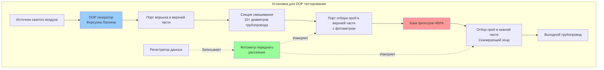

DOP (диоктилфталат) аэрозольное тестирование устанавливает отраслевой стандартный метод для верификации производительности ядерных HEPA фильтров при наиболее проникающем размере частиц (MPPS) 0.3 микрометра. Эта методология тестирования количественно определяет эффективность фильтра посредством прямого измерения аэрозольного проникновения, обеспечивая окончательную верификацию того, что установленные системы соответствуют обязательной минимальной эффективности 99.97%, требуемой ASME AG-1 и нормативными требованиями ядерной безопасности.

## Физические принципы аэрозольной фильтрации

Фильтрующие материалы HEPA захватывают частицы четырьмя фундаментальными механизмами, одновременно действующими во всей матрице волокна.

**Инерционное столкновение** доминирует для частиц размером более 1 микрометра. Крупные частицы обладают достаточной инерцией, которая не позволяет им следовать отклонению воздушного потока вокруг волокон. Отклонение траектории от линий тока вызывает прямое столкновение с поверхностями волокон.

**Перехват** захватывает частицы размером 0.1-1 микрометр, находящиеся в пределах одного радиуса частицы от поверхностей волокон. Хотя частицы следуют линиям тока воздуха, физический контакт происходит, когда линии тока проходят достаточно близко к волокнам.

**Диффузия** (броуновское движение) управляет захватом частиц размером менее 0.1 микрометра. Случайная молекулярная бомбардировка вызывает отклонение траектории частицы от линий тока, увеличивая вероятность столкновения с волокнами. Эффективность диффузии значительно возрастает по мере уменьшения размера частицы.

**Электростатическое притяжение** повышает захват во всех диапазонах размеров при наличии электростатического заряда на фильтрующем материале или частицах. Ядерные фильтры обычно получают минимальную электростатическую обработку из-за быстрого снижения заряда во влажной среде.

Размер частицы 0.3 микрометра представляет точку минимальной эффективности, где механизмы инерции и диффузии переходят друг в друга. Частицы, размеры которых больше или меньше MPPS, испытывают более высокую эффективность захвата, что делает 0.3 микрометра критической точкой тестирования для верификации фильтра.

## Свойства и генерирование DOP аэрозоля

Диоктилфталат (C₂₄H₃₈O₄, молекулярная масса 390.6 г/моль) используется в качестве стандартного тестового аэрозоля благодаря его благоприятным физическим свойствам:

- Жидкий аэрозоль остаётся стабильным без испарения и агломерации
- Низкое давление пара (1.3 × 10⁻⁷ мм рт.ст. при 20°C) предотвращает изменение размера частиц
- Нетоксичен при концентрациях тестирования
- Высокий показатель преломления (1.486) обеспечивает чувствительное оптическое обнаружение
- Жидкость при комнатной температуре упрощает генерирование аэрозоля

**Методы генерирования аэрозоля:**

Холодное генерирование с использованием сжатого воздуха через форсунку Ласкина производит полидисперсный DOP аэрозоль со средним диаметром по массе 0.3 микрометра и геометрическим стандартным отклонением приблизительно 1.8. Форсунка Ласкина работает путём подачи сжатого воздуха через погруженное сопло, которое создаёт тонкие пузырьки. Разрыв пузырьков на поверхности жидкости генерирует аэрозольные капельки, соответствующие предсказуемому распределению размеров.

Концентрация в верхней части тестового фильтра обычно составляет от 80 до 100 микрограммов на литр, что является достаточным для точного нижнего измерения при избежании чрезмерной нагрузки на материал носителя во время тестирования.

## Расчёты эффективности фильтра и проникновения

Эффективность фильтра и проникновение представляют дополнительные выражения производительности фильтра.

**Эффективность** количественно определяет долю захватываемого аэрозоля:

$$\eta = \frac{C_u - C_d}{C_u} \times 100\%$$

Где:
- $\eta$ = эффективность фильтра (%)
- $C_u$ = концентрация аэрозоля в верхней части (мкг/л)
- $C_d$ = концентрация аэрозоля в нижней части (мкг/л)

**Проникновение** количественно определяет долю проходящего через фильтр:

$$P = \frac{C_d}{C_u} \times 100\%$$

Для ядерных HEPA фильтров, отвечающих минимальным требованиям:

$$\eta = 99.97\% \rightarrow P = 0.03\%$$

**Коэффициент дезактивации** выражает коэффициент снижения концентрации:

$$DF = \frac{C_u}{C_d} = \frac{1}{P/100}$$

При эффективности 99.97%:

$$DF = \frac{1}{0.0003} = 3,333$$

Этот коэффициент дезактивации указывает на то, что только 1 частица из 3,333 проникает через фильтр, обеспечивая значительную защиту от выброса радиоактивных частиц.

**Производительность двухступенчатой системы:**

Когда два фильтра работают последовательно, суммарное проникновение равно произведению отдельных проникновений:

$$P_{total} = P_1 \times P_2$$

Для двух фильтров с эффективностью 99.97%:

$$P_{total} = 0.0003 \times 0.0003 = 9 \times 10^{-8} = 0.000009\%$$

Это даёт суммарную эффективность 99.999991% и коэффициент дезактивации, превышающий 11 миллионов.

## Методология тестирования на месте установки

Тестирование на месте установки проверяет производительность установленной системы без снятия фильтра, обеспечивая полную целостность системы, включая качество герметизации фильтра к корпусу.

**Требования к процедуре тестирования:**

1. **Стабилизация системы:** Эксплуатируйте вентиляционную систему при расчётном расходе воздуха в течение минимум 15 минут перед тестированием для установления установившихся условий.

2. **Установление концентрации в верхней части:** Впрыскивайте DOP аэрозоль с расходом, обеспечивающим концентрацию 80-100 мкг/л в точке отбора проб в верхней части. Контролируйте стабильность концентрации (±10%) в течение 5 минут перед началом измерения в нижней части.

3. **Сканирование в нижней части:** Используя портативный зонд, подключённый к фотометру, сканируйте нижнюю поверхность каждого фильтра с максимальной скоростью 5 см в секунду. Входное отверстие зонда, расположенное на расстоянии 2.5 см от поверхности фильтра, захватывает аэрозоль, проникающий в это конкретное место.

4. **Сканирование проникновения:** Сканируйте всю нижнюю поверхность фильтра, периметр рамки, интерфейсы прокладок и все проникновения в корпусе (порты приборов, люки доступа, подключения трубопровода). Любое место, показывающее повышенную концентрацию, указывает на путь утечки.

5. **Оценка критериев приемлемости:** Ни одно отдельное точечное показание не должно превышать 0.03% от концентрации в верхней части. Любое превышение представляет отказ в тесте, требующий проведения расследования и корректирующих действий.

6. **Документация:** Записывайте концентрацию в верхней части, все показания в нижней части, охват схемы сканирования, условия окружающей среды (температура, влажность, барометрическое давление) и параметры эксплуатации системы (расход, перепад давления).

## Принципы измерения фотометром

Фотометры переднего рассеяния измеряют концентрацию аэрозоля путём количественного определения света, рассеянного частицами, проходящими через камеру измерения.

**Оптическая конфигурация:**

- Источник света (обычно светодиод или лазерный диод) освещает аэрозольный поток
- Частицы рассеивают падающий свет во всех направлениях
- Фотодетектор, расположенный под углом 30-90° от оси падающего луча, измеряет свет переднего рассеяния
- Интенсивность рассеянного света коррелирует с концентрацией частиц

**Интенсивность рассеяния света:**

Для частиц, размер которых меньше длины волны (режим рассеяния Рэлея):

$$I_s \propto \frac{d^6}{\lambda^4}$$

Где:
- $I_s$ = интенсивность рассеянного света
- $d$ = диаметр частицы
- $\lambda$ = длина волны падающего света

Сильная зависимость от диаметра ($d^6$) делает фотометры весьма чувствительными к частицам размером 0.3 микрометра при одновременном снижении реакции на более мелкие частицы.

**Измерение концентрации:**

Выход фотометра связан с концентрацией аэрозоля посредством коэффициента калибровки:

$$C = K \times V_{out}$$

Где:
- $C$ = концентрация аэрозоля (мкг/л)
- $K$ = коэффициент калибровки (мкг/л на вольт)
- $V_{out}$ = напряжение выхода фотометра

Заводская калибровка по отношению к гравиметрическим или счётчикам конденсационных частиц устанавливает K-фактор, специфичный для каждого прибора и типа аэрозоля.

## Сравнение методов аэрозольного тестирования

| Метод тестирования | Тип аэрозоля | Размер частиц | Преимущества | Ограничения | Основное применение |
|-------------|--------------|---------------|------------|-------------|---------------------|
| **DOP тестирование** | Жидкий (диоктилфталат) | 0.3 мкм ММД | Нетоксичен; стабильный аэрозоль; устоявшийся стандарт; простое генерирование | Постепенно снимается; требует фотометр для обнаружения | Верификация ядерного HEPA |
| **PAO тестирование** | Жидкий (полиальфаолефин) | 0.3 мкм ММД | Нетоксичен; стабильный; низкое давление пара; современная замена DOP | Выше стоимость, чем DOP; требует совместимый фотометр | Коммерческое и ядерное тестирование HEPA |
| **DEHS тестирование** | Жидкий (диэтилгексилсебацинат) | 0.3 мкм ММД | Нетоксичен; биоразлагаемый; отличная стабильность | Ограниченные исторические данные в сравнении с DOP | Европейское тестирование HEPA (EN 1822) |
| **Хлорид натрия** | Твёрдый (кристаллы NaCl) | 0.3-0.6 мкм | Недорогой; нетоксичен; легко генерируется | Гигроскопичен; изменяет размер с влажностью; требует пламенный фотометр | QC производства фильтрующего материала |
| **PSL сферы** | Твёрдый (полистирольный латекс) | Монодисперсный | Точный контроль размера; с прослеживаемостью NIST | Дорогой; требует распыление; обнаружение счётчиком частиц | Исследовательские и калибровочные приложения |
| **DMPS тестирование** | Твёрдый (капельки сплавленного масла) | 0.1-1.0 мкм | Селективное по размерам тестирование; генерирование кривой эффективности | Сложное оборудование; длительное время тестирования | Исследовательские приложения |

## Требования тестирования ASME AG-1

ASME AG-1, раздел TA, "Тестирование систем очистки воздуха", устанавливает обязательные требования для тестирования ядерных систем очистки воздуха.

**Приёмочное тестирование фильтра (заводское):**

Каждый ядерный HEPA фильтр получает индивидуальное заводское тестирование в соответствии со статьей TA-3000 ASME AG-1:

- Тестовый аэрозоль: DOP, PAO или DEHS при 0.3 мкм ММД
- Концентрация задающего воздействия: 80-100 мкг/л
- Скорость сканирования: Максимум 5 см в секунду
- Приёмка: Минимум 99.97% эффективности, максимум 0.03% проникновения в любой точке
- Фильтры, не прошедшие приёмочное тестирование, отклоняются и уничтожаются

**Тестирование установленной системы на месте:**

Установленные системы требуют тестирования в соответствии со статьей TA-5000 ASME AG-1:

- Первоначальное тестирование после установки
- Тестирование после замены фильтра или модификации системы
- Периодическое тестирование согласно техническим спецификациям объекта (обычно ежегодно)
- Концентрация задающего воздействия: 80-100 мкг/л в верхней части
- Приёмка: Ни одно показание в нижней части не должно превышать 0.03% концентрации в верхней части
- Документация: Постоянные записи гарантии качества

**Альтернативные методы тестирования:**

ASME AG-1 разрешает аэрозоли PAO (полиальфаолефин) или DEHS (диэтилгексилсебацинат) как альтернативы DOP, при условии эквивалентного распределения размеров частиц и чувствительности обнаружения. Многие объекты переходят на PAO из-за снижения проблем со здоровьем в сравнении с фталатными соединениями.

## Стандарты тестирования фильтров DOE

Объекты Министерства энергетики следуют DOE-STD-3020, "Спецификация для HEPA фильтров, используемых подрядчиками DOE," которая согласуется с требованиями ASME AG-1 при добавлении специфичных положений DOE:

**Требования гарантии качества:**

- Производители фильтров поддерживают программы ядерного гарантии качества согласно 10 CFR 830
- Индивидуальная прослеживаемость фильтра посредством сериализации
- Сертифицированные материальные отчёты испытаний для всех компонентов
- Документация квалификации окружающей среды и сейсмической стойкости

**Тестирование производительности:**

- Тестирование эффективности при 100% и 20% номинального расхода
- Измерение перепада давления при многократных расходах
- Испытание при грубой обработке (вибрация и удар)
- Тестирование при повышенной температуре для огнестойких фильтров (до 371°C для некоторых приложений)

**Критерии приёмки:**

- Минимум 99.97% эффективности при 0.3 мкм при обоих тестовых расходах
- Перепад давления в пределах диапазона спецификации (обычно 20-30 Па при номинальном расходе)
- Отсутствие видимых повреждений после испытания при грубой обработке
- Эффективность выше 99.95% при повышенной температуре

## Распространённые отказы при тестировании и причины

Отказы при тестировании обычно являются результатом дефектов установки, а не дефектов фильтрующего материала:

**Проблемы сжатия прокладки:**

Недостаточное сжатие прокладки создаёт путь обхода вокруг периметра фильтра. Правильное сжатие требует дефекта прокладки на 25-35%. Технические условия крутящего момента на зажимах крепления обеспечивают равномерное сжатие.

**Утечки корпуса:**

Сварные швы корпуса, прокладки люков доступа или проникновения приборов могут протекать при повреждении во время установки или эксплуатации. Тестирование давлением корпусов перед установкой фильтра выявляет утечку конструкции.

**Повреждение фильтра:**

Физическое повреждение фильтрующего материала во время обработки или установки создаёт локализованные области высокого проникновения. Фильтры никогда не должны соприкасаться на лицевой стороне или поддерживаться пакетом материала во время установки.

**Неправильная установка:**

Фильтры, установленные задом наперёд или без надлежащего размещения в ножевых рамах, создают массивный обход. Визуальная проверка стрелок направления воздушного потока перед тестированием предотвращает этот режим отказа.

**Проблемы распределения аэрозоля:**

Недостаточная длина смешивания в верхней части фильтра (менее 10 диаметров трубопровода) приводит к неравномерному распределению аэрозоля. Локальные высокие или низкие концентрации инвалидируют измерения проникновения.

## Частота тестирования и требования документации

Ядерные объекты эксплуатируются в соответствии с техническими спецификациями, полученными из отчётов анализа безопасности и одобренной NRC основой лицензирования:

**Частота тестирования:**

- Первоначальное тестирование: Перед объявлением готовности системы к эксплуатации
- После обслуживания: После любого действия, влияющего на целостность цепи фильтра
- Периодическое наблюдение: Интервалы от 18 до 24 месяцев (специфичные для установки)
- После аварии: После любого события, потенциально повреждающего фильтры (сейсмическое событие, пожар, наводнение)

**Требования документации:**

- Идентификация и редакция процедуры тестирования
- Идентификация системы и параметры эксплуатации
- Верификация типа аэрозоля, концентрации и распределения
- Полные результаты сканирования в нижней части с критериями приёмки
- Квалификации техников и подписи
- Статус калибровки тестового оборудования
- Корректирующие действия при наличии дефектов
- QA проверка и одобрение

Записи тестирования представляют постоянные записи объекта, подлежащие инспекции NRC, и должны храниться в течение срока эксплуатации объекта.

## Современные альтернативы тестирования

Хотя DOP остаётся широко указываемым в существующих процедурах ядерных объектов, альтернативы решают проблемы здоровья и окружающей среды:

**Полиальфаолефин (PAO):**

Синтетическое гидроуглеводное масло с практически идентичными свойствами аэрозоля DOP, но без опасений фталатов. Тестирование PAO использует идентичное оборудование и процедуры с сравнимой или превосходящей чувствительностью обнаружения.

**Счётчики лазерных частиц:**

Передовые приборы считают отдельные частицы по диапазонам размеров, а не измеряют суммарную концентрацию. Счётчики частиц обеспечивают детальные данные эффективности по многократным диапазонам размеров, но требуют значительно более длительное время тестирования и более высокую стоимость.

**Системы непрерывного контроля:**

Постоянно установленные фотометры контролируют концентрацию в нижней части непрерывно во время эксплуатации. Хотя непрерывный контроль не заменяет периодическое сканирование проникновения, он обеспечивает реальное указание деградации фильтра или отказа.

Понимание принципов DOP тестирования, процедур и критериев приёмки обеспечивает надлежащую верификацию производительности ядерной системы HEPA фильтра, поддерживая окончательный барьер, предотвращающий выброс радиоактивных частиц в окружающую среду.
