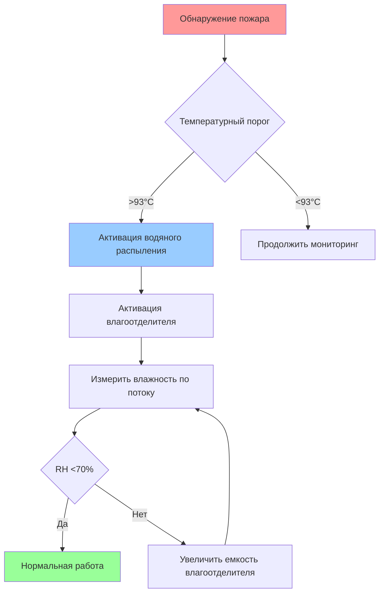
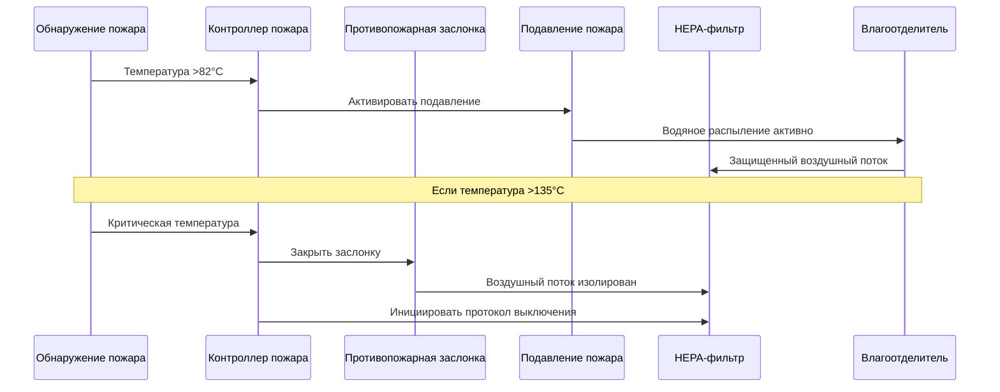

## Требования к огнестойкости систем HEPA в ядерных объектах

Системы огнестойкой HEPA-фильтрации в ядерных объектах должны поддерживать целостность герметизации при одновременном предотвращении распространения пожара через вентиляционные каналы. Двойной вызов заключается в защите фильтровального материала от термического разложения, обеспечивая при этом устойчивость конструкции корпуса к условиям пожара без нарушения радиоактивного сдерживания.

### Физические принципы воздействия пожара на HEPA-фильтры

Термическое разложение фильтровального материала HEPA следует кинетике разложения первого порядка:

$$\frac{d\alpha}{dt} = A \exp\left(-\frac{E_a}{RT}\right)(1-\alpha)$$

Где $\alpha$ представляет степень разложения, $A$ – предэкспоненциальный множитель, $E_a$ – энергия активации (типично 120-180 кДж/моль для стеклоткани), $R$ – газовая постоянная и $T$ – абсолютная температура.

Стандартный фильтровальный материал HEPA из стеклоткани начинает терять структурную целостность при температуре приблизительно 260°C, а адгезивы и герметики могут разрушиться при более низких температурах (150-200°C). Переход от механической фильтрации к термическому отказу происходит быстро после превышения критических температурных порогов.

## Огнестойкие фильтровальные корпусы

### Структурная огнестойкость

Огнестойкие корпусы HEPA должны обеспечивать защитное барьерное покрытие, рассчитанное согласно ASTM E119 или эквивалентным стандартам. Нормативное руководство NRC 1.52 требует, чтобы противопожарные барьеры, защищающие безопасность-важные системы фильтрации, поддерживали структурную целостность минимум при 1-часовых пожарных испытаниях, при этом 3-часовые рейтинги являются обычными для критических приложений герметизации.

Теплопередача через многослойную стенку корпуса следует:

$$Q = \frac{A(T_h - T_c)}{\sum_{i=1}^{n} \frac{L_i}{k_i}}$$

Где $Q$ – скорость теплопередачи, $A$ – площадь стены, $T_h$ и $T_c$ – температуры горячей и холодной поверхности, $L_i$ – толщина слоя $i$ и $k_i$ – коэффициент теплопроводности каждого слоя материала.

### Спецификации материалов корпуса

| Материал | Макс. рабочая температура | Огнестойкость | Теплопроводность | Применение |
|----------|---------------------------|---------------|------------------|-----------|
| Углеродистая сталь (3 мм) | 538°C | 1-3 часа | 45 Вт/м·K | Стандартные корпусы |
| Нержавеющая сталь 304 | 649°C | 1-3 часа | 16 Вт/м·K | Агрессивная среда |
| Нержавеющая сталь 316L | 649°C | 1-3 часа | 16 Вт/м·K | Высококоррозионные зоны |
| Изолированная двойная стенка | 260°C (предел фильтра) | 3 часа | 0.8 Вт/м·K (эффективная) | Критические приложения |

## Температурные пределы фильтровального материала

### Производительность стеклоткани

Стандартный фильтровальный материал HEPA из боросиликатной стеклоткани демонстрирует следующий диапазон тепловой производительности:

- **Непрерывная эксплуатация**: До 120°C
- **Периодическое воздействие**: До 200°C на период <30 минут
- **Структурный отказ**: >260°C
- **Полное разложение**: >400°C

Эффективность сбора частиц остается стабильной до достижения температуры стеклования, инициирующей размягчение волокон. Критическое число Стокса для захвата частиц:

$$Stk = \frac{\rho_p d_p^2 U}{18 \mu d_f}$$

Где $\rho_p$ – плотность частицы, $d_p$ – диаметр частицы, $U$ – скорость потока, $\mu$ – вязкость газа (зависит от температуры) и $d_f$ – диаметр волокна.

По мере повышения температуры вязкость газа $\mu$ увеличивается пропорционально $T^{0,7}$, незначительно снижая эффективность сбора перед катастрофическим структурным отказом.

### Варианты высокотемпературной фильтрации

Для приложений, требующих повышенной устойчивости к тепловому воздействию:

- **Керамический волокнистый материал**: Непрерывная эксплуатация до 900°C
- **Металлический волокнистый материал**: Непрерывная эксплуатация до 538°C
- **Фильтры из карбида кремния**: Непрерывная эксплуатация до 1200°C

Эти специализированные материалы жертвуют сниженной эффективностью сбора частиц (типично 95-99% против 99,97% для стандартной HEPA) ради тепловой выживаемости.

## Системы предварительного подавления пожара

### Интеграция системы водяного распыления

Системы предварительного подавления пожара защищают HEPA-фильтры благодаря испарительному охлаждению и физическому подавлению пожара. Эффективность охлаждения зависит от скорости испарения капель:

$$\dot{m}_{evap} = \frac{h_{fg} \cdot A_d \cdot (P_{sat}(T_s) - P_v)}{R_v T_{film}}$$

Где $h_{fg}$ – удельная теплота парообразования, $A_d$ – площадь поверхности капли, $P_{sat}$ – давление насыщения при температуре поверхности, $P_v$ – парциальное давление пара и $T_{film}$ – температура пленки.

### Параметры конструкции системы подавления

- **Температура активации**: 93-135°C, ниже порога повреждения фильтра
- **Плотность воды**: 6.1-12.2 л/мин·м² 
- **Размер капель**: 400-800 мкм для оптимального поглощения тепла без чрезмерного попадания в фильтр
- **Время отклика**: <30 секунд от обнаружения до полного выброса

## Влагоотделители

### Предотвращение повреждения фильтра HEPA водой

Влагоотделители защищают HEPA-фильтры от повреждения водой после активации системы подавления пожара. Эффективность разделения следует механике инерционного удара:

$$\eta_{sep} = 1 - \exp\left(-\frac{Stk}{Stk_{50}}\right)^n$$

Где $Stk_{50}$ – число Стокса при 50% эффективности сбора (типично 0.2-0.4 для влагоуловителей) и $n$ – эмпирическая постоянная (1.5-2.0).

### Спецификации влагоотделителя

| Тип | Эффективность удаления | Перепад давления | Максимальная нагрузка | Размещение |
|-----|----------------------|-------------------|----------------------|-----------|
| Пластинчатый | 95-98% (>10 мкм) | 125-250 Па | 0.5 л/м³ | Перед HEPA |
| Сетчатая подушка | 98-99% (>5 мкм) | 150-300 Па | 0.3 л/м³ | Перед HEPA |
| Шевронный | 99%+ (>8 мкм) | 100-200 Па | 0.7 л/м³ | Перед HEPA |
| Циклонный | 90-95% (>20 мкм) | 200-400 Па | 2.0 л/м³ | Предварительный этап разделения |

Влагоотделитель должен поддерживать относительную влажность ниже 70% на входе в HEPA для предотвращения насыщения материала и снижения эффективности.

## Интеграция противопожарных заслонок

### Скоординированная стратегия защиты от пожара

Противопожарные заслонки и HEPA-фильтры должны функционировать как интегрированная система огнестойкого барьера. Закрытие заслонки должно произойти до достижения пламенем фильтра, обеспечивая при этом поток вентиляции для радиоактивного сдерживания.

### Логика закрытия заслонки

Температура закрытия противопожарной заслонки $T_{close}$ должна удовлетворять:

$$T_{close} < T_{filter,max} - \Delta T_{response}$$

Где $T_{filter,max}$ – максимально допустимая температура фильтра (типично 200°C для периодического воздействия) и $\Delta T_{response}$ – тепловое запаздывание между активацией заслонки и полным закрытием (типично 30-50°C эквивалента).

Стандартные рейтинги противопожарных заслонок:

- **1.5-часовой рейтинг UL 555**: Стандартная защита для некритичных зон
- **3-часовой рейтинг UL 555**: Приложения высокой опасности или важные для безопасности
- **Динамическое закрытие**: <5 секунд от сигнала к полному закрытию
- **Класс утечки**: Класс I (<1.7 м³/ч·м² при 100 Па) или Класс II (<3.4 м³/ч·м²)

## Проверка целостности после пожара

### Требования к протоколу испытания

ASME AG-1 раздел FC требует проведения испытаний после пожара для проверки продолжающейся производительности фильтрации и структурной целостности. Протокол проверки включает:

1. **Визуальный осмотр**: Целостность корпуса, состояние прокладки, крепежное оборудование
2. **Тест аэрозольной нагрузки**: Испытание DOP или PAO для проверки эффективности ≥99,97%
3. **Измерение перепада давления**: Сравнение с исходным значением перед пожаром (допуск ±20%)
4. **Испытание герметичности**: Испытание пузырька на месте или испытание спада давления
5. **Распределение потока**: Проверка равномерной скорости лицевой части (±20% по поверхности фильтра)

### Критерии приемки

| Параметр | Предел приемки | Действие при отказе |
|----------|----------------|-------------------|
| Эффективность фильтрации | ≥99,97% при 0.3 мкм | Заменить фильтр |
| Изменение перепада давления | <20% от исходного значения | Проверить причину |
| Утечка корпуса | <0,05% байпаса | Повторно герметизировать или заменить прокладку |
| Прогиб конструкции | <L/360 (пролет/360) | Заменить корпус |
| Функциональность заслонки | Полное закрытие <5 сек | Отремонтировать или заменить заслонку |

Пронизывание $P$ через поврежденный фильтр вычисляется как:

$$P = \left(1 - \eta\right) + f_{bypass}$$

Где $\eta$ – эффективность фильтра и $f_{bypass}$ – доля байпасного потока. Даже небольшие пути байпаса (1-2%) могут доминировать в общем пронизывании при высокой эффективности фильтра (99,97%).

### Нормативно-правовая база соответствия

Нормативное руководство NRC 1.52 и 10 CFR 50 Приложение A, Общий критерий проектирования 61 требуют, чтобы системы защиты от пожара для HEPA-фильтров в безопасности-важной ядерной вентиляции:

- Предотвращали распространение пожара через вентиляционные пути
- Поддерживали функцию герметизации во время и после пожарных событий
- Позволяли оператору проверить целостность системы после события
- Обеспечивали резервную защиту для предположения единичного отказа

ASME AG-1 раздел FC конкретно решает задачи защиты от пожара для систем очистки воздуха ядерных объектов, требуя огнестойкие корпусы, тепловую защиту и протоколы испытаний после пожара, превышающие стандартные промышленные практики.

## Заключение

Огнестойкая HEPA-фильтрация для ядерных объектов требует комплексную интеграцию тепловой защиты, подавления пожара, управления влажностью и проверки после события. Физика термического разложения определяет температурные пределы, которые управляют конструкцией корпуса, порогами активации подавления и логикой закрытия заслонки. Соответствие требованиям NRC и ASME AG-1 гарантирует, что как пожарная безопасность, так и целостность радиоактивного сдерживания поддерживаются во всем диапазоне проектных сценариев пожара.
