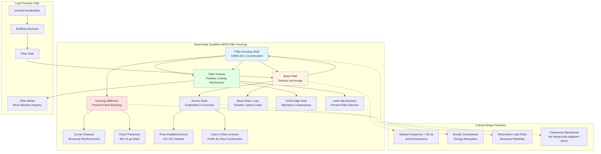

Системы фильтрации ядерного HEPA должны сохранять структурную целостность и функциональную работоспособность во время и после сейсмических событий, включая землетрясение безопасного отключения (SSE). Сейсмическая квалификация подтверждает, что узлы фильтров, корпуса, системы крепления и связанные воздуховоды могут выдерживать динамические нагрузки без потери способности фильтрации или функции герметизации. Эта квалификация защищает от радиоактивного выброса при наиболее суровом предполагаемом движении грунта.

## Основы физики сейсмического ответа

Сейсмическое ускорение грунта передает инерционные силы на конструкции и оборудование через второй закон Ньютона. Корпус фильтра массой $m$, испытывающий ускорение грунта $\ddot{u}_g(t)$, развивает инерционную силу:

$$F_{inertial}(t) = m \cdot \ddot{u}_{total}(t) = m \cdot (\ddot{u}_g(t) + \ddot{u}_{relative}(t))$$

где $\ddot{u}_{total}$ представляет полное ускорение (грунт плюс относительное движение), а $\ddot{u}_{relative}$ представляет ускорение относительно грунта. Для системы с одной степенью свободы уравнение движения становится:

$$m\ddot{u} + c\dot{u} + ku = -m\ddot{u}_g(t)$$

где $c$ — коэффициент демпфирования и $k$ — жесткость. Собственная частота системы:

$$f_n = \frac{1}{2\pi}\sqrt{\frac{k}{m}}$$

Резонанс возникает, когда содержание сейсмической частоты совпадает с собственной частотой оборудования, что приводит к усилению ответа. Оборудование, относящееся к безопасности ядерных установок, должно либо избегать резонанса с доминирующими сейсмическими частотами (обычно 2-10 Гц), либо демонстрировать адекватную прочность для выдерживания усиленного ответа.

## Анализ спектров ответа

Спектры ответа дают максимальный ответ одностепенных осцилляторов на движение грунта как функцию частоты и демпфирования. Спектральное ускорение $S_a(f_n, \zeta)$ представляет пиковое ускорение, испытываемое конструкцией с собственной частотой $f_n$ и коэффициентом демпфирования $\zeta$.

Сдвигающее усилие у основания оборудования, установленного на уровне пола, становится:

$$V_{base} = \frac{S_a(f_n, \zeta)}{g} \cdot W \cdot A_f$$

где:
- $g$ = ускорение свободного падения (9,81 м/с²)
- $W$ = рабочий вес оборудования
- $A_f$ = коэффициент усиления для высоты крепления
- $S_a$ = спектральное ускорение из спектра ответа пола

Для оборудования, установленного на верхних этажах, спектры ответа пола (FRS) учитывают усиление здания. Пиковое ускорение пола обычно превышает ускорение грунта в 2-4 раза в зависимости от характеристик здания и расположения оборудования.

Опрокидывающий момент у основания корпуса фильтра высотой $h$ становится:

$$M_{OTM} = V_{base} \cdot h \cdot \frac{2}{3}$$

Коэффициент 2/3 учитывает форму ответа первого режима, где максимальное ускорение возникает в верхней части, а центроид инерционной силы действует примерно на 2/3 высоты.

## Стандарты квалификации IEEE 344

Стандарт IEEE 344 "Рекомендуемая практика сейсмической квалификации оборудования класса 1E для ядерных электростанций" устанавливает требования для программ сейсмической квалификации. Этот стандарт применяется к системам фильтрации HEPA, имеющим отношение к безопасности и признанным за смягчение аварий.

**Ключевые требования IEEE 344:**

- **Испытания или анализ:** Квалификация посредством испытаний на встряхивающем столе, анализа или комбинации
- **Требуемый спектр ответа (RRS):** Охватывает спектры ответа конкретного участка с запасом
- **Спектр ответа испытания (TRS):** Фактическое движение встряхивающего стола должно охватывать RRS на всех частотах
- **Демонстрация работоспособности:** Оборудование должно функционировать во время и после сейсмического испытания
- **Учет старения:** Учитывать деградацию материала за квалифицированный период службы

Требуемый спектр ответа обычно добавляет 10-20% запас выше проектных спектров для учета вариативности. Для 5% демпфирования (типичного для сварных стальных конструкций) испытание должно охватывать:

$$TRS(f, 5\%) \geq 1.1 \cdot RRS(f, 5\%)$$

на всех частотах между 1-33 Гц (диапазон частоты ускорения нулевого периода).

## Сейсмические стандарты DOE

Объекты Министерства энергетики следуют DOE-STD-1020 и DOE-STD-1021 для сейсмического проектирования и оценки. Эти стандарты устанавливают категории производительности (PC) на основе важности функции безопасности:

| Категория производительности | Целевой показатель производительности | Проектное землетрясение |
|---------------------|------------------------|------------------------|
| PC-1 | Объект с низким риском | Период возврата 500 лет |
| PC-2 | Важный/умеренный риск | Период возврата 1000 лет |
| PC-3 | Опасный объект | Период возврата 2500 лет |
| PC-4 | Критический опасный объект | Период возврата 10000 лет |

Системы ядерного HEPA на объектах DOE обычно требуют квалификации PC-3 или PC-4, соответствующие вероятности превышения 1E-3 или 1E-4 в год. Медианное ускорение грунта для этих уровней опасности варьируется от 0,2g до 0,8g в зависимости от сейсмичности участка.

Стандарты DOE допускают квалификацию посредством:

1. **Испытаний на типовых спектрах ответа** (консервативный подход)
2. **Анализа с использованием спектров конкретного участка** (требует детального моделирования конструкции)
3. **Данных опыта** (ограниченное применение для специального оборудования)

## Сравнение методов сейсмической квалификации

Различные подходы к квалификации предлагают различные преимущества и ограничения:

| Метод | Преимущества | Недостатки | Типичное применение |
|--------|-----------|---------------|---------------------|
| **Испытания на встряхивающем столе** | Прямо демонстрирует работоспособность; захватывает нелинейные эффекты; высокая уверенность | Дорогостоящее; ограниченный размер образца; требует испытательного стенда | Новые конструкции; критические компоненты |
| **Анализ конечных элементов** | Экономичное; оценивает вариации проекта; определяет концентрацию напряжений | Требует валидации; неопределенность моделирования; ограничено для нелинейного поведения | Плановые применения; оптимизация проекта |
| **Метод статического коэффициента** | Простые расчеты; консервативные результаты; широко признан | Чрезмерно консервативный; игнорирует динамическое усиление; грубые оценки напряжений | Предварительное проектирование; отсев |
| **Комбинированное испытание/анализ** | Оптимизирует стоимость/уверенность; испытывает критические элементы; анализирует остаток | Сложность в комбинировании результатов; требует тщательной документации | Крупные узлы; модульные конструкции |
| **Данные опыта** | Без новых испытаний; опирается на историю эксплуатации | Ограниченное применение; требует обоснования сходства; низкая уверенность для модификаций | Идентичное сменное оборудование |

## Сейсмическое проектирование корпуса фильтра

Корпуса ядерных фильтров HEPA требуют надежного конструктивного проектирования для сопротивления сейсмическим нагрузкам при сохранении герметичности. Корпус испытывает:

**Боковые нагрузки:**

Горизонтальное сейсмическое ускорение создает сдвигающее усилие у основания, распределяемое к точкам крепления. Для корпуса с равномерно распределенным весом реакция в каждом из $n$ анкерных болтов:

$$R_{anchor} = \frac{V_{base}}{n} \sqrt{1 + \left(\frac{M_{OTM} \cdot e}{V_{base} \cdot L}\right)^2}$$

где $e$ — эксцентриситет между центром масс и геометрическим центром, а $L$ — расстояние между рядами анкеров.

**Вертикальные нагрузки:**

Вертикальное сейсмическое ускорение (обычно 2/3 горизонтального) добавляется или вычитается из гравитационных нагрузок:

$$W_{effective} = W \cdot (1 \pm \frac{S_{a,vertical}}{g})$$

Это влияет на натяжение болта и напряжения опорных площадок.

**Комбинированная проверка напряжения:**

Оболочка корпуса испытывает комбинированные мембранные и изгибающие напряжения. Максимальная интенсивность напряжения согласно ASME раздел III:

$$S_{max} = \sqrt{(\sigma_{membrane} + \sigma_{bending})^2 + 3\tau_{shear}^2}$$

должна оставаться ниже допустимых пределов напряжения с соответствующими коэффициентами безопасности (обычно 1,5 для пределов обслуживания уровня D, соответствующих SSE).

## Целостность фильтрующего материала и рамы

Сам фильтрующий материал — гофрированные боросиликатные стеклянные микроволокна, связанные органической смолой — должен выдерживать сейсмическое ускорение без разрывов или отслоения от рамы. Критические соображения:

**Стабильность гофра:**

Расстояние между гофрами обычно 3-6 мм обеспечивает структурную жесткость через гофрированную геометрию. Сейсмическое ускорение, перпендикулярное гофрам, создает моменты изгиба в фильтрующем материале. Максимальное напряжение в волокне:

$$\sigma_{fiber} = \frac{E \cdot \ddot{u} \cdot L^2}{2t}$$

где $E$ — модуль упругости, $L$ — глубина гофра, и $t$ — толщина фильтрующего материала. Типичные сейсмические ускорения (3-5g) создают напряжения значительно ниже растягивающей прочности стеклянного волокна (500-700 МПа), но могут превышать прочность адгезивной связи между смолой и материалом при отказе адгезива на границе раме-материал.

**Адгезия рама-материал:**

Граница раздела между фильтрующим материалом и опорной рамой испытывает сдвиговое напряжение от дифференциального ускорения. Полиуретановые адгезивы обеспечивают прочность адгезии 2-4 МПа, адекватную для типичных сейсмических нагрузок с надлежащими коэффициентами безопасности.

**Разделители гофров:**

Алюминиевые или струнные разделители сохраняют расстояние между гофрами при боковом ускорении. Без разделителей гофры коллабируют под сейсмической нагрузкой, блокируя воздушный поток и увеличивая перепад давления.

## Конструкция системы крепления

Корпуса фильтров требуют крепления, спроектированного для комбинированных сейсмических и эксплуатационных нагрузок. Анкерные болты испытывают:

**Растягивающую нагрузку (вертикальная сейсма + опрокидывание):**

$$T_{bolt} = \frac{4M_{OTM}}{n \cdot L} - \frac{W_{effective}}{n}$$

для болтов на стороне растяжения корпуса, где $n$ — количество болтов в ряду и $L$ — расстояние между рядами.

**Сдвиговую нагрузку (горизонтальная сейсма):**

$$V_{bolt} = \frac{V_{base}}{n_{total}}$$

где $n_{total}$ — общее количество анкерных болтов.

**Комбинированное взаимодействие:**

ACI 318 приложение D требует проверки взаимодействия:

$$\left(\frac{V_{bolt}}{V_{allow}}\right)^{5/3} + \left(\frac{T_{bolt}}{T_{allow}}\right)^{5/3} \leq 1.0$$

Послемонтажные расширяющиеся анкеры или адгезивные анкеры требуют отчета оценки ICC-ES, демонстрирующего сейсмическую адекватность. Заделанные в опалубку головные шпильки обеспечивают превосходную производительность, но требуют предварительной координации со строительством конструкции.

## Требования испытаний работоспособности

Сейсмическая квалификация должна продемонстрировать продолжение функционирования во время и после землетрясения. Для систем HEPA это требует:

**Исходные измерения перед испытанием:**
- Испытание проникновения DOP, устанавливающее утечку <0,03%
- Измерение перепада давления при проектном расходе
- Визуальное обследование состояния фильтра и корпуса

**Мониторинг во время испытания:**
- Непрерывное введение DOP и отбор проб вниз по потоку
- Запись перепада давления
- Данные акселерометра в нескольких местах

**Верификация после испытания:**
- Повторное испытание проникновения DOP (должно соответствовать тому же критерию <0,03%)
- Сравнение перепада давления (увеличение <10% указывает на повреждение материала)
- Визуальное обследование на наличие повреждений конструкции, смещения уплотнений или деформации рамы

Любой отказ — увеличенное проникновение, чрезмерное изменение перепада давления или повреждение конструкции — требует модификации проекта и повторного испытания.

## Сейсмические опоры воздуховодов и трубопроводов

Воздуховоды, подключенные к сейсмически квалифицированным корпусам HEPA, требуют совместимого сейсмического крепления для предотвращения повреждения от взаимодействия. Руководство SMACNA "Seismic Restraint Manual" содержит предписывающие требования:

- **Максимальное расстояние:** 12 м для бокового крепления, 24 м для продольного
- **Минимальные углы:** 45° от горизонтали для диагональных раскосов
- **Зазоры:** Сохраняйте минимальный зазор 5 см для предотвращения удара

Гибкие соединения на интерфейсах корпуса допускают дифференциальное движение между воздуховодом и оборудованием без чрезмерного напряжения на соединениях. Эти соединения должны сохранять герметичность (проверяется испытанием после сейсма) при допускании смещений на несколько сантиметров.

## Документирование обеспечения качества

Программы сейсмической квалификации создают обширную документацию, подлежащую нормативной проверке:

- Процедуры испытаний и критерии приемки
- Рабочие чертежи образца испытаний
- Записи калибровки инструментов
- Журналы испытаний с наблюдениями в реальном времени
- Записи сбора данных (ускорение, смещение, деформация)
- Отчеты об осмотре после испытания
- Отчет квалификации, резюмирующий демонстрацию соответствия

Эта документация обеспечивает прослеживаемость от сейсмического спроса конкретного участка посредством испытания или анализа к демонстрации работоспособности, обеспечивая нормативную уверенность в производительности оборудования при расчетных землетрясениях.

Надлежащая сейсмическая квалификация систем фильтрации ядерного HEPA защищает здоровье и безопасность населения, обеспечивая остаток радиоактивной герметизации во время наиболее суровых земных колебаний — окончательная проверка надежности системы безопасности ядерной установки.
