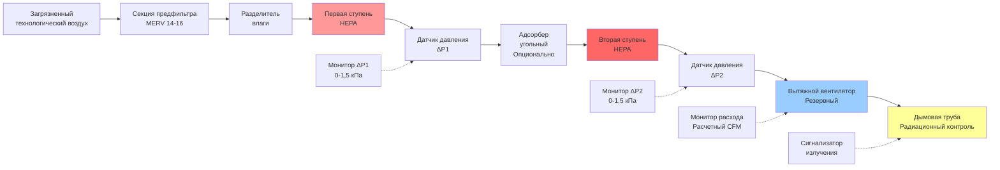

Двухступенчатые системы HEPA-фильтрации обеспечивают многоуровневую защиту от удаления частиц на ядерных объектах благодаря последовательно соединённым фильтровальным секциям. Такая конфигурация достигает коэффициентов дезактивации, превышающих 1 000 000, одновременно обеспечивая сохранение защиты даже при деградации или отказе одной ступени. Принцип резервирования вытекает из философии ядерной безопасности, требующей нескольких независимых барьеров между радиоактивными материалами и окружающей средой.

## Физика последовательной фильтрации

Фильтры HEPA удаляют частицы благодаря четырём одновременно действующим механизмам, работающим в различных диапазонах размеров частиц. Понимание этих механизмов объясняет, почему двухступенчатые системы обеспечивают превосходную надёжность по сравнению с одноступенчатыми конструкциями.

**Механизмы фильтрации:**

1. **Перехват:** Частицы, следующие потоку воздуха, контактируют с волокнами, когда их центр находится в пределах одного радиуса частицы от поверхности волокна
2. **Инерционное столкновение:** Частицы с достаточной инертностью не могут следовать за быстрыми изменениями направления потока вокруг волокон и сталкиваются с их поверхностями
3. **Диффузия:** Броуновское движение вызывает отклонение субмикронных частиц от линий потока и их контакт с волокнами
4. **Электростатическое притяжение:** Электрические заряды на волокнах привлекают частицы с противоположным зарядом

Наиболее проникающий размер частиц (MPPS) возникает при примерно 0,3 микрометров, где перехват и инерционное столкновение становятся менее эффективными, а диффузия ещё не доминирует. Фильтры HEPA тестируются при этом критическом размере для проверки наихудшего сценария производительности.

**Эффективность одноступенчатой системы:**

Ядерные фильтры HEPA должны демонстрировать минимальную эффективность 99,97% при 0,3 мкм в соответствии с ASME AG-1. Это соответствует максимальной проникаемости 0,03%:

$$P_1 = 1 - \eta_1 = 1 - 0,9997 = 0,0003$$

Где:
- $P_1$ = доля проникновения первой ступени
- $\eta_1$ = доля эффективности первой ступени

**Комбинированная эффективность двухступенчатой системы:**

Когда идентичные фильтры работают последовательно, вторая ступень захватывает частицы, прошедшие через первую ступень. Общая проникаемость равна произведению отдельных проникаемостей:

$$P_{total} = P_1 \times P_2$$

Для двух ступеней с эффективностью 99,97%:

$$P_{total} = 0,0003 \times 0,0003 = 9 \times 10^{-8}$$

Комбинированная эффективность:

$$\eta_{total} = 1 - P_{total} = 1 - 9 \times 10^{-8} = 0,99999991$$

Это представляет 99,999991% эффективности или «семь девяток» удаления частиц.

**Коэффициент дезактивации:**

В ядерных приложениях производительность фильтрации выражается как коэффициент дезактивации (DF) – отношение концентрации выше по потоку к концентрации ниже по потоку:

$$DF = \frac{C_{upstream}}{C_{downstream}} = \frac{1}{P_{total}}$$

Для двухступенчатой системы HEPA с эффективностью 99,97%:

$$DF = \frac{1}{9 \times 10^{-8}} = 1,11 \times 10^{7}$$

Этот коэффициент дезактивации превышает 11 000 000, обеспечивая исключительную защиту от выброса радиоактивных частиц.

## Конструкция двухступенчатой системы

**Обоснование последовательности компонентов:**

Конкретная последовательность оптимизирует производительность и защиту оборудования:

- **Предфильтры выше по потоку:** Удаляют основную часть частиц (>10 мкм), продлевая срок службы первой ступени HEPA в 3–5 раз
- **Разделитель влаги:** Предотвращает попадание жидкой воды, которая вызывает коллапс фильтровальной среды HEPA и потерю эффективности
- **Первая ступень HEPA:** Удаляет 99,97% частиц, снижая нагрузку на нижестоящие компоненты
- **Адсорбер угольный:** Расположен между ступенями HEPA для предотвращения выброса радиойода; требует предварительной HEPA-фильтрации для предотвращения засорения угольного слоя частицами
- **Вторая ступень HEPA:** Захватывает углеродную пыль от адсорбера и обеспечивает резервную фильтрацию при отказе первой ступени
- **Вытяжной вентилятор ниже по потоку:** Создает пониженное давление во всей фильтровальной системе, предотвращая утечку загрязненного воздуха из отверстий в корпусе

## Сравнение производительности одноступенчатых и двухступенчатых систем

| Параметр | Одноступенчатая HEPA | Двухступенчатая HEPA | Коэффициент улучшения |
|-----------|-------------------|----------------|-------------------|
| Минимальная эффективность | 99,97% | 99,999991% | 3 703× |
| Максимальная проникаемость | 0,03% | 0,000009% | 3 333× |
| Коэффициент дезактивации | 3 333 | 11 111 111 | 3 333× |
| Надежность (годовая) | 99,0% | 99,99% | 100× |
| Ожидаемый срок службы фильтра | 2–3 года | 4–6 лет (2-я ступень) | 2× |
| Перепад давления (чистый) | 0,25 кПа | 0,5 кПа | 2× |
| Увеличение энергопотребления вентилятора | Эталон | +15–25% | — |
| Увеличение капитальных затрат | Эталон | +40–60% | — |
| Соответствие DOE-STD-3020 | Маргинальное | Да | Полное соответствие |
| Снижение риска аварии | Одиночный барьер | Резервный барьер | Защита в глубину |

**Анализ надёжности:**

Если первая ступень HEPA развивает 10%-ный байпас из-за отказа уплотнения или разрыва среды, эффективность одноступенчатой системы деградирует катастрофически:

$$\eta_{degraded} = 0,90 \times 0,9997 + 0,10 \times 0 = 0,89973$$

Это представляет эффективность 89,973% – полностью неприемлемо для ядерных приложений.

При двухступенчатой конфигурации тот же отказ первой ступени приводит к:

$$\eta_{total,degraded} = 1 - [(0,90 \times 0,0003 + 0,10 \times 1,0) \times 0,0003]$$

$$\eta_{total,degraded} = 1 - [0,10027 \times 0,0003] = 1 - 0,000030081 = 0,999969919$$

Это поддерживает эффективность 99,9969% – по-прежнему обеспечивая исключительную защиту во время ремонта первой ступени.

## Требования DOE-STD-3020

Стандарт Министерства энергетики 3020 «Спецификация для фильтров HEPA, используемых подрядчиками DOE» устанавливает обязательные требования для фильтрации ядерных объектов:

**Конструкция фильтра:**

- Среда: непрерывная плиссированная боросиликатная микроволокнистая бумага, диаметр волокна 0,3–1,0 мкм
- Материал разделителя: алюминиевые или бумажные гофрированные разделители, поддерживающие расстояние между плиссами 1,0–1,5 мм
- Герметик: огнестойкий клей, квалифицированный для непрерывной работы при 121°C
- Каркас: фанера морского класса или ДСП с влагостойким покрытием; нержавеющая сталь для высокотемпературных приложений
- Уплотнение: закрытопоровое неопреновое или полиуретановое уплотнение, обеспечивающее 25–35% сжатия при заданном моменте затяжки

**Технические характеристики производительности:**

Каждый фильтр тестируется с монодисперсным аэрозолем DOP или PAO размером 0,3 мкм:

- Минимальная эффективность: 99,97% при номинальном расходе
- Максимальный начальный перепад давления: 0,25 кПа при номинальном расходе
- Проникаемость частиц: ≤0,03% в любой точке поперечного сечения фильтра

**Гарантия качества:**

DOE-STD-3020 требует 100%-ного тестирования каждого фильтра, а не выборочного контроля партии, используемого в коммерческих приложениях. Каждый фильтр получает:

- Сканирование эффективности по всему нижестоящему сечению
- Измерение перепада давления при номинальном расходе
- Визуальный контроль дефектов конструкции
- Сертификат соответствия с данными тестирования

Этот строгий контроль обеспечивает отсутствие дефектных фильтров при вводе в ядерную эксплуатацию.

## Конструкция корпуса фильтра ASME AG-1

ASME AG-1 «Кодекс ядерной обработки воздуха и газа», Раздел FC (Корпусы фильтров и вентиляционные установки) определяет требования к конструкции, изготовлению и испытаниям корпусов.

**Конструктивные требования:**

Корпусы фильтров должны выдерживать условия проектной аварии:

$$P_{design} = P_{accident} \times SF$$

Где:
- $P_{design}$ = номинальное давление в корпусе
- $P_{accident}$ = максимальное возможное давление при аварии (обычно 0,07–0,14 МПа для систем в корпусе реактора)
- $SF$ = коэффициент безопасности минимум 1,5

**Герметичность:**

Утечка из корпуса при 150% номинального давления не должна превышать:

$$L_{max} = 0,01\% \times Q_{design}$$

Где:
- $L_{max}$ = максимальная допустимая утечка из корпуса (CFM)
- $Q_{design}$ = расчетный расход воздуха через корпус (CFM)

Для системы 10 000 CFM (17 м³/ч): $L_{max} = 0,0001 \times 10 000 = 1,0$ CFM максимальной утечки

**Сжатие уплотнения:**

Уплотнения фильтра HEPA требуют точного сжатия для обеспечения герметичности без повреждения фильтровальной среды:

$$\delta = \frac{F}{A \times k}$$

Где:
- $\delta$ = деформация уплотнения (см)
- $F$ = сила зажима (Н)
- $A$ = площадь контакта уплотнения (см²)
- $k$ = жесткость уплотнения (кПа)

Целевая деформация: 25–35% первоначальной толщины уплотнения

Недостаточное сжатие (<20%) позволяет обходному потоку вокруг периметра фильтра. Чрезмерное сжатие (>40%) постоянно деформирует материал уплотнения, препятствуя надлежащей герметизации при последующих заменах фильтра.

**Положения доступа:**

AG-1 Раздел FC-4000 требует:

- Возможность замены фильтра с внутренним/внешним мешком для загрязненных фильтров
- Минимальные дверцы доступа размером 60 см × 60 см для установки/удаления фильтра
- Предотвращение проникновения персонала при работе системы
- Освещение и электрическая розетка внутри корпуса для обслуживания

## Перепад давления и выбор вентилятора

Двухступенчатые системы создают значительно больший перепад давления, чем одноступенчатые конфигурации, требуя тщательного выбора вентилятора.

**Общий перепад давления в системе:**

$$\Delta P_{total} = \Delta P_{prefilter} + \Delta P_{separator} + \Delta P_{HEPA1} + \Delta P_{charcoal} + \Delta P_{HEPA2} + \Delta P_{duct}$$

Типичные значения при расчётном расходе (новые фильтры):

- Секция предфильтра: 0,075–0,125 кПа
- Разделитель влаги: 0,05–0,1 кПа
- Первая ступень HEPA: 0,25–0,3 кПа
- Адсорбер угольный (слой 10 см): 0,37–0,5 кПа
- Вторая ступень HEPA: 0,25–0,3 кПа
- Воздуховоды и фасонные части: 0,25–0,37 кПа

Чистая система в целом: 1,22–1,92 кПа

**Перепад давления в конце срока службы:**

Фильтры HEPA накапливают частицы до достижения порога замены перепада давления (обычно 0,98–1,47 кПа на каждую ступень):

- Первая ступень HEPA (загруженная): 0,98–1,47 кПа
- Вторая ступень HEPA (загруженная): 0,49–0,73 кПа (испытывает меньшую нагрузку благодаря защите первой ступени)

Загруженная система в целом: 2,82–4,24 кПа

**Критерии выбора вентилятора:**

Вытяжной вентилятор должен обеспечивать расчетный CFM при максимальном перепаде давления в системе с достаточным запасом:

$$SP_{fan,rated} = \Delta P_{total,max} \times 1,25$$

Где:
- $SP_{fan,rated}$ = номинальная способность вентилятора к статическому давлению
- $\Delta P_{total,max}$ = максимальный ожидаемый перепад давления в системе
- 1,25 = коэффициент конструктивного запаса (25%)

Для системы с максимальным перепадом давления 4,24 кПа:

$$SP_{fan,rated} = 4,24 \times 1,25 = 5,3 \text{ кПа}$$

Выбрать вентилятор с номинальной статической давлением 5,5 кПа и выше при расчетном CFM.

## Эксплуатационный контроль и техническое обслуживание

**Мониторинг перепада давления:**

Каждая ступень HEPA требует отдельного измерения перепада давления:

- Точность передатчика: ±0,5% диапазона (типичный диапазон 0–2,5 кПа)
- Установка предварительной сигнализации: 0,85–1,0 кПа (расписание замены фильтра)
- Установка высокой сигнализации: 1,22–1,47 кПа (предупреждение о снижении расхода)
- Логирование трендов: 15-минутные интервалы для прогнозного обслуживания

**Стратегия замены фильтра:**

Двухступенчатые системы позволяют поэтапную замену, оптимизирующую затраты жизненного цикла:

1. Фильтры первой ступени заменяют при достижении 0,98–1,22 кПа (обычно 2–3 года)
2. Фильтры второй ступени заменяют реже, достигая 0,73–1,0 кПа через 4–6 лет благодаря снижению нагрузки частиц
3. Обе ступени заменяют одновременно при крупных останов для сброса эффективности системы

**Анализ затрат-выгод:**

Несмотря на более высокие капитальные затраты, двухступенчатые системы обеспечивают превосходную экономику жизненного цикла:

- Увеличенный срок службы фильтра второй ступени снижает частоту замены на 50%
- Непрерывная работа при отказе первой ступени предотвращает дорогостоящие остановы
- Улучшенные коэффициенты дезактивации могут позволить снизить требования к контролю выбросов
- Обеспечение соответствия нормам уменьшает риск нормативного воздействия

## Аэрозольное тестирование на месте установки

Обе ступени HEPA требуют отдельного тестирования на месте в соответствии с ASME N510:

**Процедура тестирования:**

1. Впрыскивать полидисперсный аэрозоль DOP или PAO выше по потоку от первой ступени HEPA до концентрации 80–100 мкг/л
2. Измерять концентрацию выше по потоку фотометром прямого рассеяния света
3. Сканировать нижестоящее сечение фильтров первой ступени со скоростью 5 см/сек, поддерживая зонд в 2,5 см от поверхности фильтра
4. Документировать любую проникаемость, превышающую 0,03% концентрации выше по потоку
5. Повторить процесс для банка HEPA второй ступени, используя выход первой ступени как вход

**Критерии приемки:**

- Ни одно отдельное значение не должно превышать 0,03% концентрации выше по потоку
- Максимальная средняя проникаемость по банку фильтра: 0,01%
- Проникновения в корпус и уплотнения: максимум 0,01%

**Частота тестирования:**

- Первоначальная установка: перед запуском системы
- Постобслуживание: после любой замены фильтра или обслуживания корпуса
- Контрольное тестирование: минимум ежегодно в соответствии с техническими характеристиками
- Пост-авария: перед возвратом системы в эксплуатацию после проектной аварии

Двухступенчатая HEPA-фильтрация представляет отраслевой стандарт для систем очистки воздуха ядерных объектов. Философия защиты в глубину обеспечивает беспрецедентную надежность и производительность дезактивации, гарантируя удержание радиоактивных частиц при нормальной работе и авариях. Понимание физики фильтрации, расчетов эффективности и нормативных требований позволяет надлежащее проектирование, эксплуатацию и техническое обслуживание системы, защищая персонал и общественную безопасность.
